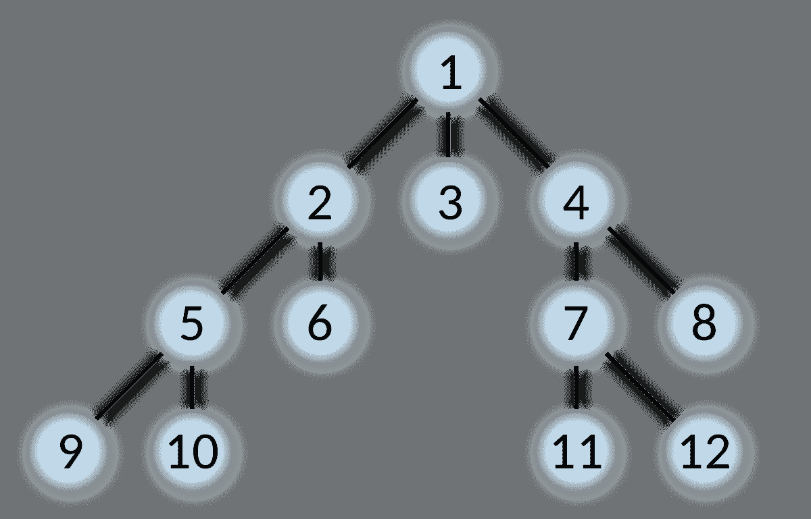

# 搜索算法介绍-广度优先搜索

> 原文：<https://towardsdatascience.com/search-algorithm-introduction-1-a71e4a1911b3?source=collection_archive---------21----------------------->

## [搜索](https://towardsdatascience.com/tagged/search)

## 从头开始 Python 实现

搜索是关于规划的，广泛应用于自动驾驶汽车和路线规划。在本帖中，我们来谈谈在给定的静态环境下寻找可行路径的问题。结构遵循[这里](https://classroom.udacity.com/courses/cs373/lessons/48646841/concepts/486837620923)的课程，我们直接进入一个问题，基于问题设置引入 first search。

# 设置

假设我们生活在 2D 网格世界中:

网格大小为 5 乘 6，0 表示可用，1 表示堵塞。我们从点`[0, 0]`开始，目标位于右下角`[4, 5]`。有 4 个动作可用`left, right, up and down`对应`delta_name`中列出的 4 个符号。现在的问题是找到一条从起点到目标的可行路径。

# 横向优先搜索

有许多搜索算法，让我们从广度优先搜索开始。与深度优先搜索相反，广度优先搜索开始水平扩展搜索路径:



refer to [wiki](https://en.wikipedia.org/wiki/Breadth-first_search)

如图所示，从节点`1`开始，在深入到下一层之前，它会探索它的所有邻居。与我们的问题设置相同，我们的 2d 网格世界也可以被视为一个可扩展的树，我们从初始点`[0, 0]`开始，从这里，我们只能向下到`[1, 0]`或直接到`[0, 1]`，只有在迭代完所有这些邻居之后，我们才会探索下一级的节点。

因此，让我们考虑一下实现广度优先搜索需要哪些组件。首先，我们肯定需要维护一个当前扩展路径的队列或列表，并且能够弹出下一个最低级别的节点。其次，我们应该维护另一个列表来跟踪所有被访问过的节点，这样我们就不会两次访问一个节点。

所以这里的`close`是我们追踪所有访问过的节点并用值`1`表示它们的列表，而`open_list`是扩展路径，其中每个元素记录了节点的级别和节点位置→ `[g_value, x, y]`。

搜索路径不断扩展，直到:

1.  没有可浏览的节点:`len(open_list) == 0`
2.  找到目标:`[cur_x, cur_y] == goal`

`sort`和`reverse`确保每次弹出最小级别的节点。如果在那个层次上没有找到目标，它将通过迭代所有可能的动作来扩展节点，同时通过`nxt_g = cur_g + cost`添加层次。

最后，我们打印出结果:

```
[11, 4, 5]
```

所以需要 11 步才能达到我们的目标`[4, 5]`。你可以算出 11 实际上是我们的最优值。

上面的代码贯穿了整个过程，但是好像缺了点什么……我们并没有真正找到我们的路径并打印出来！

要打印出我们的路径，我们需要在扩展时跟踪每个单元格中采取的每个动作，然后以相反的方式从目标到初始点，以获得我们的最终路径。

列表`action`在展开过程中跟踪每个动作，就像在 for 循环中一样:

```
action[nxt_x][nxt_y] = delta.index(d)
```

扩展后的行动列表包括:

```
[-1, 3, -1, 0, 3, 3]
[2, 2, -1, 0, 3, 3]
[2, 2, 3, 3, -1, 2]
[2, 2, -1, -1, -1, 2]
[2, 2, 3, 3, -1, 2]
```

策略列表从目标状态开始，以相反的方式打印出代表动作的符号，最后，我们得到最终结果:

```
['>', 'v', ' ', ' ', ' ', ' ']
[' ', 'v', ' ', '>', '>', 'v']
[' ', '>', '>', '^', ' ', 'v']
[' ', ' ', ' ', ' ', ' ', 'v']
[' ', ' ', ' ', ' ', ' ', '*']
```

您可能会注意到有多条最佳路径，但是该算法只能根据扩展顺序打印一条路径。我们将在下一篇文章中介绍另一个实现，它给出了所有的最优路径。

最后，广度优先搜索可以找到给定条件下的最优结果:

> 如果路径代价是节点深度的非减函数，则广度优先搜索是最优的。最常见的情况是所有的行为都有相同的成本。

一个直观的理解是，由于广度优先搜索仅在当前级别的所有节点都已被访问时探索下一级别，所以它总是在可能的最低级别中找到目标。

**参考**:

1.  [https://classroom . uda city . com/courses/cs 373/lessons/48646841/concepts/112 e9f 79-63cd-44ee-883 f-652677 e64d 31](https://classroom.udacity.com/courses/cs373/lessons/48646841/concepts/112e9f79-63cd-44ee-883f-652677e64d31)