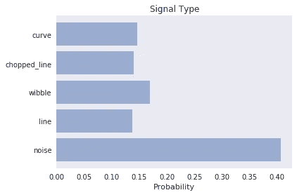

# 在 GCP 上用人工智能搜索外星人

> 原文：<https://towardsdatascience.com/searching-for-et-using-ai-on-gcp-b45b07ba5b6?source=collection_archive---------26----------------------->


Photo by [Austin Johnson](https://unsplash.com/@semajjat?utm_source=unsplash&utm_medium=referral&utm_content=creditCopyText) on [Unsplash](https://unsplash.com/search/photos/aliens?utm_source=unsplash&utm_medium=referral&utm_content=creditCopyText)

*一个使用 SETI 开放数据的项目*

他们说学习数据科学的最好方法是创造一些东西。

一旦你使用教科书、博客文章，当然还有 MOOCs(大规模开放在线课程)覆盖了数据处理、编码和统计的基础知识，接下来要做的就是做一个你感兴趣的项目。通过这种方式，您可以使用您所学的各种工具和技术，另外，您可以以一种现实而有意义的方式进行数据科学研究，因为您必须实际找到数据，为分析做好准备，最重要的是，您必须提出要问的问题。

对我来说，这就是我最近花了几年时间学习无数在线课程的地方。我已经达到了 MOOC 疲劳的暂时状态，我想做一些长期而深入的工作。我开始四处寻找有趣的数据，最终偶然发现了来自 [SETI 研究所](https://www.seti.org/)(搜寻外星智能)的各种文件和 GitHub 知识库。

最初，看起来我需要的所有数据和代码都是可用的，包括 IBM 托管的一些大数据集，加上一些分析代码。然后我意识到，相当一部分是来自已经停止的项目，留给我许多零碎的东西，但没有具体的东西。

令人欣慰的是，在收到几封邮件后，SETI 的人热心地帮助我，并明确表示，让“公民科学家”参与进来是他们希望在未来做得更多的事情。我加入了他们的 Slack 频道，打了一个 Skype 电话，并获得了几个额外数据集的链接。这是一种惊人的、令人耳目一新的接触数据爱好者的方法，我以前从未遇到过。

满怀热情的我接着回顾了 SETI 过去和现在的所有公众参与项目，以便找到我的项目想法。

# **SETI 和公民科学**

2016 年 1 月，伯克利大学伯克利 SETI 研究中心启动了一项名为[突破倾听](https://en.wikipedia.org/wiki/Breakthrough_Listen)的计划，被描述为“*迄今为止最全面的外星通讯搜索*”。无线电数据目前由西弗吉尼亚州的[格林班克天文台](https://greenbankobservatory.org/)和新南威尔士的[巴夏礼天文台](https://en.wikipedia.org/wiki/Parkes_Observatory)收集，光学数据由加利福尼亚州的[自动行星探测器](https://en.wikipedia.org/wiki/Automated_Planet_Finder)收集。

为了吸引公众，Breakthrough listen 的主要方法是一种名为 [SETI@Home](https://setiathome.berkeley.edu/) 的东西，可以下载并安装一个程序，空闲时可以用你的电脑下载数据包并对其进行各种分析。

除此之外，他们还共享了一些启动脚本和一些数据。脚本可以在 GitHub [这里](https://github.com/UCBerkeleySETI/breakthrough/tree/master/GBT)找到，数据存档可以在[这里](http://breakthroughinitiatives.org/opendatasearch)找到(虽然大部分是“基带”格式，与我一直使用的“滤波器库”格式相比，这是一种更原始的格式)。请注意，来自自动行星探测器的光学数据也是一种不同的格式，称为“FITS”文件。

SETI 让公众参与的第二个举措是 2016 年 9 月启动的 [SETI@IBMCloud](https://developer.ibm.com/clouddataservices/2016/09/29/seti-data-on-ibm-cloud/) 项目。这为公众提供了通过 IBM 云平台访问大量数据的机会。这个项目也附带了一个优秀的启动脚本集合，这个集合仍然可以在 GitHub [这里](https://github.com/ibm-watson-data-lab/seti_at_ibm)找到。不幸的是，在编写本报告时，该项目被搁置，数据无法访问。

# SETI 对深度学习的运用

SETI 还有一些其他的在线数据来源。2017 年夏天，他们举办了一场机器学习挑战，向参与者提供了各种大小的模拟数据集以及盲测集。获胜团队使用卷积神经网络实现了 94.7%的分类准确率。这项挑战的目的是尝试一种新的信号检测方法，即超越传统的信号分析方法，在将信号转换为[光谱图](https://en.wikipedia.org/wiki/Spectrogram)后，将问题转化为图像分类任务。


A squiggly signal in simualated SETI data

主要训练数据已被删除，但数据的“基本”、“小型”和“中型”版本仍在 [GitHub 页面](https://github.com/setiQuest/ML4SETI)上。这些信号的详细性质以及更详细的挑战描述可以在[这里](https://medium.com/ibm-watson-data-lab/using-artificial-intelligence-to-search-for-extraterrestrial-intelligence-ec19169e01af)找到。

注意，许多由 SETI 编写的托管在 Github 上的脚本使用了一个名为 **ibmseti** 的非标准 Python 包。

SETI 在机器学习方面的工作最近成为头条新闻，当时一种深度学习算法被应用于来自绿色银行望远镜的大量数据，这些数据与一个名为 [FRB 121102](https://www.seti.org/frb-121102-radio-calling-cards-distant-civilization) 的射电源有关。被认为来自 30 亿光年外的一个矮星系，一些神秘的信号被发现，让媒体陷入外星人引发的狂热。然而，这些信号的一些细节，如它们的极化，表明它们已经通过了一个极其强大的磁场，导致了它们来自一颗中子星的假设，也许是在一个大质量黑洞附近。

进一步的细节可以在张，格里等人的论文“快速无线电突发 121102 脉冲检测和周期性:机器学习方法”中找到*天体物理学报* 866.2 (2018): 149。

这项工作的所有数据和相应论文的链接可以在[这里](http://seti.berkeley.edu/frb-machine/)找到。

# **ABACAD 寻找 ET 的方法**

一些 SETI 数据寻找非常快速的信号，即在很宽的频率范围内存在很短时间的信号。来自上述快速射电爆发论文的数据使用了这样的数据。另一种 SETI 数据被用来做相反的事情，即信号在很窄的频率窗口在较长的时间帧。这类数据从一开始就让我更感兴趣，因为它似乎更有可能包含任何有目的的外星信号。

然后我看到了下面这篇文章:对智慧生命的突破性监听搜索:对 692 颗邻近恒星的 1.1-1.9 GHz 观测。*天体物理学报* 849.2 (2017): 104。

在其中，使用非机器学习技术分析了来自 692 颗恒星的此类数据，其中许多基础数据是共享的(从现在起我将把这项工作称为“突破 692”论文/项目)。使用的一种技术被称为“ABACAD”方法。思路如下:从目标恒星(第一个“A”)收集数据，然后将望远镜移动到不同的目标(“B”)。然后，回到 A，然后是另一个目标 C，再次回到 A，然后是最后一个不同的目标 d。这个想法是，如果信号来自主要目标恒星，它将出现在所有 3 A 扫描中。然而，如果一个信号来自陆地，它可能会在所有 6 次扫描中出现。

这篇论文让我产生了将这些数据用于机器学习的想法。我找到了我的项目！

# **我的项目**

最初，我开始玩 2017 年 SETI 夏季机器学习挑战的模拟数据。起初我在本地这样做(即使用我的家用台式电脑)，然后很快转移到在 [Kaggle](https://www.kaggle.com/) 上工作，这要感谢他们免费的数据托管和 GPU 支持。我创建了一个笔记本(在 Kaggle 上称为“内核”)，介绍了典型的 SETI 数据和 filterbank 文件格式，随后是一个使用深度学习区分不同类型模拟数据的笔记本(根据夏季挑战)。

然后，我转向突破性的 692 数据，并决定尝试使用云计算来实现这一点，因为我知道，在 ABACAD 搜索中生成的大量 filterbank 文件中翻腾将受益于云平台提供的缩放能力。不幸的是，我对这个主题知之甚少，所以我暂停了这个项目，直到我在 Coursera 上完成了出色的[谷歌云平台专业化数据工程。](https://www.coursera.org/specializations/gcp-data-machine-learning)

一旦完成，我就开始在 GCP 数据实验室(谷歌的云版 Jupyter 笔记本)上整理代码。我把这个问题分成 4 个部分，

1.  **创建谱图图像**——将滤波器组数据转换成谱图图像文件
2.  **模拟数据** —这必须与 ABACAD 搜索得出的数据类型相似，与夏季挑战赛的模拟数据截然不同
3.  **构建深度学习模型** —使用模拟数据创建和评估模型
4.  **从 ABACAD filterbank 文件中进行预测** —使用模型发现信号，不仅仅是每个图像，还包括 ABACAD 扫描技术的背景

# **模拟数据**

为了模拟数据，我想出了一些类别(部分基于夏季挑战类别，部分基于我在突破 692 结果中看到的)。这些是:*噪音、线条、断续线、抖动*和*曲线*。我试图确保信号水平和背景噪声水平的种类，以及像素的数量，与突破 692 项目中看到的数据种类相匹配。下面是每种方法的一些例子，

**线**


**维布尔**


**斩线**


**曲线**


**噪音**


该代码有一个变量列表，它可以取某个范围内的任何值。这些包括数值变量，例如背景噪声水平、信号强度、线的梯度、截断线中间隙的大小等。这些是每次随机选择的，允许批量创建每个图像类别的变体。还有一些更多的实验变量，如一个叫做“幽灵”的变量，其中信号的副本被复制到主信号的左侧和右侧。然而，我还没有探究它的影响。

# **构建深度学习模型**

对于这个项目的深度学习方面，我最初使用了 VGG19 和 InceptionNet 等预构建模型。然而，我后来得出结论，对于这个应用程序来说，这些可能过于复杂，所以最终使用 Keras 框架来构建一个简单的模型架构(受我读过的一些 Keras 博客帖子的启发)。我使用的模型总结如下:

```
_________________________________________________________________
Layer (type)                 Output Shape              Param #   
=================================================================
conv2d_1 (Conv2D)            (None, 188, 188, 32)      9632      
_________________________________________________________________
activation_1 (Activation)    (None, 188, 188, 32)      0         
_________________________________________________________________
max_pooling2d_1 (MaxPooling2 (None, 94, 94, 32)        0         
_________________________________________________________________
dropout_1 (Dropout)          (None, 94, 94, 32)        0         
_________________________________________________________________
conv2d_2 (Conv2D)            (None, 90, 90, 32)        25632     
_________________________________________________________________
activation_2 (Activation)    (None, 90, 90, 32)        0         
_________________________________________________________________
max_pooling2d_2 (MaxPooling2 (None, 45, 45, 32)        0         
_________________________________________________________________
dropout_2 (Dropout)          (None, 45, 45, 32)        0         
_________________________________________________________________
conv2d_3 (Conv2D)            (None, 43, 43, 64)        18496     
_________________________________________________________________
activation_3 (Activation)    (None, 43, 43, 64)        0         
_________________________________________________________________
max_pooling2d_3 (MaxPooling2 (None, 21, 21, 64)        0         
_________________________________________________________________
dropout_3 (Dropout)          (None, 21, 21, 64)        0         
_________________________________________________________________
flatten_1 (Flatten)          (None, 28224)             0         
_________________________________________________________________
dense_1 (Dense)              (None, 197)               5560325   
_________________________________________________________________
dropout_4 (Dropout)          (None, 197)               0         
_________________________________________________________________
dense_2 (Dense)              (None, 5)                 990
```

然后，我使用 [RMSprop 优化器](/a-look-at-gradient-descent-and-rmsprop-optimizers-f77d483ef08b)对其进行了 100 多个时期的训练，给出了以下准确度和损耗图。


这实现了大约 84%的测试数据准确性。下面是测试阶段的混淆矩阵，


# **单幅图像预测**

一旦模型被创建，我需要一些图像来测试。我从突破 692 论文里取了一些，看看模型给出了什么。下面是几张来自 [HIP4436](https://en.wikipedia.org/wiki/Mu_Andromedae) 的图片，第一张是噪点，


这是模型的预测，



如你所见，它正确地将其归类为噪声。接下来，有信号存在的图像，


这个预测，


“line”类是明显的赢家。

# **根据 ABACAD 过滤器库文件进行预测**

从 filterbank 文件中提取一部分并对其进行分类是很好的，但正如前面提到的，SETI 使用 ABACAD 搜索技术来决定目标是否是感兴趣的。为此，我编写了一个“评分函数”(我在代码中实际上称之为“外星人探测器”，因为这样听起来更酷)，对 6 幅图像进行预测，对应于 6 个 filterbank 文件的相同频率范围，然后应用一些简单的规则，通过分配点数来决定整体模式是否令人感兴趣。评分工作如下，


例如，6 个“噪音”结果得零分。事实上，6 手任何一个相同的信号都不得分(例如线-线-线-线-线)。一个或多个 A 扫描中的一种信号类型与 B、C 和 D 扫描中的不同类型得到*一些*点，最大值分配给 3 A 扫描中的一种信号类型，B、C 和 D 为噪声(例如*wibble-noise-wibble-noise-wibble-noise*)。

这似乎工作得很好。例如，在 Breakthrough 692 论文中，使用非 ML 信号检测方法将以下标记为可能的候选者(HIP65352 ),


使用深度学习，这得到一个很低的分数，因为 B 扫描(倒数第二个)，你可以*仅仅*用眼睛看到有一条微弱的线存在，*被*检测到。

回到前面使用的 HIP4436 示例，我们有以下图像集合，


用深度学习模型给出以下预测:*‘线’，‘噪声’，‘线’，‘噪声’，‘线’，‘噪声’，*，如预期。这得到最高分。

# 新建数据

上面的例子使用了从突破 692 论文中共享的[小数据文件。然而，SETI 向公众公开了大量未经处理的数据。分析单个目标所需的 x6 filterbank 文件高达令人瞠目的 100GB。我将这些文件用于 HIP4436，并将这 6 个文件中的前 3000 个频率片转换成 PNG 图像文件。](https://seti.berkeley.edu/lband2017/landing.html)

这些然后通过深度学习模型发送，然后通过评分功能，最后结果被保存到 csv 文件中。对于如此少量的频率，这将产生一个微小且易于使用的文件，但如果处理整个滤波器组范围，产生的 csv 文件将有 50 万个条目(尽管您总是只能保存“命中”，这将少得多)。

为了将结果转换成更加“云友好”的格式，我测试了从结果中创建一个 BigQuery 数据库。这非常简单，并且可以作为处理管道的一部分来完成，然后允许感兴趣的团体搜索高分目标。举个例子，

***SELECT *
FROM ` SETI _ results . SETI _ results _ table `
其中分数> 0
按分数排序 DESC***

给出最高得分目标。

# **整体流程**

下图显示了如何将此流程放入一个简单的管道中，不同的流交错排列，以显示扫描完成后可以立即开始处理 A1 数据(在所有流完成并输入评分功能后，结果将与其他 5 个流合并)。

这些独立的流甚至可以由 6 个不同的 GCP 实例来处理，从而大大加快速度。


# 时间就是金钱

据我所知，SETI 数据的一个问题似乎是它的剪切比例。单个 filterbank 文件是 17GB，我们每个目标处理 6 个。在每个单独图像的频率分辨率下，每个滤波器组生成 500，000 个图像。因此，每个目标都需要通过深度学习模型处理惊人的 300 万张图像。

我在一个 GCP 实例上测试了一些东西，具体来说，是一个带有 1 个 NVIDIA Tesla K80 GPU 的 **n1-standard-8** (8 个 vCPUs，30 GB 内存)。利用这一点，我能够对每次扫描的 2999 幅图像做出预测，或者在大约 187 秒内总共 17，994 幅图像。基于此，300 万次预测需要大约 8 个小时。

我们可以从下面的成本计算器中看到，如果我永久保留这个实例，成本将是每天 15 美元左右。因此，使用这种方法可以处理全套 6 个滤波器组文件，费用约为 5 美元。


因为这是云计算，如果可以承受更高的成本水平，这个价格可以降低以节省资金，或者分析一组 filterbank 文件的时间可以减少(甚至大大减少)。

# **下一步去哪里？**

由于我不是 SETI 的专业研究人员，毫无疑问，上述所有方面都可以改进，包括:

1.  **数据模拟** —改善信号类别(信号形状、信号电平、信号噪声等)。在给定图像中包括不止一个信号(例如几行而不是一行)。我最初生成了一个名为“brightpixel”的图像类，用于夏季 ML 挑战赛。然而，这似乎破坏了我的模型。这可以进一步调查
2.  **深度学习模型** —尝试不同的模型配置、不同的超参数、不同的预处理方法等。针对更多数据和更多时期进行训练
3.  **ABACAD 评分** —为决定 ABACAD 功能的结果设计一个更好的评分系统
4.  **大规模模型部署** —使用 GCP 允许过滤器库集合(来自 ABACAD 搜索的 x6)通过部署的模型自动运行
5.  **代码优化** —通过提高代码效率来加速预测

欢迎专业人士的任何意见或建议。

这个项目的代码可以在[这里](https://github.com/RobHarrand/SETI_GCP)找到。

感谢 Emilio Enriquez、Andrew Siemion 和 Steve Croft 在这方面的帮助，以及 SETI 对让公民科学家研究这些迷人数据的普遍开放态度。