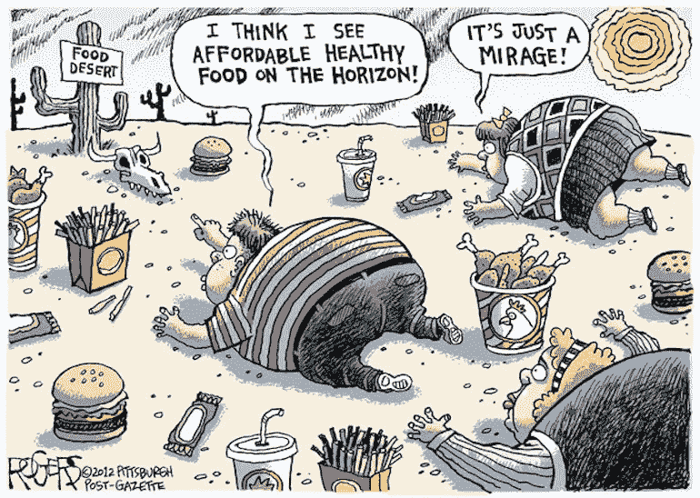
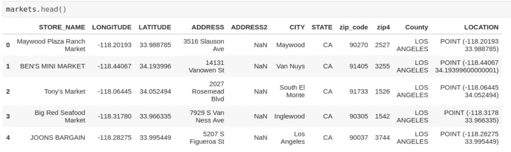
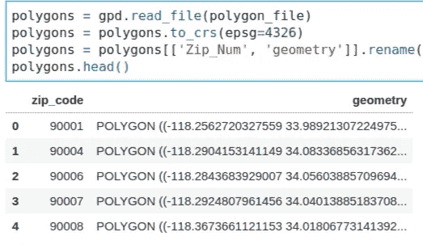
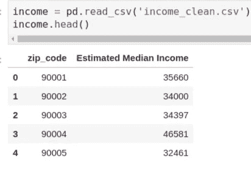
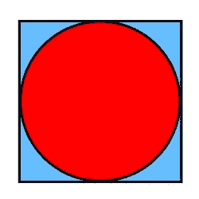
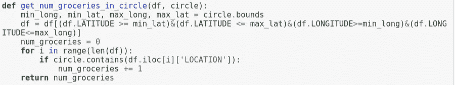
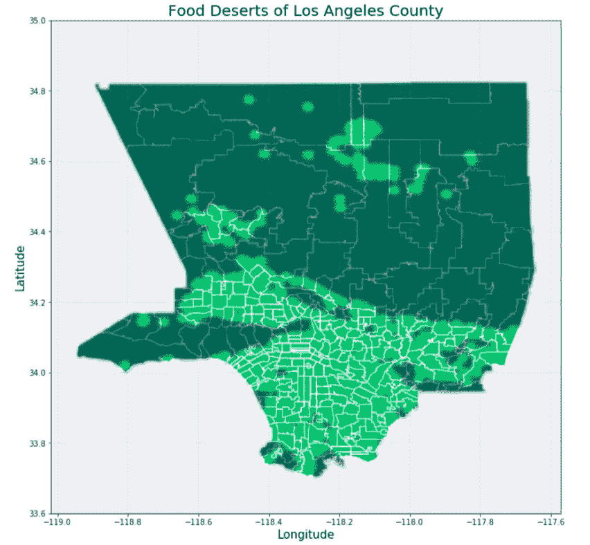
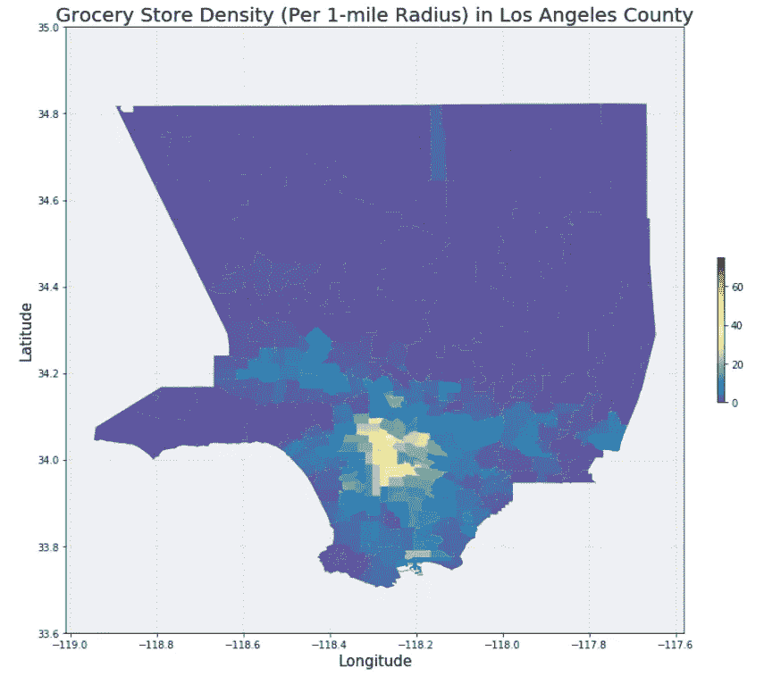
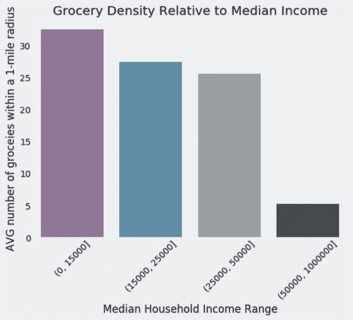

# 在洛杉矶县寻找食物沙漠

> 原文：<https://towardsdatascience.com/searching-for-food-deserts-in-los-angeles-county-b573467a55b?source=collection_archive---------16----------------------->

img source: robrogers.com

在最近的一个数据科学项目中，我与其他几位 Lambda 学校的学生合作，在洛杉矶县寻找食物沙漠。食物沙漠的一般定义是在一英里范围内没有杂货店/市场提供新鲜、健康的食物，如水果、蔬菜、肉类等。我们想验证低收入社区更有可能生活在食物沙漠的理论。

**第一步:获取数据**

我们需要为这个项目找到 3 种主要类型的数据:洛杉矶县的杂货店/市场的数据，洛杉矶县每个邮政编码的地理数据，最后是每个邮政编码的收入数据。

对于杂货店，我们从 [SNAP retailers 数据库](https://www.cbpp.org/snap-retailers-database#California)获取所有加州的数据，然后过滤洛杉矶县的数据。不幸的是，这一数据过于宽泛，因为它包含了许多便利店、酒类商店和其他随机机构，这些机构不应该有资格提供健康和新鲜的食物。使用 regex，我们试图尽可能多地消除这些不合格的机构。最后，我们使用每个市场的纬度和经度，并使用 [Shapely](https://shapely.readthedocs.io/en/stable/manual.html) 库生成一个点对象。

接下来，我们能够找到洛杉矶县每个邮政编码的地理信息。然而，由于地球的曲率，我们需要将这些数据转换成二维表示，或投影，以便我们可以用图形显示它。我们将数据读入 geopandas 数据帧，然后调用 *to_crs()* 方法，并传入“epsg=4326 ”,该方法将地理数据从 GIS 坐标转换为纬度/经度，并格式化邮政编码多边形对象，以便在二维可视化中正确显示。

我们获得的最终数据是洛杉矶县每个邮政编码的家庭收入中值，我们将其存储在 pandas 数据框架中，以便在项目的后期与 food desert 和杂货密度合并。

.

**第二步:在整个洛杉矶县进行网格搜索**

我们希望对整个洛杉矶县进行彻底的网格搜索，以确定任何食品沙漠的位置，并为每个邮政编码汇编一些汇总统计数据，如 1 英里内杂货店的平均数量，以计算每个邮政编码的杂货店密度指标。然后，我们将这些数据与每个邮政编码的平均收入进行比较，并检查结果。

首先，对于每个邮政编码，我们在邮政编码的地理边界周围创建了一个矩形，然后从西北角开始，以四分之一英里的步长水平(向东)迭代，然后再次从西边开始，但向下走四分之一英里，再次水平迭代，重复这个过程，直到整个区域都被遍历完。在每一步，我们都生成一个 Shapely Point 对象，并附加到该邮政编码的列表中。我们将每个邮政编码内的点列表添加到地理数据框架的新列中。对于整个洛杉矶县来说，这导致了将近 58，000 点。

接下来，对于每个邮政编码，我们遍历点列表中的每个点。对于每个点，我们使用 *buffer()* 方法在每个点周围画一个半径为一英里的圆，并将该圆保存为一个形状良好的多边形对象。因为每个形状良好的多边形对象都包含组成该对象形状外部的所有坐标的值，所以我们可以为该多边形调用 *contains()* 方法并传入一个坐标。无论给定坐标是否位于多边形对象的*内部*，该方法都会返回一个布尔值 True 或 False。

为了测试食物沙漠，我们可以检查所有市场的坐标，看看它们是否存在于那个圆圈的边界内。然而，数据框包含几千个市场，对洛杉矶县的每个市场的每个生成点执行这种检查在计算上是非常昂贵的。不用遍历数据框架中的每个市场，我们可以通过首先过滤坐标在我们的圆的正方形边界内的市场来大大加快这个过程，我们可以使用圆的 *bounds* 属性(一个形状良好的多边形对象)来访问它。现在，我们要测试的市场列表大大减少了。对于正方形内的每个市场，如果圆圈对象包含市场坐标，我们增加圆圈内食品杂货的数量。

最后，为了创建一个食品杂货密度统计数据以及一个包含所有食物沙漠点的主列表(在该点的一英里半径范围内没有找到市场)，我们创建了一个函数来迭代每个邮政编码，然后迭代点列表中的每个点。我们为每个邮政编码初始化了一个计数器，记录在点列表中找到的食物沙漠的数量。我们还初始化了两个空列表，一个记录找到的食物沙漠的位置，另一个记录列表中每个点的圆圈内的食品数量。

遍历每个邮政编码后，我们对结果进行解包，以创建一个所有找到的食物沙漠的主列表，并按邮政编码计算汇总统计数据，如杂货密度(找到的附近杂货的平均数量，以及每个邮政编码的食物沙漠的总数)。

**步骤 3:分析结果并创建可视化:**

在解开详尽的网格搜索结果后，我们首先想要创建一个食物沙漠发现位置的可视化。如你所见，大部分位于洛杉矶县的北半部和西部。这些地区通常要么是国家公园，山区，甚至是真正的沙漠，所以这些食物沙漠的存在是完全有道理的。

接下来，我们根据邮政编码绘制了杂货店的密度。如你所见，城市中心的密度最高。

最后，我们想检查相对于收入的食品杂货密度，所以我们将收入分成 4 个范围，并绘制每个范围的平均食品杂货密度。

有趣的是，我们的结果似乎表明，低收入地区实际上比高收入地区有更高的杂货店密度。

**结论/要点:**

在考虑了为什么我们的结果与我们的预期相矛盾之后，我们学到了一些很好的数据科学经验。首先，任何数据科学项目的结果通常最终取决于底层数据的质量。在我们的例子中，市场和杂货店列表的基础数据过于宽泛。即使我们尽了最大努力使用 regex 手动过滤掉不合格的机构，仍然有数百到数千个“市场”可能不符合资格。不幸的是，我们没有足够的工时来逐一检查每一家店，并确定是否有健康/新鲜的食物。

此外，由于洛杉矶独特的地形，许多富人区位于蔓延的丘陵/山腰和海滨地区。这些较富裕的家庭大多拥有汽车，开车去一英里以外的杂货店没有问题。相反，收入较低的家庭往往位于人口更稠密的城市地区。这些家庭的成员通常没有汽车，但可以通过步行、骑自行车或使用公共交通工具出行。由于这些地区的总体密度较高，并且因为我们的市场数据框架包括许多街角商店、杂货店或民族商店/零售机构，这些地区的杂货密度最终高于高收入邮政编码地区。

总的来说，我认为这是一个伟大和令人愉快的项目。我在一些新的 python 库方面获得了一些经验，包括 GeoPandas、Shapely、pyproj，制作了一些简洁的地理数据可视化，并在此过程中学习了一些有价值的数据科学课程。

如果有兴趣看看我们的一些代码，这里有一个链接指向这个博客的[笔记本](https://github.com/food-desert/food-desert-DS/blob/master/Nolanole_food_desert_notebooks/Full_notebook_with_new_grocery_data.ipynb)，这里有一个链接指向我们的团队[回购](https://github.com/food-desert/food-desert-DS)