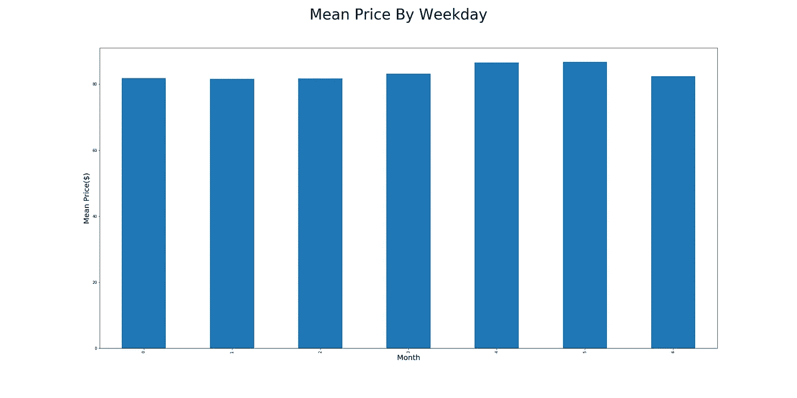
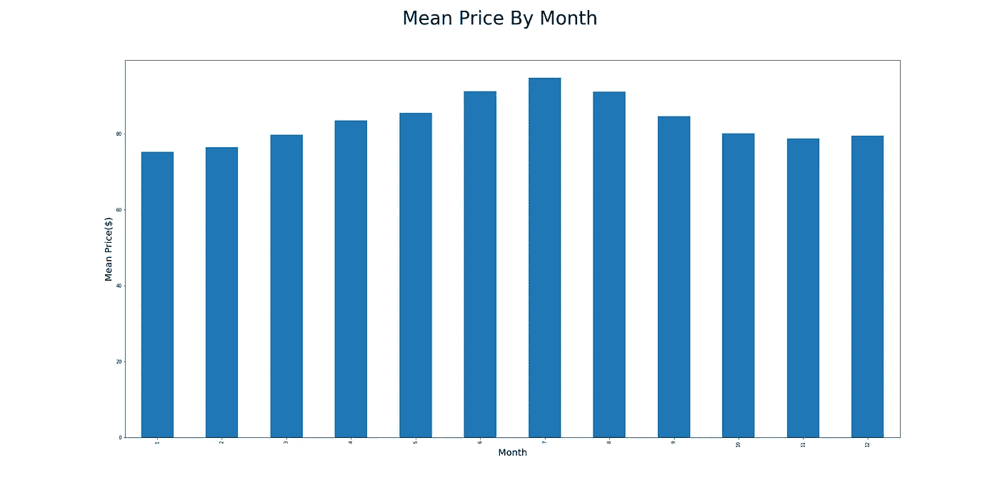
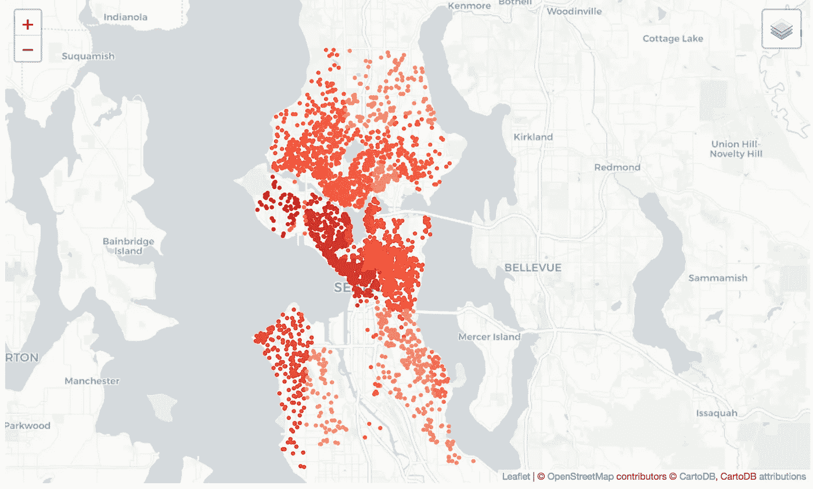
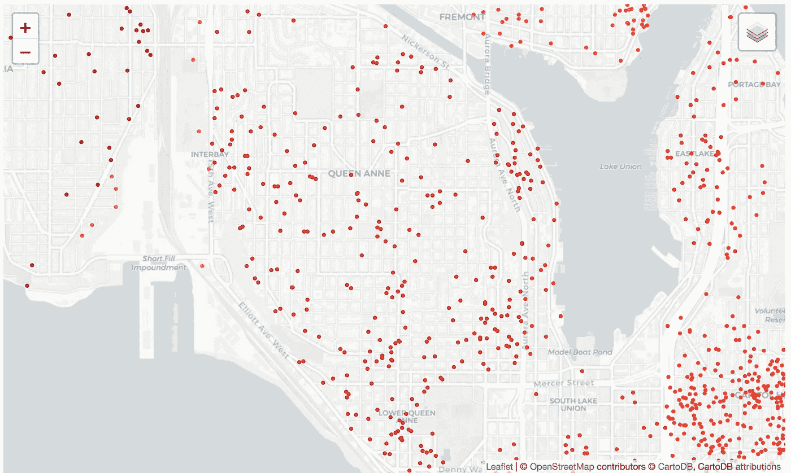
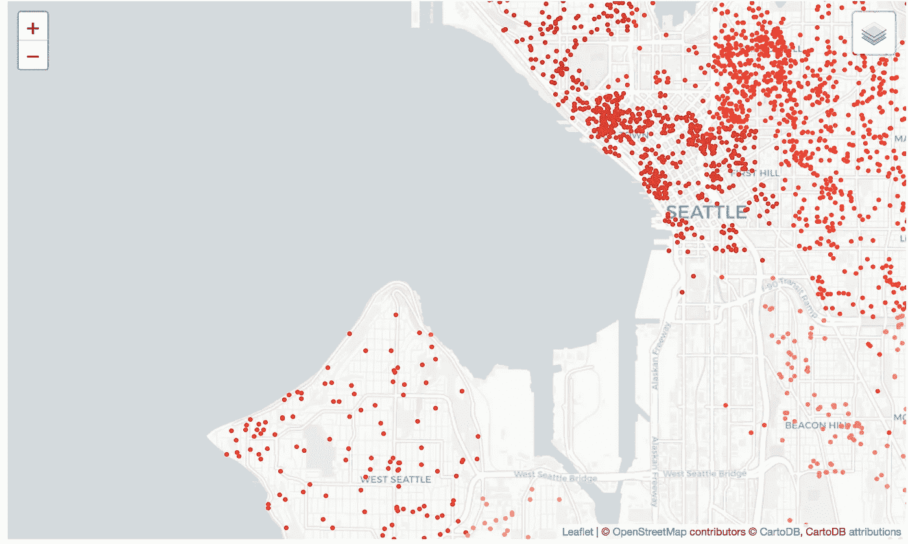
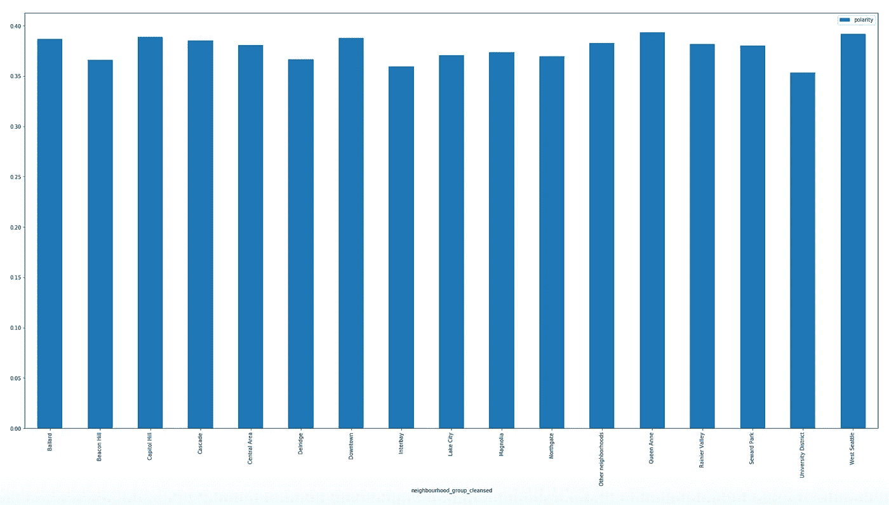

# 西雅图 AirBnB 市场价格分析

> 原文：<https://towardsdatascience.com/seattle-airbnb-market-price-analytics-97196545da3a?source=collection_archive---------16----------------------->

## 查看 AirBnB 西雅图公共数据集进行价格预测，并了解预测变量


Fig.1.Dr. Frasier Crane looks out on Seattle in the series finale, on March 23, 2004\. FROM NBC/NBCU PHOTO BANK/GETTY IMAGES.

每当我看到“西雅图”时，这句名言就在我脑海中回响:“下午好，西雅图。这是弗雷泽·克雷恩博士。”。看过这部电视剧的人都知道克雷恩博士有一套华丽的公寓。我敢肯定，如果他的公寓在 airbnb 上，就不会一直空着。我告诉你，我们会看看能有多少。

我们的数据集来自 Kaggle。[1]

文档和笔记本也可以在[https://github.com/elifinspace/udacity_crispdm](https://github.com/elifinspace/udacity_crispdm)找到。

快速浏览一下数据，让我们从一些问题开始:

1.  西雅图的高峰日是什么时候？
2.  哪些地区比其他地区更贵？
3.  决定价格的主要因素是什么？

## 数据探索

让我们开始探索数据集。我们有 3 个数据文件:

*   日历. csv
*   listings.csv
*   点评. csv

日历数据集有每个列表的日期和价格。通过简单地计算工作日和月份的平均值，结果是**周六**是最昂贵的工作日，平均值为**86.69 美元**，而**七月**是最昂贵的月份，平均值为**94.76 美元。**



Fig.2



Fig.3

我们的第二个数据集 listings.csv 包含位置、便利设施、运营成本和价格等信息。

通过邮政编码或邻近地区计算平均值将有助于我们了解哪些地区价格更高。我选择使用邻居，因为它比邮政编码或邻居组更细粒度。我已经用叶子来绘图了。[3]



Fig.4\. Mean Price by Neighbourhood Group Cleansed

近距离观察西雅图市中心:



Fig.5 Mean Price by Neighbourhood Group Cleansed (zoomed)

原来安妮女王是最贵的地区。随着我们远离中心，平均价格越来越低。

不仅是西雅图市中心，西雅图南部的一些地方似乎也很贵，比如西西雅图的滨水区和贝尔镇(西雅图的西北部)，如下图所示。



Fig.6 Mean Price by Neighbourhood Group Cleansed (zoomed)

克兰博士虚构的公寓位于安妮女王区，有 3 间卧室，3.5 间浴室。快速搜索位置，卧室和浴室的数量，整个公寓的价格将在 750 美元左右。

我们的第三个数据集 reviews.csv 包含评论、按日期排列的评论和列表。经过一些数据争论，我决定使用评论极性。我看到评论不仅是英语的，还有法语、德语和其他几种语言的。我只使用了英语评论，并按邻里群体划分了评论的极性。



Comment Polarity by Neighbourhood Group

评论极性图与邻近地区的平均价格一致。虽然安妮女王有更大的极性(更积极)，但大学区与其他街区相比极性较低。类似地，其他昂贵的地区如西西雅图也有很高的评论极性。这个结果告诉我们，邻居在定价中起着重要的作用，这是合理的。

## 特征选择

让我们看一下列表数据，看看哪些字段与邻居相关。除了“邻里”和“邻里 _ 团体 _ 净化”之外，我们还有一些自由文本栏“邻里概况”、“描述”和“交通”。为了简单起见，我选择只使用这些列的极性，而不是更复杂的语义分析。

我添加了几个特性，如“time_to_first_review”和“time_since_last_review”作为流行度的指标，并删除了原来的日期列。计算结果见。

我使用的另一个分类特征是列表中的“便利设施”。我们知道，就顾客满意度和价格而言，便利设施非常重要。后来我们会发现我们没有错。

## 回归

我选择了 RandomForestRegressor 来预测价格[4]。在这种情况下，Ridge 和 SVR 不起作用。

为了评估我们回归器的性能，我们可以看看 mse(均方误差)和 r2 得分，这是数据与拟合回归线接近程度的统计度量。

r2 得分为 0.63，这很好，下图也显示了回归变量的预测效果。回归器对于大值的表现不是很好，可能是因为缺少训练样本。


Measured vs Predicted Values (Scaled Prices with a factor 100)

那么我们的回归变量用于预测的特征是什么呢？

首先，请记住，在基于树的算法中，每个特征的贡献不是单个预定值，而是取决于特征向量的其余部分，该特征向量确定了遍历树的决策路径，从而确定了沿途经过的保护/贡献。[5]

绝对特征重要性与特征:

```
 index               feature  coefficient
0     12              bedrooms     0.413892
1     15          cleaning_fee     0.053380
2    101          private room     0.039854
3     81  description_polarity     0.036671
4     14      security_deposit     0.030007
5     10          accommodates     0.029731
6      7              latitude     0.027472
7     36     reviews_per_month     0.027280
8     11             bathrooms     0.025478
9     23      availability_365     0.023142
```

当我们看上面的特征重要性表时，“卧室”是最重要的因素。此外，一些相关的功能，如“容纳”和“浴室”也在最重要的 10 个功能。我们知道容纳更多人的房间总是更贵。此外，我们可以看到，房间类型“私人房间”在定价中也起着重要作用。

“清洁费”似乎与“保证金”和“可用性 _365”一样对定价有显著影响。这些是与运营成本相关的变量。成本越高，价格就越高。

供求定律是一种经济理论，它解释了供给和需求之间的关系，以及这种关系如何影响商品和服务的价格。这是一个基本的经济原则，当商品或服务供大于求时，价格就会下跌。当需求超过供给时，价格就会上涨。[6]这解释了为什么我们在这个表格中有“每月评论”。

“纬度”和“描述极性”是与邻里关系相关的变量。如果你看一下列表，你会看到“描述”有时包括关于便利设施和邻居的信息。所以描述越正面，价格越高。而“纬度”，即一个点相对于赤道的南北位置，被证明是一个重要的因素。因为西雅图有一个狭长的形状，这意味着纬度比经度变化更大，因此纬度而不是经度对价格的影响更大。

## 结论

我们看到，位置、运营成本、便利设施和受欢迎程度是决定价格的主要因素。

从而通过谈判降低运营成本，在中心位置有一个宽敞的地方，提供私人房间而不是共享或整个公寓。而且，公开露面有助于空中旅馆赚更多的钱。此外，为什么不通过提供折扣或其他活动在高峰期吸引更多的客人呢？

感谢您的阅读！

参考资料:

[1]:[https://www.kaggle.com/airbnb/seattle/](https://www.kaggle.com/airbnb/seattle/)

【2】:【https://pypi.org/project/folium/ 

[3]:[https://www . thrillist . com/home/photo-tour-of-frasi er-crane-s-Seattle-apartment](https://www.thrillist.com/home/photo-tour-of-frasier-crane-s-seattle-apartment)

[4]:[https://sci kit-learn . org/stable/tutorial/machine _ learning _ map/index . html](https://scikit-learn.org/stable/tutorial/machine_learning_map/index.html)

【5】:[https://blog.datadive.net/interpreting-random-forests/](https://blog.datadive.net/interpreting-random-forests/)

[6]:[https://www . investopedia . com/ask/answers/033115/how-law-supply-and-demand-affect-prices . ASP](https://www.investopedia.com/ask/answers/033115/how-does-law-supply-and-demand-affect-prices.asp)