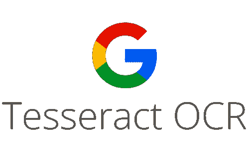
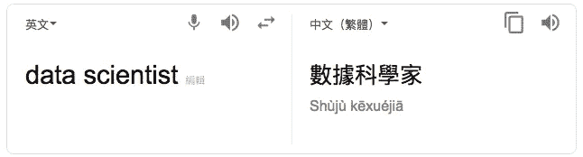
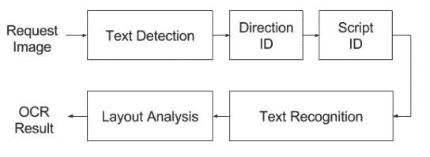
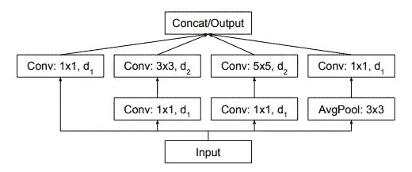
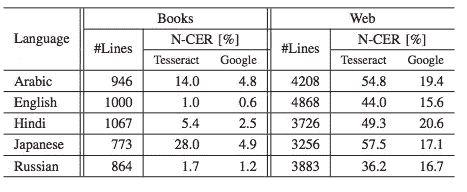

# 谷歌基于网络的 OCR 服务的秘密

> 原文：<https://towardsdatascience.com/secret-of-google-web-based-ocr-service-fe30eecedd01?source=collection_archive---------15----------------------->

## 光学字符识别简介

Photo by [Edward Ma](https://unsplash.com/@makcedward?utm_source=medium&utm_medium=referral) on [Unsplash](https://unsplash.com?utm_source=medium&utm_medium=referral)

光学字符识别(OCR)是连接现实世界和虚拟世界的方法之一。第一个 OCR 系统是在 20 世纪 20 年代末推出的。OCR 的目标是从图像中识别文本。然而，由于许多因素，实现非常高的精度是非常具有挑战性的。在下面的故事中，我将介绍谷歌如何构建解决方案，这是谷歌云视觉 API 之一，以解决这个问题。

谈到 OCR， [tesseract](https://github.com/tesseract-ocr/tesseract) 是一个著名的开源库，每个人都可以利用它来执行 OCR。宇宙魔方由惠普发现，自 2006 年以来一直由谷歌赞助开发。Tesseract 3.x 模型是旧版本，而 4.x 版本是由深度学习(LSTM)构建的。如果你想了解 3.x 和 4.x 的区别，你可以访问[分享](https://github.com/tesseract-ocr/docs/blob/master/das_tutorial2016/6ModernizationEfforts.pdf)了解更多细节。

由于 tesseract 是由 C++实现的，我们不能像调用其他 python 库一样调用它。事实上，我们可以在 python 中调用 [C-API，但是它对用户不太友好。因此，python 包装器](https://github.com/tesseract-ocr/tesseract/wiki/APIExample)[pytesserac](https://github.com/madmaze/pytesseract)的引入让我们的生活变得更加轻松。

# 定义

在介绍架构设计之前，需要介绍一些定义。

*   脚本 vs 语言:脚本不同于语言。文字指的是书写系统，而语言大多数时候指的是口语。在下图中，“数据科学家”是罗马体的英语，而“书局科学家”是罗马体的中文。

Script vs Language

*   边界框:与其他 OCR 系统不同，边界框包括单行检测文本，而不是单个字符或单个单词。
*   模型考虑:除了准确性，成本，通用性和可维护性也被考虑来建立模型。

给出一幅图像，它要经过 5 个阶段才能在[谷歌视觉 API](https://cloud.google.com/vision/docs/fulltext-annotations) 中得到最终结果。

Google Cloud Vision API Architecture (Walker et al., 2018)

## 文本检测

第一步是使用传统的基于神经网络(CNN)的模型来检测和定位文本行，并生成一组边界框。

## 方向识别

按边界框对方向进行分类。如果需要，一些边界框将被过滤掉，因为它被错误地检测为文本。

## 脚本识别

标识每个边界框的脚本。假设每个边界框有一个脚本，但允许每个图像有多个脚本。

## 文本识别

这是 OCR 的核心部分，它从图像中识别文本。它不仅包括基于字符的语言模型，还包括初始风格的光学模型和自定义解码算法。

Inception Model (Fujii et al., 2017)

## 布局分析

确定订单的阅读和区分标题、页眉等。

# 实验

如前所述，宇宙魔方是由谷歌赞助的。我想这也是作者拿结果和宇宙魔方比较的原因之一。模型比较采用字符差错率(CER)。它被定义为编辑距离除以参考长度并乘以 100。越低越好。

Tesseract vs Google Cloud Vision API (Walker et al. 2018)

# 拿走

持有一，为什么图像处理步骤不包括在管道中？论文没有提到原因。我相信这是由于神经网络模型已经能够捕捉那些特征。

除了性能，速度是另一个考虑因素。从我的经验来看，宇宙魔方在识别方面做得很好，但速度相当慢。

# 关于我

我是湾区的数据科学家。专注于数据科学、人工智能，尤其是 NLP 和平台相关领域的最新发展。你可以通过[媒体博客](http://medium.com/@makcedward/)、 [LinkedIn](https://www.linkedin.com/in/edwardma1026) 或 [Github](https://github.com/makcedward) 联系我。

# 参考

沃克 j，藤井 y，Popat A. C..2018.基于网络的文档 OCR 服务。

王晓东，王晓东，王晓东，王晓东，王晓东，王晓东。..2017.[用于多语言 OCR 的序列到标签文字识别](https://arxiv.org/pdf/1708.04671.pdf)。