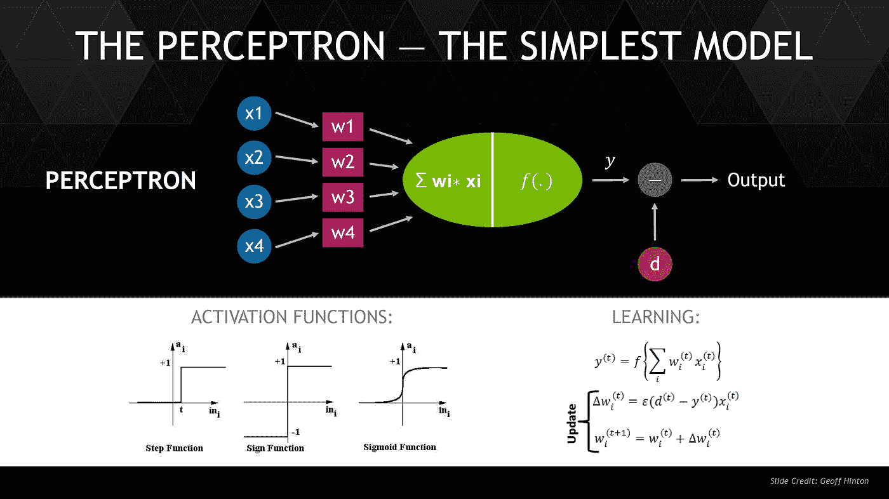
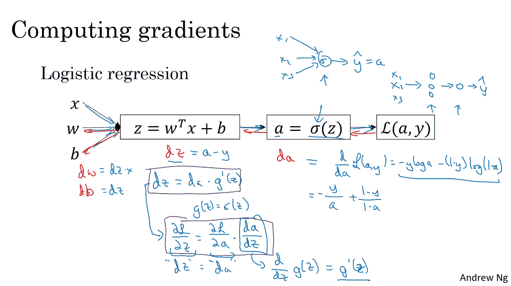
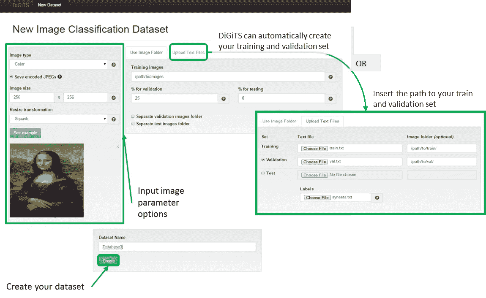

# 保护学习机器:

> 原文：<https://towardsdatascience.com/securing-learning-machines-bdfb6db96f9d?source=collection_archive---------30----------------------->

## 在尝试保护产品之前，先了解机器学习、人工神经网络和人工智能背后的基础知识

The Perceptron — The Simplest Model by Geoff Hinton

**场景:**

你刚刚被位于昂贵的硅谷某处的一家有前途且资金充足的“人工智能和人工智能”技术初创公司聘用为他们的第一名安全工程师。

你满足了他们对“技术堆栈”体验的所有要求，在面试中，你对如何处理复杂的安全问题表现出了热情和激情。你同意了这个提议，你已经准备好开始你的第一天。

有一个问题。

你对机器学习(ML)、人工神经网络(ANN)和营销界的新宠“人工智能”(A.I .)一无所知，也没有任何经验。为了简单起见，在整个故事中，我们将这一技术堆栈称为 ML/ANN/AI。

想象一下，您只有两周时间来熟悉支持产品堆栈的技术。

你从哪里以及如何开始？书籍？网络课程？只是谷歌的东西？

Don’t just Google stuff. Prepare a learning path. (Photo by [Jacky Chiu](https://unsplash.com/photos/_kf2Z44k7Ng?utm_source=unsplash&utm_medium=referral&utm_content=creditCopyText) on [Unsplash](https://unsplash.com/search/photos/startup-software-engineer?utm_source=unsplash&utm_medium=referral&utm_content=creditCopyText))

首先，不要自责。你不是落后者。这些都是尖端技术，由于可使用的现成框架的爆炸式增长，它们最近悄悄进入了主流软件产品。

这些框架包括 Caffe，TensorFlow，PyTorch，NVIDIA DIGITS 和 RAPIDS，以及亚马逊 AWS，谷歌云平台和微软 Azure 基于云计算的产品。

所有人都称之为“机器学习的民主化”

我个人认为，如果有足够的动力和时间，即使没有 ML/ANN/AI 的实践经验，你仍然可以赶上技术，成为一名有效的安全工程师。

那么如何开始呢？

理解 ML/ANN/AI 的基础和构建模块是你的首要任务。

其余的，也就是你所支持的产品的代码和基础设施的实际实现，你可以边做边学。

对于安全工程师来说，在不了解其背后的基本原理或核心原则的情况下，保护基于尖端技术的新产品或服务是一场艰苦的战斗。

以下是我的一些个人建议，告诉你如何在短时间内掌握基本知识，以便开始帮助保护产品:

> “理解 ML/ANN/AI 的基础和构建模块是你的首要任务。剩下的，就是你所支持的产品在代码和基础设施中的实际实现，你可以边做边学。”

(**注:**这是个人推荐，也是我熟悉 ML/ANN/AI 技术栈所走的路。绝不是唯一的办法，随便挑你喜欢的就行。我与课程的创建者和书籍作者没有业务关系)

# **在线课程**

我建议在开始学习之前，先复习一下 Python 脚本/编码知识。在我开始学习之前，我已经不再每天写代码了，所以我在 Python 上有点吃力。但如果我能做到，你也能。

以下是我的学习经历:

**1。** [**IBM 数据科学基础—一级**](https://cognitiveclass.ai/courses/data-science-101/) **(免费)**

数据科学概念、方法、工具包和业务用例介绍。**完成时间:3 小时**

**2。** [**IBM 数据科学基础—二级**](https://cognitiveclass.ai/learn/data-science/) **(免费)**

1 级课程的延续。回顾数据科学工具和数据科学方法的介绍性概念、更深入的讨论和实践。完成时间:13 小时

**3。** [**IBM 应用数据科学与 Python**](https://cognitiveclass.ai/learn/data-science-with-python/) **(免费)**

现在是时候应用您在之前的数据科学基础课程中学到的数据科学概念和方法了。本课程将教你如何使用 Python 语言来清理、分析和可视化数据。课堂实验很短但很有帮助，因此你可以获得处理有趣数据问题的实践经验。使用 Python 深入研究数据分析和数据可视化。了解如何将事实上的 Python 库的基础知识用于数据科学 pandas、Matplotlib、Seaborn 和 Folium。完成时间:23 小时。

**4。** [**IBM 机器学习用 Python**](https://cognitiveclass.ai/badges/machine-learning-python/) **(免费)**

本课程将向您介绍使用 Python 进行机器学习的基础知识。它将向您介绍有监督和无监督的机器学习，流行的算法，如分类，回归，聚类和降维，以及流行的模型训练/测试分裂，均方根误差和随机森林。完成时间:12 小时。

**5。** [**深度学习。人工智能神经网络和深度学习**](https://www.deeplearning.ai/deep-learning-specialization/) **($$$)**

由全球公认的机器学习先驱吴恩达创建和教授。深入探究神经网络和深度学习进化背后的理论和数学。

为繁重的数学和线性代数复习做准备。本课程将深入探讨深度学习介绍、神经网络基础知识以及浅层和深层神经网络。

由于大量的符号和公式，白板会议可能会让你睡着，请确保你及时休息，以便吸收关键概念。练习在自己的备忘单或白板上写下注释，以加强学习和视觉识别。

Computing gradients: One of Andrew Ng’s whiteboard session in his course.

这门课的编程练习完全值得一试。你将使用 Jupyter 笔记本，在复习了前面的基础课程后，你现在应该已经知道了。完成时间:18 小时。

> "练习在你自己的备忘单或白板上书写符号，以加强学习和视觉识别."

**6。** [**英伟达**](https://www.nvidia.com/en-us/deep-learning-ai/education/)**($ $)**

这是一门优秀的入门课程，包括在 NVIDIA 的 DIGITS 平台上进行图像分类和对象检测的实际配置和编码练习。了解已经在平台上使用的图像分类中获奖的预训练模型 AlexNet、GoogleLeNet、LeNet 和 UNET。

您将探索深度学习的基础，并学习如何训练和提高神经网络的性能，学习深度学习工作流，实验数据、训练参数(也称为超参数调整)、网络结构和其他调整，以提高神经网络的性能和能力。

You will learn how to classify, train and tweak hyperparameters quickly using NVIDIA’s DIGITS platform.

完成本课程后，我立即获得了许多使用该平台进行图像分类的想法和业务用例。**完成时间:8 小时以上。**

# **书籍**

按顺序排列，下面是我推荐给你的书籍，你可以阅读它们来提高你的基础知识或者扩展它们。

我还没有 100%看完所有这些书，但是从一本书跳到另一本书来改变一下步调，对你的学习道路很有帮助。

1. [**塔里克·拉希德制作自己的神经网络。**](https://www.amazon.com/Make-Your-Own-Neural-Network/dp/1530826608/ref=sr_1_2?keywords=Make+your+own+neural+network&qid=1551640616&s=gateway&sr=8-2)

可能是我读过的关于神经网络的最好的入门材料。像伟大的理查德·费曼会如何解释一样解释(像我五岁/ELI5 一样解释)

**2。** [**务实的艾乘诺亚的礼物**](https://www.amazon.com/Pragmatic-AI-Introduction-Cloud-Based-Analytics/dp/0134863860/ref=sr_1_1?keywords=Pragmatic+AI&qid=1551640674&s=gateway&sr=8-1)

Noah 是一位好朋友兼柔术实践者写的，他已经在数据科学领域工作多年了。了解现代开发人员工作流程，以及如何利用云计算服务来运行机器学习工作负载。在职场上非常有用。

**3。** [**安迪·托马斯博士编码深度学习革命**](https://adventuresinmachinelearning.com/coding-deep-learning-ebook/)

工程师的理想伴侣书。介绍深度学习概念和模型。了解如何使用 Python、Tensorflow 和 Keras。大量的示例代码和编码练习。在职场上非常有用。

**4。** [**机器学习的向往:深度学习时代 AI 工程师的技术策略吴恩达**](https://www.mlyearning.org/)

注册并获得该领域全球公认的领导者吴恩达的书的草稿。雄辩的文字说明，易于阅读。技术或数学方面没那么重。提倡简化工作流程，您可以从 Andrew 本人那里获得提示和指导！

**5。** [**深度学习的 TensorFlow:从线性回归到强化学习拉姆伦达和扎德**](https://www.amazon.com/TensorFlow-Deep-Learning-Regression-Reinforcement/dp/1491980451/ref=sr_1_5?keywords=Tensorflow+for+Deep+Learning&qid=1551714229&s=books&sr=1-5)

通过 TensorFlow 学习机器学习的基础知识，tensor flow 是谷歌著名的深度学习软件库，使工程师可以直接设计和部署复杂的深度学习架构。了解如何使用 TensorFlow 构建能够检测图像中的对象、理解人类文本和预测潜在药物属性的系统。

Photo by [NeONBRAND](https://unsplash.com/photos/uEcSKKDB1pg?utm_source=unsplash&utm_medium=referral&utm_content=creditCopyText) on [Unsplash](https://unsplash.com/search/photos/learn-to-code?utm_source=unsplash&utm_medium=referral&utm_content=creditCopyText)

总而言之，我想重申一下这个学习途径的目标:

作为一名新创公司的安全工程师，您需要了解使用 ML/ANN/AI 创建软件产品所涉及的基本原则、理论、技术和现代工具，以便您拥有保护产品的最基本的知识和背景。

拥有适当的上下文是生成您负责保护的产品的最小可行威胁模型的必要条件。

(精通是一件不同的事情，通常需要至少 10，000 小时对你的技能或专业领域的刻意练习。)

如果加上完成在线课程的总预计时间，总计 80 多个小时，大约三天。实际上，我会用一周的时间来完成这些课程，其中主要包括通过 Stack Overflow 和 GitHub 进行编码练习的研究。我可以在家连续两周从早上 9 点到晚上 12 点学习来完成这些课程。

目前，我正享受着翻阅我提供的书单，探索很酷的 GitHub 项目，如[优步的 Ludwig 项目](https://uber.github.io/ludwig/)和 [NVIDIA 的 DIGITS 平台](https://developer.nvidia.com/digits)，以及它如何帮助美国安全工程师快速原型化由 ML/ANN/AI 增强的信息安全工具。

如果你刚刚开始你的学习之路，犹豫不决，停滞不前，请告诉我，我会尽我所能给予回应和帮助。

享受你的学习之路。会有障碍和难以消化的概念，特别是如果你来自非计算机科学教育背景，但正如俗话所说，“这不是目的地，而是旅程”

去找你的 y 吧。明白吗？

***来自《走向数据科学》编辑的提示:*** *虽然我们允许独立作者根据我们的* [*规则和指导方针*](/questions-96667b06af5) *发表文章，但我们并不认可每个作者的贡献。你不应该在没有寻求专业建议的情况下依赖一个作者的作品。详见我们的* [*读者术语*](/readers-terms-b5d780a700a4) *。*