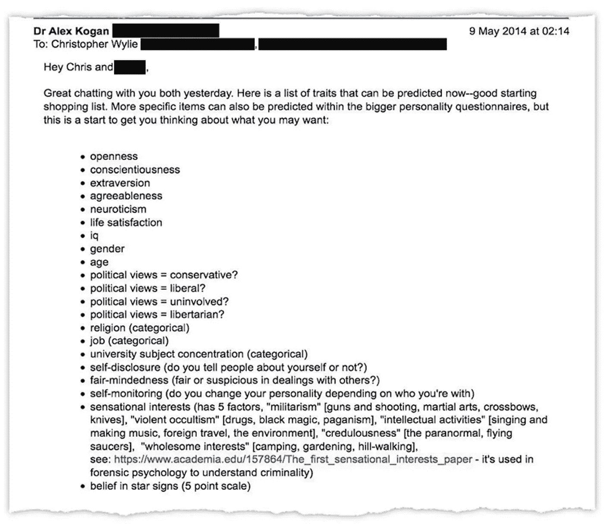
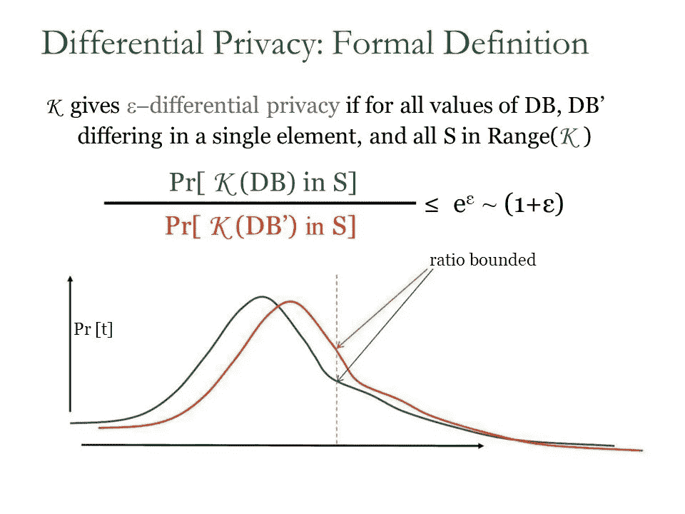
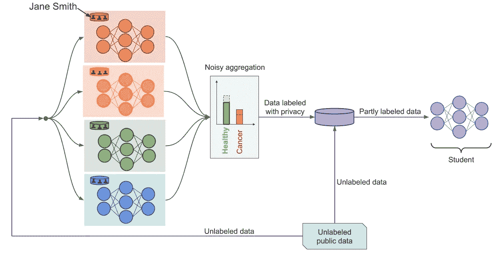
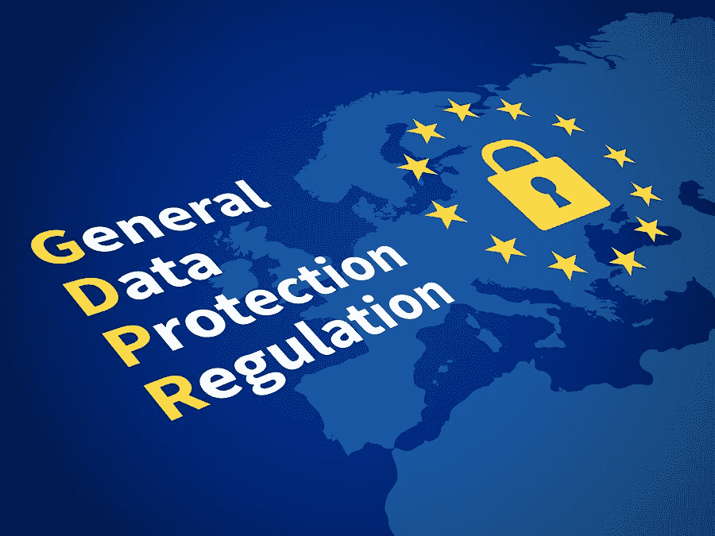

# 人工智能和机器学习中的安全和隐私考虑—第 6 部分:近距离接触隐私

> 原文：<https://towardsdatascience.com/security-privacy-in-artificial-intelligence-machine-learning-part-6-up-close-with-privacy-3ae5334d4d4b?source=collection_archive---------5----------------------->

*注意:这是“人工智能中的安全和隐私&机器学习”系列文章的第 6 部分。以下是所有文章的链接(到目前为止):*

*   [*Part-1*](/security-and-privacy-in-artificial-intelligence-and-machine-learning-part-1-c6f607feb94b)*——*[*打下江山*](/security-and-privacy-in-artificial-intelligence-and-machine-learning-part-1-c6f607feb94b)
*   [*Part-2*](/security-and-privacy-considerations-in-artificial-intelligence-machine-learning-part-2-the-new-39748342a5a)*——*[*新增资产*](/security-and-privacy-considerations-in-artificial-intelligence-machine-learning-part-2-the-new-39748342a5a)
*   [*Part-3*](/security-and-privacy-considerations-in-artificial-intelligence-machine-learning-part-3-attacks-f3987342b903)*——*[*攻击运行时*](/security-and-privacy-considerations-in-artificial-intelligence-machine-learning-part-3-attacks-f3987342b903)
*   [*Part-4*](/security-and-privacy-considerations-in-artificial-intelligence-machine-learning-part-4-the-d02a2fa3f665)*——*[*安全用例*](/security-and-privacy-considerations-in-artificial-intelligence-machine-learning-part-4-the-d02a2fa3f665)
*   [*Part-5——当攻击者使用 AI*](/security-and-privacy-considerations-in-artificial-intelligence-machine-learning-part-5-when-6d6d9f457734)
*   *第 6 部分——本文。*

Photo by [Jason Blackeye](https://unsplash.com/@jeisblack?utm_source=medium&utm_medium=referral) on [Unsplash](https://unsplash.com?utm_source=medium&utm_medium=referral)

在本系列的前一篇文章中，我们研究了攻击者如果也开始利用 AI/ML 的能力(这是不可避免的),可能造成的损害的性质和程度。在这一部分，我们将把注意力转移到另一个方面，在机器学习的背景下更仔细地研究隐私。

就隐私而言，人工智能/人工智能的进步带来了巨大的挑战。每一个新的场景——无论从功能和效用的角度来看多么引人注目——似乎都带来了影响和损害数据隐私的可怕的新方式。

让我们来看看隐私在人工智能/人工智能环境中的表现——治理、个人和组织的动机、隐私保证的技术机制、监管方面等等。

# 美丽新世界中的隐私治理

鉴于人工智能/人工智能场景的巨大利润可能性，在介绍隐私治理挑战时，很少有什么比近距离观察“剑桥分析”争议更好的了。

如果你没有听说过剑桥分析，首先，欢迎回到地球！:-).事情的要点是，2014 年，剑桥大学的一名心理学教授在脸书应用平台上发布了一款名为“这是你的数字生活”的“心理测量”/“个性档案”应用。该应用程序至少在纸面上征得了用户的同意，收集了他们的一些个人资料/个人信息*。作为一项个性测试，它变得非常受欢迎，到 2016 年，约有 5000 万美国*公民*注册并参加了测试(这使作者能够了解和洞察 5000 万公民的个性！).*

然而，在如何和为什么这样做方面存在一些问题。首先，该应用程序收集的个人数据远远超过了它获得同意的数量。第二，这位教授与一家名为 Cambridge Analytica (CA)的公司有业务往来，该公司专门为大型竞选活动提供咨询。这位教授(碰巧部分是俄罗斯人，部分是美国人)将这些数据以大约 2 亿美元的价格卖给了 CA。此外，剑桥分析公司的大投资者之一是一名共和党参议员，他也是特朗普总统竞选活动的重要助手。剩下的就是让我们[把这些点](https://www.nytimes.com/2018/03/17/us/politics/cambridge-analytica-trump-campaign.html)联系起来。

下面的截图来自教授和他在加州大学的团队之间的电子邮件交流(克里斯·怀利成为了其中的一个[告密者](https://www.theguardian.com/news/2018/mar/17/data-war-whistleblower-christopher-wylie-faceook-nix-bannon-trump))。

“This is a start to get you thinking about what you may want…”

CA 争议不仅凸显了如何使用大数据分析/AI&ML 世界的技术来“大规模社会工程化”像民主这样的长期制度，它还对跨几个系统和组织边界的治理失败进行了出色的研究。这是一个严重的提醒:保护我们的隐私是如何建立在站不住脚的承诺之上的，而这些承诺可能会被一股令人信服的商业价值主张冲掉。

随着基于人工智能和人工智能的商业机会的扩大和变得更加普遍，各行各业的隐私和安全专业人士可能会面临类似的困境，即在收集和保留个人数据以及对其使用保持透明方面，应该在哪里划定界限。从一开始就没有非黑即白的事情——但是现在可能会有更多的灰色阴影。

正如我们所看到的，不幸的消费者记住这一点很重要:

On the internet *you* are the product!

说到这个话题，另一件需要注意的事情是，我们在社交网络平台上留下的“赞”已经被证明是关于我们的丰富信息来源。[这项研究](http://www.pnas.org/content/112/4/1036)表明，只要知道 10 个赞，计算机模型就能判断或理解某人的个性，就像判断或理解同事一样，70 个赞时，它能胜过朋友，150 个赞时，它能胜过家庭成员，300 个赞时，它能胜过配偶！！

# 大数据、隐私和匿名

尽管 AI/ML 将挑战推向了一个全新的水平，但自大数据本身的早期以来(即远在机器学习回归主流之前)，对隐私的担忧就一直很普遍。

许多大数据场景带来的一个经典问题是“推理控制”的挑战，即在不泄露数据集中个人隐私敏感信息的情况下，为各种研究/调查项目共享大规模数据集的摘录的能力。在深入研究机器学习环境中的隐私方面之前，让我们探索一下在挖掘大型数据集时多年来开发和使用的技术。

Privacy concerns have been around since early days of Big Data

包含人员数据的数据库通常具有列/属性，从隐私的角度来看，这些列/属性可以是以下类型之一:

(a)*【PII】*—这些栏目可以直接链接或识别一个人(例如，社会保险号、电子邮件地址等)。).

(b) *准标识符(QI)* —这些列本身可能没有用处，但可以与其他 QI、查询结果和一些外部信息结合使用，以识别个人身份(例如，邮政编码、年龄、性别等)。).

(c) *敏感栏* —这些属性不是 PII 或 QI，但构成出于各种原因(如工资、HIV 诊断、居住地理位置等)需要保护的个人的数据。).

(d) *非敏感列* —这些是不符合上述(a)、(b)或(c)的剩余属性(例如，国家)。

Types of attributes from a privacy standpoint

显然，在合格中介机构存在的情况下，仅仅从数据集中删除 PII 列不足以保护隐私。例如，如果一个数据集中存在基本的人口统计数据(称为 QI ),那么它可以与其他公共数据源(如选民登记名单)相结合，以非常准确地识别个人。几年前，研究人员使用了这种方法，当时他们发现为 Netflix Prize 比赛共享的“匿名化”数据集可能会通过与另一个公共数据源的一些数据相关联而受到损害。IMDB 上用户对电影的评级。在这种情况下，研究人员利用 IMDB 公开提供的几个数据点来挖掘网飞数据集，并揭示了个人的*整个*电影观看历史(这被认为是敏感的，受美国隐私法规保护)。

那么什么可能有用呢？

向'***k-匿名*** '、'***l-多样性*** '和'***t-亲密度*** '问好。

**K-匿名**用于保证对大型数据集的任何任意(基于 QI 的)查询都不会暴露有助于将群体缩小到“K”个人阈值以下的信息。也就是说，该技术提供了一种保证，即对于任何使用他们对特定个人的 qi 的知识从数据集中挖掘隐私敏感属性的人来说，将保持“至少 k”个记录的模糊性。

在这种情况下，具有一个或多个 qi 的相同值的数据集子集被称为“等价组”(或“等价类”)。例如，'*在某个邮政编码*的所有 30 岁以下的女性可以构成一个等价组。目标是确保攻击者无法利用此类查询来缩小范围并获取特定人员的敏感信息。本质上，“k-匿名”确保数据集的所有可能等价组至少有“k”条记录。

这是通过使用以下技术实现的:( a) **清除**记录或列，其中一些记录可能被完全清除，或者某些 QI(例如，性别)可能在其他记录中被替换为“*”；或者(b) **概括**，其中特定 QI 值被范围(例如，63 年→55-70 年)或数字替换为分类值(例如，87% →“通过”)—从而降低基于 QI 的查询对数据集的精确度。

A ‘k-anonymized’ result set (k=3)

**对 k-匿名的攻击—** 如果来自数据集的不同子集(可能出于不同目的发布)的结果未经排序，则“k-匿名”中使用的技术可能会受到攻击。例如，为不太敏感的场景发布的子集可能有一个有用的 QI，攻击者碰巧将它链接到使用其他信息的个人。然后，攻击者可以查看同一数据的一个更敏感的子集，如果这些行恰好处于相同的顺序，则将个人与敏感信息(例如，疾病)相关联。对此的缓解是随机化每个释放子集的顺序。

如果在每个等价组中包含敏感属性的记录没有足够的多样性，则另一类攻击开始起作用。在这种情况下，攻击者可以使用个人的一些背景信息来推断他们的敏感数据。在极端情况下，如果一个等价组中的所有记录都具有相同的敏感属性的*值，那么攻击者甚至可以在没有背景信息的情况下做出推断。例如，如果匿名化的数据集揭示某一年龄范围(例如，20-30 岁)的个人的所有记录都患有特定疾病，并且如果攻击者知道特定的人(例如，该年龄组中的邻居)在数据集中，则他们可以断定此人患有相同的疾病。*

因此，虽然 k-匿名提供了对 **'** 成员推断 **'** 攻击的抵抗，但是它不能防止“属性推断”攻击(这种攻击来自等价组的同质性)。

k-anonymized data lacking attribute diversity can leak sensitive info

**L-Diversity** 试图通过确保等价组具有“**属性多样性”**来解决这个问题。也就是说，它确保具有相同 QI 值(例如，相同年龄组)的数据集子集具有敏感属性的“足够多样性”(至少“l”个不同值)。此外，它试图在*所有可能的*等价组中达到这一点。请注意,“l-多样性”与“k-匿名”携手工作——它将“属性推断”保护添加到受“k-匿名”保护的“成员推断”数据集。

虽然“l-多样性”涵盖了“k-匿名”的弱点，但在具有许多 qi 的数据集上实现这一点是复杂和困难的(因为这会导致需要处理大量等价组)。此外，攻击者可以利用(a)属性值之间的语义关系或者(b)属性值具有非常不同的敏感度级别的情况来提取私人信息。它还假设攻击者不知道敏感属性在整个数据集中的实际全局分布(这通常是不正确的)。

**T-closure**通过有意识地保持每个敏感属性在等价组中的分布“接近”其在完整数据集中的分布来缓解这些弱点。在“t-接近度”中，敏感属性在等价组中的分布与该属性在整个表(或群体)中的分布之间的距离不超过阈值“t”。此外，它使用推土机距离(EMD)的概念来表示分布之间的“距离”,因为它具有消除不同属性敏感性影响的优点。

# 输入 AI/ML

当我们将 AI/ML 的算法和技术引入大数据领域时，挑战会上升到一个完全不同的水平。这是因为，与传统的基于查询/规则的数据提取/三角测量方法不同，ML & AI 场景可以以任意复杂的方式组合数百个输入维度/特征，因此，可以以迄今为止未知和不可理解的方式危及隐私。

大数据时代的技术在这个生态系统中苦苦挣扎。例如，“k-匿名”依赖于找到附近“k *记录”的能力，以返回进行查询——这是超维空间中一个已知的挑战/模糊的概念。例如，一个在线购物网站存储了数百个关于其客户的属性。当每个记录有如此多的维度时,“近邻”的概念变得很难确定——忘记能够对所有等价组都这样做吧！*

现在让我们来看看一些有帮助的基本原则和当前的努力。

# 将隐私融入机器学习

## 差异隐私

最近许多分析 AI/ML 算法隐私保证的工作都利用了一个叫做**差分隐私** (DP)的概念。

差分隐私提供了一个数学框架，可用于理解机器学习算法在多大程度上“记住”了它不应该记住的个人信息——从而提供了评估 ML 算法的隐私保证的能力。这是非常宝贵的，因为我们希望模型从数据集学习一般概念(例如，工资高于 X 的人比工资低于 Y 的人购买无人机的可能性高 90%)，而不是可以揭示组成数据集的个人的身份或敏感数据的特定属性(例如，约翰的工资是 X)。此外——与“k-匿名”及其同类假设的攻击模型不同——差分隐私不假设攻击者可获得的背景知识的水平或范围。

DP — the adversary cannot tell if the training set contained a specific record

尽管“差异隐私”这个术语已经成为一个时髦的词(特别是在苹果宣布这种方法支持他们在各种 iOS 设备上的隐私保护工作之后)，但它是基础性的，因为研究人员正在各个人工智能/人工智能领域投入大量努力，以确保算法和机器学习的构建模块可以变得“差异隐私”。

差分隐私通过在处理期间添加受控量的“噪声”来实现其目标，以便在下游生成足够的模糊性，使得不能基于来自系统的预测做出影响隐私的推断。此外，这样做的同时还能确保预测足够准确，具有实用性。它基于固定“隐私预算”的概念，并为评估各种数据操作的隐私损失提供了一个基础——最终指定如何限制损失，同时实现数据效用损失的可接受折衷。

The mathematical gist of Differential Privacy (Image from [this deck](https://slideplayer.com/slide/9545059/).)

在 iOS 用例中(采用差分隐私)，苹果使用三种关键机制来保护隐私，同时仍然了解用户在各种环境下的一般行为模式。例如，在寻找“*的过程中，哪些表情符号是流行的？*’，首先，哈希用于确保他们的后端服务不会获得任何关于用户的直接识别数据。其次，通过仅报告每个用户活动的随机子集来采用子采样(即，不是发送可能感兴趣的每个数据点，而是仅发送子集)。最后，即使对于 T2 发送的数据，噪声也会被注入，因此特定用户的击键模式在后端看到时也只是大致准确。隐私感知后端算法能够在跨设备聚合数据的同时“过滤”噪音，以了解用户行为的一般模式，并在此基础上改善用户体验。因此，例如，如果确定某个特定的表情符号越来越受欢迎，它就会被添加到所有用户都能看到的快速访问表情符号集中。同样，一旦确定特定的“本地”词典单词已经被许多用户添加，它就被添加到所有用户的词典中。

[Trending emojis learned with local (client-side) differential privacy on iOS](https://machinelearning.apple.com/docs/learning-with-privacy-at-scale/appledifferentialprivacysystem.pdf)

## PATE 框架

差分隐私提供了一种通用技术，可以在 AI/ML 环境中以各种方式应用。教师集合的私有聚集(PATE)框架应用差别隐私来为根据用户数据训练的模型提供整体隐私保证。PATE 框架中的关键直觉是*“如果两个基于独立数据训练的模型在某些结果上达成一致，那么向消费者分享该结果就不太可能泄露任何关于特定用户的敏感数据”。*

该框架将私有数据划分为子集，并在每个子集上独立训练不同的模型(称为“教师”)。总体预测是通过组合教师模型“整体”的各个预测而生成的。这本身并没有增加任何隐私成分。这是通过两个重要步骤实现的。首先，在组合单个教师的结果时会添加噪声，因此组合的结果是单个教师预测的“有噪声的集合”。第二，来自教师总体的这些有噪声的预测被用作“标记的训练数据”来训练下游的“学生”模型。就是*这个*学生模型被暴露给终端用户消费。[PATE 框架的作者撰写的这篇文章](http://www.cleverhans.io/privacy/2018/04/29/privacy-and-machine-learning.html)更为详细。

[Private Aggregation of Teacher Ensembles (PATE)](http://www.cleverhans.io/privacy/2018/04/29/privacy-and-machine-learning.html)

## 联合学习

**联合学习**采取了一种有些不同的方法来保护众包学习场景中的隐私。关键的想法是，如果我们可以设计出从数据子集(孤岛)中学习的方法，然后有效地汇总我们的学习，为什么还要把所有的数据聚集在一起呢？’。

这使得在几种有趣的情况下学习成为可能。例如，一组医院可能对应用 ML 技术来改善患者的医疗保健感兴趣，但是(a)单个医院可能没有足够的数据来独自完成这项工作，以及(b)他们可能不想冒险将他们的数据用于集中汇总和分析。这是应用联合学习的理想场景。

另一个常见的场景是使用机器学习来改善跨设备平台的用户体验，而无需将用户活动数据从单个设备移动到中央服务(此处描述为)。在后一种情况下，每个设备从中央位置下载一个(定期改进的)模型，并在本地应用 ML 来对要提交回中央服务器的模型进行“微改进”。这种方法越来越受欢迎，还因为每个设备上本地可用的数据越来越丰富(因此本地学习非常有益，隐私约束更少)，以及与过去相比更强大的设备端处理器(使得计算密集型 ML 算法可行)。

## 同态加密

最后，通过利用一种称为**同态加密(HE)的加密技术，人们也在努力使用密码术来提供机器学习中的隐私保证。**

当使用传统技术对数据进行加密时，就不可能对加密形式的数据进行任何有意义的计算。随着云计算的广泛采用，人们经常会遇到这样的情况:拥有敏感数据的一方想要将对该数据的一些计算外包给它不信任明文数据的第三方。同态加密基本上提供了对加密数据执行各种有意义的操作的能力，而无需直接访问加密密钥或纯文本数据本身。使用同态加密，服务可以对加密数据执行请求的计算，并将(加密的)结果返回给客户端。然后，客户端可以使用加密密钥(从未与服务共享)来解密返回的数据并获得实际结果。

同态加密本身是一个不断发展的领域。性能是一个很大的问题，某些限制——例如只计算多项式函数的限制(ML 中的许多激活函数是非多项式的)和只计算整数模 n 的加法和乘法(大多数学习算法需要浮点计算)——意味着仍然有许多挑战要克服。然而，随着机器学习即服务(MLaaS)的日益流行，人们对改进利用同态加密来执行“加密”机器学习的技术产生了浓厚的兴趣。这两种变体都在探索中——对加密数据执行学习/预测的能力，以及使用加密模型对明文数据进行学习的能力。

Privacy regulations and machine learning

# GDPR 和机器学习

《通用数据保护条例》(GDPR)于 2018 年 5 月生效，这是欧盟让全球组织认真对待个人数据的最新尝试。简而言之，GDPR 将任何处理(或外包处理)欧盟公民数据的实体/组织的隐私保护门槛推得更高。在同意处理、数据保护、违规披露和擦除方面有着严格的要求，对故意违规行为会处以重罚。此外，与它的前身数据保护指令(DPD)不同，它是一个“指令”(被成员国用作制定法律的*指导方针*)，GDPR 是一个“法规”(一个*法律*本身)。

The GDPR went into effect from May 2018

《GDPR》中的一些条款就其对人工智能/洗钱的潜在影响激起了许多讨论和辩论。让我们简单地看看几个突出的例子。

## “潜在可识别”数据的解释

在“适用范围”部分，GDPR 声明该法规适用于*“所有可能识别数据主体的欧盟公民数据”。这本身就提出了一个有趣的难题。鉴于人工智能/人工智能算法的巨大能力和洞察力，是否有可能将任何处理关于人的数据(以任何形式和出于任何目的)的系统明确排除在 GDPR 的管辖范围之外？你能确定你正在处理的关于人的数据不会以任何方式被用来识别任何对象吗？*

此外，探索性数据分析(EDA)是帮助数据科学项目走向创新和有趣见解的最有价值的活动之一。GDPR 规定，未经数据主体的进一步同意，数据处理者不得将数据用于超出原始意图的任何目的。这最多会大大减慢探索的速度。

## 明确禁止人们服从“自主”决定

GDPR 明确禁止数据主体受制于自主决策的结果。但这就是这么多 AI/ML 主流用例的全部本质，对吧？这一条款是否意味着不能将 ML 应用于欧盟公民的数据？当有人浏览一个网站时显示广告是否构成了自动决策？有许多这样的问题需要解释。当谈到 AI/ML 的使用时，似乎有一个出路，大多数组织可能会依靠它。基本上，如果自主决策是(a)履行合同义务所必需的或出于法律原因所需要的，或(b)当数据主体明确同意时，这一禁令不适用。

## 解释的权利

这是一个棘手的问题。GDPR 要求应向数据主体提供充分的解释，这些主体可能希望了解为什么基于对其数据的使用做出某个(自动)决定。这样做的目的是提高透明度，并确保这种系统是公正的。

然而，机器学习模型的复杂性以及解释它们如何得出预测或结果的严重困难，使这成为一项艰巨的任务。尚不完全清楚这些解释需要“细化”到何种程度才能被监管机构接受。例如，如果使用深度神经网络(DNN)，数据处理器是否需要解释随机梯度下降(SGD)的内部工作原理，显示各层的权重向量，并解释卷积和丢失的逻辑等。大多数深度学习专家说，很多时候，甚至他们也不明白为什么这一切都行得通——但它确实行得通！还有知识产权保护的问题可能会在某个时候出现。

当每个人都在等待“案例法”出现并澄清这方面的确切立场时，让机器学习变得可以解释的工作正在进行中。一个例子是[局部可解释模型不可知解释(LIME)](https://arxiv.org/pdf/1602.04938.pdf) 中概述的方法。LIME 基本上将潜在的非常复杂的实际模型视为一个黑盒，并试图纯粹通过研究更复杂的模型提供的输入和做出的决策来重新创建一个更简单(更容易解释)的表示。此外，它试图“局部地”这样做，也就是说，它采用要寻求解释的特定预测，并对输入向量进行扰动，以查看输入的哪些方面在所做的决策中具有显著影响或更大权重。这承认了一个事实——尽管对一个模型的每一个方面进行彻底的解释可能令人望而生畏——我们仍然可以努力理解具体的决策。

## 被遗忘的权利

根据 GDPR 的说法，数据主体可以要求处理器删除他们可能已经存储的关于该主体的所有数据(相当于撤回过去同意使用个人数据)。这项规定旨在授权数据主体控制各种数据处理者对其数据的长期使用和保留。(它最初是由[引入的](https://www.theguardian.com/technology/2014/may/13/right-to-be-forgotten-eu-court-google-search-results)，因为它认识到保护改过自新的个人不被互联网上关于他们过去罪行的信息永久玷污的基本需要。)

当数据主体的数据用于机器学习时，当他们撤回同意或请求删除数据时，会出现一个有趣的问题。是否应该要求数据处理器在没有特定对象数据的情况下重新训练先前训练过的模型？显然不是！GDPR 明确表示，撤销不影响或不适用于最初同意生效时所做的过去的处理。所以这应该是一种解脱。然而，正如我们在上一节中看到的，模型可能会记住它们不应该记住的东西，因此从训练好的模型开始重新创建潜在的可识别数据是可能的。这意味着，虽然您可能认为您已经删除了数据主体的数据，但它可能仍然是可恢复的！目前，这种风险似乎已经被学术界忽略了。

# 接下来呢？

前面关于 GDPR 及其许多规定背后的意图的讨论提出了关于人工智能/人工智能的社会含义的有趣问题。算法决策的公平性和偏见、伦理和道德等考虑因素可以在最深层次上激发我们的社会安全感。在下一篇文章中，我们将探索这些领域，并且可能从我们到目前为止所做的最广泛的意义上来看待 AI/ML 环境中的“安全性”。

***注来自《走向数据科学》的编辑:*** *虽然我们允许独立作者根据我们的* [*规则和指导方针*](/questions-96667b06af5) *发表文章，但我们不认可每个作者的贡献。你不应该在没有寻求专业建议的情况下依赖一个作者的作品。详见我们的* [*读者术语*](/readers-terms-b5d780a700a4) *。*