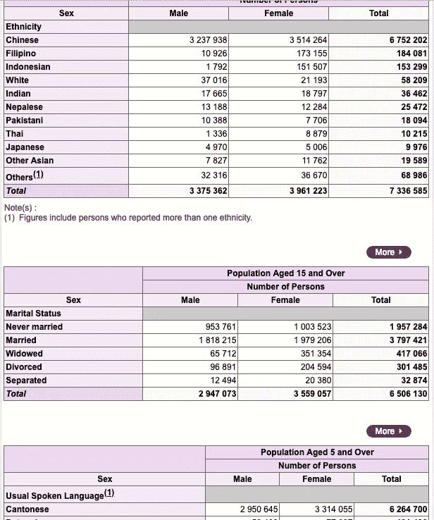
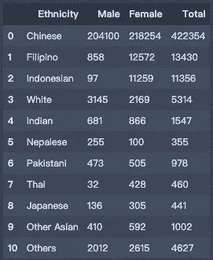
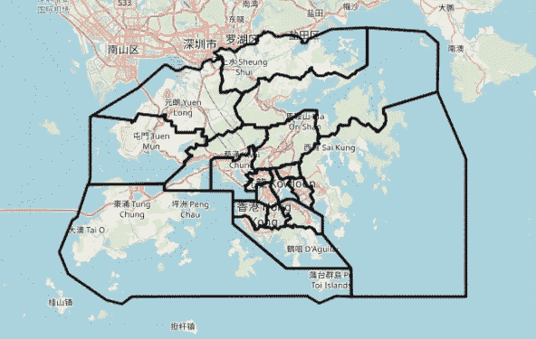
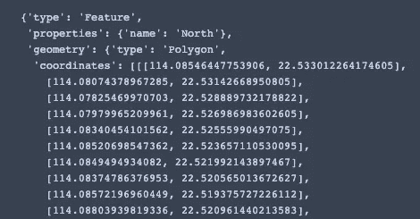
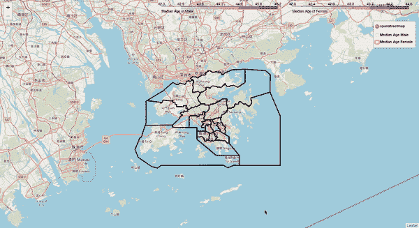
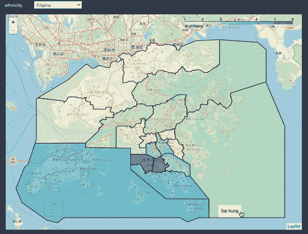

# 透过编号的颜色看世界

> 原文：<https://towardsdatascience.com/see-the-world-through-numbered-colour-d8635a2eaca7?source=collection_archive---------23----------------------->

## 香港 2016 年中期人口统计结果互动地图

起初，我只是想得到一些普查结果。这是了解我居住的地方和我周围的人的一个很好的来源。当我在[香港政府网站](https://www.bycensus2016.gov.hk/en/bc-dp.html)找到 2016 年中期人口统计结果时，首先看到的是一张地图，然后在它的下面，是无数的表格。尽管被这些表淹没了，我仍然有一些控制权。我可以选择一个区域，它会返回给我一些表格。

Table Streak! ([source](https://www.bycensus2016.gov.hk/en/bc-dp.html))

我决定制作一些彩色地图来缓解我的眼睛，而不是看那些表格和数字来找出各个地区的人口特征。

# 中期人口统计数据

中期人口统计的结果包含了很多关于人口统计、教育、经济等方面的有价值的数据。这些数据按区议会、三级规划单位、新市镇和主要屋分组。要了解更全面的情况，区议会的人口特征是一个很好的起点。这些数据可以用 Excel 格式下载。全港共有 18 个区议会，因此，最简单的方法是下载全部 18 个 Excel 档案。每个文件代表一个区，有 11 个电子表格。每个电子表格都包含一个表，例如，电子表格 D4 包含“按种族和性别划分的人口”表。

为了使它更灵活，我创建了一个类“District”来处理数据。当读取 Excel 文件时，将创建一个实例，该实例将解析数据并将其转换为 DataFrame 和 Series。这里有一个例子。

District 类有一个 summary()方法，用来计算一些有用的统计量和比率，保存为熊猫系列。为了数据可视化，所有区议会摘要都保存为 demographic_summary_2016.csv。

# 地理空间数据

第二部分数据是地区边界的地理空间数据。

就是因为找不到已经可用的 GeoJson 数据，所以在 geojson.io 上划了 18 个区的界限，把它们标绘在地图上。以下是 GeoJson 数据的快照:

The name of the district is stored in the “properties”, and the coordinates are stored in “geometry”.

# 地图可视化

当数据准备好了，就该绘制等值线图了。这是一个有多个阴影或图案区域的地图，每个区域都根据统计变量按比例测量。可视化一个地理区域中的统计测量是如何变化的是非常有用的。制作 choropleth 地图有不同的方法。Folium 提供了一个有效的选项，让我可以更少地担心美观，而是更多地关注数据部分。

District name and the median age are displayed as tooltip

从上面的 choropleth 图，我们可以很容易地确定哪个地区的平均年龄最高。当光标位于选区边界内时，将显示选区的名称和年龄中位数。图层控件允许我们选择要可视化的数据。然而，当有更多的层时，屏幕可能会很混乱，因为所有的图例将同时显示。

幸运的是，Ipywidgets 提供了有用的小部件。它们是支持为 Jupyter 笔记本构建交互式 GUI 的多事件 python 对象。有各种类型的小部件可以让你的笔记本更加有趣和互动。为了使用 Ipywigets.interact 来显示地图，我们将地图保存为 HTML 文件。

现在，它有一个用于地图选择的下拉菜单。地图中的颜色表示该地区的种族密度百分比。举例来说，湾仔有 180123 人，其中 14706 人是菲律宾人，因此，湾仔约有 8%的人口是菲律宾人。

1 Map + 1 Legend at a time

所有的代码和地图都可以在 [GitHub 库](https://github.com/DanielHLH/choropleth-of-Hong-Kong-2016-by-census-result)中找到。为了避免任何法律问题，Excel 文件不会放在存储库中，但可以从[政府网站](https://www.bycensus2016.gov.hk/en/bc-dp.html)下载。我用于可视化的摘要 csv 文件可以在存储库数据文件夹中找到。

人口普查数据是一个很好的探索资源。给出正确的演示，所有这些数字都可以成为鼓舞人心的。我在上面制作的地图只是一个简单的例子，展示了如何使用 follow 和 Ipywidgets 将来自表格和数字的人口普查数据转化为丰富多彩的 choropleth 地图。我相信在这些资料中还有许多其他的选择和未被探索的故事。一如既往，我欢迎任何类型的建议，如果你有任何想法，请随时发表评论或通过 Twitter[@ HLH _ 丹尼尔](https://twitter.com/HLH_Daniel)联系我。