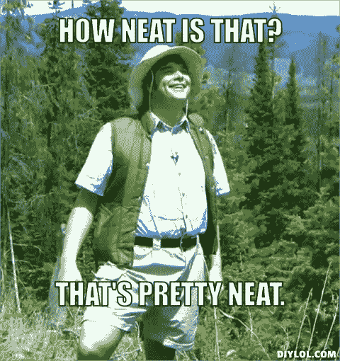
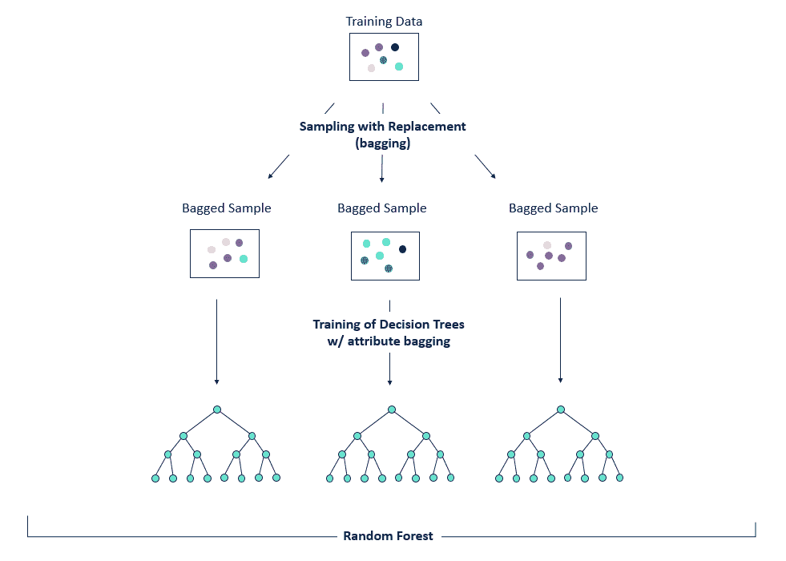
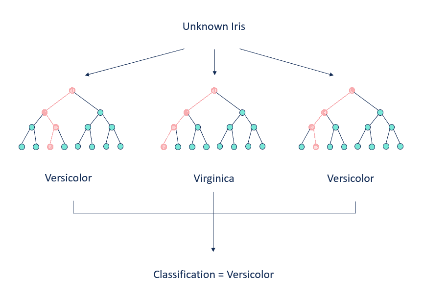
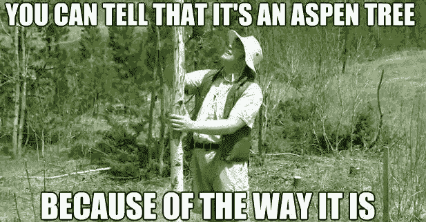
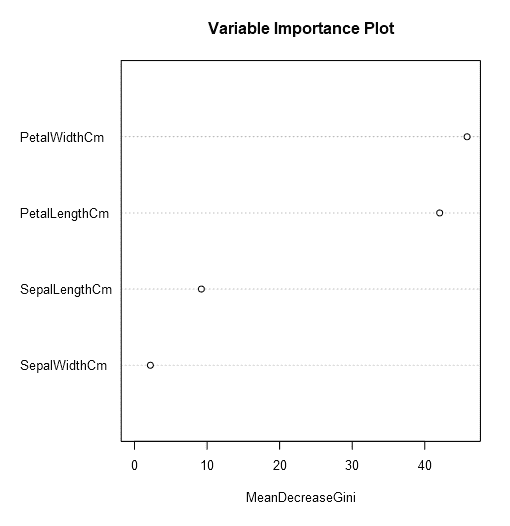
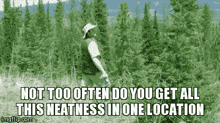

# 只见树木不见森林:随机森林导论

> 原文：<https://towardsdatascience.com/seeing-the-forest-for-the-trees-an-introduction-to-random-forest-41a24fc842ac?source=collection_archive---------22----------------------->

随机森林非常整洁。他们利用[集成学习](https://en.wikipedia.org/wiki/Ensemble_learning)来使用通常被认为是弱学习者的东西([决策树](https://en.wikipedia.org/wiki/Decision_tree_learning)来创建一个更强更[健壮的](https://en.wikipedia.org/wiki/Robust_statistics#Definition)建模方法。

随机森林模型由决策树组成，因此在进入森林之前，确保您了解这些树是非常重要的。如果你需要复习决策树，请花点时间查看[播种——决策树介绍](https://community.alteryx.com/t5/Alteryx-Knowledge-Base/Planting-Seeds-An-Introduction-to-Decision-Trees/ta-p/134623)。

正如你可能知道的，决策树的两个主要限制是，它们容易[过度拟合](https://en.wikipedia.org/wiki/Overfitting)，并且它们往往不健壮，这意味着训练数据的微小变化会导致非常不同的树。随机森林模型通过生成许多决策树，然后将每棵树的预测聚合为单个模型预测，克服了决策树的这两个缺点。

创建然后组合一堆决策树的结果看起来很基本，然而，简单地从完全相同的训练数据中创建多个树不会有成效——它会产生一系列强相关的树。所有这些树都以相同的方式对数据进行排序，因此这种方法与单一决策树相比没有优势。这就是随机森林的奇特之处开始发挥作用。为了[去相关](https://en.wikipedia.org/wiki/Decorrelation)组成随机森林的树木，进行了一个被称为[引导聚集](https://en.wikipedia.org/wiki/Bootstrap_aggregating)(也称为装袋)的过程。Bagging 通过用替换对原始训练数据进行采样来从原始数据集生成新的训练数据集([引导](https://en.wikipedia.org/wiki/Bootstrapping_(statistics)))。对于构成随机森林的尽可能多的决策树，重复这一过程。然后，每个单独的自举数据集被用于构建树。这个过程有效地降低了模型的[方差](https://en.wikipedia.org/wiki/Bias%E2%80%93variance_tradeoff)(训练数据中随机噪声引入的误差，即过拟合)，而不增加[偏差](https://en.wikipedia.org/wiki/Bias%E2%80%93variance_tradeoff)(欠拟合)。就其本身而言，将训练数据打包以生成多棵树创建了所谓的打包树模型。

称为[随机子空间方法](https://en.wikipedia.org/wiki/Random_subspace_method)(也称为属性装袋或特征装袋)的类似过程也用于创建随机森林模型。对于每棵树，对可能的预测变量的子集进行采样，从而为每棵树产生一个较小的预测变量集以供选择。这通过防止主要预测变量成为被选择来在每个单独的决策树中创建分裂的第一个或唯一的变量，进一步去相关树。如果不实施随机子空间方法，则存在一个或两个主要预测变量被一致地选为每个决策树的第一分裂变量的风险，并且所得的树将是高度相关的。bagging 和随机子空间方法的结合产生了随机森林模型。

bootstrap 聚合的聚合部分来自于组合这些决策树中每一个的预测，以确定总体模型预测。对于每个单独的记录，整个模型的输出是类的模式(分类)或单独的树的所有预测的平均预测(回归)。

在这种情况下，插入到(简化的)随机森林模型中的记录在大多数树(2/3)中被分类为杂色，因此随机森林会将该记录分类为杂色。

随机森林还有几个重要的组成部分需要强调。

**出袋错误**

Bagging 有效地导致大约 1/3 的原始训练数据被排除在每个单独的决策树之外。这些被排除的数据被称为袋外(OOB)观察值。这种效应已经被用来创建[出袋](https://en.wikipedia.org/wiki/Out-of-bag_error) (OOB)误差估计，它可以用来代替交叉验证指标。

通过在每个决策树中运行不属于训练数据的记录，然后将这些结果聚合到单个预测中，可以计算出超出范围的误差。可以为所有训练记录确定 OOB 预测，这意味着可以计算总体 OOB MSE，并将其用作模型误差率。

**可变重要性**

关于随机森林的另一个巧妙之处是，在它们的实现过程中，预测变量重要性是通过利用[基尼重要性](https://en.wikipedia.org/wiki/Decision_tree_learning#Gini_impurity)来计算的，基尼重要性用于确定各个决策树的节点，以生成杂质的平均减少(MDI)。

MDI 是一个变量的节点杂质总减少量的平均值(mean ),通过随机森林中每个单独决策树中到达该节点的样本比例进行加权。用于创建随机森林模型的每个预测变量都有一个结果 MDI 值，该值用于对变量对模型的重要性进行排序。基尼系数的平均降幅越大，表明变量的重要性越高。

**随机森林的局限性**

随机森林在模型鲁棒性方面比决策树有所提高，但在可解释性和可接近性方面有所损失。在决策树中，您可以看到用于对目标变量进行排序的单个变量分割和阈值。这在随机森林中是不可能的，在随机森林中，数百棵树被聚集在一起以创建一个估计值。因为随机森林模型不太容易接近，也不容易解释，所以它们通常被视为“黑箱”

**优势**

随机森林与组成它们的决策树有许多相同的优点。它们可以应用于分类或连续目标变量，并且可以处理不平衡数据集、异常值和非线性关系。除了这些优势，随机森林往往比单个决策树有更好的预测能力，并且不容易过度拟合。随机森林模型在估计分类数据时往往表现很好。

**总之……**

随机森林是一种集成机器学习方法，通过创建多个决策树，然后通过聚合各个树的预测将这些树组合成一个模型，来利用决策树的个体预测能力。随机森林比决策树更健壮，并且往往具有更好的预测能力。然而，它们也更不透明，看起来更令人生畏。希望这篇文章已经让你看到了(决策)树的森林，并向你展示了随机森林是多么整洁。

[https://www.youtube.com/watch?v=Hm3JodBR-vs](https://www.youtube.com/watch?v=Hm3JodBR-vs)

[原文](https://community.alteryx.com/t5/Alteryx-Designer-Knowledge-Base/Seeing-the-Forest-for-the-Trees-An-Introduction-to-Random-Forest/ta-p/158062)。经允许重新发布。