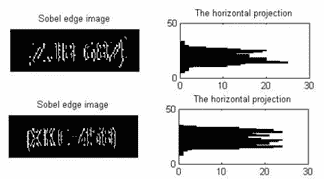
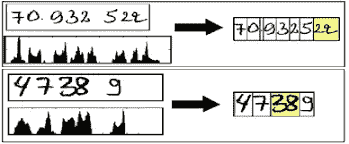
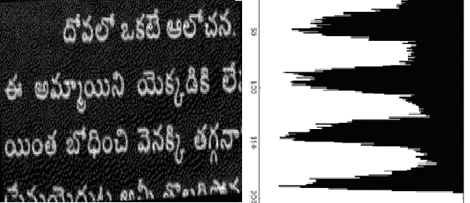
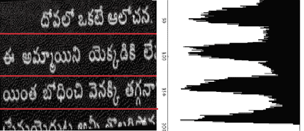
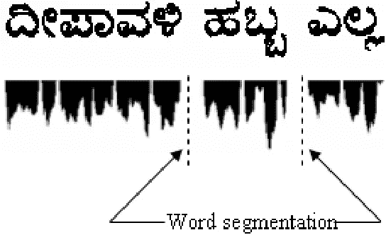
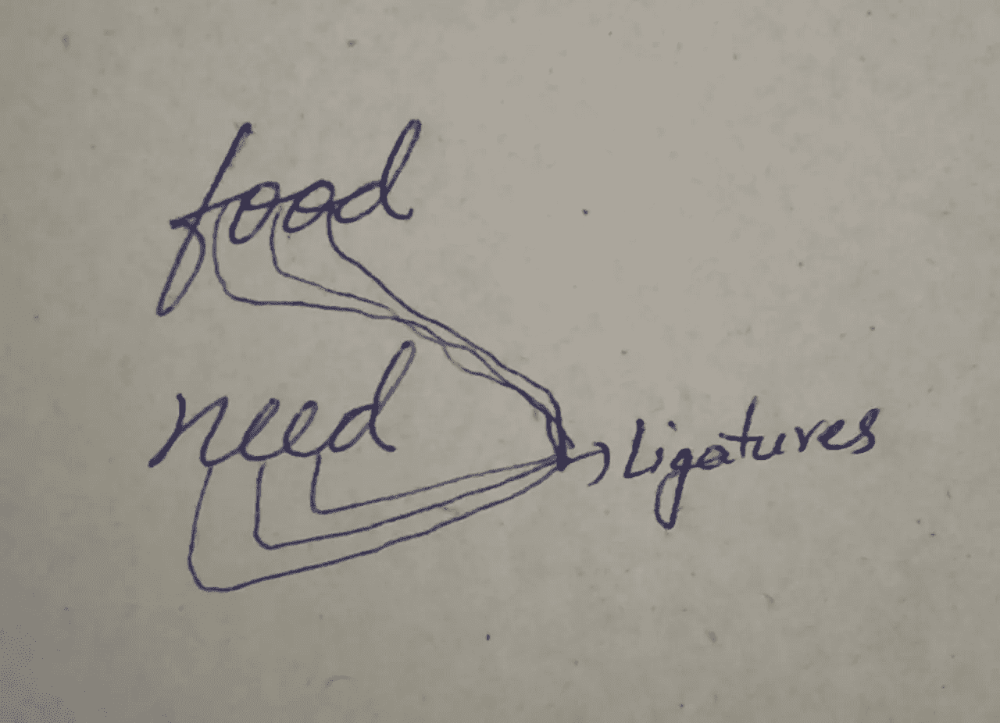
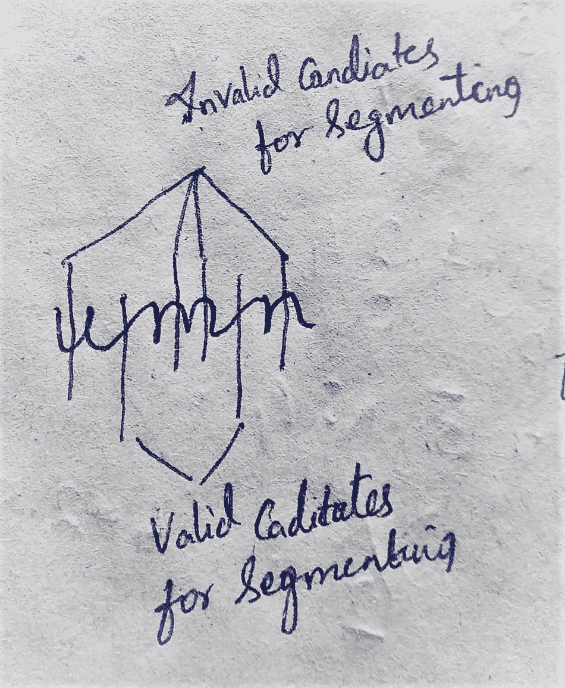
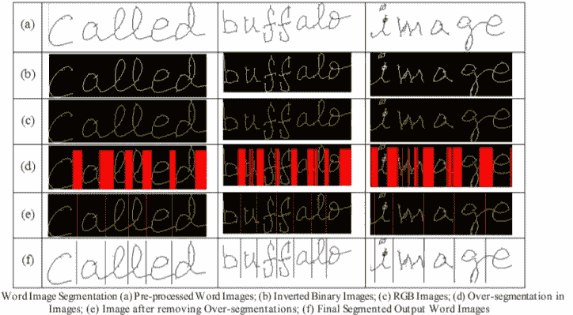
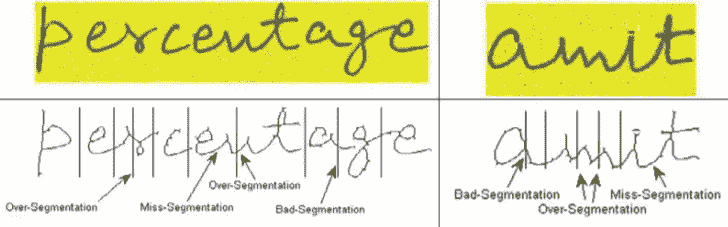

# OCR 中的分割！！

> 原文：<https://towardsdatascience.com/segmentation-in-ocr-10de176cf373?source=collection_archive---------4----------------------->

## OCR 系统使用的不同分段级别的基本说明。

欢迎来到关于 OCR 系统工作的第三部分**。在 [*上一篇*](https://medium.com/@susmithreddyvedere/pre-processing-in-ocr-fc231c6035a7) 中，我们已经看到了 OCR 系统中基本且广泛使用的预处理技术。**

在这一部分，我们将介绍 OCR 系统的另一个最重要的阶段的技术，*。*

****分割*** 无非是 ***将整幅图像分割成子块，以便进一步处理*** 。*

*图像的分割按以下顺序进行:
→行级分割
→词级分割
→字符级分割*

*对于上述所有级别的分割，我们将使用*直方图投影技术*。*

## *直方图投影法*

*下面我给大家简单介绍一下直方图投影法。一旦彩色图像被转换成二进制图像，图像中就只存在黑色和白色像素。*

*在二值图像中，代表有用信息的像素称为*，非前景像素的称为 ***背景像素。*** 我们在对图像进行二值化时，选择前景像素应该是白色还是黑色。**

*****水平直方图投影:*** 在这种方法中，我们沿着图像的行统计前景像素的*号，得到的数组的大小等于图像中*行的*号(图像的高度)。***

```
**# img be binarized image of size height x width and foregound pixel is white i.e pixel value = 255
**horizontal_hist = np.sum(img,axis=1,keepdims=True)/255**
# axis = 1 is used to take sum along the row
# horizontal_hist is an array of size height x 1# If the img has foreground pixel as black i.e pixel value = 0
**horizontal_hist = img.shape[1] - np.sum(img,axis=1,keepdims=True)/255**
# Logic :- No.of columns - No.of white pixels**
```

**将 *horizontal_hist* 绘制成直方图，如下所示**

****

**No.of White pixels (foreground) in each row. **Source:** [**researchgate.net**](https://www.researchgate.net/figure/a-Vertical-edge-maps-of-images-in-Fig-1-b-horizontal-projection-histograms_fig1_221274002)**

**在上图中，**

*   **较高的峰值意味着相应行中前景像素的*数量较高。***
*   **较低的峰值意味着相应行中*个*前景像素的数量较低**

*****垂直直方图投影:*** 该方法中，我们统计前景像素沿图像列的*个数。结果数组的大小等于图像中*列的*号(图像的宽度)。***

```
**# img be binarized image of size height x width and foregound pixel is white i.e pixel value = 255
**vertical_hist = np.sum(img,axis=0,keepdims=True)/255**
# axis = 0is used to take sum along the column
# vertical_hist is an array of size 1 x width# If the img has foreground pixel as black i.e pixel value = 0
**vertical_hist = img.shape[0] - np.sum(img,axis=0,keepdims=True)/255**
# Logic :- No.of rows - No.of white pixels**
```

**将 *vertical_hist* 绘制成直方图，如下所示**

****

**No.of Black pixels (foreground) in each column. **Source:** [**researchgate.net**](https://www.researchgate.net/figure/Segmentation-of-the-numbers-based-the-vertical-projection-histogram_fig2_282184214)**

***注意:上图中，前景像素为黑色，背景像素为白色。***

**在上图中，**

*   **较高的峰值意味着相应列中的前景像素的*数量较高。***
*   **较低的峰值意味着相应列中的个前景像素的*数量较低。***

**既然我们已经理解了*水平*和*垂直*直方图投影，我们就准备知道不同层次的 ***分割*** 是如何执行的。**

1.  *****线级分割:*** 在这一级分割中，我们被提供一个*倾斜校正图像*包含以线的形式书写的文本。*线级分割*的目的是将***的图像分割成线条*** 。**

> **写作的一般规则:我们应该在行间留有足够的空间。**

**这个想法是，如果我们*水平投影*二进制图像，**

*   *****表示一行中文本的行具有高数量的前景像素*** ，其对应于直方图中*较高的峰值*。**
*   *****表示线间间隙的行具有高数量的背景像素*** ，其对应于直方图中的*较低的峰值*。**

****

**Horizontal Projection of image, Counting No.of Foreground pixels in each row. **Source: Image by the author.****

**对应于直方图中较低峰值的行可以被选择作为分割线来分离这些线。**

****

**Segmenting the image as lines by selecting the rows which have lower peaks. **Source: Image by the author.****

**2.***单词级分割*的目的是 ***将图像分割成单词*** 。****

> **写作的一般规则:我们应该在单词之间留有足够的空间。**

**这个想法与上一步类似，但唯一的变化是，这里我们必须垂直投影图像(沿列求和)，因为我们必须垂直分割单词。**

**如果我们*垂直投影*二进制图像，**

*   *****表示文本的列具有高数量的前景像素*** ，其对应于直方图中*较高的峰值*。**
*   *****表示单词之间间隙的列具有高背景像素数*** ，其对应于直方图中的*较低峰值*。**

****

**Vertical Histogram Projection of image. **Source:** [**researchgate.net**](https://www.researchgate.net/figure/A-text-line-and-its-vertical-projection-profile-indicating-word-segmentation-for-a-sample_fig5_225875226)**

***注:上图中，前景像素为黑色像素，背景像素为白色。***

**我想你已经搞清楚上图的分词是怎么做的了。可以选择对应于直方图中较低峰值的列作为分割线来分隔单词。**

> **对于分割单词，应该以这样的方式选择较低的峰值，即它们应该跨越一定的宽度(阈值)。这是因为我们会发现较低的峰值，这些峰值对应于一个单词中不相连的字符之间的间隙，这是我们不感兴趣的。众所周知，单词之间的间隙大于单词内字符之间的间隙，阈值的选择应忽略单词内字符之间的细小间隙。**

**3. ***字符级分割:*** 在这一级别的分割中，我们得到一个包含一个单词(在前面的步骤中被分割)的图像，该单词由一系列字符组成。*字符级分割*的目的是 ***将图像分割成单个字符*** 。**

**这一级别的分割是可选的，这取决于使用 OCR 的上下文。**

*   **如果将 OCR 系统应用于文本，其中一个单词中的 ***字符是单独的*** ，*字符级分割*是不需要的*。*由于一个单词中的字符之间保持一致的间隙(即使它很小),我们可以在前面的步骤中分割字符(通过设置非常低的*阈值*)。**
*   **如果将 OCR 系统应用于文本，其中一个单词中的 ***字符被连接*** (草书)，必须执行*字符级分割*来分割字符。**

**通过利用字符之间的小间隙，我们可以使用我们用于单词级分割的相同思想，即通过垂直投影图像，我们可以分割字符。**

**在*字符级切分中，*字符的切分并不简单，因为草书中的 ***连字*** 的概念。**

> ****什么是连字？？**
> 连字是连接草书中两个连续字符的纽带。**

****

****Source: Image by the author.****

***现在你可能在想，* ***这个连写产生了什么问题****……..对吗？*
在英文剧本中，我们有两种类型的人物**

*   *****闭合字符:*** 这些字符有一个循环，垂直投影时，横跨这些字符的所有列至少有 2 个前景像素 ***。如 a、b、c、d* 、****
*   *****开放字符:*** 这些字符没有循环，垂直投影时，跨越这些字符的所有列中，至少有一列只有 1 个前景像素。如 ***u，v，w*****

**因此，OCR 系统无法将带有曲线的连字与开放字符区分开，并认为两者都是有效的分割候选。这个问题被称为 ***过度分割问题*** 。**

****

**Ligature problem for the word “umn” written in Cursive. **Source: Image by the author.****

***注意:* *上图中，为了分割，有效候选是连字(u，m & m，n 之间的连接)，无效候选是那些，是开放字符* ***u，m，n*** *的一部分【我们不能在字符之间分割】***

**到目前为止，我们还没有解决这个问题的完美方法，但是这里有一个基本的和广泛使用的方法来克服这个问题。

我们假设 ***细化*** 到 1 像素宽。因此，垂直直方图数组中可能的 sum 为
→ ***sum=0*** ，如果列
→ ***sum=1*** ，如果列
→***sum>1***中存在连字或部分开放字符，如果列中存在部分封闭字符。*例如* o，p(在每一列中具有一个以上的前景像素)**

****

****Source: Reference[1]****

**在上图中，用红色标记的列要么有垂直直方图 ***sum=0*** 要么有 ***sum=1*** 。这些列被称为 PSC ( *潜在分割列*)。**

**遵循以下规则选择*有效线段*(不总是选择有效线段，但大多数时候选择有效线段):-**

*   **两个连续字符之间的垂直空白，即沿该列的***【sum = 0】，*** ，表示不存在前景像素。所以我们可以在这些连续的列中选择中间的列。**
*   **当有一列 ***sum=1，*** 表示存在连字或部分开放字符时，在这种情况下， ***过度分割问题*** 通过取所有那些距离小于特定值(阈值)的 PSC 的平均值并通过将它们合并成单个 SC(分割列)在很大程度上得以消除。阈值是沿着连续 PSC 之间的单词图像宽度的最小距离，并且被选择为使得其值必须小于单词图像中可能的最细字符的宽度(例如，I，l)。现在，所有这些 SC 都通过用大量数据训练的机器学习模型来验证。如果 SC 成为有效分段线的概率很高，则认为它是有效分段线；否则，它将被忽略。**

**通过遵循上述规则，我们可以在 90%的情况下正确分割字符。**

****

**Word Images Showing all types of Segmentation Errors. **Source: Reference[1]****

## **最后的话**

**在这个由 3 部分组成的系列中，我们对 OCR 系统的工作有了一个较高层次的概述，并涵盖了 OCR 系统的两个最重要的阶段*和 ***分割*** 。***

**我希望你能理解并喜欢阅读这篇文章！！！**

**欢迎任何质疑、建议、指正。**

**快乐学习……结束😀😀**

# **参考资料:**

**[1] Choudhary，Amit & Rishi，Rahul & Savita，Ahlawat。(2013).一种新的脱机手写草书字符分割方法。计算机科学。17.88–95.10.1016 年 5 月 13 日**

**[2]桑切斯、a .和苏亚雷斯、P.D .和梅洛、卡洛斯和奥利维拉、阿德里亚诺和阿尔维斯..(2008).手写历史文献图像中的文本行分割。1–6.10.1109/ipta . 2008 . 436386363637**

**[3]库尔尼亚万、法杰里和沙夫里、莫哈末和拉希姆、莫哈末和马图斯、尼和拉赫马迪、阿克毛和穆罕默德、祖尔基弗利。(2011).基于轮廓分析和神经网络验证的草书手写体字符分割。ITB 信息与通信技术杂志。5.10.5614/itbj.ict**

****图片来源:** *谷歌***