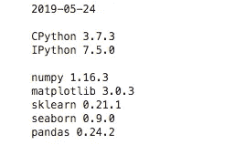
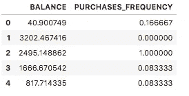
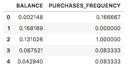
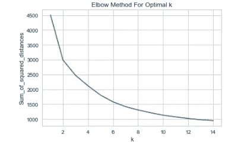

# 利用机器学习细分信用卡客户

> 原文：<https://towardsdatascience.com/segmenting-credit-card-customers-with-machine-learning-ed4dbcea009c?source=collection_archive---------14----------------------->

## 利用无监督机器学习识别可销售细分市场


Photo by [Ryan Born](https://unsplash.com/photos/x8i6FfaZAbs?utm_source=unsplash&utm_medium=referral&utm_content=creditCopyText) on [Unsplash](https://unsplash.com/search/photos/credit-card?utm_source=unsplash&utm_medium=referral&utm_content=creditCopyText)

*市场营销中的细分是一种技术，用于根据行为或人口统计等属性将客户或其他实体分成不同的群体。确定可能以类似方式对特定营销技术(如电子邮件主题行或展示广告)做出反应的客户群非常有用。因为它使企业能够定制营销消息和时机，以产生更好的响应率并提供改善的消费者体验。*

在接下来的文章中，我将使用一个包含信用卡客户行为属性的数据集。数据集可以从 Kaggle [网站](https://www.kaggle.com/arjunbhasin2013/ccdata)下载。我将使用 [scikit-learn](https://scikit-learn.org/stable/modules/clustering.html) python 机器学习库来应用一种称为聚类的无监督机器学习技术，以识别人类认知可能不会立即显现的片段。

该数据集由 18 个信用卡客户行为特征组成。这些变量包括当前卡上的余额、账户上的购物次数、信用额度等。完整的[数据字典](https://www.kaggle.com/arjunbhasin2013/ccdata/discussion/91399)可在数据下载页面找到。

**设置**

*我在*[*JupyterLab*](https://blog.jupyter.org/jupyterlab-is-ready-for-users-5a6f039b8906)*中运行以下代码。我正在使用*[*iPython magic*](https://github.com/rasbt/watermark)*扩展水印来记录我正在运行的工具的版本。如果您在运行代码时遇到任何问题，其输出如下所示。库导入也显示在下面。*

```
%load_ext watermark
%watermark -d -m -v -p numpy,matplotlib,sklearn,seaborn,pandas -g
```



```
import pandas as pd
import numpy as npfrom sklearn.cluster import KMeans
from sklearn import preprocessingimport matplotlib.pyplot as plt
%matplotlib inline
import seaborn as sns
```

## 数据清理

首先，我们需要检查数据，找出可能需要的清理和转换。scikit-learn 库要求所有数据都没有空值，并且所有值都必须是数字。

首先，我已经阅读了下载的 csv 文件。

```
TRAIN_FILE = 'CC GENERAL.csv'
train_data = pd.read_csv(TRAIN_FILE)
```

首先，我运行下面的代码来检查数据类型，看看是否有需要转换的分类变量。从结果中我们可以看到，除了`CUST_ID`以外，所有的特征都是数字。但是因为我们不需要这个特性来训练模型，所以我们不需要在这里做任何转换。

```
print("Data Types:", train_data.dtypes)output:
Data Types: CUST_ID                              object
BALANCE                             float64
BALANCE_FREQUENCY                   float64
PURCHASES                           float64
ONEOFF_PURCHASES                    float64
INSTALLMENTS_PURCHASES              float64
CASH_ADVANCE                        float64
PURCHASES_FREQUENCY                 float64
ONEOFF_PURCHASES_FREQUENCY          float64
PURCHASES_INSTALLMENTS_FREQUENCY    float64
CASH_ADVANCE_FREQUENCY              float64
CASH_ADVANCE_TRX                      int64
PURCHASES_TRX                         int64
CREDIT_LIMIT                        float64
PAYMENTS                            float64
MINIMUM_PAYMENTS                    float64
PRC_FULL_PAYMENT                    float64
TENURE                                int64
```

运行下面的代码告诉我，只有两个特性具有空值“CREDIT_LIMIT”和“MINIMUM_PAYMENTS”。此外，每列中只有不到 5%的部分为空。这意味着我们应该可以用合理的替换值来填充它们，并且应该仍然能够使用该特性。

```
train_data.apply(lambda x: sum(x.isnull()/len(train_data)))Output:
CUST_ID                             0.000000
BALANCE                             0.000000
BALANCE_FREQUENCY                   0.000000
PURCHASES                           0.000000
ONEOFF_PURCHASES                    0.000000
INSTALLMENTS_PURCHASES              0.000000
CASH_ADVANCE                        0.000000
PURCHASES_FREQUENCY                 0.000000
ONEOFF_PURCHASES_FREQUENCY          0.000000
PURCHASES_INSTALLMENTS_FREQUENCY    0.000000
CASH_ADVANCE_FREQUENCY              0.000000
CASH_ADVANCE_TRX                    0.000000
PURCHASES_TRX                       0.000000
CREDIT_LIMIT                        0.000112
PAYMENTS                            0.000000
MINIMUM_PAYMENTS                    0.034972
PRC_FULL_PAYMENT                    0.000000
TENURE                              0.000000
```

下面的代码用列中最常出现的值填充缺少的值。我们同样可以使用均值或中值，或者其他方法，但如果需要，我们将从这里开始迭代。

```
train_clean = train_data.apply(lambda x:x.fillna(x.value_counts().index[0]))
```

我还将删除`CUST_ID`列，因为我们在培训中不需要它。

```
cols_to_drop = 'CUST_ID'
train_clean = train_clean.drop([cols_to_drop], axis=1)
```

## 特征缩放

在训练模型之前，我要做的最后一项处理是缩放特征。

我在这篇文章中使用的聚类模型是 K-Means。简单来说，下面是该算法的工作原理:

1.  取预定数量的簇。
2.  找到每个聚类的质心，实质上就是平均值。
3.  根据平方欧几里得距离将每个数据点分配给其最近的聚类。
4.  一旦训练了新的看不见的数据点的聚类，就可以基于欧几里德距离来识别。

因为它依赖于这种距离度量特征，所以缩放是一个非常重要的考虑因素。在我使用的数据集的例子中，让我们取两个特征`PURCHASES_FREQUENCY`和`BALANCE`。特征`PURCHASES_FREQUENCY`是一个介于 0 和 1 之间的数字，而`BALANCE`在这个数据集中是一个介于 0 和 19，043 之间的货币值。这些特征具有非常不同的尺度，这意味着如果我们不对它们进行标准化，使它们处于相同的尺度上。可能存在算法将给予一个变量更多权重的情况。

以下代码缩放数据框中的所有要素。我在第一次迭代中使用了 min_max_scaler。不同的缩放技术可能会产生不同的结果。

```
x = train_clean.values
min_max_scaler = preprocessing.MinMaxScaler()
x_scaled = min_max_scaler.fit_transform(x)
train_clean = pd.DataFrame(x_scaled,columns=train_clean.columns)
```

为了说明这一点，这里是缩放前的`PURCHASES_FREQUENCY`和`BALANCE` 列。



缩放后。



## 有多少个集群？

我之前提到过，我们需要告诉 K-Means 算法它应该使用的聚类数。有许多技术可以用来找到最佳数量。对于这个例子，我将使用[肘方法](https://en.wikipedia.org/wiki/Elbow_method_(clustering)),这样命名是因为它产生的图表在形状上类似于肘的曲线。此方法计算聚类 k 的距离平方和。随着使用的聚类越来越多，方差将会减少，直到达到某个点，在该点上增加聚类不再会产生更好的模型。从这篇[文章](https://blog.cambridgespark.com/how-to-determine-the-optimal-number-of-clusters-for-k-means-clustering-14f27070048f)中借用的代码说明了这一点。谢谢[托拉孙心怡](https://blog.cambridgespark.com/@tolaalade_48082)！

```
Sum_of_squared_distances = []
K = range(1,15)
for k in K:
    km = KMeans(n_clusters=k)
    km = km.fit(train_clean)
    Sum_of_squared_distances.append(km.inertia_)plt.plot(K, Sum_of_squared_distances, 'bx-')
plt.xlabel('k')
plt.ylabel('Sum_of_squared_distances')
plt.title('Elbow Method For Optimal k')
plt.show()
```



您可以看到，在 8 个集群之后，添加更多集群对模型的好处微乎其微。因此，我将使用 8 个聚类来训练我的模型。

## 培养

在训练之前，我将把数据集分为训练集和测试集。下面的代码划分数据，保留 20%用于测试。

```
np.random.seed(0)
msk = np.random.rand(len(train_clean)) < 0.8
train = train_clean[msk]
test = train_clean[~msk]
```

然后，我将训练集和测试集都转换成 numpy 数组。

```
X = np.array(train)
X_test = np.array(test)
```

接下来，我使用 8 个集群调用 KMeans fit 方法。

```
kmeans = KMeans(n_clusters=8, random_state=0).fit(X)
```

使用训练好的模型，我现在将预测测试集上的聚类。

```
y_k = kmeans.predict(X_test)
```

现在，我将把预测指定为原始测试数据框上的一个新列，以分析结果。

```
test['PREDICTED_CLUSTER'] = y_k
```

## 分析集群

我将使用 pandas groupby 函数来分析聚类的一些选定特征，以了解模型是否成功识别了独特的片段。

```
train_summary = test.groupby(by='PREDICTED_CLUSTER').mean()
train_summary = train_summary[['BALANCE', 'PURCHASES', 
                               'PURCHASES_FREQUENCY','CREDIT_LIMIT', 
                               'ONEOFF_PURCHASES_FREQUENCY', 
                              'MINIMUM_PAYMENTS','PRC_FULL_PAYMENT', 
                               'PAYMENTS']]
train_summary
```

这给出了以下输出。


只需查看“PURCHASES_FREQUENCY ”,我们就可以看到该模型已经识别出一些高频购买细分市场，即集群 2 和集群 3。让我们了解这两个部分之间的差异，以进一步确定它们为什么在不同的群集中。我们可以看到，集群 3 的总购买次数更多，信用额度更高，他们经常进行一次性购买，更有可能全额支付。我们可以得出结论，这些都是高价值的客户，因此几乎可以肯定的是，你如何向这些客户营销会有所不同。

作为模型的第一次迭代，这似乎是识别一些有用的部分。我们可以通过多种方式调整模型，包括替代数据清理方法、特征工程、删除高相关性特征和超参数优化。然而，出于这篇文章的目的，我想给出一个关于如何启动一个执行无监督聚类的机器学习模型的高级端到端视图。