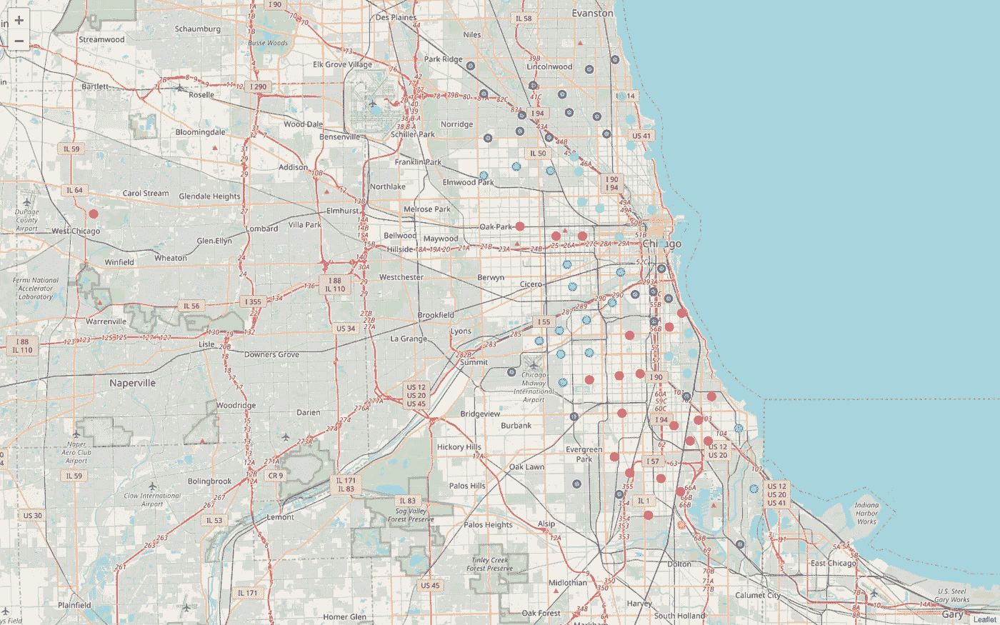
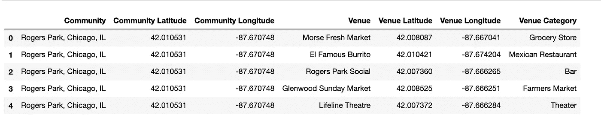
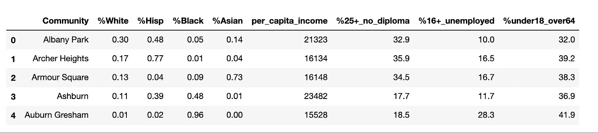
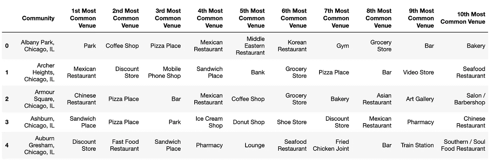
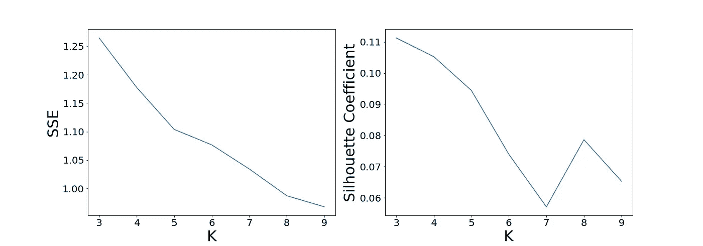
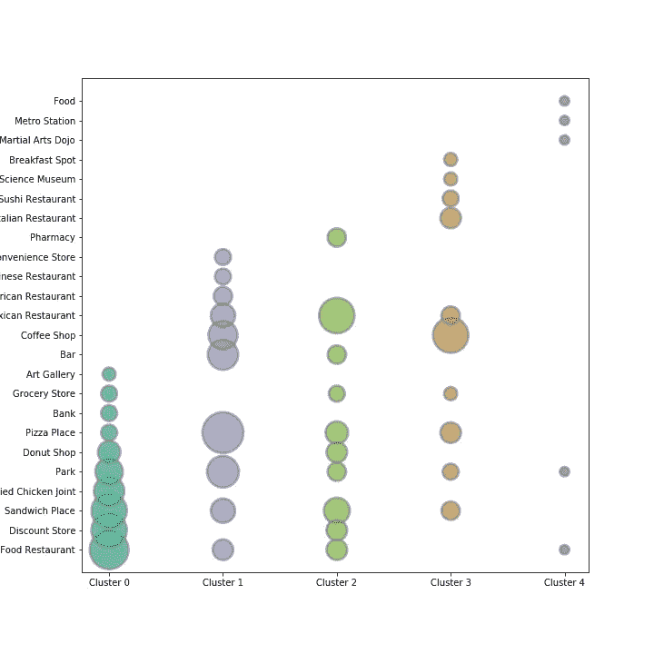
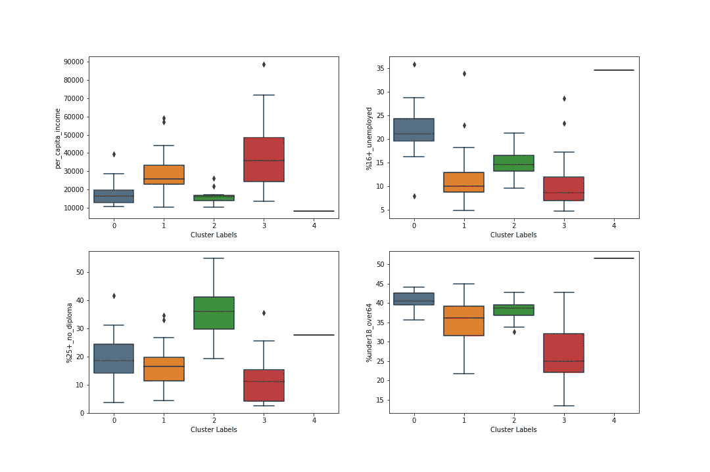
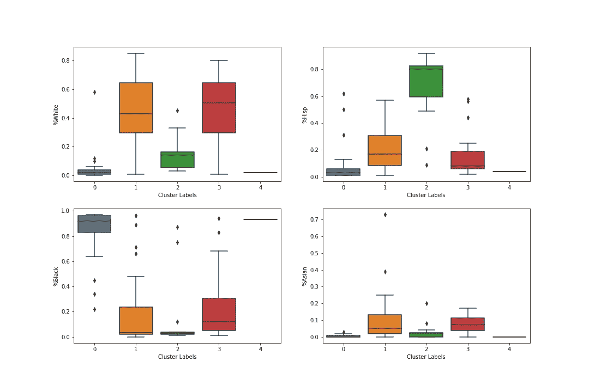
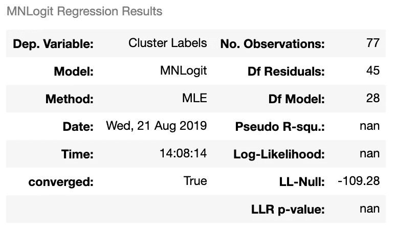

# 芝加哥的隔离和消费选择

> 原文：<https://towardsdatascience.com/segregation-consumption-options-in-chicago-d62cb6852579?source=collection_archive---------34----------------------->

— —利用 K-Means 聚类和多项逻辑回归探索芝加哥公共消费空间的潜在模式

维多利亚·王

77 Chicago communities, clustered by recurrent venue types

种族隔离一直是芝加哥的一个重要问题。虽然这座城市的总人口分布相当均匀——大约 32%是白人，30%是黑人，29%是西班牙裔，但这些人被分成 77 个不同的社区，过着截然不同的生活。

伊利诺伊大学社会学教授 Maria Krysan 在哥伦比亚广播公司的一篇报道中说:“你居住的地方深刻地塑造了你生活的方方面面。”。事实上，不同种族或经济背景的芝加哥市民不仅居住在不同的居住环境中，而且接触到极其不同的公共空间和资源，这反过来又塑造了他们的生活方式。这个项目研究了芝加哥居民生活的一个特定方面——他们在各自生活空间的消费选择。

消费是一种建立和表达社会归属和区别的方式，这些目的地针对特定用户，包括一些人，而排除其他人( [Bolzoni 2016](https://journals.openedition.org/mediterranee/8425) )。有理由假设芝加哥市的种族隔离可以反映在人们的日常消费中——换句话说，他们在食物、零售商品、活动等方面的花钱选择。本项目旨在验证这一假设。 ***除了居住隔离，不同社会背景的市民在公共消费空间上接触到的选择是否不同？***

这可能是进一步研究美国城市地区社会经济隔离的第一步。以往的研究主要集中在城市人口的居住分布，而本项目旨在发现与公共消费空间的使用和可达性相关的空间隔离模式。这项研究的结果可能会引起学者、政策制定者、社会工作者和/或活动家以及直接受到这种隔离影响的人的兴趣。

**数据采集和预处理**
一个社区对某类场馆的可达性是通过该类场馆的流行程度(或出现频率)来衡量的。如果某种类型的场所通常出现在社区区域中，则可以推断该社区中的居民更容易接触到这些类型的场所。使用 FourSquare API，我搜索了每个社区中心周围 2.5 公里半径内的场地，每个社区的上限是 100 个场地。值得注意的是，2.5km 的搜索半径对于获取小型社区(社区区域半径小于 2.5km)的场地并不完全令人满意，这可能导致错误地包含属于其相邻社区的场地。

Part of data obtained from FourSquare API

单个社区的居民特征由从芝加哥市人口数据的两个来源提取的数据给出，包括[芝加哥 2017 年人口普查数据](https://www.kaggle.com/apgross/chicagocensusdata#censusData.csv)和[芝加哥社区快照](https://www.cmap.illinois.gov/data/community-snapshots)。这些指标为每个社区的居民的个人发展、经济状况和种族身份提供了足够的信息。

Part of Chicago Communities Demographic Data

**K-均值聚类**

这个项目的第一步是根据每个地区最常见的 10 种场所类型对 77 个芝加哥社区区域进行分类。从 FourSquare 获得的数据集计算每个社区区域中每个场馆类别的出现频率。为每个社区区域挑选出前 10 个最常出现的场所类型。

Part of Communities’ top-10 most recurrent venues data

为了将具有相似类型场馆的社区归入相同的组，我对场馆数据集应用了 K-Means 聚类方法。

K 均值模型的准确性在很大程度上取决于为该模型选择的聚类数，即 K 值。为了确定该模型的最佳 K 值，我应用了两种方法来交叉评估值为 3 到 10 的 K 值:

1.  **弯头判据**方法。该方法旨在找到 SSE(标准误差之和-样本到其最近聚类质心的距离)急剧接近 0 时的最小 k 值。一个相对最优的 SSE 显示在 k = 5 或 6。
2.  **轮廓系数**的测量。较高的轮廓系数表示较密集的聚类和每个聚类之间更明显的边界。虽然所有的 k 都产生相当低的轮廓系数，但当 k = 3、4 或 5 时，该数值较高。

Two plots for finding the optimal K

给定上述两种方法的结果，如果将芝加哥社区分成 5 个群，则是最佳的。本博客开头的地图显示了用聚类标签着色的 77 个芝加哥社区。直观上，在这张地图上用相同颜色标记的社区应该有相似的场馆出现模式。

**探索跨集群的场馆模式**

首先，我单独查看聚类数据。我在这五个组中找出了最常出现的前五种场地类型，以检查组内模式和组间差异。下面的气泡图显示了结果。

就餐馆而言，集群 0 和集群 2 中的社区几乎只有**快餐店**，从常识来看，这些快餐店很不健康，但很饱，更方便，最重要的是**更便宜**。相比之下，集群 3 中的社区有很多咖啡店、中高端的意大利和日本餐馆。他们也可以选择享受博物馆和酒店。群组 1 和群组 4 中的社区具有更均匀分布的场所，尚未注意到明显的模式。

**通过集群探索社区居民属性**

然后，将聚类数据与表示每个社区的常驻属性的数据一起进行检查。首先，我研究了社区整体财务状况、教育状况、就业率和年龄构成的指标:

Per-capita income, unemployment, education, age composition by cluster labels

集群 0、2 和 4 中的社区拥有低收入居民**。对于集群 1 和集群 3，虽然存在低收入社区，但这两个集群中的社区的平均财务状况较高**。集群 0 和集群 4 的失业率明显较高；群组 2 的低教育率特别高。最后，如最后一个方框图所示，虽然前四个图具有相似的年轻人和老年人百分比，但在这一部分中，聚类 4**特别高**。****

这些结果与上一节的发现一致，这表明第 1 和第 3 集群中的**社区拥有相对较高价格的消费空间，而其余集群中的社区拥有相反的**。

接下来，我研究了每个集群中社区居民的种族构成。尽管有一些异常值，但这些图表显示了集群之间清晰的种族分割。

如第一个方框图所示，白人居民比例高的社区主要集中在**集群 1 和集群 3** ，这里的**高端消费空间非常普遍**。**集群** **0 和 4 充斥着黑人社区**，其中一些黑人居民比例超过 95%；**聚类 2 显示了西班牙裔居民的相同特征**。这三个社区群是**快餐和折扣店聚集区**。

虽然在以亚裔为中心的社区的分布中没有明显的趋势，但第 1 类确实包括两个亚裔居民比例很高的边远社区。正如美国其他城市的情况所表明的那样，亚裔居民的总人口较少，而且倾向于集中居住在一两个小的集中空间。这两个社区大概就是芝加哥的空间。

Race compositions by clusters

简而言之，探索性分析表明**这些由场所产生的芝加哥社区集群之间存在一些居民属性的差异**。具体来说，对于倾向于拥有更高端和更高价格消费选择的社区，居民一般都是受过高等教育、收入高的成年人，其中大多数也是白人。另一方面，在充斥着快餐店和旧货店的社区里，大量居民——通常是非白人——接受的教育和收入较低。

**多项逻辑回归**

那么，公共消费空间(即场馆)与居民经济/种族特征之间是否存在真实的关系？基于上述探索性分析得出的结论，我使用了一个多项逻辑回归模型来检验上一节中考察的居民特征是否真的与场馆产生的社区聚类相关。

多项式逻辑回归适用于该数据集有两个原因。首先，它允许因变量类别有两个以上的级别。在这种情况下，聚类标签被视为因变量，因为有五个聚类，所以它有五个级别；常驻特征被视为独立变量。第二，它不假设独立变量的正态性、线性或同方差性。在这种情况下，自变量不易呈正态分布，很难证明具有线性和同方差性。

逻辑回归模型的汇总统计提供了一个有点复杂的信息，但总的来说，结果合理地倾向于自变量和因变量之间存在真实关系的结论。

完整模型的总体总结如下所示。伪 R 平方是基于零模型“M0”和全模型“M1”的最大化对数似然函数的比率来计算的。伪 R 平方值接近 0 意味着模型不会显著提高估计因变量分类的确定性，而接近 1 意味着模型完全符合，对数优势比最大化为 0。在这个模型中，这个值在~0.6，这表明完整的模型比平庸的模型工作得稍好。

LLR 指标评估的是完整模型相对于零模型(零模型中不考虑任何指标)的绩效。特别是，LLR p 值表示观察假设总体系数为零的零假设(H0)的检验统计量的概率。在这个模型中，4.166e^-14 的 p 值非常低，这表明我们可以拒绝零模型比全模型更好的零假设。

Analytic model summary

**讨论**

探索性分析给人的印象是，芝加哥社区居民的社会、经济和文化属性与他们各自的消费空间类型之间存在着强有力的联系。

另一方面，逻辑回归模型有其缺点。虽然显示消费空间类型确实与所有居民的属性整体相关，但其结果可能会受到**多重共线性**的破坏，多重共线性是一种统计现象，其中逻辑回归模型中的预测变量高度相关。不可避免的是，社会、种族和经济隔离是深深交织在一起的现象，相互影响。因此，使用这些变量表示这三个方面的分离会使模型面临一定的多重共线性风险，阻止模型观察单个指标和因变量之间的一些显著相关性。

未来的研究可能会采用更严格的方法，例如使用**岭回归或**主成分分析(CPA)来最小化多重共线性的混杂影响；或者分解完整模型，比较不同局部模型的性能。

**结论**

日常经验告诉我们，不同的消费空间服务于不同的社会群体，这个项目为这种普遍的看法提供了一个粗略的证明。

该项目对芝加哥社区的公共消费选择和居民的社会、经济和文化分割之间的关系进行了相当全面但初步的分析。尽管下面的逻辑回归分析没有完全证实，但两者之间存在相关性。

分析发现，某些食物和活动消费选择在低收入和少数种族居民社区更为普遍，如快餐店。另一方面，收入较高且大多为白人的社区群体可以选择在高级餐厅和更好的娱乐场所消费，如酒店和博物馆。

未来的研究可能会对不同类型的场馆在不同社区开放的潜在原因进行更严格的调查。研究还可以更深入地考察这种消费选择差异对芝加哥市民生活各个方面的影响，比如他们的**身体、精神或社会福祉**。