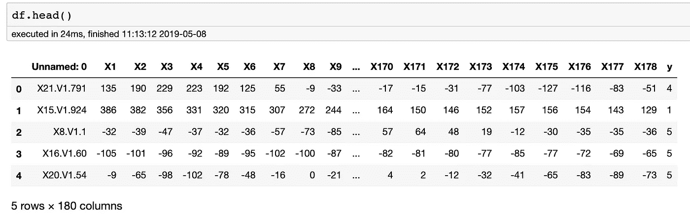

# 癫痫发作分类 ML 算法

> 原文：<https://towardsdatascience.com/seizure-classification-d0bb92d19962?source=collection_archive---------8----------------------->

## Python 中的二元分类机器学习算法

# 介绍

癫痫是一种中枢神经系统(CNS)疾病，在美国影响约 1.2%(340 万人)，全球超过 6500 万人。此外，大约 1/26 的人会在他们一生中的某个时候患上癫痫。癫痫发作有很多种，每种都有不同的症状，如失去知觉、抽搐或意识模糊。有些癫痫发作很难用肉眼发现；患者通常会出现短时间无反应或发呆等症状。癫痫发作可能会意外发生，并可能导致受伤，如跌倒、咬伤舌头或无法控制大小便。因此，这些就是为什么癫痫发作检测对于在医疗监督下被怀疑有癫痫发作倾向的患者是至关重要的一些原因。这个项目将使用二元分类方法来预测一个人是否有癫痫发作。

该数据集可在 UCI 的机器学习知识库[这里](https://archive.ics.uci.edu/ml/datasets/Epileptic+Seizure+Recognition)获得。该数据集包括每名患者在 23.5 秒内的 4097 次脑电图(EEG)读数，总共有 500 名患者。然后将 4097 个数据点平均分成每个患者 23 个块；每个块被转换成数据集中的一行。每行包含 178 个读数，这些读数被转换成列；换句话说，有 178 列组成了一秒钟的脑电图读数。总之，有 11，500 行和 180 列，第一列是患者 ID，最后一列包含患者的状态，无论患者是否有癫痫发作。

在这个项目中，我将演示用 Python 构建二元分类机器学习算法的步骤。

我的 [Github](https://github.com/Mr-Jree/Epileptic-Seizure-Binary-Classification/blob/master/Seizure%20Binary%20Classfication%20Notebook.ipynb) 上有 Jupyter 笔记本。

# 数据探索

该数据集包含一个散列的患者 ID 列、一秒钟内的 178 个 EEG 读数和一个描述该秒钟患者状态的 Y 输出变量。当患者癫痫发作时，y 表示为 1，而所有其他数字都是我们不感兴趣的其他状态。所以当我们把我们的 Y 变量变成二元变量的时候，这个问题就变成了二元分类问题。

我们还将选择删除第一列，因为患者 id 是散列的，我们无法使用它。我们使用下面的代码来完成所有这些工作。

下一步是计算患病率，它被定义为样本在类中呈阳性的比例；换句话说，在我们的数据集中，这是癫痫发作患者的比例。

我们的患病率是 20%。当涉及到平衡类和使用“提升”度量评估我们的模型时，了解这一点是很有用的。

# 数据处理和建立训练/验证/测试集

这里不需要做任何特征工程，因为我们所有的特征都是脑电图读数的数值；将我们的数据集转储到我们的机器学习模型中不需要任何处理。

将预测变量和响应变量从数据集中分离出来是一种很好的做法。

cols_input are our predictor variables & OUTPUT_LABEL is our response variable

现在是时候将我们的数据集分成训练集、验证集和测试集了！多刺激啊！通常，验证集和测试集的大小相同，定型集通常占主数据集的 50%到 90%，具体取决于数据集拥有的样本数。数据集拥有的样本越多，我们就有越多的样本可以转储到我们的训练集中。

第一步是打乱我们的数据集，以确保我们的样本没有某种顺序。

然后，选择的分割是 70/15/15，所以让我们这样分割数据集。我们将首先选择将我们的验证和测试集与我们的训练集分开，这是因为我们希望我们的验证和测试集具有相似的分布。

然后我们可以检查每组的患病率，以确保它们大致相同，也就是 20%左右。

接下来，我们希望平衡我们的数据集，以避免创建一个错误地将样本分类为属于多数类的模型；在我们的案例中，是病人没有癫痫发作。这被称为[准确性悖论](https://en.wikipedia.org/wiki/Accuracy_paradox)，例如，当我们的模型的准确性告诉我们有 80%的准确性时，如果类别不平衡，它将只反映底层的类别分布。因为我们的模型看到我们的大多数样本没有癫痫发作，所以获得高准确度分数的最好方法是将样本分类为没有癫痫发作，而不管我们要求它预测什么。有两种简单易用的方法可以帮助我们解决这个问题。欠采样和过采样。我们可以通过减少属于较主导类的样本数量来对较主导类进行子采样，或者我们可以通过多次粘贴少数类的相同样本来进行过采样，直到两个类的数量相等。我们将选择在这个项目中使用二次抽样。

然后，我们将`train_all`、`train`、`valid`和`test`集合保存为。csv 文件。在开始导入`sklearn`并构建我们的第一个模型之前，我们需要调整我们的变量以使我们的一些模型能够工作。由于我们将构建九个不同的分类模型，我们应该用`StandardScaler`来调整我们的变量。

We dump our scaler as a .csv file for quick access if we want to use it in other python notebooks

# 分类模型

让我们设置一下，这样我们就可以用一个函数`print_report`打印所有的模型指标。

由于我们已经平衡了数据，我们将阈值设为 0.5。阈值用于确定样本被分类为阳性还是阴性。这是因为我们的模型返回样本属于正类的百分比机会，所以在不设置阈值的情况下，它不会是二进制分类。如果样本返回的百分比高于我们的阈值，那么它将被归类为阳性样本，等等。

# 分类模型

我们将介绍以下型号:

*   k 个最近邻居
*   逻辑回归
*   随机梯度下降
*   朴素贝叶斯
*   决策树
*   随机森林
*   极端随机森林
*   梯度推进
*   极端梯度增强(XGBoost)

我们将对所有模型使用基线默认参数，然后选择具有最高验证分数的模型来执行超参数调整。

## k 最近邻(KNN)

当谈到分类模型时，KNN 是人们最先学习的模型之一。该模型根据与其最接近的 *k* 个样本对样本进行分类。例如，如果 *k* = 3，并且所有三个最接近的样本都是正类，那么该样本将被分类为类 1。如果三个最接近的样本中有两个是阳性类别，那么该样本将有 66%的概率被分类为阳性。

我们得到了一个非常高的曲线下训练面积(AUC)、受试者操作曲线(ROC ),以及一个很高的验证 AUC。此指标用于衡量分类模型的性能。AUC 告诉我们模型能够在多大程度上区分类别，AUC 越高，模型在区分类别方面就越好。如果 AUC 是 0.5，那你还不如猜样本。

## 逻辑回归

逻辑回归是一种广义线性模型，它是常规线性模型的概念和能力的概括。

在逻辑回归中，模型预测某事是真还是假，而不是预测连续的事情。该模型适合两个类别的线性决策边界，然后通过 sigmoid 函数从几率对数转换为样本属于阳性类别的概率。因为该模型试图找到正类和负类之间的最佳分离，所以当数据分离明显时，该模型表现良好。这是一个要求缩放所有要素的模型，并且因变量是二分的。

## 随机梯度下降

梯度下降是一种算法，可以最小化许多不同模型中的许多损失函数，如线性回归、逻辑回归和聚类模型。它类似于逻辑回归，其中梯度下降用于优化线性函数。不同之处在于，随机梯度下降允许小批量学习，其中模型使用多个样本来采取单个步骤，而不是整个数据集。这在数据中存在冗余的情况下尤其有用，这通常是通过聚类发现的。因此，SGD 比逻辑回归快得多。

## 朴素贝叶斯

朴素贝叶斯分类器使用贝叶斯定理来执行分类。它假设如果所有的特征彼此不相关，那么一起看到这些特征的概率只是每个特征发生的概率的乘积。给定所有不同的特征组合，它找出样本被分类为阳性的概率。该模型通常是有缺陷的，因为模型的“幼稚”部分假设所有的特性都是独立的，而大多数时候情况并非如此。

## 决策树

决策树是一种模型，其中它运行多个“问题”的样本来确定其类别。分类算法通过重复地将数据分成相同类别的子区域来工作，并且当算法已经将所有样本分成纯的类别时，或者通过满足分类器属性的一些标准，树结束。

决策树是弱学习者，我的意思是它们不是特别准确，它们通常只比随机猜测好一点点。他们也几乎总是过度拟合训练数据。

## 随机森林

由于决策树可能会过度适应，随机森林就是为了减少这种情况而创建的。许多决策树组成了一个随机森林模型。随机森林包括引导数据集，并使用每个决策树的随机特征子集来降低每个树的相关性，从而降低过度拟合的可能性。我们可以通过使用没有用于任何树来测试模型的“袋外”数据来衡量随机森林有多好。随机森林也几乎总是优于决策树，因为该模型具有较低的方差；因此，该模型可以更好地推广。

## 极度随机化的树

树外分类器类似于随机森林，除了:

*   当在拆分时选择变量时，样本是从整个训练集中抽取的，而不是引导样本
*   节点拆分是随机选择的，而不是像在随机森林中那样被指定

这使得树外分类器不容易过度拟合，并且它通常可以产生比随机森林更一般化的模型。

## 梯度推进

梯度推进是另一种对抗决策树过度拟合的模型。然而，GB 和 RF 之间存在一些差异。梯度推进一次建立一棵更短的树，每棵新树都减少了前一棵树的错误。这个误差叫做伪残差。梯度推进比随机森林更快，在许多现实应用中很有用。然而，当数据集包含噪声数据时，梯度增强效果不佳。

## 极端梯度推进

XGBoost 类似于梯度增强，除了

*   树有不同数量的终端节点
*   用较少证据计算的树的叶子重量收缩得更厉害
*   牛顿推进提供了比梯度下降更直接的到达最小值的路线
*   额外的随机化参数用于减少树之间的相关性
*   由于标准 GBM 没有正则化，因此使用更正则化的模型来控制过拟合，这使其性能优于 GBM。
*   XGB 实现并行处理，比 GBM 快很多。

# 模型选择和验证

下一步是在一个图表中可视化我们所有模型的性能；这使得我们更容易选择要调哪个。我选择了 AUC 曲线来评估我的模型。您可以选择任何想要优化的指标，如精度或提升，但是，AUC 不受您选择的阈值的影响，因此它是大多数人用来评估其模型的指标。

九个模型中的七个具有非常高的性能，这很可能是由于癫痫发作和非癫痫发作患者之间 EEG 读数的极端差异。决策树看起来像预期的那样过度拟合，请注意训练 AUC 和验证 AUC 之间的差距。

我将选择 XGBoost 和 ExtraTrees 分类器作为要调优的两个模型。

# 学习曲线

学习曲线是我们在模型中可视化偏差-方差权衡的一种方式。我们利用了`scikit-learn`中的学习曲线代码，但绘制了 AUC，因为这是我们选择用来评估模型的指标。

训练和 CV 曲线都很高，因此这表明我们的树外分类器中的低方差和低偏差。

然而，如果你看到两条曲线的分数都很低，而且很相似，那就是高偏差的信号。如果你的曲线有一个很大的差距，这是一个高方差的迹象。

以下是在这两种情况下如何做的一些提示:

高偏差:
-增加模型复杂性
-减少正则化
-改变模型架构
-增加新特性

高方差:
-添加更多样本
-减少特征数量
-添加/增加正则化
-降低模型复杂度
-组合特征
-改变模型架构

## 特征重要性

就像在回归模型中，你可以从特征系数中分辨出影响的大小；你可以在分类模型中做同样的事情。

根据您的偏差-方差诊断，您可以选择删除一些特征，或者通过组合一些新的变量，如下图所示。然而，对于我的模型，没有必要这样做。从技术上来说，脑电图读数是我唯一的特征，读数越多，分类模型就越好。

# 超参数调谐

下一步应该执行的是调整我们模型中的旋钮，也称为超参数调整。有几种方法可以做到这一点。

## 网格搜索

这是一种传统的超参数调整技术，这意味着它是第一个在手动调整每个超参数之外开发的技术。它需要相关超参数的所有输入(例如，您想要测试的所有学习率)，并通过遍历超参数值的所有可能组合，使用交叉验证来测量模型的性能。这种方法的缺点是，当我们有很多想要优化的超参数时，要花很长时间进行评估。

## 随机搜索

随机搜索使用超参数的随机组合来寻找性能最佳的模型。您仍然需要输入想要调整的超参数的所有值，但是该算法在网格中随机搜索，而不是搜索超参数的所有值的所有组合。根据本文[所述](http://www.jmlr.org/papers/v13/bergstra12a.html)，由于其随机性，这通常在时间上胜过网格搜索，因为模型可以比网格搜索更快地达到其优化值。

## 遗传表演程序

遗传编程或遗传算法(GA)是基于查尔斯·达尔文的适者生存理论。GA 对当前超参数应用小的、缓慢的和随机的改变。它的工作原理是给一个解决方案分配一个适应值，适应值越高，解决方案的质量越高。然后，它会选择具有最高适应值的个体，并将它们放入“交配池”中，其中两个个体将产生两个后代(对后代进行一些更改)，预计后代的质量将高于其父母。这种情况一次又一次地发生，直到我们达到期望的最佳值。

TPOT 是一个正在积极开发中的开源库，最初由宾夕法尼亚大学的研究人员开发。它获取整个训练数据集的多个副本，并执行自己的一键编码变体(如果需要)，然后使用遗传算法优化超参数。

我们将在 tpot 的 automl 中使用`dask`来执行此操作。我们将`xgboost`和`extratrees`分类器传递到`tpot`配置中，告诉它我们只希望算法在这两个分类模型中执行搜索。我们还告诉`tpot`把生产的每一款车型都出口到一个目的地，以防我们想早点停下来。

# 模型评估

AUC 为 0.997 的最佳性能模型是优化的 extratrees 分类器。下面是它在所有三个数据集上的性能。

我们还创建了 ROC 曲线图来显示上述 AUC 曲线。

# 结论

现在，向副总裁或首席执行官传达项目的要点通常是工作中最困难的部分，所以下面是我想对高层利益相关者简明扼要地说的话。

在这个项目中，我们创建了一个分类机器学习模型，可以通过脑电图读数预测患者是否癫痫发作。表现最好的模型的提升度量为 4.3，这意味着它比随机猜测要好 4.3 倍。它在预测测试集中的阳性类别方面也有 97.4%的正确率。如果将该模型投入生产以预测患者是否有癫痫发作，那么您可以预期该模型在正确预测癫痫发作患者方面的性能。

感谢您的阅读！

这是东北大学 Andrew Long 教授的硕士课程中的一个顶点项目。