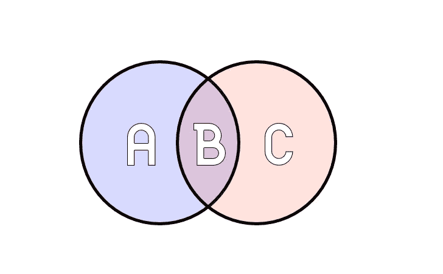
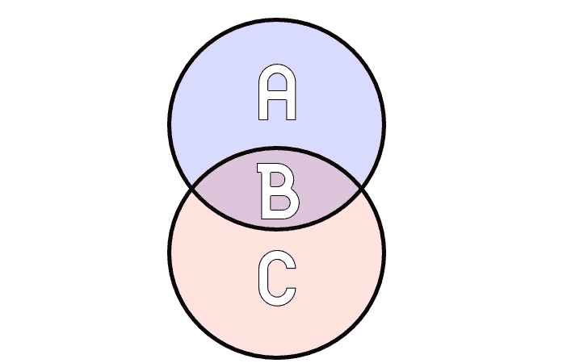

# 从 sql 中选择答案

> 原文：<https://towardsdatascience.com/select-answers-from-sql-5cef923380ac?source=collection_archive---------29----------------------->

## 一些带有直观答案的常见 SQL 面试问题的回顾


Modded from photo by [Ashim D’Silva](https://unsplash.com/@randomlies?utm_source=unsplash&utm_medium=referral&utm_content=creditCopyText) on [Unsplash](https://unsplash.com/s/photos/pile-of-stuff?utm_source=unsplash&utm_medium=referral&utm_content=creditCopyText)

对于任何对数据分析或数据科学感兴趣的人来说，重要的一点是:**不要低估 SQL 的效用！**使用 Python 和 pandas、numpy 之类的包很容易上手，但有许多业务是用 SQL 完成的，许多报告和分析工作可以用它快速高效地完成。如果您对大数据感兴趣，并且使用 PySpark 之类的包与 Apache Spark 进行交互，那么编写 SQL 查询可能是过滤和分析数据最清晰、最快捷的方式。

为了帮助巩固这些概念，下面是一些关于 SQL 的常见面试问题的分类。我从我最近查阅的其他人的列表中提取了这些信息(更多信息请点击底部的链接),我只是针对我个人在最近的采访中遇到的一些问题给出了解释:

## SQL、MySQL 和 SQL Server 之间的区别

非常基础的，SQL 代表结构化查询语言。它是用于设计、管理和查询结构化关系数据库的语言本身。mySQL 是一个开源的关系数据库管理系统。SQL Server(也称为 Microsoft SQL Server)是由 Microsoft 为其服务器平台创建的关系数据库管理系统。这两个平台都使用一种通用语言(SQL ),但也有各自的细微差别。还有一些你可能听说过的，比如 Oracle，但是要注意的是 SQL 是语言，而其他的是数据库平台。

## 哪里与拥有

如果你需要一个一句话的答案: **HAVING** 专门用于使用集合函数对表进行过滤，而 **WHERE** 不是。对于更长的上下文: **WHERE** 子句根据满足特定条件的行进行过滤。它在行中寻找特定数据的匹配。 **HAVING** 子句用于对整个表中的数据条件进行过滤。下面是这种情况的快速分析。让我们假设我们有一张桌子，看起来像这样一个随机分类的《权力的游戏》角色:

```
╔═══════════╦════════════════════╦════════╗
║   name    ║       house        ║  age   ║
╠═══════════╬════════════════════╬════════╣
║ Eddard    ║ Stark              ║ 40     ║
║ Catelyn   ║ Stark              ║ 35     ║
║ Rob       ║ Stark              ║ 17     ║
║ Sansa     ║ Stark              ║ 13     ║
║ Cersei    ║ Lannister          ║ 35     ║
║ Jaime     ║ Lannister          ║ 35     ║
║ Tyrion    ║ Lannister          ║ 30     ║
║ Daenerys  ║ Targaryen          ║ 15     ║
║ Theon     ║ Greyjoy            ║ 19     ║
╚═══════════╩════════════════════╩════════╝
```

如果您想要查找大于或等于 30 的字符，我们可以编写如下查询:

```
SELECT name, age
FROM got_table
WHERE age >= 30
```

此函数查看表，根据列出的年龄大于或等于 30 的行进行筛选。它查看表中的可用数据，并从中进行过滤。但是假设你想使用集合函数。让我们从基于 house 聚合这个表开始，只是为了计算每个表中列出了多少人:

```
SELECT house, COUNT(*)
FROM got_table
GROUP BY house
```

我们做到了！但是，如果我们只想查看在这个聚合表中创建的具有多个成员的行，我们需要使用具有的**而不是 **WHERE** :**

```
SELECT house, COUNT(*)
FROM got_table
GROUP BY house
HAVING COUNT(*) < 2
```

简而言之，如果你在寻找行**在哪里**或者组**在哪里**。

## 主键与外键

一个**主键** **键**是数据库表中一条记录的唯一标识符。外键是一个表中的一个字段，它是另一个表中的主键。主键在每个表中只能出现一次，而外键可以出现多次。在这里，我将制作几个表格来说明(为了好玩，请容忍我的假数据和混合位置):

```
╔════════╦═══════════╦═════════╗  ╔════════╦═══════════╦════════╗
║group_id║  name     ║army_size║  ║planetid║  name     ║group_id║
╠════════╬═══════════╬═════════╣  ╠════════╬═══════════╬════════╣  
║ 0001   ║Cpt. Planet║ 1       ║  ║ 7001   ║ Earth     ║ 0001   ║  
║ 0002   ║First Order║ 800,000 ║  ║ 7020   ║ Cybertron ║ 0001   ║
║ 0003   ║ Autobots  ║ 1,000   ║  ║ 7044   ║ Tatooine  ║ 0003   ║
║ 0004   ║Silverhawks║ 10      ║  ║ 5084   ║ Alderan   ║ 0004   ║
║ 0005   ║ C.H.U.D.s ║ 35,000  ║  ║ 2001   ║ Mars      ║ 0002   ║
╚════════╩═══════════╩═════════╝  ╚════════╩═══════════╩════════╝
TABLE 1                           TABLE 2
```

因此，假设我们有一些派系(主要取自大脑的后部)在为几个不同的星球而争斗。我们将它们放在单独的表中，以存储每一个的单独特征。这些表格是基于哪个群体控制哪个星球而联系在一起的。在表 1 中，**主键**是 group_id。它是用来标识每条记录的唯一 id。在表 2 中，**主键**是 planetid，而**外键**是 group_id。你可以看到我们如何证明行星船长已经接管了地球和赛博顿，这是一个相当有力的举动！表 2 中使用的 group_id 显示了两个表之间的关系，但是拥有一个外键允许我们为每个集合拥有唯一的表。在较大的数据库中，您的系统会有几个以这种方式连接的表。

## 连接和联合

基础如下，假设我们有两个表，我们并排连接数据，它们有一些共同的键或值来匹配:



*   内部连接:只记录在两个表中有匹配的值(B)
*   左连接:最左侧表中的所有记录和右侧匹配的记录(A & B)
*   右连接:最右边的表中的所有记录和最左边的记录相匹配(B & C)
*   完全外部连接:来自两者的所有记录(A & B & C)

还不错，只是需要时间记住布局。这是很好的思考通过加入他们并排的性质。有了工会，我们只需要改变我们看待表格的角度:



*   联合:两个表的组合，一个堆叠在另一个的上面，但是第二个没有重复(A & B)
*   联合所有:两张桌子整体叠放在一起的组合(A & B & C)

## 删除、截断和丢弃

快速回答: **DELETE** 可以用来从表中删除一些记录， **TRUNCATE** 删除整个表的行， **DROP** 从数据库中删除对象。当使用 **DELETE** 时，您将指定一个 WHERE 子句来选择记录:

```
DELETE FROM got_table WHERE house = "Stark"
```

**TRUNCATE** 清除表格中的所有行，没有修饰符:

```
TRUNCATE TABLE got_table
```

**DROP** 实际上是从数据库中删除表对象和行:

```
DROP TABLE got_table
```

每一个都有用途，但是根据你的情况，明智地选择你需要的。

## 操纵字符串

有很多函数可以帮助进行字符串操作，但是一个重要的事情是索引从 1 开始(尽管在其他编程语言中通常从 0 开始)。下面是一些可能会出现的快速重要功能:

*   **SUBSTR(***)text，position，length* **)** 将获取文本并抓取任意部分
*   **LEFT(** *text，length***)**&**RIGHT(***text，length* **):** 两者都从最右边或最左边的固定位置开始并从那里修剪。
*   **REPLACE(** *text，string_to_find，string _ to _ REPLACE _ with***):**相当直接的文本替换。
*   **CONCAT(**)T26【text _ 1】、text_2 等 ***。* ):** 简单组合的文字

以下是对每一种可能出现的情况的简要介绍:

```
╔═══════════╦══════════╦══════════════════════════╗
║   first    ║   last   ║  line                    ║
╠═══════════╬══════════╬══════════════════════════╣
║ Inigo     ║ Montoya ║ "Prepare to battle!"     ║
╚═══════════╩══════════╩══════════════════════════╝**SELECT** LEFT(first, 1), last **FROM** pb_table
╔═════╦══════════╗
║  I  ║  Montoya ║  
╚═════╩══════════╝
**SELECT** CONCAT(last, "," , first) **FROM** pb_table
╔════════════════╗
║ Montoya, Inigo ║  
╚════════════════╝
**SELECT** last, REPLACE(line, "battle", "die") **FROM** pb_table
╔══════════╦════════════════════╗
║  Montoya ║  "Prepare to die!" ║  
╚══════════╩════════════════════╝
```

我发现一些面试问题来源很有帮助:

[最重要的 SQL 面试问题(IntelliPaat)](https://intellipaat.com/blog/interview-question/sql-interview-questions/)

[2019 年需准备的 65 大 SQL 面试问题(Edureka)](https://www.edureka.co/blog/interview-questions/sql-interview-questions)

[50 大 SQL 面试问题&答案(Guru99)](https://www.guru99.com/sql-interview-questions-answers.html)

[100+最流行的 SQL 面试问答(软件测试材料)](https://www.softwaretestingmaterial.com/sql-interview-questions/)

我喜欢的一些 SQL 学习资源:

[模式分析](https://mode.com/sql-tutorial/introduction-to-sql)(免费，可以用自己的平台做一些互动练习)

[代码教程](https://www.codecademy.com/learn/learn-sql)(喜欢他们的互动平台和详尽的讲解)

[W3Schools](https://www.w3schools.com/SQL/default.asp) (也是一些示例交互的非常好的书面参考)

谢谢！