# 为组学集成选择特征

> 原文：<https://towardsdatascience.com/select-features-for-omics-integration-511390b7e7fd?source=collection_archive---------11----------------------->

## [生命科学的数理统计和机器学习](https://towardsdatascience.com/tagged/stats-ml-life-sciences)

## 单变量与多变量特征选择

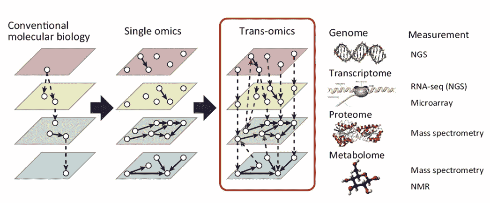

Idea of Integrative OMICs from [Yugi et al., Trends Biotechnol. 2016 Apr;34(4):276–290](https://www.ncbi.nlm.nih.gov/pubmed/26806111)

这是 [**生命科学的数理统计和机器学习**](https://towardsdatascience.com/tagged/stats-ml-life-sciences?source=post_page---------------------------) 专栏的第六篇文章，我试图在这里解释一些在生物医学、生物信息学、细胞生物学、遗传学、进化生物学等领域常见的神秘分析技术。接下来的几篇文章将致力于综合组学分析，这是对计算生物学的现代挑战。[这里](/deep-learning-for-data-integration-46d51601f781)我讨论了如何使用深度学习进行数据整合。现在，我将后退一步，解释在**将各种类型的生物信息**合并在一起之前，将对数据执行的**基本预处理步骤**。

# 什么是整合组学？

[**下一代测序(NGS)**](https://en.wikipedia.org/wiki/Massive_parallel_sequencing) **技术**催生了多种生物和生物医学大数据，如基因组学、蛋白质组学、表型组学、转录组学、代谢组学、表观组学、宏基因组学、脂质组学等。，由于它们共同的后缀，常被称为****。快速增长的数据量和多样性提供了新的**独特的机会**，也带来了**大量的分析挑战**。一个挑战是，我们假设组学数据应该具有**协同效应**，这允许更准确地模拟生物细胞的行为。以这种方式，组学整合可以识别**新的生物学途径**，这些途径在单个组学层中不一定是可区分的。然而，尽管开发了**暗黑混合组学**等有前途的工作流程，目前仍缺乏用于执行组学整合的数学方法学。****

****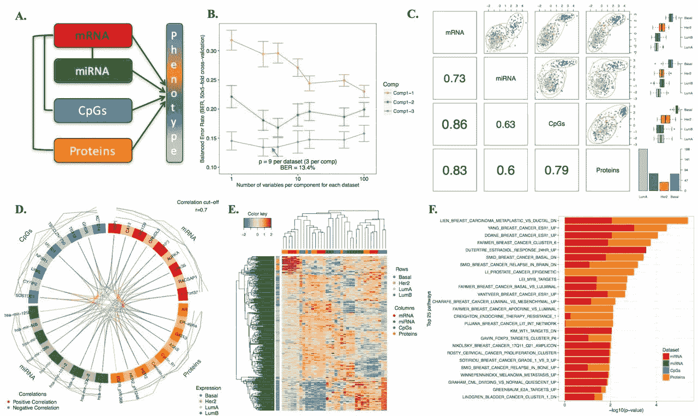****

****DIABLO Integrative OMICs pipeline from [mixOmics](http://mixomics.org/) R package, [image source](https://www.biorxiv.org/content/10.1101/067611v1.full)****

# ****为什么要选择信息丰富的特征？****

****另一个挑战是组合不同类型的生物信息**增加了分析特征** **的数量，同时保持统计观察(样本)的数量不变**。考虑到即使是单个组学也可能是非常高维的，如果没有严格的降维或正则化，它们的集成是困难的，这归结为对最有信息的特征的**选择** **，同时丢弃有噪声的特征**。****

****假设我们对解释我们感兴趣的表型 Y 的变异感兴趣，例如疾病状态，我们有一个解释变量(基因)的矩阵 X，我们假设这些变量对 Y 的变异负责。问题是:X 中的所有解释变量对 Y 的变异都有同等贡献吗？**由于生物数据中存在大量噪声，有理由假设一些基因是信息性的，而一些基因是有噪声的**。由于我们通常只有有限数量的统计观测值，我们不能包含噪声基因，而必须专注于信息基因，即**在继续建模**之前选择特征 **。******

****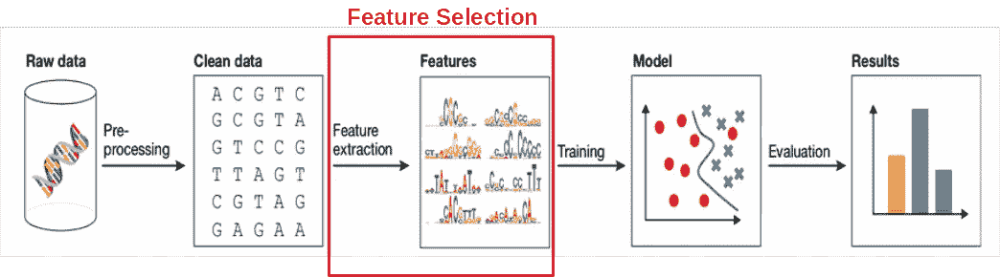****

****Feature selection is an important step in biological analysis workflow, [image source](https://www.embopress.org/doi/full/10.15252/msb.20156651)****

****为了进行选择，我们必须针对表型 y 测试 X 中的基因。然而，我们应该如何做呢:一起测试**X 中的所有基因(多变量特征选择)**还是逐个测试**(单变量特征选择)**？这里我们要比较两种方式。****

# ****单变量特征选择****

****为了演示单变量与多变量特征选择，我将使用来自人类骨骼肌的 [RNAseq](https://en.wikipedia.org/wiki/RNA-Seq) 基因表达数据，来自 [**GTEx 人类组织基因表达**](https://gtexportal.org/home/) [**联合体**](https://gtexportal.org/home/) [**V7**](https://gtexportal.org/home/) 。数据集包括 **n=157 个样本**，为了简单和快速起见，我随机抽取了 **p=1000 个基因**。****

****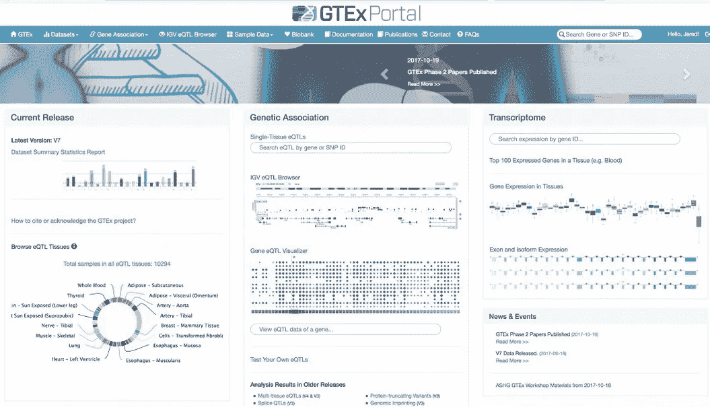****

****[The Genotype-Tissue Expression (GTEx) project](https://gtexportal.org/home/). Nature Genetics. 29 May 2013\. 45(6):580–5.****

****在这里，我们加载基因表达矩阵 X，并删除低表达基因。为简单起见，感兴趣的表现型将是性别。换句话说，在我们的案例中，我们将发现人类骨骼肌中哪些基因的表达显示了 99 名男性**和 58 名女性**之间的表型差异。让我们通过显示 [**PCA 图**](https://en.wikipedia.org/wiki/Principal_component_analysis) 来可视化 157 个男女样本。****

****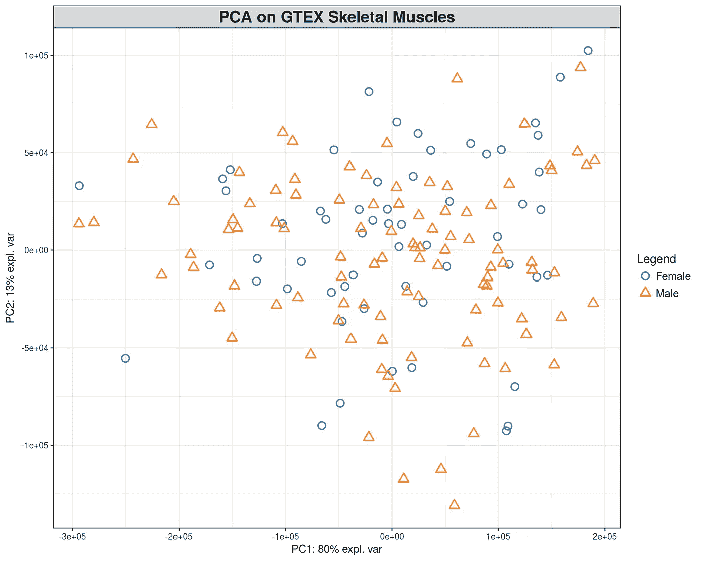****

****PCA 图显示了 PC1 和 PC2 中的样本之间的大量差异，但是基于它们的骨骼肌基因表达数据，没有明确的雄性和雌性分离。了解样本之间差异背后的基因的一种方法是测试每个个体基因与性别的相关性，在我们的情况下，这相当于差异基因表达(DGE)的分析。这里，我们将使用简单的非参数 [**Spearman 相关性**](https://en.wikipedia.org/wiki/Spearman%27s_rank_correlation_coefficient) 来推断 X 和 Y 之间的关系，我们将对照 Y 逐一测试 X 中的所有基因，使用[错误发现率](https://en.wikipedia.org/wiki/False_discovery_rate)调整多重测试相关性的 p 值，并通过 FDR 对基因进行排序。****

****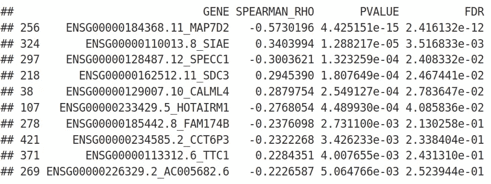****

****我们根据基因与性别的个体关联对基因进行排序，并可以应用传统的截止值 **FDR=0.05** 来选择**信息性****/**/**显著性**基因。接下来，我们可以将这些选择的基因组合成一个预测得分，这似乎是一个有吸引力的想法。然而，在实践中，这种基于单变量特征选择的预测效果很差，因为它有两个问题:****

*   ****单变量特征选择不能克服 [**维数灾难**](https://en.wikipedia.org/wiki/Curse_of_dimensionality) 问题，因为 FDR 校正不足以达到此目的，即它易于**过度拟合**并且具有**较差的泛化能力**。****
*   ****单变量特征选择不考虑特征之间的[多重共线性](https://en.wikipedia.org/wiki/Multicollinearity)，即当特征彼此高度相关时。****

****上述缺点可以用稀疏线性模型来解决，即具有正则化惩罚的模型，如 [**【套索/脊/弹性网】**](https://en.wikipedia.org/wiki/Lasso_(statistics)) 或 [**偏最小二乘(PLS)**](https://en.wikipedia.org/wiki/Partial_least_squares_regression) 回归或判别分析，多变量特征选择的基本技术。****

# ****多元特征选择****

****同时**考虑 X 矩阵中所有解释变量的最简单方法是将它们一起放入**多重**或**多元**线性模型，并执行 [**普通最小二乘(OLS)**](https://en.wikipedia.org/wiki/Ordinary_least_squares) 最小化:******

**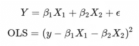**

**这里为了简单起见，我们只使用了两个预测值 X1 和 X2，但是可以有成千上万个。这意味着，为了最小化 OLS 成本函数，我们必须在高维空间中工作，由于维数灾难，这本来就很困难。这导致多元线性回归的解非常不稳定。为了克服这个障碍，我们可以在上述 OLS 成本函数中增加一个惩罚项:**

**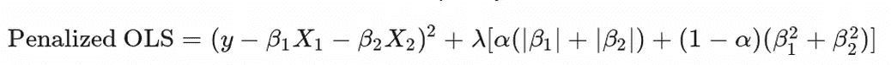**

**在这里， *λ* 被称为**拉格朗日乘数**，它是我们想要在我们的线性模型上放置多少**惩罚**的度量，它的最优值是通过**交叉验证**找到的。参数 *α* 通常是固定的，但原则上也可以通过交叉验证找到，正则化的类型称为: **1) LASSO if *α* =1，2) Ridge if *α* =0，3)Elastic Net if*α*= 0.5**。这些惩罚方法有一些不同之处，当您选择分析方法时，请记住这些不同之处。LASSO 是最严格的惩罚，在有大量噪音的数据上表现最好。LASSO 的问题在于它不能完全处理预测因子之间的多重共线性。如果两个变量强相关，LASSO 将只选择其中一个(偶然)，并将另一个变量前面的系数设置为零。有时，如果被忽略/省略的特征比 LASSO 选择的特征有更多的物理/生物意义，这种类型的特征选择可能会有问题。这个问题可以通过脊罚函数来避免，此外，脊对于**数值最小化**更加稳定，因为它在高维空间中提供了完全**凸流形**。然而，在超高维空间中，Ridge 可能过于宽松，会选择许多**噪声特征**，这可能是不可取的。弹性净惩罚在套索和脊之间提供了一种折衷，通常是机器学习从业者的首选和推荐。让我们使用 LASSO，进行交叉验证，检查选择了哪些基因:**

**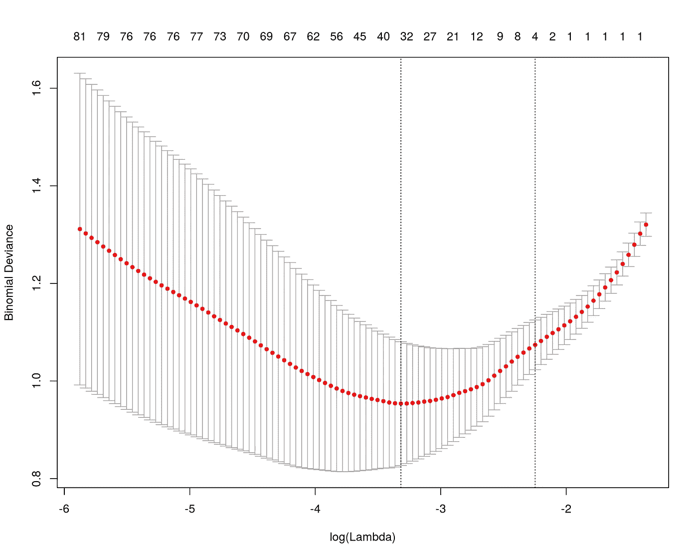****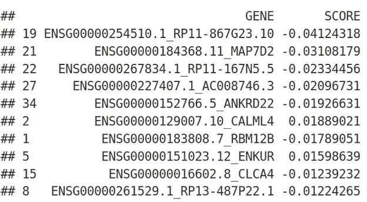**

**正如我们所见，LASSO 选择了大约 30 个信息丰富的特征，并根据其内部得分对它们进行了排名。与单变量特征选择相比，排序看起来非常不同，即使基因 **MAP7D2** 出现在两种特征选择方法的顶部。**

**另一种优雅的多元特征选择技术是**偏最小二乘法(PLS)** 回归和判别分析，其也被(其作者)称为潜在结构投影(PLS)。PLS 背后的思想是，它通过最大化 X 和 Y 之间的协方差来执行特征选择:**

**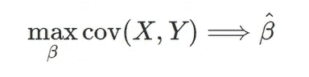**

**让我们使用性别 Y 对基因表达矩阵 X 进行 PLS 判别分析(PLS-DA)用于**监控**。它可以被认为是基因的多元选择，提供了雄性和雌性之间最大的分离。**

**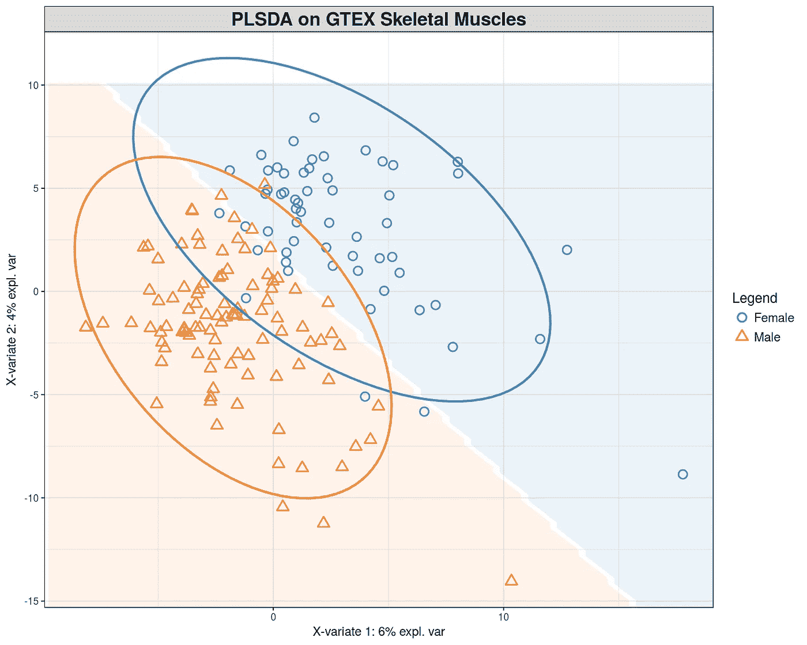**

**在这里，我们可以清楚地看到男性和女性之间的分离，将该图与上面的 PCA 图进行比较，我们没有看到任何分离。为了观察哪些基因提供了性别分离，我们显示了 PLS 负荷:**

**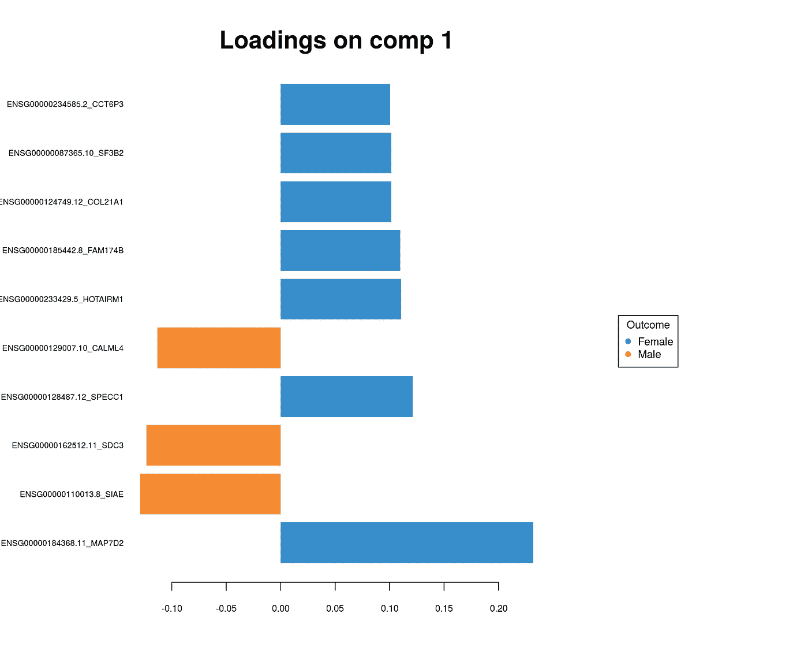****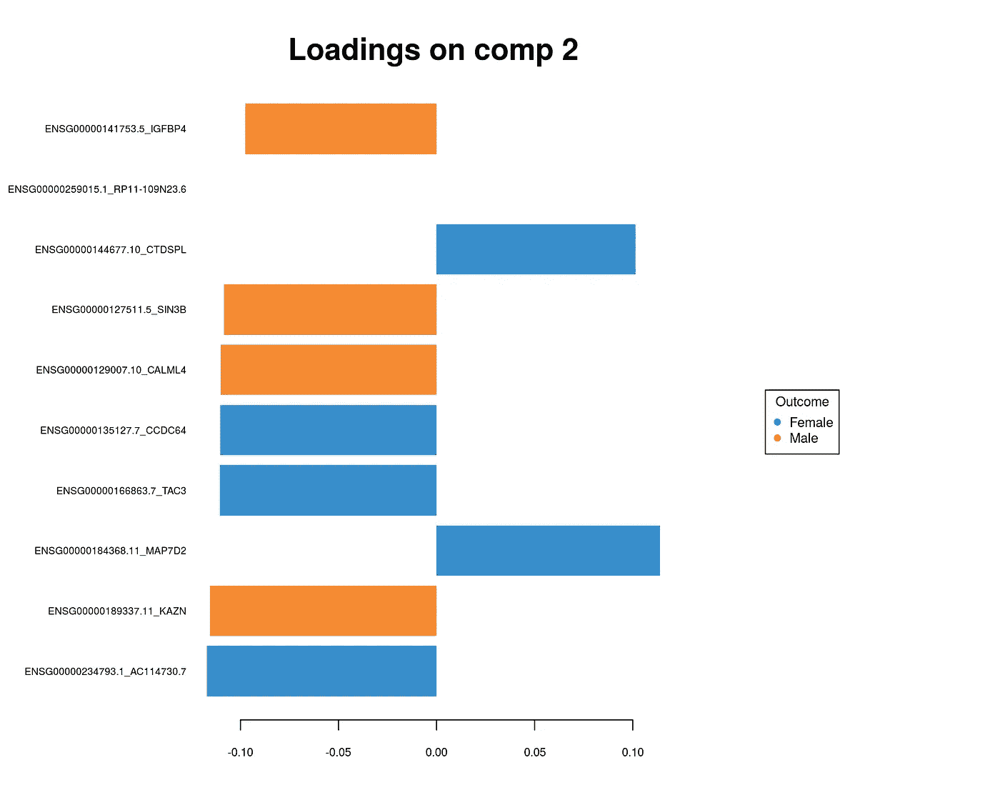**

**我们再次得出结论，通过 PLS 的多变量特征选择提供了一组看起来**与单价特征选择**非常不同的基因。此外，我们将使用以多元方式选择的基因组来整合不同的组学层。**

# **摘要**

**在本文中，我们了解到**组学集成**为生物过程的精确建模提供了一个有希望的下一步。然而，为了克服维数灾难，通常必须在集成之前进行**特征预选**。**单变量特征选择**很简单，但是它的泛化能力很差，并且没有考虑多重共线性。**多元特征选择**LASSO、Ridge、Elastic Net 和 PLS 等方法更适合处理高维生物数据。**

**在下面的评论中让我知道生命科学中的哪些分析对你来说似乎特别神秘，我会在这个专栏中尝试回答它们。在我的 [github](https://github.com/NikolayOskolkov/FeatureSelectionIntegrOMICs) 上查看完整的笔记本。在 Medium [关注我，在 Twitter @NikolayOskolkov 关注我，在 Linkedin](https://medium.com/u/8570b484f56c?source=post_page-----511390b7e7fd--------------------------------) 关注我。下次我们将讨论**监督组学整合方法**，敬请关注。**