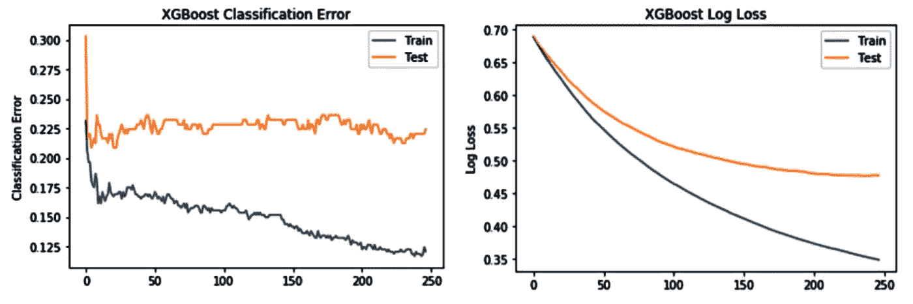
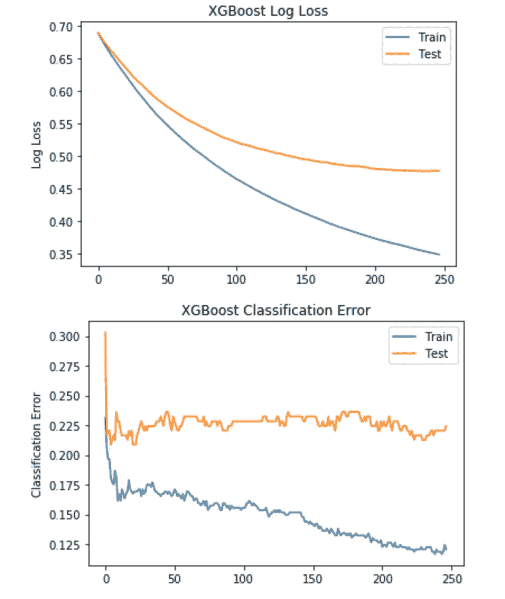
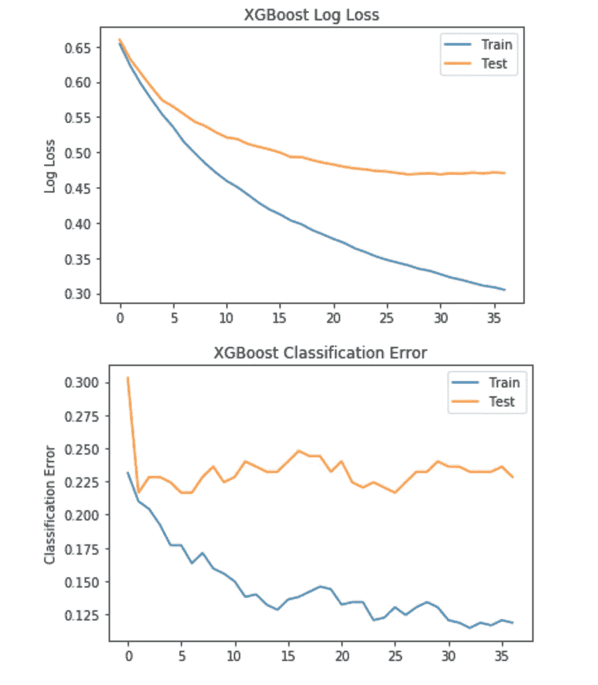
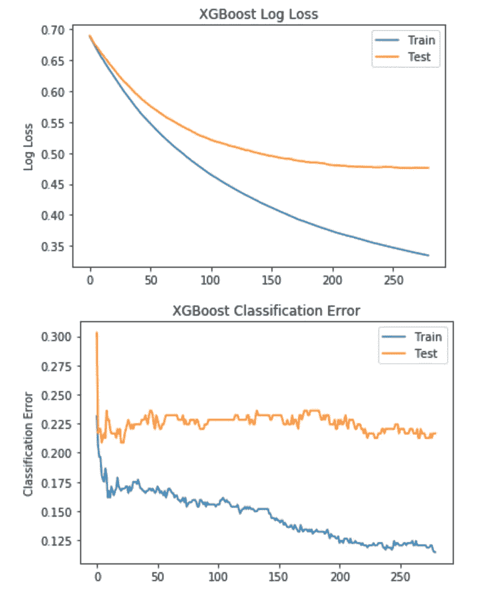

# 为 XGBoost 模型训练选择最佳参数

> 原文：<https://towardsdatascience.com/selecting-optimal-parameters-for-xgboost-model-training-c7cd9ed5e45e?source=collection_archive---------3----------------------->

## 所描述的方法有助于找到用 XGBoost 为机器学习模型训练选择参数的方法

XGBoost training results

在为机器学习模型训练选择参数时，总会涉及一点运气。最近，我在研究渐变增强树，特别是 XGBoost。我们在企业中使用 XGBoost 来自动化重复性的人工任务。在用 XGBoost 训练 ML 模型时，我创建了一个选择参数的模式，这有助于我更快地构建新模型。我会在这个帖子里分享它，希望你也会觉得有用。

我使用[皮马印第安人糖尿病数据库](https://raw.githubusercontent.com/jbrownlee/Datasets/master/pima-indians-diabetes.names)进行训练，CSV 数据可以从[这里](https://raw.githubusercontent.com/jbrownlee/Datasets/master/pima-indians-diabetes.data.csv)下载。

这是运行 XGBoost 训练步骤并构建模型的 Python 代码。通过传递成对的训练/测试数据来执行训练，这有助于在模型构建期间特别评估训练质量:

XGBoost 中的关键参数(将极大影响模型质量的参数)，假设您已经选择了 max_depth(更复杂的分类任务，树更深)、子样本(等于评估数据百分比)、目标(分类算法):

*   *n _ estimators*—XGBoost 将尝试学习的运行次数
*   *学习速率* —学习速度
*   *early _ stop _ rounds*—防止过拟合，如果学习没有改善，则提前停止

当在 verbose=True 的情况下执行 *model.fit* 时，您将看到每个训练运行评估质量被打印出来。在日志的末尾，您应该看到哪个迭代被选为最佳迭代。可能训练轮数不足以检测最佳迭代，那么 XGBoost 将选择最后一次迭代来构建模型。

使用 *matpotlib* 库，我们可以绘制每次运行的训练结果(来自 XGBoost 输出)。这有助于理解被选择来构建模型的迭代是否是最好的。这里我们使用 *sklearn* 库来评估模型精度，然后用 *matpotlib* 绘制训练结果:

让我们描述一下我为 XGBoost 训练选择参数的方法( *n_estimators* ， *learning_rate* ， *early_stopping_rounds* )。

**第一步**。根据你的经验，从你认为最有效的或者有意义的事情开始

*   *n _ 估计量* = 300
*   *学习率* = 0.01
*   *提前 _ 停止 _ 回合* = 10

结果:

*   停止迭代= 237
*   准确率= 78.35%

结果图:

通过第一次尝试，我们已经在 Pima Indians 糖尿病数据集上获得了良好的结果。训练在迭代 237 时停止。分类误差图显示了在迭代 237 附近较低的误差率。这意味着学习率 0.01 适用于该数据集，并且提前停止 10 次迭代(如果结果在接下来的 10 次迭代中没有改善)是可行的。

**第二步**。尝试学习率，尝试设置一个较小的学习率参数，并增加学习迭代次数

*   *n _ 估算者* = 500
*   *学习率* = 0.001
*   *提前 _ 停止 _ 回合* = 10

结果:

*   停止迭代=没有停止，花费了所有 500 次迭代
*   准确率= 77.56%

结果图:

较小的学习率对这个数据集不起作用。即使迭代 500 次，分类误差几乎不变，XGBoost 对数损失也不稳定。

**第三步**。尽量提高学习率。

*   *n _ estimates*= 300
*   *学习率* = 0.1
*   *提前 _ 停止 _ 回合* = 10

结果:

*   停止迭代= 27
*   准确率= 76.77%

结果图:

随着学习速率的增加，算法学习得更快，它已经在迭代 Nr 处停止。27.XGBoost log loss 误差趋于稳定，但总体分类精度并不理想。

**第四步**。从第一步开始选择最优学习率，增加提前停止(给算法更多机会找到更好的结果)。

*   *n _ 估算者* = 300
*   *学习率* = 0.01
*   *提前 _ 停止 _ 回合* = 15

结果:

*   停止迭代= 265
*   准确率= 78.74%

结果图:

稍微好一点的结果是 78.74%的准确度，这在分类误差图中是可见的。

资源:

[GitHub 上的 Jupyter 笔记本](https://github.com/abaranovskis-redsamurai/automation-repo/blob/master/diabetes_redsamurai_db.ipynb)

博文— [Jupyter 笔记本—忘记 CSV，用 Python 从 DB 获取数据](https://bit.ly/2I7VKhr)

博客文章— [通过在 Python 中使用 XGBoost 来避免过度拟合](https://machinelearningmastery.com/avoid-overfitting-by-early-stopping-with-xgboost-in-python/)