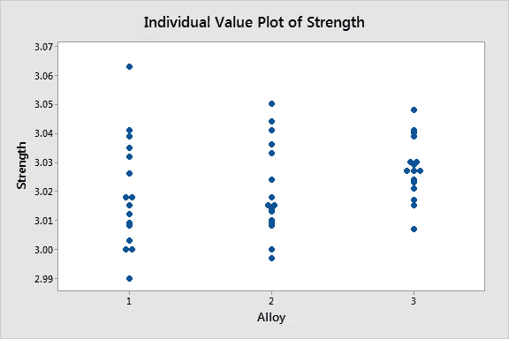
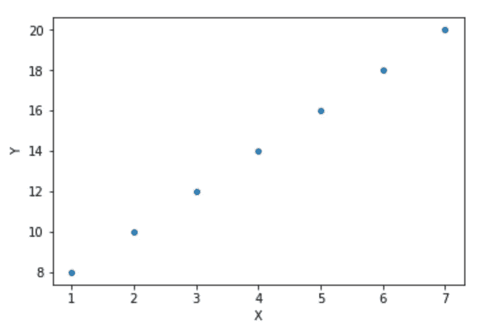
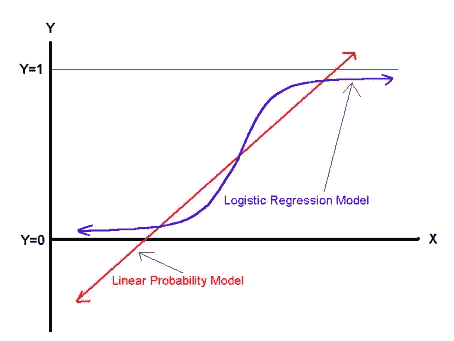
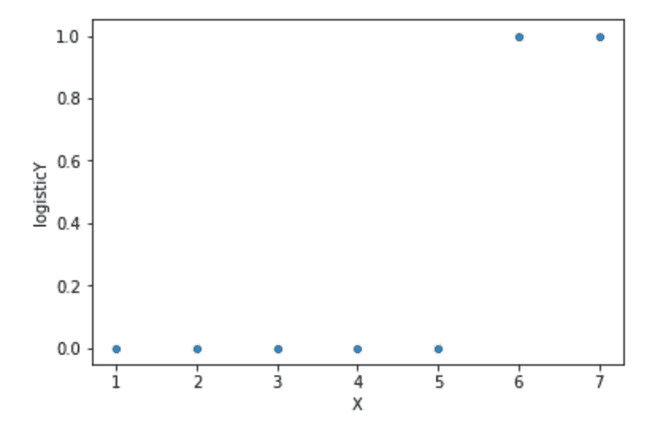
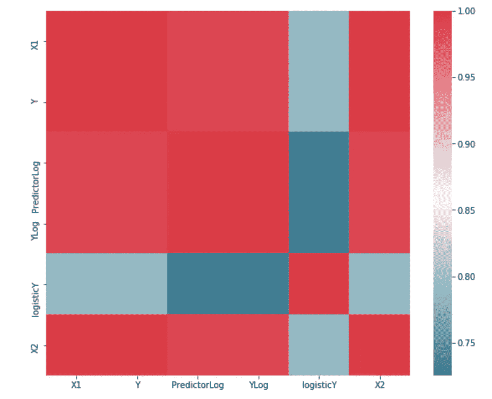
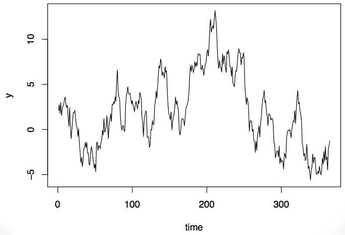
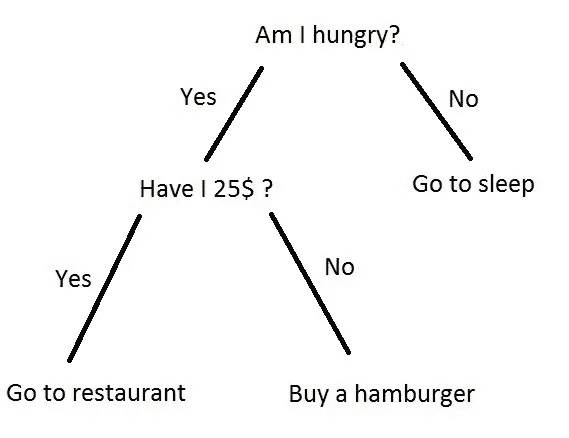
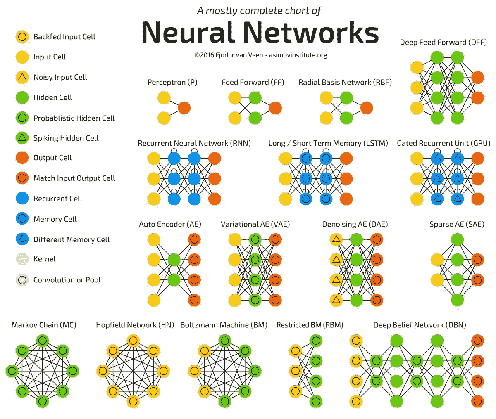

# 选择正确的预测建模技术

> 原文：<https://towardsdatascience.com/selecting-the-correct-predictive-modeling-technique-ba459c370d59?source=collection_archive---------1----------------------->

## 使用统计、概率和数据挖掘来预测未来的结果。

# 什么是预测建模？

预测建模是获取已知结果并开发一个可以预测新事件值的模型的过程。它使用历史数据来预测未来事件。有许多不同类型的预测建模技术，包括方差分析、线性回归(普通最小二乘法)、逻辑回归、岭回归、时间序列、决策树、神经网络等等。在项目开始时选择正确的预测建模技术可以节省大量时间。选择不正确的建模技术会导致不准确的预测和经历非恒定方差和/或均值的残差图。

# 回归分析

回归分析用于从一个或多个独立变量预测一个连续的目标变量。通常，回归分析用于自然发生的变量，而不是通过实验操纵的变量。如上所述，有许多不同类型的回归，所以一旦我们决定了应该使用回归分析，**我们如何选择应该应用哪种回归技术？**

**方差分析**

A scatterplot for data that may be best modeled by an ANOVA model looks as so

当目标变量是连续的且因变量是分类的时，使用 ANOVA 或方差分析。该分析中的无效假设是不同组之间没有显著差异。总体应呈正态分布，样本病例应相互独立，且组间方差应大致相等。

**线性回归**

当目标变量是连续的，因变量是连续的或者是连续变量和分类变量的混合，并且自变量和因变量之间的关系是线性的时，将使用线性回归。此外，所有预测变量应正态分布，具有恒定的方差，并且彼此之间应很少或没有多重共线性或自相关。

**逻辑回归**

[https://www.researchgate.net/figure/Linear-Probability-Versus-Logistic-Regression-6_fig2_224127022](https://www.researchgate.net/figure/Linear-Probability-Versus-Logistic-Regression-6_fig2_224127022)

逻辑回归不需要目标和因变量之间的线性关系。目标变量是二元的(假设值为 0 或 1)或二元的。逻辑回归的误差/残差不需要是正态分布的，并且残差的方差不需要是常数。但是，因变量是二元的，观察值必须相互独立，数据中必须很少或没有多重共线性或自相关，并且样本量应该很大。最后，虽然该分析不要求自变量和因变量线性相关，但自变量必须与对数概率线性相关。

If the scatter plot between the independent variable(s) and the dependent variable looks like the plot above, a logistic model might be the best model to represent that data.

**岭回归**

For variables that experience high multicollinearity, such as X1 and X2 in this case, a ridge regression may be the best choice in order to normalize the variance of the residuals with an error term.

岭回归是一种分析经历多重共线性的多重回归变量的技术。岭回归采用普通的最小二乘法，并通过向回归估计值添加一定程度的偏差来减少标准误差，从而承认残差经历了较高的方差。假设遵循多元回归的假设，散点图必须是线性的，必须有不含异常值的恒定方差，并且因变量必须表现出独立性。

**时间序列**

[https://simplystatistics.org/2016/05/05/timeseries-biomedical/](https://simplystatistics.org/2016/05/05/timeseries-biomedical/)

时间序列回归分析是一种基于响应历史预测未来响应的方法。时间序列的数据应该是变量在不同时间点的一组观察值。数据是二元的，**自变量是时间**。序列必须是稳定的，这意味着它们是正态分布的:序列的均值和方差在很长一段时间内是恒定的。此外，残差还应在长时间内呈均值和方差恒定的正态分布，并且不相关。该系列不应包含任何异常值。如果随机冲击是存在的，它们确实应该随机分布，平均值为 0，方差为常数。

# 分类分析

## 决策树

[https://hackernoon.com/what-is-a-decision-tree-in-machine-learning-15ce51dc445d](https://hackernoon.com/what-is-a-decision-tree-in-machine-learning-15ce51dc445d)

决策树是一种监督学习算法，它基于关于样本的某些问题重复分割样本。这些对于分类问题非常有用。它们相对容易理解并且非常有效。决策树表示几个决策，后面跟着不同的发生几率。这项技术帮助我们定义最重要的变量以及两个或更多变量之间的关系。

## 神经网络

神经网络有助于对数据进行聚类和分类。这些算法大致模仿人脑，旨在识别模式。神经网络往往非常复杂，因为它们由一组算法组成。这种类型的分析可能非常有用，但是，如果你试图确定*为什么*发生了什么，这可能不是最好的模型。

[http://www.asimovinstitute.org/neural-network-zoo/](http://www.asimovinstitute.org/neural-network-zoo/)

总之，这些只是可用于数据建模的不同预测技术的一小部分选项。需要注意的是，在使用预测分析技术时，在变量之间建立因果关系是非常危险的。在预测分析中，我们不能说一个变量*导致了另一个*，相反，我们可以说一个变量对另一个变量有影响，以及这种影响是什么。

我们来连线:

[https://www.linkedin.com/in/mackenzie-mitchell-635378101/](https://www.linkedin.com/in/mackenzie-mitchell-635378101/)

 [## 麦肯齐米切尔 6 -概述

### 在 GitHub 上注册您自己的个人资料，这是托管代码、管理项目和与 40…

github.com](https://github.com/mackenziemitchell6) 

资源:

[https://www.statisticssolutions.com/manova-analysis-anova/](https://www.statisticssolutions.com/manova-analysis-anova/)

[https://DSS . Princeton . edu/online _ help/analysis/Regression _ intro . htm # target text = Regression % 20 analysis % 20 is % 20 used % 20 when，logistic % 20 Regression % 20 should % 20 be % 20 used。](https://dss.princeton.edu/online_help/analysis/regression_intro.htm#targetText=Regression%20analysis%20is%20used%20when,logistic%20regression%20should%20be%20used.)

[https://www . statistics solutions . com/assumptions-of-logistic-regression/# target text = Third % 2C % 20 logistic % 20 regression % 20 需要% 20 这里，独立% 20 变量% 20 和%20log%20odds。](https://www.statisticssolutions.com/assumptions-of-logistic-regression/#targetText=Third%2C%20logistic%20regression%20requires%20there,independent%20variables%20and%20log%20odds.)

[https://www . microstrategy . com/us/resources/introductive-guides/predictive-modeling-the-only-guide-you-need](https://www.microstrategy.com/us/resources/introductory-guides/predictive-modeling-the-only-guide-you-need)

[https://skymind.ai/wiki/neural-network](https://skymind.ai/wiki/neural-network)

[https://NCSs-wpengine . net DNA-SSL . com/WP-content/themes/NCSs/pdf/Procedures/NCSS/Ridge _ regression . pdf](https://ncss-wpengine.netdna-ssl.com/wp-content/themes/ncss/pdf/Procedures/NCSS/Ridge_Regression.pdf)

[https://www . analyticsvidhya . com/blog/2015/01/decision-tree-simplified/2/](https://www.analyticsvidhya.com/blog/2015/01/decision-tree-simplified/2/)