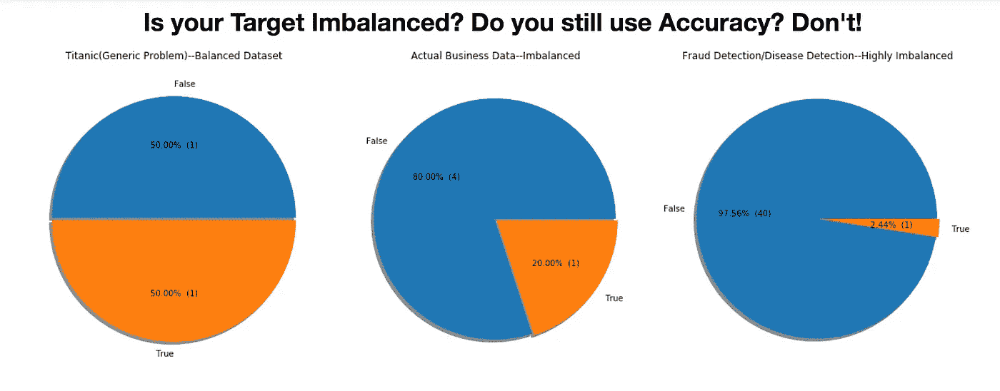
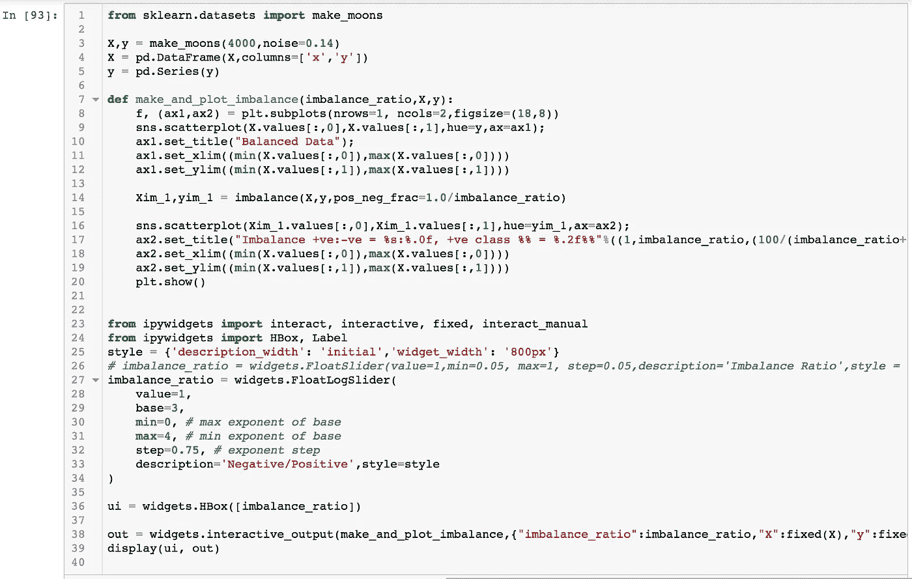
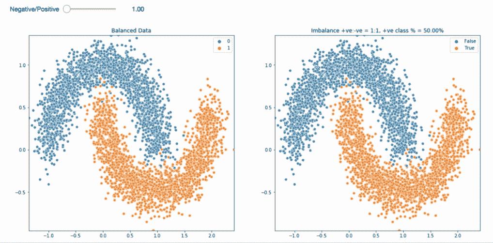
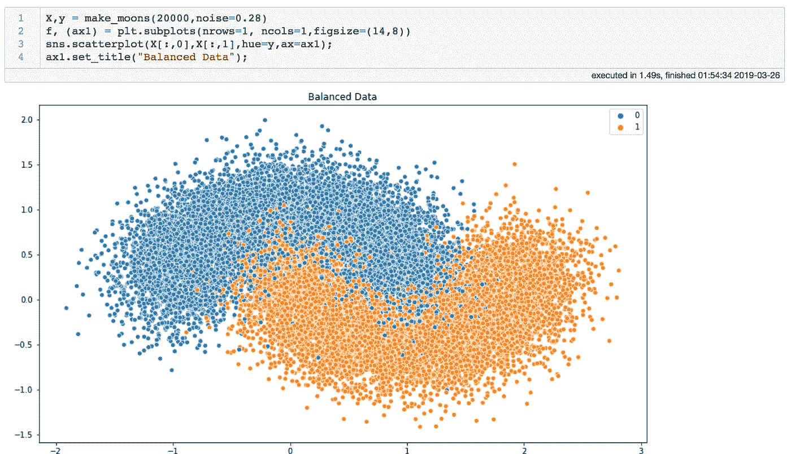
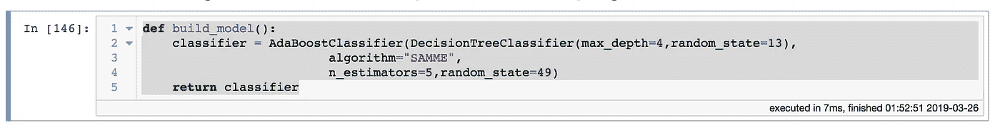
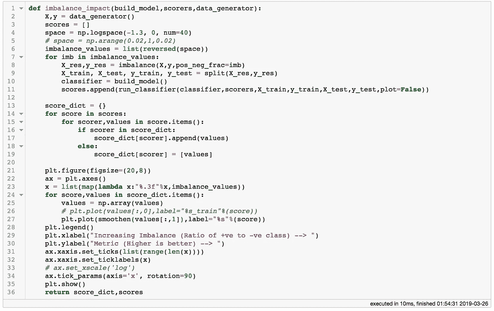
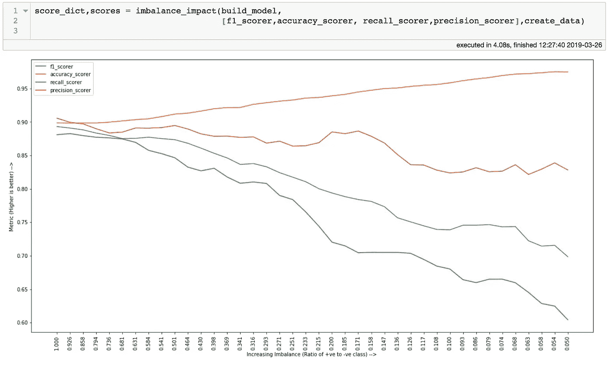
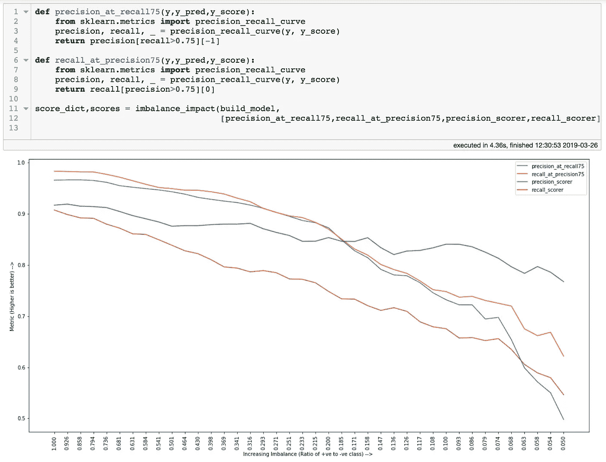
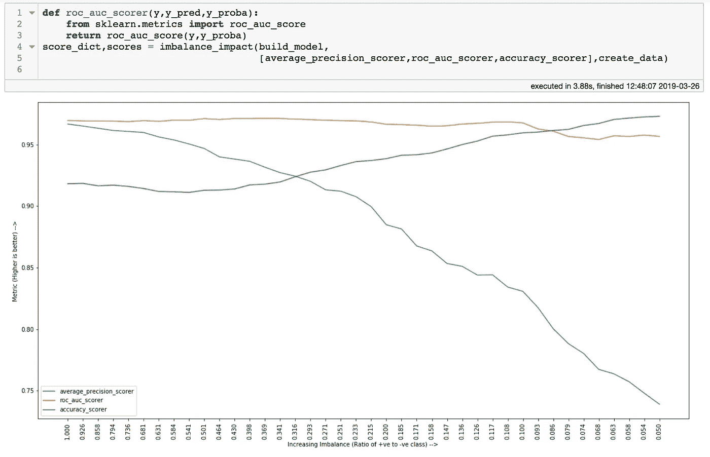
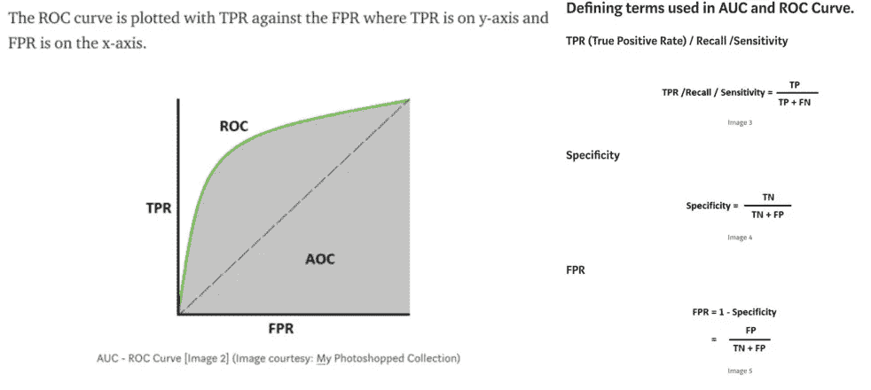

# 为偏态分类问题选择正确的度量

> 原文：<https://towardsdatascience.com/selecting-the-right-metric-for-skewed-classification-problems-6e0a4a6167a7?source=collection_archive---------5----------------------->

## 偏斜精度！！让我们尝试一些其他的分类标准！！



Skew Accuracy

这是关于不平衡和噪声数据系列文章的第 2 部分。[第 1 部分关于数据生成到此为止。](/https-medium-com-faizanahemad-generating-synthetic-classification-data-using-scikit-1590c1632922)

那么，为什么我们需要关心我们的度量呢？TLDR；这将帮助你的企业更好地理解你的模型。这将有助于您的模型更快地优化自身，并获得更加面向业务的结果。

接下来是一个很长的答案。解决有监督的 ML 问题可以从不同的角度来看。

## 解决模糊问题

天气预测、股票价格预测或信用欺诈检测等都试图通过建立数据模式来解决看似模糊的问题。我们试图找到我们观察到的数据和观察到的目标标签之间的关系。我们进一步使用这些发现的关系进行预测。

> **“我们发现的数据和预测目标之间的关系质量如何？”**

## 寻找函数近似值

我们相信，给定所有可能的数据，每个事件都是可预测的，因此我们相信，每个目标观察都可以用一个采用正确预测集的函数来解释。

```
*f*(All Predictors)->y
or
*f*(All Predictors) gives target
```

然后，我们试图找到一个函数 *g，*，这是一个很好的近似函数*f。*不可能在所有情况下找到函数 *f* 本身，因为你有时没有所有的预测值和所有的观测值。所以我们发现

```
*g*(Some subset of Predictors) -> y [Correct in most cases]
```

> **“g*和 f*有多接近？”**

现在，**" g*逼近 *f"**** *的程度将取决于我们的预测器有多好，以及我们的学习算法有多好。*

*所以我们有两个问题，我们的函数逼近有多好？我们发现数据和目标之间的关系有多好？这些是我们的指标帮助我们回答的问题。*

## *需要一个好的度量标准:预测第二天的降雨*

*我们试图预测明天是否会下雨？我明天应该带一把伞吗？现在，我们每天都对一整年(365)的第二天进行预测。*

*让我们检查一些假设的数据。*

*它只下了 87 天雨，整整 278 天没下雨。我们预测了 42 天。但总的来说，我们说会下雨 122 天。我们在 87 天中对了 42 天，278–80 = 278 天中的 198 天，42+198 = 240 天。所以 240/365 正确或 65%的时间。但是如果我们的目的是保护我们的用户不被淋湿，那么我们失败了 87–42 = 45 次。下雨有一半是我们没有预料到的。因此，尽管我们有 65%的时间是正确的，但我们还是在 45 天里淋湿了，而且只在 42 天里得救了。*

*现在，我们使用的度量标准(总体正确率%)是问题的正确度量标准吗？考虑两种情况*

*   *案例一:避雨:客户利用你的预测来计划外出。或许你可以用不同的方法来衡量成功？像*、*、*、【TTL/N 天前预测】、*因为我们的用户想避免下雨，所以如果我们检测大多数天会更好。此外，在这种情况下，我们提前提供预测(第二个指标)以便用户进行规划是很重要的。所以我们努力优化这两者。*
*   *案例 2:通勤的交通路线选择:在这里，您可以预测每个小时，没有必要找到所有的雨天，而是重要的是大多数时候是正确的，这样用户(或地图应用程序)就可以在大多数日子选择正确的路线。所以这里的*“%总体正确次数”*确实是一个很好的指标。*

*从上面的例子中，我们看到一个成功的 ML 解决方案需要定义的不仅仅是精度/召回率/准确度。您的指标可能会考虑重要的业务因素，如*何时应该进行预测？*，*你需要预测未来多久？*(需求预测领域)，*你的算法需要多长时间？*等。*

*在这篇文章中，我关注分类问题的一个子集，偏斜标签分类问题。在这些问题中，目标标签不是均匀分布的。我们的示例问题本身存在偏差，其中阳性标签(下雨)只有 87 个，而阴性标签有 278 个，偏差为 1:3。*

*许多像信用欺诈这样的问题有更高的偏差，99%的例子是负面的(非欺诈)，只有 1%(欺诈)。因为像准确度/精确度/召回率这样的通用指标不能捕捉业务意图。许多组织也有一套好的精确/召回的概念(90%的精确，95%的召回)。但是对于这些扭曲的问题来说，这样的数字很大程度上是无法实现的。因此，正确的问题是:ML 模型能提供商业价值吗？你的度量应该反映这个问题。*

# *分类问题可用的度量*

*我提供了一个在流行的 scikit 库中可用的分类指标的列表。在链接的文档页面上可以看到它们如何工作的详细信息。*

*我认为最好到最坏的安排(对于偏斜问题)*

*   *[敏感度得分](https://imbalanced-learn.readthedocs.io/en/stable/generated/imblearn.metrics.sensitivity_score.html#imblearn.metrics.sensitivity_score)*
*   *[特异性评分](https://imbalanced-learn.readthedocs.io/en/stable/generated/imblearn.metrics.specificity_score.html#imblearn.metrics.specificity_score)*
*   *[精度](https://scikit-learn.org/stable/modules/generated/sklearn.metrics.precision_score.html#sklearn.metrics.precision_score)*
*   *[回忆](https://scikit-learn.org/stable/modules/generated/sklearn.metrics.recall_score.html#sklearn.metrics.recall_score)*
*   *[平衡精度](https://scikit-learn.org/stable/modules/generated/sklearn.metrics.balanced_accuracy_score.html#sklearn.metrics.balanced_accuracy_score)*
*   *[精度](https://scikit-learn.org/stable/modules/generated/sklearn.metrics.accuracy_score.html#sklearn.metrics.accuracy_score)*
*   *[F1 得分](https://scikit-learn.org/stable/modules/generated/sklearn.metrics.f1_score.html#sklearn.metrics.f1_score)*
*   *[AUC-ROC](https://scikit-learn.org/stable/modules/generated/sklearn.metrics.roc_auc_score.html#sklearn.metrics.roc_auc_score)*
*   *[平均精度/精度召回曲线下面积](https://scikit-learn.org/stable/modules/generated/sklearn.metrics.average_precision_score.html#sklearn.metrics.average_precision_score)*

# *不平衡/偏斜问题的分类度量的行为*

*[Jupyter 笔记本链接](https://github.com/faizanahemad/data-science/blob/master/exploration_projects/imbalance-noise-oversampling/Choosing-Right-Metric-Imbalanced-Skew-Classification.ipynb)*

*我们将创建一些人工数据，然后倾斜正负类。接下来，我们将使用一个分类算法和一些指标来检查这些指标如何应对不断增加的不对称。*

*理想情况下，在不对模型进行微调或对数据进行重采样的情况下，合适的指标应该从好变坏。另一方面，没有考虑偏斜的指标不会显示出太大的变化，甚至可能显示出偏斜越大的改进。*

*首先让我们看看不平衡的数据是什么样子的，我们将使用 scikit 的 make_moons api(在以前关于数据生成的博客中已经介绍过[)。](/https-medium-com-faizanahemad-generating-synthetic-classification-data-using-scikit-1590c1632922)*

**

*Interactive Imbalance Plot Code*

*随着我们增加不平衡的结果*

**

*Increasing Imbalance*

*[笔记本带代码。](https://github.com/faizanahemad/data-science/blob/master/exploration_projects/imbalance-noise-oversampling/Choosing-Right-Metric-Imbalanced-Skew-Classification.ipynb)*

*接下来，让我们看看在不平衡加剧的情况下，各种指标会是什么样子。*

**

*Generating Data*

*接下来，我们定义一个函数来连续构建模型。*

**

*Model builder function*

*最后，我们编写一个函数，循环遍历各种不平衡值、我们提供的指标，并制作一个指标与不平衡的图表。*

**

*Function to plot metrics vs imbalance*

*注意，我使用`np.logspace`来生成不平衡值。这帮助我生成更多接近 0 的值，和更少接近 1 的值。第 8 行对`imbalance`的函数调用使数据不平衡，这是一个自定义函数，可以在同一文件夹的`[lib.py](https://github.com/faizanahemad/data-science/blob/master/exploration_projects/imbalance-noise-oversampling/lib.py)`中找到。其他自定义函数在同一个文件中。*

*最后让我们运行它。我们使用 f1、准确度、召回率和精确度作为我们的衡量标准。*

**

*Metrics vs Imbalance — I*

*我们的观察如下。*

*准确度对不平衡完全不敏感，而精度、召回率和 f1 则敏感。*

*接下来，让我们尝试几个其他指标。我们定义了两个新的指标:`precision@recall=75`和`recall@precision=75`，因此我们将召回率/精确度保持在一个设定的阈值，然后检查这种不平衡如何影响另一个。*

**

*Metrics vs Imbalance — II*

*请注意，所有这些指标对不平衡都很敏感。为了改进它们，你需要改进你的模型。另一方面，精确度对不平衡不敏感，呈现出良好性能的虚假舒适画面。发生这种情况是因为随着偏斜的增加，预测最频繁的类将给出高精度。在 1:99 的偏差情况下(1 个正例，99 个负例)，如果你总是预测为负，那么你的准确率是 99%。`Accuracy = Num correctly predicted / Total examples`*

*最后，我们将比较 AUC-ROC 和平均精度与准确性。*

**

*Metrics vs Imbalance — III*

*注意，AUC-ROC 对不平衡不敏感。因此，如果数据集有偏差，那么 AUC-ROC 就不是一个好的指标。让我们找出原因。*

## *解释为什么 AUC-ROC 对不平衡不敏感*

*[先简单介绍一下什么是 AUC-ROC。](/understanding-auc-roc-curve-68b2303cc9c5) [别出心裁。](https://stats.stackexchange.com/questions/145566/how-to-calculate-area-under-the-curve-auc-or-the-c-statistic-by-hand)*

*公然从上面的文章复制粘贴(避免写的东西和别人写的一样)。*

**

*Roc Curve and Terms*

*所以 ROC 曲线对于不同的阈值(0-1)是真阳性对假阳性。最低值可以是 0.5，用于随机猜测。*

*让我们看看它对增加不平衡有什么作用。*

*我们想证明的是:随着失衡的增加，TPR 和 FPR 相对保持不变。*

***等式 1: TPR = TP/(TP+FN)***

*随着不平衡的增加，TPR 将大部分保持不变，因为它依赖于错误分类的正面例子。如果我们的算法具有 90%的检测，则 TPR = 90/(90+10) = 0.9，即 TPR 不取决于偏斜，而是取决于我们的算法仅能够多好地检测正类。*

***等式 2: FPR = FP/(TN+FP)***

*有趣的是，随着偏斜的增加，我们将有更多的 FP，假设我们的算法将每 100 个负样本中的 1 个分类为正样本(FP)，那么当我们有高偏斜时，我们将有许多负样本与正样本相比，以及许多 FP。但是这里我们不考虑 FP，我们考虑 FPR，注意分母中的 TN，真负数(TN)也会随着负数类的增加而增加。结果，FPR 还是老样子。*

*鉴于这两个方程在直觉上保持一致，AUC-ROC 对偏斜不敏感也就不足为奇了。*

# *对不平衡/偏斜问题使用衍生指标*

*我建议根据您的业务需求使用以下两种方法中的任何一种。*

*   *精确度@召回=x 或 FPR @召回=x*
*   *Recall@Precision=x*

## *为什么这些有用？*

*以欺诈检测为例，你想检测 95%的欺诈，所以你的召回率=0.95，现在你想确保你没有太多的 FPs。精度= TP/(TP+FP)，所以精度越高，FPs 越低。你的企业在我们的公式中修正了`x`。你知道召回，现在你用持续召回来优化你的模型，以提高精度或降低 FPR。*

*同样，考虑癌症的药物管理(化学疗法)。你要确保没有患病的人不会服用这种药物，因为它对健康有巨大的不良影响。你的医院认定只有 1/1000 的诊断是不正确的。或者你的精度= 999/(999+1) = 0.999。所以你的精度是固定的，现在你的模型必须增加检测/召回。因此，Recall@Precision=0.999 是一个很好的指标。*

*除了使用这些特定于问题的派生指标，您的指标还可以由多个约束组成。例如，在我们讨论的降雨预测问题中，您可以有一个类似于`Precision@Recall=0.8,Duration=7 Days`的度量，即您想要检测 80%的降雨天，并且您想要在下雨前至少 7 天预测这一情况。有了这些约束，您就可以优化精度。*

# *选择正确指标时需要注意的事项*

## *基于问题和度量的数学性质*

*如果你的分布是偏斜的，那么准确性和 AUC-ROC 就不好。最好使用精度/召回率或一些派生的度量标准。*

## *基于商业效用*

*派生指标在这里是赢家，因为它们最好地转化为业务用例。上面我们展示了 Precision@Recall=x 和 Recall@Precision=x 如何很好地编码您的业务需求。*

## *关于为什么不使用曲线下面积/f1 得分/AP 作为衡量标准的信息很少*

*仅供参考:这是一种意见。*

**

*F1 Formula*

*请注意，当精度和召回互换时，F1 可以是相同的值。取精度=0.9，召回=0.3，那么 f1=0.45，反过来取召回=0.9，精度=0.3，还是 f1 = 0.45。现在，如果您将 f1 作为您的模型指标，那么精确度和召回率的值是多少。你的企业准备好接受这两种价值观了吗？他们能理解这个吗？*

*现在来看 AP/AUC-ROC，他们有类似的问题，你的曲线下面积可能是相同的，这是两条看起来非常不同的曲线，它们优化的东西不同。*

# *结论*

*让我总结一下我们的学习*

*   *不要使用 AUC-ROC、PR-曲线面积(平均精确度分数)等进行业务报告。*
*   *不要使用 F1 分数等过于复杂的指标进行报告。*
*   *使用衍生指标，因为它们很容易抓住你的业务的本质*
*   *如果你的数据不平衡，就不要用 accuracy 或者 auc-roc。*

*[笔记本链接](https://github.com/faizanahemad/data-science/blob/master/exploration_projects/imbalance-noise-oversampling/Choosing-Right-Metric-Imbalanced-Skew-Classification.ipynb)*

*[Reddit 讨论不平衡数据集](https://www.reddit.com/r/MachineLearning/comments/awfgox/d_training_set_imbalanced_should_my_validation/)*

> *将您的模型指标建立在您业务成功的基础上！！*

*感谢阅读！！*

*我利用数据科学、人工智能、机器学习和深度学习来解决现实世界的问题。随时联系我 [**LinkedIn**](https://www.linkedin.com/in/faizan-ahemad-7851a07b/) **。***