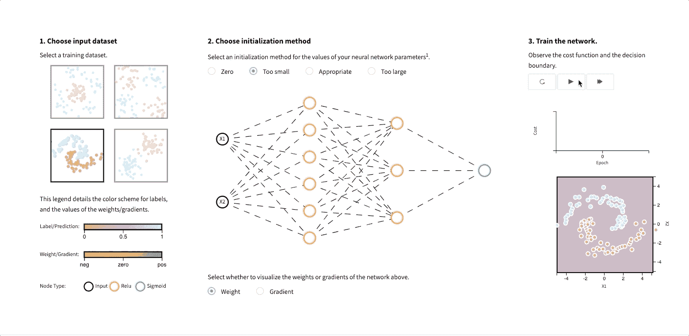
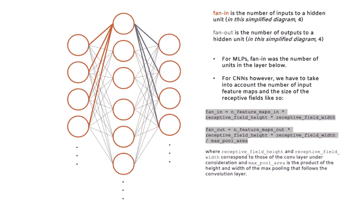
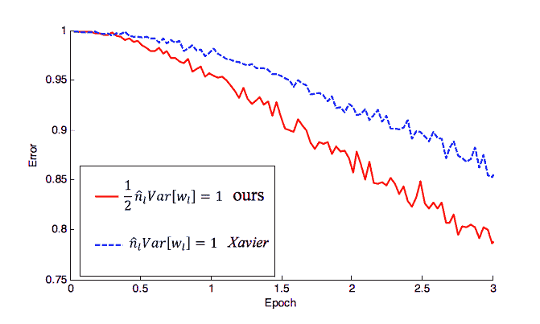

# 为深度神经网络选择正确的权重初始化

> 原文：<https://towardsdatascience.com/selecting-the-right-weight-initialization-for-your-deep-neural-network-8ccf8dfcfc4c?source=collection_archive---------15----------------------->

## *两部分系列的第一部分*

您为神经网络选择的权重初始化技术可以决定网络收敛的速度或是否收敛。虽然这些权重的初始值只是许多要调整的参数中的一个，但是它们非常重要。它们的分布影响梯度，从而影响训练的有效性。

在神经网络中，权重表示相邻网络层中单元之间的连接强度。这些权重和前一层中的值的线性变换通过非线性激活函数来产生下一层的值。这个过程在正向传播期间逐层发生；通过反向传播，可以找出这些权重的最佳值，以便在给定输入的情况下产生精确的输出。

**在本文中，我们将介绍:**

*   为什么重量初始化很重要
*   围绕权重初始化的活跃研究领域

*我们将不涉及这些初始化方法的数学推导。如果你对这类材料感兴趣，我们可以在文章的内部和结尾(在“进一步阅读”部分)链接到几个很好的资源*📚。

# 为什么权重初始化很重要？

不正确初始化的权重会导致**消失**或**爆炸梯度问题，从而对训练过程产生负面影响。**对于消失梯度问题，权重更新较小，导致收敛较慢——这使得损失函数的优化较慢，在最坏的情况下，可能会使网络完全停止收敛。相反，使用太大的权重进行初始化可能会导致正向传播或反向传播过程中梯度值爆炸(参见更多[此处](https://medium.com/usf-msds/deep-learning-best-practices-1-weight-initialization-14e5c0295b94))。

[Deeplearning.ai](http://deeplearning.ai/) 最近发布了[一个互动帖子](https://www.deeplearning.ai/ai-notes/initialization/)在这里你可以选择不同的初始化方式，观看网络列车。这里有一个例子:

你会注意到设置一个太小的初始化方法几乎不能让网络学习(即降低成本函数)，而过大的初始化方法会导致发散(检查决策边界)。

# 权重初始化方法发生了怎样的变化？

2012 年，该年 ImageNet 大规模视觉识别挑战赛(ILVSRC)的获胜者 AlexNet 推广了“使用均值等于零、标准差设置为 0.01、某些层的偏差等于一的高斯(正态)噪声进行初始化”的权重初始化方法(参见 [Krizhevsky et al. 2012](https://papers.nips.cc/paper/4824-imagenet-classification-with-deep-convolutional-neural-networks.pdf) )。

然而，由于前面提到的消失和爆炸梯度问题，这种正常的随机初始化方法不适用于训练非常深的网络，尤其是那些使用 ReLU(校正线性单元)激活函数的网络。

为了解决这些问题，Xavier 和 Bengio (2010)提出了“Xavier”初始化，在初始化权重时考虑网络的大小(输入和输出单元的数量)。这种方法通过使权重与前一层中单元数量的平方根成反比来确保权重保持在合理的值范围内(称为*扇入*)。关于如何找到给定单元的扇入和扇出，请参见下图:

激活函数的选择最终在确定初始化方法的有效性方面起着重要的作用。激活函数是可微分的，并将非线性属性(即曲率)引入我们的神经网络，这些神经网络对于解决机器学习和深度学习旨在解决的复杂任务至关重要。

激活函数是我们对输入信号进行的非线性变换。然后，这个转换后的输出被发送到下一层单元作为输入。这些非线性激活函数的一些例子是:

*   乙状结肠的
*   Softmax
*   双曲正切
*   热卢
*   泄漏 ReLU

通常使用校正线性单元(ReLU)(和泄漏 ReLU)，因为它们对消失/爆炸梯度问题相对鲁棒。对于像 ReLU 这样的激活函数，何等人(2015)引入了一种更稳健的权重初始化方法，该方法考虑到了它是不对称的这一事实(参见下文何等人论文中引用的性能差异)。这两种方法都使用了相似的理论分析:它们为从中提取初始参数的分布找到了良好的方差。该方差适用于所使用的激活函数，并且是在没有明确考虑分布类型的情况下导出的。

图来自[何等人(2015)的论文](https://arxiv.org/abs/1502.01852)，显示了他们改进的初始化策略(红色)如何比(P)ReLUs 的 Xavier 方法(蓝色)更快地降低错误率，并说明了其不对称的事实。

关于 Xavier 和 he 初始化方法的可访问证明，请参见 Pierre Ouannes 的精彩帖子[“如何初始化深度神经网络？泽维尔和明凯初始化'](https://pouannes.github.io/blog/initialization/)。

值得注意的是，权重初始化仍然是*一个活跃的研究领域。*已经出现了几个有趣的研究项目，包括[数据相关初始化](https://arxiv.org/abs/1511.06856)、[稀疏权重矩阵](https://openai.com/blog/block-sparse-gpu-kernels/)和[随机正交矩阵初始化](https://arxiv.org/abs/1312.6120)。

该领域最有趣的发展之一是麻省理工学院的[彩票假说](/how-the-lottery-ticket-hypothesis-is-challenging-everything-we-knew-about-training-neural-networks-e56da4b0da27)，该假说详细描述了这些大型神经网络如何包含比完整网络小 10 倍的较小“子网”。根据研究小组的说法，这些子网也可以学习，做出同样精确的预测，有时比完整的神经网络更快。

“[彩票假说:寻找稀疏的、可训练的神经网络](https://internetpolicy.mit.edu/publications/#lottery)”的作者 Carbin 和 Frankle 通过执行一个称为*修剪*的过程来测试他们的彩票假说和子网的存在，该过程涉及根据网络优先级或权重从训练过的网络中删除不需要的连接，以使它们适合低功耗设备。

事实上， [TensorFlow](https://medium.com/u/b1d410cb9700) 最近宣布了一个新的权重修剪 API:

权重修剪意味着消除权重张量中不必要的值。我们实际上是将神经网络参数值设置为零，以去除我们估计的神经网络各层之间不必要的连接。这是在训练过程中完成的，以允许神经网络适应这些变化。

点击阅读更多关于权重修剪 API [的信息。](https://medium.com/tensorflow/tensorflow-model-optimization-toolkit-pruning-api-42cac9157a6a)

**互动演示**

点击这里试试这个互动演示[。**权重值的大小很重要，但确保权重随机初始化也很关键**。这种随机初始化方法基于一种称为**打破对称性**的已知特性，其中:](https://www.deeplearning.ai/ai-notes/initialization/)

*   如果两个隐单元有相同的输入和相同的激活函数，那么它们一定有不同的初始参数
*   最好初始化每个单元来计算不同的函数

如果仅用零初始化权重，网络中的每个神经元将计算相同的输出，并且梯度将经历完全相同的参数更新。换句话说，如果神经网络中的单元的权重被初始化为相同的值，则它们将在训练期间学习相同的特征。

*通过迁移学习，您可以使用以前网络中保存的权重作为新实验的初始权重，而不是从随机初始化的权重开始(即微调预训练的网络)。*