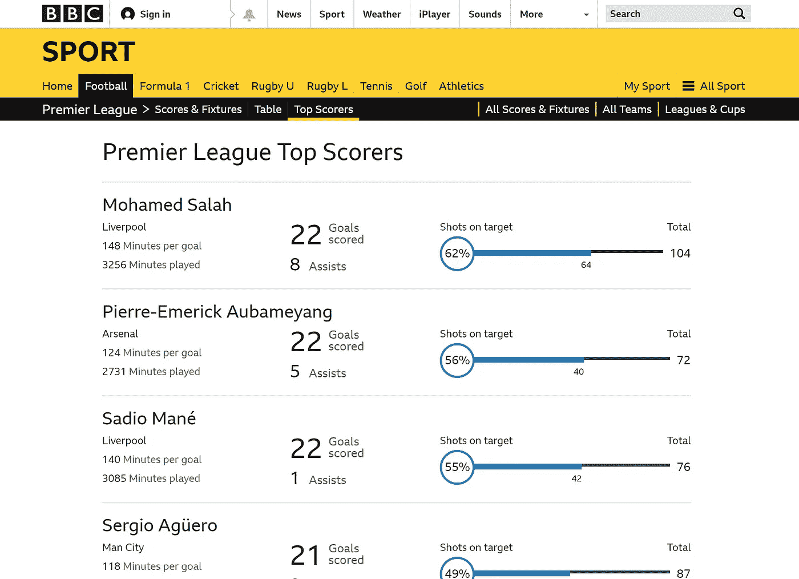
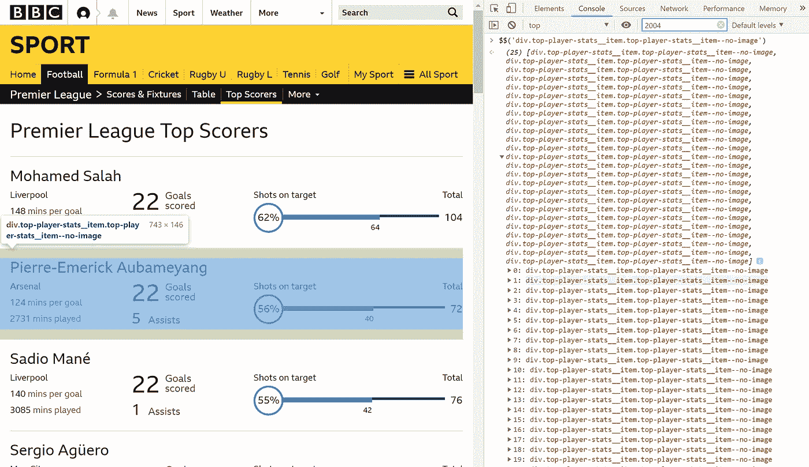
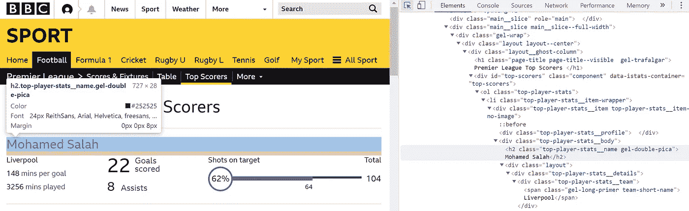
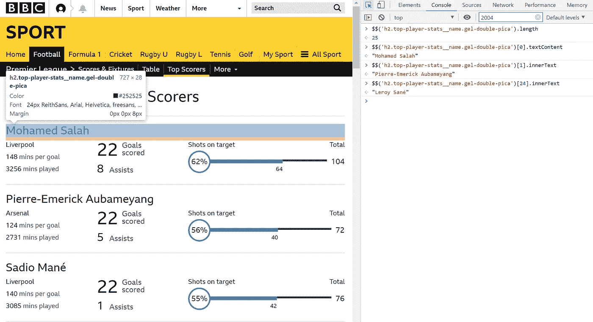
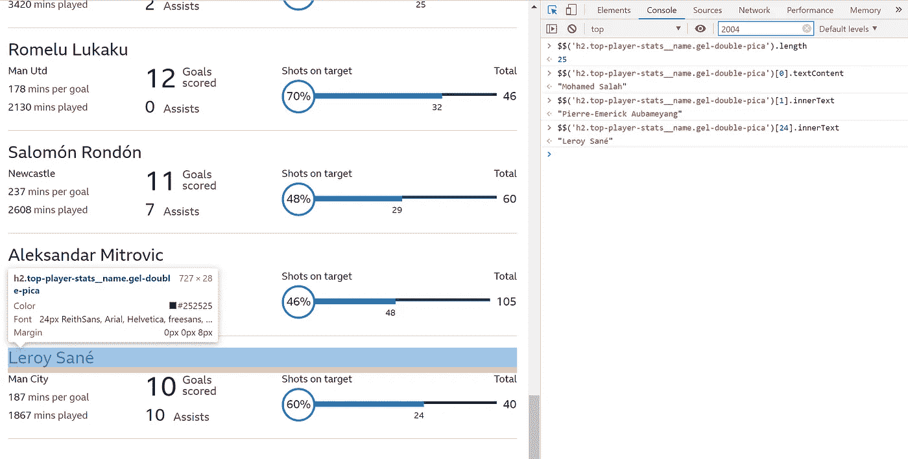
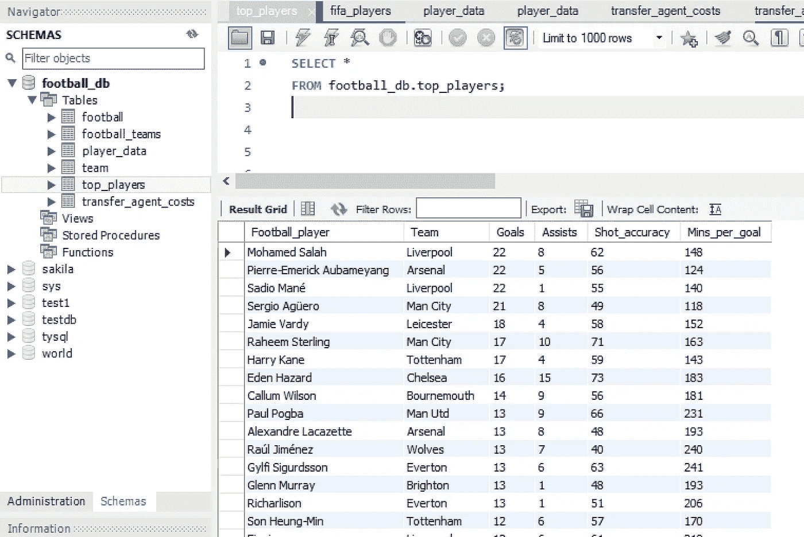
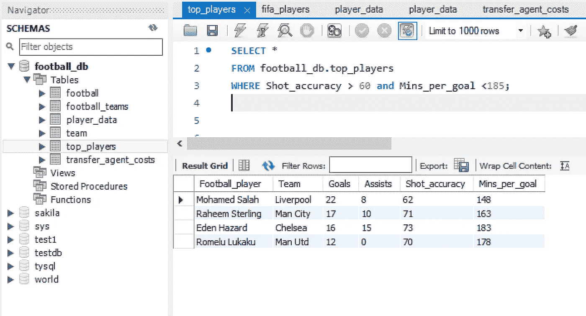

# Selenium 和 SQL 组合——顶级英超球员

> 原文：<https://towardsdatascience.com/selenium-and-sql-combined-top-premier-league-players-282b2a3fa413?source=collection_archive---------30----------------------->

## 用 Selenium 抓取并将数据列表到 SQL 数据库表中

Source: [Jannes Glas](https://unsplash.com/@jannesglas) via unsplash

英超 2019/20 赛季计划于 2019 年 8 月 10 日星期六开始。虽然对新赛季的期望越来越高，但我想我会调查刚刚过去的这个赛季中表现最好的球员。

这篇教程将演示我们如何简单地收集 2018/19 赛季最佳球员的数据，并将这些数据列表到数据库管理系统(DMS)MySQL 中。然后可以使用 SQL 查询收集的数据。

开始本教程，第一个目标是找到一个关于顶级英超球员的关键统计数据的合适来源。快速搜索将我带到 BBC 足球选项卡上的“[英超最佳射手](https://www.bbc.co.uk/sport/football/premier-league/top-scorers)”页面，如下所示。

# 数据挖掘

我想收集的每个球员的数据的关键统计指标是:他们各自的名字和他们竞争的球队，进球和助攻，他们的射门准确性，最后是他们的每球上场时间比率。

首先，我需要找到一个包装器，其中包含我渴望收集的每个玩家的所有统计数据。我在我的 chrome 浏览器中右击感兴趣的页面，将鼠标悬停在我正在搜索的 web 元素上。显然，包装器“*div . top-player-stats _ _ item . top-player-stats _ _ item-no-image*”包含了所有感兴趣的信息(如下图中突出显示的)。

*在*编写任何 Python 代码之前，我鼓励的一个工作习惯是切换到开发者工具的控制台选项卡，搜索感兴趣的元素。这种方法被认为是最佳实践，因为我们可以直观地检查是否找到了感兴趣的元素。

要使用此功能，请键入 2 个美元符号$$，然后在括号内输入标签和标识符名称。

现在已经找到了包装器，还需要找到包装器中的关键信息，这样我们以后就可以遍历包装器，提取每个玩家感兴趣的所有信息。

如下所示，我可以清楚地看到播放器“Mohamad Salah”包含在 h2 标签中，在浏览器和元素选项卡中，类名都以蓝色文本指定。

# 有用的验证:我的建议

控制台实用程序 API 包含一组用于执行常见任务的便利函数:选择和检查 DOM 元素以及以可读格式显示数据。

如图所示，这里我执行了一些快速但有用的验证步骤。从视觉上检查页面，我知道应该有 25 个玩家，实际上通过使用控制台中的 length 函数得到的长度实际上是 25！

此外，让我们确认球员的名字是正确的。我想知道这 25 个元素列表中的第一个元素是否是“Mohamad Salah”，所以我简单地使用了控制台文本功能，一切似乎都如预期的那样工作。

*最后*，让我们确认列表中的最后一个玩家实际上是“勒鲁瓦·萨内”，我用第 25 个元素([24]，由于 Python 的第 0 计数索引系统)索引我的搜索查询，并滚动到网页的底部。事实上，“勒鲁瓦·萨内”是名单上的最后一名球员。

我对我想从这个网页上获取的每一条数据都重复这个过程，比如球队、进球、助攻和进球率。

# 使用硒

为了提取、制表并传输到 SQL 数据库，我首先需要导入 selenium webdriver、pandas 库和 sqlalchemy 模块。

sqlalchemy 模块中的 create_engine 函数支持与数据库的交互。提供了一个连接字符串，告诉引擎对象我们正在连接到 MySQL 数据库。

然后，我创建一个 webdriver 对象并将其分配给变量 browser，并使用 browser 对象上的 get 方法导航到 BBC 页面。

我使用 find_elements_by_css_selector 方法找到所有玩家及其数据，并在括号中输入前面找到的包装器。我将该列表分配给变量，明智地称为玩家。

***在开发人员工具的控制台选项卡中验证元素的一个很大的优点是，它们可以直接复制并粘贴到‘find _ element(s)_ by _ CSS 选择器方法中，它们是有效的查询！***

我现在可以遍历球员列表，提取像进球等关键信息。然后可以将这些附加到适当的列表中。为了确认一切工作正常，我打印出列表，并删除任何我不想要的文本。

例如，我想在我的 SQL 数据库中把“每个目标 140 分钟”作为一个数字，所以我确保删除任何填充和“每个目标分钟”。最后，尽管不是绝对必要的，我退出了浏览器，这样当我在每次迭代中检查我的列表时，页面就不会堆积。

最后，我创建了一个 DataFrame，将我的列表压缩在一起，并将它们分配给合理命名的列。然后，我通过填写下面 GitHub 要点中显示的参数连接到 MySQL。

我需要在底层数据库中存在一个表，以便将我新创建的数据帧 df 插入其中。我用 SQL 语言编写了一个查询来创建一个表，并为每一列分配一个数据类型。

然后执行查询(MySQL 中的表现在已经完成)。现在，剩下要做的就是使用**。to_sql** 方法，并将我的 DataFrame (df)插入到名为 top_players 的新表中。

刷新 schemas 图标显示 top_players 表已经创建。一个简单的 SQL 查询从表中提取所有列，显示 selenium 抓取的数据现在驻留在一个 SQL 表中。

最后，让我们执行一个信息查询。我们很想知道，哪些球员的投篮命中率在 60%以上，每分钟进球率低于 185 分钟。使用 WHERE 子句进行过滤会返回满足这些条件的玩家。

# 摘要

这篇教程演示了如何使用 selenium 收集数据，然后将数据制成数据帧，再传输到 MySQL 等 SQL 数据库。