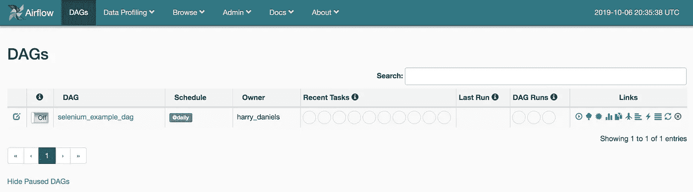
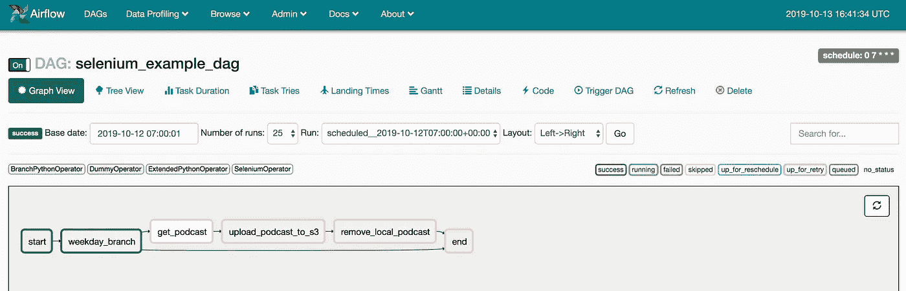

# 气流上的硒:在网络上自动化日常任务！

> 原文：<https://towardsdatascience.com/selenium-on-airflow-automate-a-daily-online-task-60afc05afaae?source=collection_archive---------7----------------------->

这篇文章演示了如何构建一个使用 Selenium WebDriver 的气流插件来自动化日常在线任务。


Photo by [Jehyun Sung](https://unsplash.com/@jaysung?utm_source=unsplash&utm_medium=referral&utm_content=creditCopyText) on [Unsplash](https://unsplash.com/s/photos/robots?utm_source=unsplash&utm_medium=referral&utm_content=creditCopyText)

## 自动化提供了一系列好处

*   提高生产力。
*   更高的质量。
*   消除人为错误的可能性并减少体力劳动。
*   额外的频率和一致性(周末工作！).

如果您的日常任务涉及到网络，那么在 Airflow 上使用 Selenium 每年可能会节省数百个小时，并提高您工作的质量和一致性。

# **简介**

这篇文章的目标是开发一个插件，利用 Selenium 来自动完成关于气流的日常任务。

1.  设置气流环境。
2.  开发 Selenium 插件。
3.  在气流 DAG 中使用 Selenium 插件。

如果你想跳过，这篇文章中讨论的所有代码都可以在我的 GitHub [这里](https://github.com/HDaniels1991/airflow_selenium)找到。

以下是所涵盖主题和软件的简要概述:

**Selenium:** 简而言之，Selenium 自动化了浏览器。它主要用于自动化测试目的的 web 应用程序，但是它并不局限于此。selenium 的一个关键组件是 WebDriver，WebDriver API 直接向浏览器发送命令。示例命令可以是导航到网页、填写表格，甚至下载文件。在这篇文章中使用的网络驱动将是 Selenium/standalone-chrome 驱动。

**Airflow:** Airflow 是一个以编程方式创作、调度和监控工作流的平台。Airflow 的关键组件是 web 服务器、调度器和工作器。web 服务器指的是 Airflow 用户界面，而调度程序根据预定义的指令在一组工作线程上执行您的任务。

最后，为了同时使用 Selenium 和 Airflow，还需要集装箱化软件 docker。

Docker 是一款通过使用容器来简化软件部署和开发的软件。容器允许开发人员将应用程序及其所有需求打包在一起，还可以将软件与其环境隔离开来，以确保它可以在不同的开发环境中工作。Docker 的一大特色是 compose 工具，它用于定义和运行多容器 Docker 应用程序。

我们将首先使用 Docker 来设置我们的气流环境，然后作为我们插件的一部分增加一个额外的 Selenium 容器。

# **设置气流环境**

## 基础环境:

如上所述，Docker 将用于设置气流环境。为此，请访问[https://github.com/puckel/docker-airflow](https://github.com/puckel/docker-airflow)并下载[docker-compose-celery executor . yml](https://github.com/puckel/docker-airflow/blob/master/docker-compose-CeleryExecutor.yml)文件。这是一个 docker-compose 文件，由 Github 用户 Puckel 创建，允许您快速启动并运行气流。compose 文件选择 Celery executor，如果您需要并发运行任务，那么这是必要的，因为它扩展了工作线程的数量。

docker-compose 文件有一些基本的变化。

*   重命名合成文件:docker-compose.yml。
*   取消自定义插件卷的注释。

```
- ./plugins:/usr/local/airflow/plugin
```

要确保 Airflow 容器对插件和 Dag 目录拥有正确的权限，请在运行合成之前确保主机上存在这些目录。

使用 docker-compose up 命令测试环境在本地运行，UI 应该在 [http://localhost:8080](http://localhost:8080) 可用。



## 修改环境以适应 Selenium 插件

在完成环境之前，有必要简要解释一下 Selenium 插件是如何工作的，因为它的一些功能会直接影响设置。这个插件将会在后面的文章中详细介绍。

该插件将执行以下步骤:

1.  启动 Selenium docker 容器
2.  配置远程硒驱动程序
3.  向驱动程序发送命令:这将导致从互联网下载一个文件。
4.  移除运行中的容器

上述步骤可以归纳为两类:

*   从气流中使用 Docker。
*   与远程容器交互

## 从气流中使用 Docker

气流工作者需要能够创建 Selenium 容器，然后发送命令来执行任务。正如 jérme Petazzoni 在这篇[文章](https://jpetazzo.github.io/2015/09/03/do-not-use-docker-in-docker-for-ci/)中很好地解释的那样，在另一个容器中旋转 Docker 容器是不好的做法，只要容器存在并且可访问，就没有必要这样做。允许工作人员创建容器的最简单的方法是通过将主机 Docker 套接字作为一个卷安装在 docker-compose 文件中，从而向工作人员公开它。

```
worker:
    volumes:
       - /var/run/docker.sock:/var/run/docker.sock
```

由于没有正确的权限，气流工人仍然无法访问主机 Docker 套接字，因此必须更改这些权限。这可以通过创建名为“Dockerfile-airflow”的新 docker 文件来实现，该文件扩展了 puckel/docker-airflow 基本映像，如下所示:

```
FROM puckel/docker-airflow:1.10.4USER root
RUN groupadd --gid 999 docker \
   && usermod -aG docker airflow
USER airflow
```

*   docker 文件首先调用 puckel/docker-airflow 基础映像
*   作为根用户，创建 id 为 999 的 docker 用户组，并将 airflow 用户添加到该组中。
*   设置气流用户。

工作者和主机上的 docker 组 id (999)必须相同。要找出主机 docker 组 id，请使用以下命令:

```
grep 'docker' /etc/group
```

创建新的 docker 图像:

```
docker build -t docker_airflow -f Dockerfile-selenium .
```

接下来要做的是在 Docker-compose 文件中将气流图像名称从`puckel/docker-airflow:latest`更改为`docker_airflow:latest`。这意味着合成文件将使用新创建的图像。

Airflow worker 现在可以在主机上创建 Docker 容器，但是仍然需要 Docker python 包。附加安装也可以在 Dockerfile 文件中处理。下面的安装是 Selenium 插件和 DAG 所必需的。

```
RUN pip install docker && \
    pip install selenium && \
    pip install bs4 && \
    pip install lxml && \
    pip install boto3
```

要使用插件启动 Selenium 容器，映像必须已经存在于主机上:

```
docker pull selenium/standalone-chrome
```

最后，为了让 worker 容器向新的 Selenium 容器发送命令，它们需要在同一个 Docker 网络上。两个容器都将位于外部网络上:使用以下命令创建的“container_bridge ”:

```
docker network create container_bridge
```

容器桥网络也需要添加到合成文件中。

```
worker:
    networks:
        - default
        - container_bridgenetworks:
    default:
    container_bridge:
```

**NB** 需要注意的是，上述将主机 docker sock 暴露给 worker 容器并设置权限的方法只能在 linux 环境下工作，要为 MacOS 配置开发环境，请参考这两篇精彩的文章:

*   [又一个带有 Docker 示例设置的可扩展 Apache 气流](https://medium.com/@tomaszdudek/yet-another-scalable-apache-airflow-with-docker-example-setup-84775af5c451)
*   [解决在 Mac OS 中尝试从容器连接到 Docker 守护进程套接字时权限被拒绝的问题](https://medium.com/@mingheng/solving-permission-denied-while-trying-to-connect-to-docker-daemon-socket-from-container-in-mac-os-600c457f1276)

## 与远程容器交互

Selenium 插件通过远程驱动程序向 docker 容器发送命令，它通过 container_bridge 网络连接到远程驱动程序。Selenium 命令将作为主目录中的挂载卷添加到环境中:`{AIRFLOW_USER_HOME}`

```
volumes:
    # Selenium scripts 
    - ./selenium_scripts:/usr/local/airflow/selenium_scripts
```

这些命令将来自一个定制的 Python 模块(selenium_scripts ),它需要位于 Python 路径中。这可以在 Airflow Dockerfile 文件中完成。

```
ENV PYTHONPATH=$PYTHONPATH:${AIRFLOW_USER_HOME}
```

气流环境的最后一个变化是允许 Selenium 容器和气流工作者共享文件和内容。当使用 Selenium 从互联网下载内容时，这是必需的，并且可以使用外部命名卷来实现。

```
docker volume create downloads
```

需要将“下载”卷添加到 docker-compose 文件:

```
worker:
        volumes:
            - downloads:/usr/local/airflow/downloadsvolumes:
   downloads:
      external: true
```

在容器上创建 Docker 卷时，如果没有预先存在的相应目录，它们将由 root 用户创建，这意味着容器用户没有写权限。规避这一点的最简单的方法是在初始构建期间以容器用户的身份创建目录。

对于 Airflow Dockerfile 文件，添加以下行:

```
RUN mkdir downloads
```

必须为 Selenium 容器创建一个新的 Dockerfile，这将被称为 Dockerfile-selenium。

```
FROM selenium/standalone-chromeRUN mkdir /home/seluser/downloads
```

构建两个新映像:

```
docker build -t docker_selenium -f Dockerfile-selenium .docker build -t docker_airflow -f Dockerfile-airflow .
```

环境现已完成，完整的环境如下:

## 气流 Dockerfile 文件:

## Selenium Dockerfile 文件:

## docker-撰写:

# Selenium 插件

Airflow 的一个很大的特性是插件，插件是扩展 Airflow 现有特性集的一个简单方法。要将新插件与现有的气流环境集成，只需将插件文件移动到插件文件夹中。

Selenium 插件的工作方式如下:

1.  在主机环境中启动 Selenium Docker 容器。
2.  在 docker 容器上配置远程 Selenium WebDriver。
3.  向 WebDriver 发送命令来完成任务。
4.  停下来，取出容器。

这种方法比使用独立的 Docker 操作符更常用，因为它提供了更好的控制，并且便于调试。

Selenium 插件将包含一个钩子和操作符，钩子处理外部连接并构成操作符的构件。操作员将执行我们的任务。插件文件夹结构如下:

。
├── README.md
├── __init__。py
├──勾手
│ ├── __init__。py
│ └──硒 _hook.py
└──算子
├── __init__。py
└──硒 _operator.py

要创建一个插件，你需要派生 AirflowPlugin 类并引用你想插入到 Airflow 中的对象，我们在 __init__ 中做了这些。py 文件:

## 硒钩

Selenium 钩子继承自 BaseHook 模块，它是所有钩子的基类。这个钩子由启动、停止和向 Selenium 容器发送命令的几个方法组成。

**创建容器**:钩子利用 Python Docker 库向主机 Docker 套接字发送命令，并在主机上创建 Selenium 容器。外部命名卷(下载)安装在本地下载目录中，该目录将被配置为浏览器的默认下载位置。为了支持与工人的交互，还包括了 container_bridge 网络。

**配置驱动程序:**一旦执行了 create_container 方法，下一步就是配置并连接驱动程序，使其满足任务需求。

因为 Selenium 容器位于 container_bridge 网络上，所以可以在网络 IP 的以下位置找到 web driver:`<network IP>:4444/wd/hub`。可以使用 WebDriver 遥控器将驱动程序连接到。

配置驱动程序的第一步是使用 Options 类使驱动程序能够在 headless 模式下运行，并设置窗口大小以确保页面内容正确加载。无头模式本质上意味着驱动程序没有用户界面。

```
options = Options()
options.add_argument("--headless")
options.add_argument("--window-size=1920x1080")
```

第二步是启用浏览器以无头模式下载。这是通过向驱动程序发送 post 请求来完成的，该请求修复了下载行为。

```
driver.command_executor._commands["send_command"] = (
    "POST", '/session/$sessionId/chromium/send_command')
params = {'cmd': 'Page.setDownloadBehaviour',
          'params': {'behavior': 'allow',
                     'downloadPath': <DOWNLOADS>}}
driver.execute("send_command", params)
```

**执行任务:**为了使插件尽可能保持任务不可知，Selenium 命令被抽象为一个单独的 python 模块，在运行时导入 DAG。每个脚本的一个条件是它们作为函数导入，第一个参数是驱动程序。这将在后面详细介绍。

**移除容器:**一旦任务完成，容器就可以被移除。

## 硒算子

如上所述，气流挂钩是运营商的积木。下面的操作符使用 Selenium 钩子和 Airflow 的执行上下文来运行 Selenium 任务。

所有气流操作符必须继承 BaseOperator 类，该类创建成为 DAG 中节点的对象。Airflow 操作符的一个重要特性是能够定义模板字段；这些是 Jinjafied 字段，在执行时可以接受 Airflow 宏。airflow_args 变量是一个 template_field，这意味着它们可以在运行时使用宏动态设置。

# 在气流 DAG 中使用 Selenium 插件

由于气流环境和 Selenium 插件现在已经完成，下一步是将它们以气流 DAG 的形式组合在一起。气流 DAG 以预定义的方式运行一组任务。

下面的 DAG 示例旨在从 BBC 下载每日播客:醒来发现钱，并将 mp3 文件上传到 S3 供以后使用。《为钱而醒》是英国广播公司第五电台的一档早间财经广播节目，每周日早上 5 点播出新一集。

## Selenium 脚本:

唤醒赚钱脚本使用 Selenium WebDriver 导航到 URL:[https://www . BBC . co . uk/programs/b 0070 lr 5/episodes/downloads](https://www.bbc.co.uk/programmes/b0070lr5/episodes/downloads)并下载最新一集。


一旦浏览器呈现了页面，就会使用 Beautiful soup 来解析下载链接的 html。在下载链接上调用`driver.get`方法启动下载，并轮询完成。下载后，该文件会被重命名，以便于在任务之间进行跟踪。

正如在插件部分提到的，Selenium 脚本需要是一个可执行的函数，将驱动程序设置为第一个参数。

完成后，确保 Selenium 脚本位于在 Airflow 环境中挂载并在前面的步骤中添加到 Python 路径的文件夹中。

## **匕首**

如上所述，DAG 是任务的集合，创建 DAG 的第一步是描述这些任务将如何运行。创建 DAG 对象时使用的参数就是这样做的。

由于播客在每个工作日的早上 5 点播出，DAG schedule_interval 将被设置为在早上 7 点播放每集。将气流时间表达式设置为仅在工作日运行并不容易，因此 DAG 将每天运行，分支操作符将用于根据一周中的某一天来设置任务。

现在已经定义了 DAG 计划，下一步是添加任务。DAG 任务包括:

*   **启动:**启动 DAG
*   **工作日分支:**根据执行日是否为工作日，确定遵循 DAG 的哪个分支。
*   **获取播客:**下载播客。
*   **上传播客到 S3:** 上传播客到 S3。
*   **删除本地播客:**删除播客的本地副本。
*   **结束:**结束 DAG。

**开始**和**结束**任务利用气流虚拟操作器，它们除了在任务分组时有用之外什么也不做。

Selenium 插件将在**下载播客**任务中使用。SeleniumOperator 将在运行时执行从 Selenium 脚本模块导入的 download_podcast 函数。一旦播客被下载，它将被保存在新的名称下:`episode_{{ds_nodash}}.mp3`，但是由于文件名是一个模板字段，这将在运行时呈现。例如，2019 年 10 月 13 日的文件名将为`episode_20191013.mp3`。

**工作日分支**任务根据执行日是工作日还是周末将 DAG 分成两个分支。分支任务使用 Airflow Python 分支运算符根据 weekday_branch 函数的输出设置下一个任务。

如果执行日是工作日，DAG 运行的下一个任务是 get_podcast 任务，如果执行日是周末，运行的下一个任务是 end。

最后两个任务是:**上传播客到 S3** 和**移除本地播客**。这两种方法都使用 PythonOperator，它被扩展为“Jinjafy”参数。根据 Selenium 操作符，这对于跟踪 podcast 文件名是必要的。

S3 函数将需要一个名为 S3 _ 康恩 _id 的 S3 连接。

最后，最后一步是定义任务顺序，注意 weekday_branch 任务如何先于 get_podcast 和 end 任务。

```
start >> weekday_branch
weekday_branch >> get_podcast
get_podcast >> upload_podcast_to_s3
upload_podcast_to_s3 >> remove_local_podcast
remove_local_podcast >> end
weekday_branch >> end
```



我希望你喜欢这篇文章；如果你有任何问题或建议，甚至是对未来帖子的想法，请在评论区告诉我，我会尽最大努力回复你。

请检查我的其他气流职位:

*   [https://towards data science . com/Apache-air flow-automating-the-collection-of-daily-email-attachments-213 BC 7128 d3a](/apache-airflow-automating-the-collection-of-daily-email-attachments-213bc7128d3a)