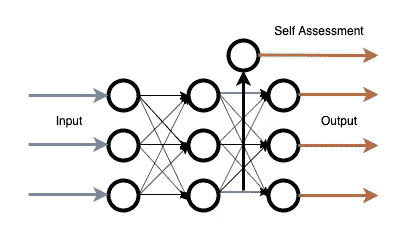

# 自我评估神经网络

> 原文：<https://towardsdatascience.com/self-assessing-neural-networks-e703b5fd4958?source=collection_archive---------30----------------------->

A diagram of a Self-Assessment layer

我发明了一种新型的神经网络层，我希望得到反馈。

新的层使网络能够评估其自身特征的可靠性。这使得它可以根据问题改变每个特征的权重。

# 问题

当正常的神经网络解决回归问题时，它只提供原始输出。它不提供对输出正确性的确定程度的度量。

如果网络不知道输出实际上应该是什么，这就是一个问题。它不会告诉你它的输出只不过是瞎猜。

这两种不确定性是有区别的:

1.  “我已经检查了我能找到的所有数据源，答案是 0.3”
2.  “我甚至不知道从哪里开始，但平均值是 0.3，所以我们就这样吧”

当代的神经网络没有捕捉到它们之间的差异，因为它们都给出相同的输出。

对我来说，这一信息显然应该是有用的。

# 解决办法

我介绍自我评估层:

自我评估层是神经网络的一种新型层。它由平行训练的两部分组成:

1.主组件，其行为类似于普通层。

2.自我评估部分，学习预测主要部分的有用性。

有许多不同的方法来实现细节。在我尝试的例子中，它是这样实现的:

主要成分是线性层。

自我评估组件像正向传递中的正常线性层一样工作。在向后传递时，它忽略它接收到的梯度并替换它。自我评估部分的新梯度来自最小二乘损失函数。该损失的目标是由主分量接收的梯度的平均绝对值。

因此，自我评估组件学习预测主组件梯度的平均绝对值。

每当主成分做出一个完美的预测，自评成分应该预测为零。每当主成分做出差的预测时，自我评估成分应该预测高的值。

自我评估部分最终成为在计算了其他特征之后剩下的不确定性的度量。

了解网络的可靠性对您在设计网络架构时做出决策非常有用。此外，这些信息还可以帮助您提高网络的准确性:

将网络层分成许多平行的层，并对每一层进行自我评估。网络应该从中获得有价值的信息以改进其自身的性能。原因如下:将一个层的特征想象为人们给下一层的人提供建议。增加一个自我评估层可以让你知道哪些顾问实际上对他们的建议有信心，哪些没有。

# 用例

自我评估层至少有两种不同的用途:

1.  来评估你的网络预测的可靠性。
2.  通过使网络能够对其自身的每项功能进行评级来提高网络的整体性能。这使得网络能够对其自身特征的不确定性进行建模，从而提高性能。

# PyTorch 中的实现

我已经在 PyTorch 中实现了自我评估层。

查看我的 Github 代码:[https://github.com/FlorianDietz/selfAssessment](https://github.com/FlorianDietz/selfAssessment)

# 背景和更多信息

这项发明是我私人研究项目的副产品。

在一次小规模试验中，使用该图层可使 MNIST 数据集略有改善。然而，这种改进太小了，无法确定它是否有用。

这个项目与我的主要研究方向不同。这就是为什么我不打算继续追查下去。然而，它似乎很有前途，完全忽视它是一种浪费。

也许这更符合其他人的研究兴趣，或者也许它只是帮助激发某人有一个相关的想法。

有关我已经进行的实验、未来可能的改进以及自我评估层的其他潜在使用案例的更多信息，请查看这篇更详细的文章:

【https://floriandietz.me/neural_networks_self_assessment/ 号

*原载于*[*https://floriandietz . me*](https://floriandietz.me/neural_networks_self_assessment/)*。*