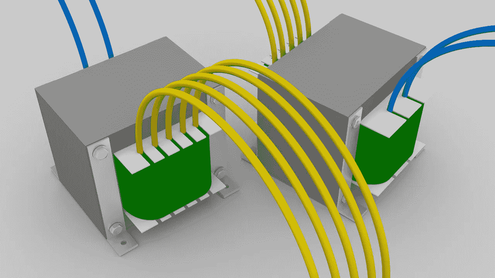
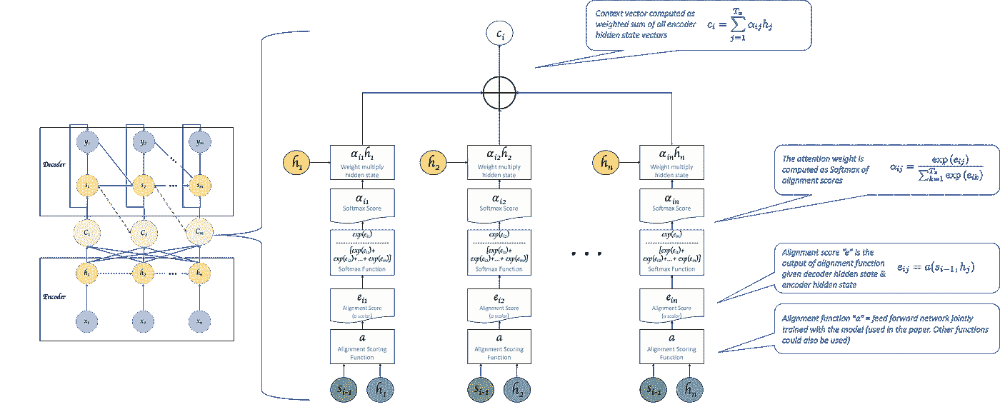
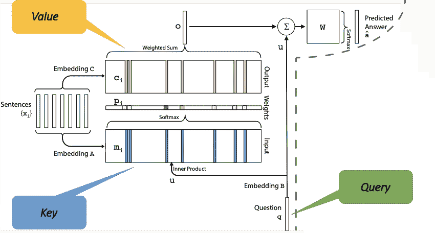
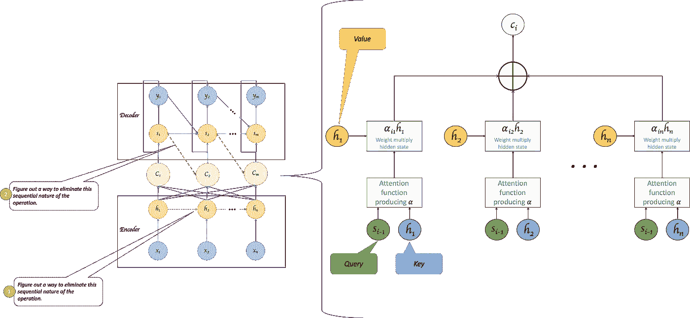
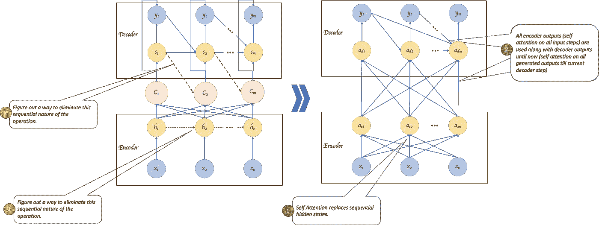
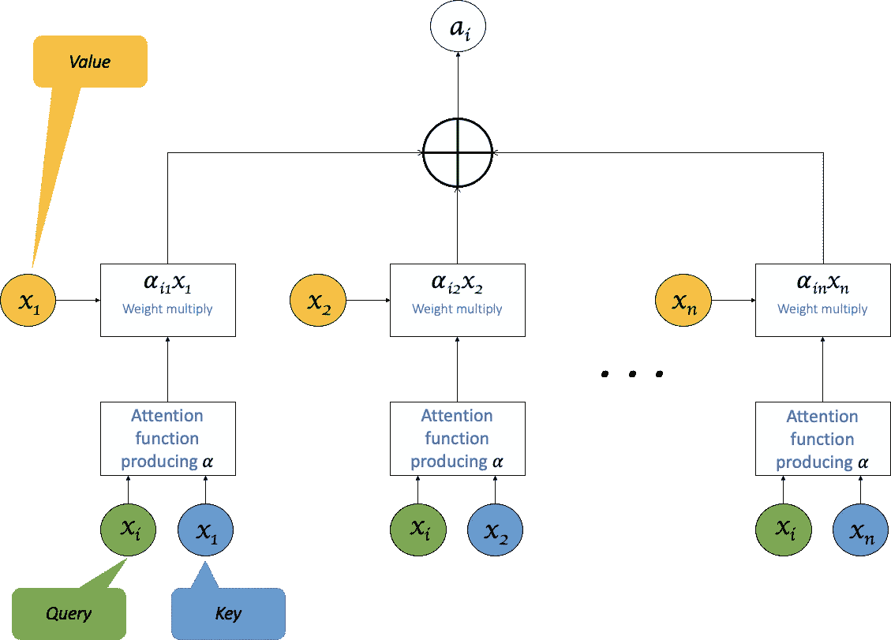
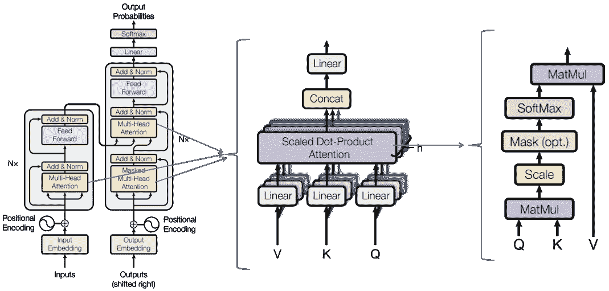
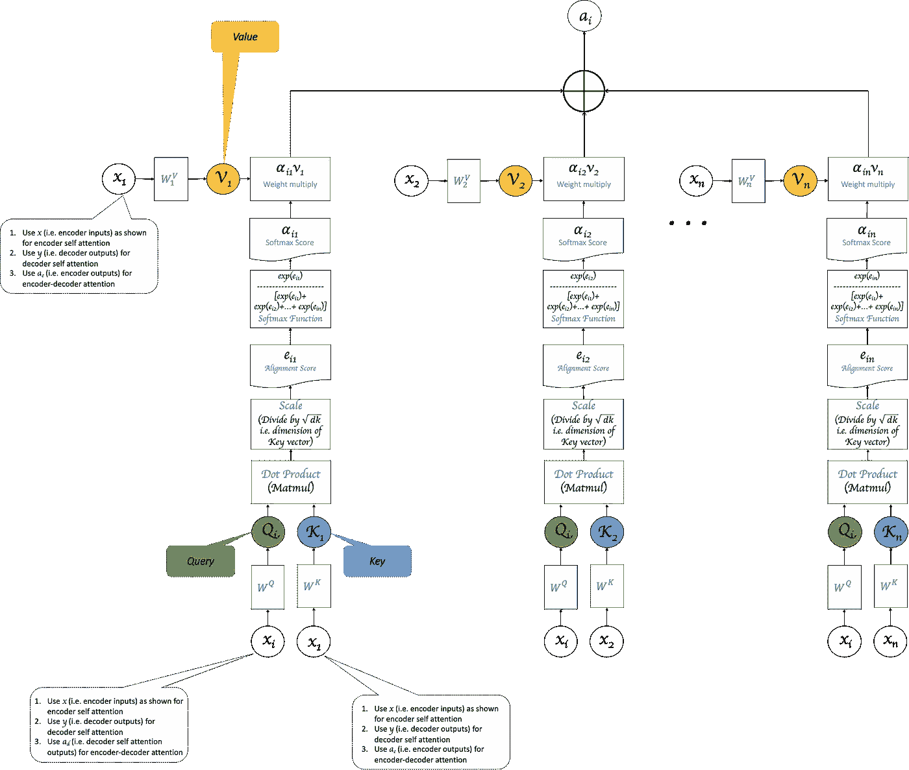

# 自我关注和变形金刚

> 原文：<https://towardsdatascience.com/self-attention-and-transformers-882e9de5edda?source=collection_archive---------11----------------------->

## 从关注到自我关注到变形金刚

这实际上是早先关于“ [**注意力**](/an-introduction-to-attention-transformers-and-bert-part-1-da0e838c7cda) 介绍”的帖子的延续，在那里我们看到了注意力架构所解决的一些关键挑战(并在下面的*图 1* 中提到)。

**Fig 1**: From “[**Introduction to Attention**](/an-introduction-to-attention-transformers-and-bert-part-1-da0e838c7cda)”, based on [paper by Bahdanau et al](https://arxiv.org/pdf/1409.0473.pdf).

一个单独的上下文向量(编码器 RNN 中的最终隐藏状态，保存整个句子/输入序列的含义)的挑战通过用为每个解码器步骤生成的基于注意力的上下文向量来替换来解决，如 ***图 1*** 所示。

但是它引入了为解码器的每一步计算单独的上下文向量的增加的计算复杂性的挑战。这超出了现有的与并行化相关的挑战。即 RNNs 中所需的处理的顺序性质——假设需要隐藏状态 h1 来计算下一个隐藏状态 h2，则这些操作不能并行进行。 ***这两种挑战都由图 1 左半部分的红色虚线*** *(在图 3 中也称为* ***)表示。***

说到顺序处理，你可能还会想，假设我们用为每个输出步骤生成的上下文向量来替换最后一个隐藏状态，我们还需要“h”状态吗？毕竟，注意力对齐应该定义给定的输出步骤应该关注输入的哪一部分，而“h”只是“x”的间接表示。它表示所有输入步骤的上下文，直到“x ”,而不仅仅是“x”。直接用“x”不是更有意义吗？

事实证明确实如此。

苏赫巴托尔等人提出的[中介绍的端到端存储网络。粘贴在 ***图 2*** 只是建议模型的单层版本。所提出的模型具有代表所有输入的“输入记忆”或“关键”向量、模型需要响应的“查询”向量(像最后的解码器隐藏状态)和“值”或“输出记忆”向量——同样是输入的表示。“查询”和“关键字”之间的内积给出了“匹配”(类似于注意力)的概率。通过概率加权的“值”向量的总和给出了最终的响应。虽然产生了良好的结果，但这消除了输入的顺序处理，代之以“内存查询”范例。](https://arxiv.org/pdf/1503.08895.pdf)

**Fig 2**: End to End Memory Networks [by Sukhbaatar et al](https://arxiv.org/pdf/1503.08895.pdf)

将此与我们之前看到的基本注意力模型进行比较，就会发现“相似之处”。虽然两者之间存在差异，但“端到端记忆网络”提出了跨句子和多次“跳跃”的记忆来生成输出，我们可以借用“键”、“查询”和“值”的概念来获得我们基本模型的概括视图。 ***图 3*** 将这些概念应用于基础模型。

**Fig 3**: Challenges in the attention model from “[**Introduction to Attention**](/an-introduction-to-attention-transformers-and-bert-part-1-da0e838c7cda)” based on [paper by Bahdanau et al](https://arxiv.org/pdf/1409.0473.pdf) to Transformers

**图 3** 还强调了我们想要解决的两个挑战。对于挑战#1，我们也许可以直接用输入(x)代替隐藏状态(h)作为密钥。但是如果我们直接使用单词嵌入，这就不是丰富的表示了。端到端的记忆网络对输入和输出记忆表示使用不同的嵌入矩阵，这更好，但它们仍然是单词的独立表示。将其与隐藏状态(h)进行比较，隐藏状态(h)不仅代表单词，还代表给定句子上下文中的单词。

有没有一种方法可以消除生成隐藏状态的顺序性，但仍然产生更丰富的上下文表示向量？

**Fig 4**: Sequence to Sequence with self attention — Moving from being “RNN based” to “attention only”

***图 4*** 说明了这样做的一种可能方式。如果我们不使用注意力来连接编码器和解码器，而是分别在编码器和解码器内部使用注意力，会怎么样？毕竟，注意力是一种丰富的表示——因为它考虑了所有的键和值。因此，我们可以使用基于注意力的替换，而不是使用 RNN 来导出隐藏状态，其中输入(x)被用作“键”和“值”。(如下面的 ***图 5*** 所示，用“x”代替“h”)。

**Fig 5**: Self Attention

在编码器端，我们可以使用自我关注来生成给定输入步长 xi 相对于输入 x1，x2…xn 中所有其他项的更丰富的表示。与基于 RNN 的编码器中的隐藏状态生成不同，这可以对所有输入步骤并行完成。我们基本上是将 ***图 4*** 左半部分的十字交叉线向下移动，如右半部分所示，从而消除代表向量之间的红色虚线。

在解码器方面，我们可以做一些类似的事情。我们将基于 RNN 的解码器替换为基于注意力的解码器。即不再有隐藏状态，并且不再为每个解码器步骤计算单独的上下文向量。相反，我们对迄今为止生成的所有输出进行自我关注，并随之消耗整个编码器输出。换句话说，我们正在将注意力应用到目前为止我们所知道的任何事物上。(注意，变压器中绝对不会出现这种情况，变压器中对生成输出和编码器输出的关注是在两个独立的层中一个接一个地完成的)。

瓦斯瓦尼等人在论文[“注意力是你所需要的全部”中介绍的“变形金刚”模型，见下面的 ***图 6*** ，做了我们上面讨论的事情。](https://papers.nips.cc/paper/7181-attention-is-all-you-need.pdf)

**Fig 6:** From [“Attention Is All You Need” by Vaswani et al.](https://papers.nips.cc/paper/7181-attention-is-all-you-need.pdf)

Transformer 模型使用“缩放点积”注意机制。它在图 6 的右侧以及图 7 中示出。比较图 7 和图 1，感受一下这两种模型在计算注意力的“方式”上的差异。(注意:“在哪里”也不同，我们将在下一步讨论)。transformer 模型还使用了所谓的“多头注意力”(Multi-Head Attention)，而不是为给定的“xi”只计算一个“ai”(注意力)，而是使用不同的 Ws 集计算多个注意力分数“ai”。这允许模型在不同的位置关注不同的“表示子空间”，类似于使用不同的过滤器在 CNN 的单个层中创建不同的特征地图。

**Fig 7:** Scaled Dot Product used in [“Attention Is All You Need” by Vaswani et al.](https://papers.nips.cc/paper/7181-attention-is-all-you-need.pdf)

**编码器**

所提出的变压器模型中的编码器具有多个“编码器自关注”层。每一层的构造如下:

1.  输入将是第一层的单词嵌入。对于后续层，它将是前一层的输出。
2.  在每一层中，首先使用该层的输入作为键、查询和值来计算多头自我关注。
3.  #2 的输出被发送到前馈网络层。这里，每个位置(即每个单词表示)都通过相同的前馈来馈送，该前馈包含两个线性变换，后跟一个 ReLU(输入向量->线性变换的隐藏 1->线性变换的隐藏 2 ->ReLU 输出)。

**解码器**

解码器也将具有多层。每一层的构造如下:

1.  输入将是到目前为止为第一层生成的单词嵌入。对于后续层，它将是前一层的输出。
2.  在每一层内，首先使用该层的输入作为关键字、查询和值(即，到目前为止生成的解码器输出，为其余位置填充)来计算多头自我关注。
3.  #2 的输出被发送到“多头-编码器-解码器-注意”层。这里，使用#2 输出作为查询，使用编码器输出作为键和值，来计算另一个注意。
4.  #3 的输出被发送到类似编码器中的位置式前馈网络层。

虽然摆脱顺序性在很多方面都有帮助，但它有一个关键的优势——知道单词在输入序列中的顺序。如果没有它，出现在同一个句子中不同位置的同一个单词可能会以相同的输出表示结束(因为它将具有相同的键、值等)。因此，该模型使用“位置编码”——基本上是一个表示位置的向量，它被添加到编码器和解码器堆栈底部的输入嵌入中。Shaw 等人的另一篇[论文在这里](https://arxiv.org/pdf/1803.02155.pdf)提出了一种基于相对位置的替代方案，它比原始 Transformer 模型论文中建议的绝对位置编码实现了更好的结果——如果您能花时间在位置嵌入上，我建议您研究一下。

希望这在某些方面有所帮助。