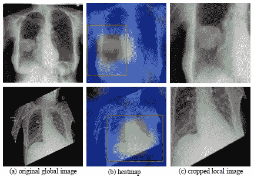
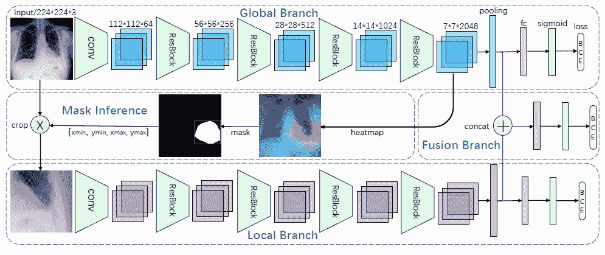
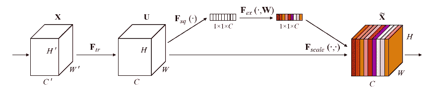
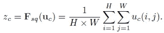
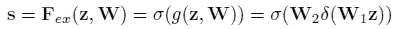
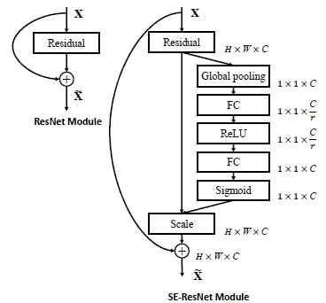
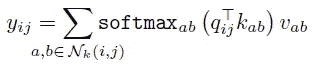
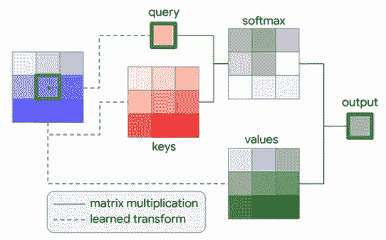
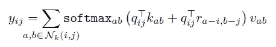

# 计算机视觉中的自我注意

> 原文：<https://towardsdatascience.com/self-attention-in-computer-vision-2782727021f6?source=collection_archive---------1----------------------->

自从引入 [Transformer networks，](https://arxiv.org/abs/1706.03762)深度学习中的注意力机制在机器翻译和 NLP 社区中非常受欢迎。然而，在计算机视觉中，卷积神经网络(CNN)仍然是标准，自我关注刚刚开始慢慢进入研究的主体，要么补充现有的 CNN 架构，要么完全取代它们。在这篇文章中，我将试图阐明视觉自我关注的最新发展，并强调其可能的好处。对于这项任务，我将提交三篇不同的论文(包括一篇被即将举行的 NeurIPS 2019 会议接受的论文)，在我看来，这些论文很好地说明了计算机视觉中自我关注的最新水平。

我将提交的第一篇论文由 Guan 等人[1]撰写，来自医学图像分析社区，这是我的家。与自然图像(照片)不同，医学图像通常在外观上非常相似。它们是使用相似的采集参数从标准化位置采集的。对于放射科医生来说，阅读图像的**经验主要来自于知道准确地在哪里寻找**，以便找到某种病理。因此，毫不奇怪，注意力在医学图像分析中扮演着重要的角色，甚至比其他研究领域更重要。

该论文试图提高胸部 X 射线图像上**自动胸部疾病分类的性能。以前，已经提出了仅通过查看全局图像来检测和分类胸部 X 射线上的病理的网络。因此，通过使用**二进制交叉熵** (BCE)作为损失函数或一些其他标记机制(例如，编码器-解码器框架使用 LSTM 作为解码器来捕获标签之间的相互依赖性[2])来执行**多标签分类**。使用整个 X 射线图像进行分类的问题在于，在医学图像中，与整个图像相比，病变区域可能非常小，甚至可能位于沿着边界的某处，导致分类器的大量噪声并降低检测精度。此外，胸部 X 射线图像经常会出现错位(例如图 1 第二行中的例子)。这种未对准导致图像周围的边界不规则，并且还可能对分类产生负面影响。**

在论文中，作者使用**递归硬注意**(即硬自我注意)来提高检测精度，方法是裁剪掉图像的有区别部分，并将全局图像和裁剪部分分类在一起(左侧的整个图像和右侧的裁剪部分见图 1)。

Figure 1: Two training images from [1] including heatmaps extracted from a specific convolutional layer in the network in as well as the resulting cropped image. Both the global and the cropped image are used for classification.

该网络由三个分支组成:

*   **全局分支**处理整个图像并确定裁剪 ROI，
*   **局部分支**展现注意机制，处理裁剪后的图像，
*   **融合分支**连接全局和局部分支的汇集输出，并使用密集层执行最终分类。

**所有分支都是分类网络**，最终执行多类分类(如图 2 所示)以预测病理的存在。除了分类之外，全局分支还用于生成确定裁剪区域的热图。热图是通过对某个高级层上通道的最大值进行计数而生成的。则生成与热图大小相同的遮罩。如果在某个位置 *(x，y)* 的每通道最大化热图的值大于某个阈值，则在该位置掩码被分配为 1。否则，掩码的值将为 0。然后，**确定裁剪区域，使得所有掩码值为 1 的点都在裁剪区域内**。然后，图像的裁剪部分通过局部分支运行。此外，两个分支的输出在融合分支中融合，以执行附加分类。

网络分三步训练:

*   ImageNet 预训练的全局分支的微调。
*   屏蔽推断以获得裁剪的图像并执行局部分支的微调。因此，全局分支中的权重是固定的。
*   连接全局和局部分支输出以及微调融合分支，同时冻结其他分支的权重。

融合分支用于产生模型的最终分类结果，因为它比其他两个分支执行得更好，正如预期的那样。

Figure 2: Architecture of the AG-CNN presented in [1] with a ResNet-50 backbone as an example. The local lesion patch is cropped from the global image using the heatmap (attention) layer. BCE represents binary cross-entropy loss.

为了从注意力的角度理解这个模型在做什么，我们必须首先知道软注意力和硬注意力之间的区别。本质上，**注意力根据一些外部或内部(自我注意)提供的权重对网络**的某些特征进行重新加权。因此，**软注意允许这些权重是连续的，而硬注意要求它们是二进制的**，即 0 或 1。这个模型是硬注意的一个例子，因为它裁剪了图像的某个部分，因此本质上是重新加权原始图像，使得裁剪部分的权重为 1，其余部分的权重为 0。

hard attention 的主要**缺点是不可微**，不能端到端训练。相反，作者使用某一层的激活来确定 ROI，并在复杂的多阶段过程中训练网络。为了训练**注意门**，我们必须使用软注意(例如使用 sigmoid 或 softmax)。接下来我们将看看一些软注意模型。

# 压缩和激励网络

胡等人[3]没有使用硬注意，而是根据特征图的裁剪来重新校准权重，而是通过使用软自注意来模拟卷积特征的通道之间的相互依赖性，对 CNN 的某一层中的通道式响应进行重新加权。为此，作者引入了**挤压和激励模块**(见图 3)。

Figure 3: Squeeze-And-Excitation block presented in [3].

挤压和激励块工作如下:对于从 *X* 到 *U* (例如卷积)*，*的特征 *F_tr* 的任何变换，存在聚集跨空间范围的全局特征响应的变换*F _ sq*(*H*， *W* )。这是挤压操作。挤压操作之后是激励操作 *F_ex* ，这是一种自门控操作，可构建通道权重响应。 *F_tr* 的输出随后按通道乘以激励结果(这在图 3 中表示为 *F_scale* )。挤压操作的数学描述是

因此 *u_c* 是运算 *F_tr* 的输出。挤压操作通过使用全局平均池创建全局嵌入。也可以使用全局最大池，尽管作者指出平均池会略微提高整体性能。另一方面，激励模块描述如下

因此，激励将挤压块的输出乘以学习到的权重 *W1，*将输出通过 ReLU 函数 *δ* ，将输出乘以另一组权重 *W2* ，并在最后使用 sigmoid 函数以确保得到的通道权重为正。据此， ***W1* 通过因子 *r*** (可视为超参数)*降低维度，而 *W2* 再次将其增加到原始通道数。最后，F_tr 的信道特征响应乘以从激励块获得的权重。这可以被视为使用全局信息的通道上的自我关注功能。*

*挤压和激励模块背后的**主要思想是在网络**的决策过程中包含全局信息；卷积只查看某个半径内的局部空间信息，而挤压和激发模块聚集来自整个感受野的信息。作者的一个有趣的观察是，在网络的早期阶段，不同类别的激励权重相对相似，在后期阶段变得更加具体。这与通常的假设相关，即**较低层学习输入的更多一般特征，而较高层的辨别能力越来越强**。此外，挤压-激励模块在网络的最后一级没有太大意义，因为大多数激励变为 1。这可以通过以下事实来解释，即网络的最后一级已经包含了大部分全局信息，并且没有通过挤压和激励操作引入新的信息内容。*

***挤压和激励方法的主要优势是它非常灵活**:作者提到了在广泛使用的架构中的集成，如 ResNet(见图 4)、Inception 或 ResNeXt。在实践中，该块可以被添加到网络的每一级，或者只是在特定的级。此外，在可学习参数的数量方面，它只引入了**一点点开销。例如，与已包含 2500 万个参数的原始 ResNet 相比，使用挤压和激励模块的 SE-ResNet-50 仅使用了约 250 万个附加参数。因此，这仅增加了 10%的复杂性。***

**

*Figure 4: The original ResNet block (left) and the Squeeze-And-Excitation ResNet block (right) as presented in [3].*

*在该论文中，作者给出了通过挤压和激励块增强的训练结构的大量例子。特别是，他们能够在 ILSVRC 2017 挑战赛中实现最先进的分类性能，前 5 名的误差仅为 2.251%。*

# *独立的自我关注*

*我将提交的最后一篇文章是 NeurIPS 2019 提交的文章，它通过使用独立的自我关注模块**，而不是仅仅通过自我关注来增强卷积层**，将 CNN 中的自我关注概念进一步发展。事实上，作者提出了一个自我注意层，它可以用来代替卷积，同时减少参数的数量。*

*让我们回顾一下卷积运算来激励替换。**卷积运算包括在位置 *(i，j)* 将一定大小(例如 3×3)的权重矩阵与每个邻域相乘，并在空间上对结果求和**。这使得不同空间位置之间的重量分担成为可能。此外，权重的数量与输入大小无关。*

*与卷积类似，论文提出的自我注意层也作用于 *(i，j)* 周围的一个小邻域，称为**记忆块**。对于每个内存块，单头注意力计算如下:*

**

*因此， *q_ij=W_q x_ij* 是查询， *k_ab=W_k x_ab* 是关键字， *v_ab=W_v x_ab* 是从位置 *(i，j)* 及其邻域处的特征作为线性变换计算的值。矩阵 *W* 是学习转换。从公式中可以看出，变换后的中心像素 *x_ij* 用作查询，在邻域内对键和值求和。softmax 函数也应用于 logits，以获得权重，然后乘以这些值。如果你不知道**查询、键和值**是什么，那就看看[这篇文章](https://lilianweng.github.io/lil-log/2018/06/24/attention-attention.html)。作者在本文中使用了**多头注意力**，简单地说就是将像素特征沿深度方向分成大小相同的 *N* 组，用不同的矩阵 *W* 分别计算每组的注意力，并将结果连接起来。图 6 提供了视觉自我注意块的图形描述。*

**

*Figure 6: Local attention layer with spatial extent k=3 in [4].*

*使用上述方法的一个问题是，在关注块中没有编码位置信息，因此该公式对于各个像素的排列是不变的。位置信息对于视觉任务很重要:例如，如果你想检测人脸，你需要知道哪里可以找到嘴、鼻子、耳朵等等。在最初的 transformer 论文[5]中，作者使用位置的正弦嵌入作为附加输入。然而，在[4]中，**相对 2D 位置嵌入**被使用，因为它们对于计算机视觉任务具有更好的准确性。这些相对嵌入通过计算位置 *(i，j)* 到每个邻域像素 *(a，b)* 的相对距离来获得。这些距离分为行和列距离 *r_a-i* 和 *r_b-j* 。这些嵌入被连接成矩阵形式，并乘以查询 *q_ij* ，如下所示:*

**

*这确保了由 softmax 函数计算的**权重受到键和查询**的距离和内容的调制。*

*从上面的描述我们可以看出，视觉自我注意是局部注意的一种形式。注意层只关注内存块而不是整个特征图。这种方法的优点是参数的数量大大减少，并且不同空间位置之间的权重是共享的。作者提到，他们的自我注意网络在训练和推理方面仍然比他们的 CNN 同行慢，但是他们将此归因于高度优化的卷积核以及注意力层缺乏优化的硬件。*

*作者还介绍了他们在 ImageNet 上通过用他们的自我注意块代替 ResNet 中的 3×3 卷积而获得的一些结果。请注意，它们保留了 1x1 卷积(基本上是按像素计算的全连接层)和卷积干(网络中的前几个卷积层)不变。有了这些变化，它们在所有测试架构(ResNet-26、ResNet-38 和 ResNet-50)中的表现都优于基准(标准 ResNet ),同时使用的触发器和参数减少了 12%和 29%。*

# *参考*

*[1]关，庆吉，等.“像放射科医生一样诊断:注意力引导卷积神经网络在胸部疾病分类中的应用” *arXiv 预印本 arXiv:1801.09927* (2018)。*

*[2]姚，李等，“利用标签间的依赖关系从零开始学习诊断” *arXiv 预印本 arXiv:1710.10501* (2017)。*

*[3]胡、杰、、。"挤压和激励网络."*IEEE 计算机视觉和模式识别会议论文集*。2018.*

*[4] Ramachandran，Prajit 等，“视觉模型中的独立自我注意” *arXiv 预印本 arXiv:1906.05909* (2019)。*

*[5]瓦斯瓦尼、阿希什等人，“你所需要的只是关注。”*神经信息处理系统的进展*。2017.*