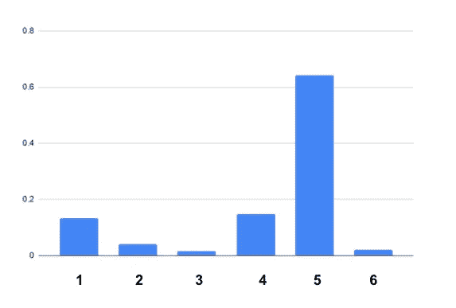

# 自动驾驶汽车—本地化

> 原文：<https://towardsdatascience.com/self-driving-car-localization-5323c7bc6703?source=collection_archive---------22----------------------->

## 自动驾驶汽车如何知道自己在任何给定时间的位置？

Image by [Pixabay](https://pixabay.com/illustrations/car-automobile-3d-self-driving-4343634/)

一直让我着迷的人工智能项目之一就是自动驾驶汽车。这是我学习更多深度学习和人工智能的主要动机。

自动驾驶汽车要实现其他功能，最重要的事情之一就是本地化。不仅是自动驾驶汽车，移动机器人也要先预测它在哪里。自动驾驶汽车的所有其他功能都取决于它的真实位置。在本文中，我们将尝试找出如何使用蒙特卡洛定位来预测汽车的位置。

知道物体或汽车位置的一种方法是使用 GPS。通过打开智能手机中的 GPS 服务，我们可以在卫星的帮助下轻松地看到我们在世界上的位置。但是使用 GPS 作为定位工具有一个问题。GPS 的不确定性接近 10 米。如果一辆自动驾驶汽车有这么大的误差，它很可能会撞上路边的一座建筑，认为它是道路的一部分。因此，自动驾驶汽车使用摄像头、激光、红外传感器来识别其在已知路线图上的位置

为了便于理解，让我们考虑一辆只做 1D 运动的汽车，它的世界由红色和绿色方块组成。

**Figure 1: World consists of blocks of the green and red color [image by author]**

一开始，当汽车没有用传感器从环境中获取任何数据时，它不知道自己在哪里。所以不确定性的程度是最高的，它不知道它在哪里。如果我们试着画出它所在位置的概率分布，它会是这样的:

**Figure 2**: **Probability of the car to be in block i (1,2,…,6) [image by author]**

在这里，我们可以看到每个位置都有 0.167 的概率。这意味着汽车可以在 6 个街区中的任何一个。

现在让我们假设传感器已经进行了一次测量，它以 80%的把握感知到了**绿色**(由于传感器误差，测量有时可能是错误的)。那么你现在会相信你的车在那些绿色街区的前面。因此，我们将 0.8(确定性)乘以与我们的测量相匹配的块的先验概率。在块颜色与测量颜色不匹配的情况下，我们将先验乘以 0.2。归一化后，概率分布如下所示:

**Figure 3**:**Probability of the car to be in block i (1,2,…,6) [image by author]**

测量后，你的信念改变了，现在你相信你在绿色方块前的概率(0.2672)比在红色方块前的概率高。红色块仍有一些剩余概率(0.0668)。这是因为你的传感器不是 100%准确。所以有很小的可能是你的传感器出错了，而你实际上是在一个红色方块的前面。这些小概率用图表表示。如果传感器是 100%准确的，你将绝对肯定你是在一个绿色块的前面，红色块的概率将是 0。

上述计算基于贝叶斯法则。

在感知颜色之前，我们有一个先验概率分布 P(Xi) →图表中表示的每个块的概率。在我们进行测量后，我们有把握地感觉到了颜色。P(Z | Xi)=0.8 →如果我们在块 Xi 中，感知正确颜色的概率是 0.8，这对于所有具有与测量颜色匹配的颜色的块是恒定的。对于具有不同颜色的块，其值为 0.2(对于不同的传感器可能不同)。因此，进行测量后的后验概率是 P(Xi | Z)=进行测量 Z(感知颜色)后处于位置 Xi 的概率→ P(Xi)* P(Z | Xi)

我们正是这么做的。我们随后将这些值标准化，使总概率等于 1。

现在考虑运动。我们假设这是一个循环的世界。如果一辆车从第六个街区向右移动，它会停在第一个街区。汽车是借助运动的机械部件运动的，这也有不确定性。让我们假设汽车一次移动一个街区，它的移动确定性为 0.9。这意味着，如果它试图移动一个街区，有 90%的可能性它实际上移动了期望的一个街区，有 10%的可能性它从未移动并停留在当前位置。

如果运动是 100%准确的，向特定方向移动将意味着概率分布也将向该方向移动一个街区。

**Figure 4**: **Probability of the car to be in block i (1,2,…,6) [image by author]**

这里我们假设世界是圆形的。所以当我们绝对确定地移动时，我们的概率分布向那个方向移动。原因是，如果目前很可能在第四街区发现汽车，那么在向右移动一定距离后，很可能在第五街区发现汽车。所以概率分布随着运动而变化。

但是如果我们没有 100%确定的运动，那么我们就必须使用全概率来预测运动后的最终概率分布。在运动之后，一个块的概率分布可能来自它的前一个块，确定性为 0.9，如果汽车根本没有运动，当前的分布也可能不变，确定性为 0.1。所以新的概率分布是这两个的加权和。

P(Xi)= P(Xi-1)*P(动议)+P(Xi)* P(暂停)

因此，如果我们以 0.9 的概率移动，那么概率分布应该是:

**Figure 5**: **Probability of the car to be in block i (1,2,…,6) [image by author]**

这里我们可以看到，现在的分布更为分散。我们可以很容易地注意到，在每次测量后，不确定性水平下降，但在运动后，不确定性水平增加或保持不变。

现在让我们进行多次测量，并测量我们是否能在这种方法中实际确定我们的位置。

**Figure 6**: **1D world comprising green and red blocks [image by author]**

让我们从自动驾驶汽车的角度来思考。

**动作:**

1.它感觉到一个绿色的障碍物

2.它向右移动一个街区

3.它感觉到红色

4.它移动了一个街区

5.它感觉到红色

6.它不动

7.它感觉到红色

8.它向右移动一个街区

9.它感觉绿色

10.它移动了一个街区

现在告诉我，根据先前的行动，这辆车现在可能在哪里？

是的，现在应该在第五街区。让我们看看计算显示了什么。

根据动作，测量向量=['绿色，'红色'，'红色'，'红色，'绿色']

运动矢量=[1，1，0，1，1]

我写了一个代码(下面给出了链接)，如果你把这些向量，它会给你概率分布。

代码链接:[https://github . com/ishtiakm/self _ driving _ car/blob/master/senseandmov1d . py](https://github.com/ishtiakm/self_driving_car/blob/master/senseandmov1D.py)

**Figure 7: The probability of the car being in each of these blocks**

概率分布在第 5 块最大。

**Figure 8: Probability of the car to be in block i (1,2,…,6) [image by author]**

经过多次测量后，赛车对自己的位置非常确定，我们可以看到它的预测与我们的相符。

上述方法实际上是自动驾驶汽车在现实世界中识别其位置的核心算法。在现实中，世界不仅是绿色或红色的，运动也不是一维的。真实世界引入了更多的噪音和更不利的情况，如雨、雪等。但是我们在这里学到的算法保持不变。汽车已经从谷歌地球上知道了它的“世界”列表(见代码)。它的相机拍摄图像，并将其用作测量。在匹配这两个之后，它更新它的概率分布，并了解它在哪里以及它是否在车道的右侧。

这个逻辑也可以在具有绿色和红色块的 2D 世界中实现。尝试通过为 1D 编辑给定代码的 1D 函数来实现它。下面也给出了 2D 世界代码的链接。但是试着自己实现，自己摆弄。我向你保证这是相当惊人的。

代码链接:[https://github . com/ishtiakm/self _ driving _ car/blob/master/senseandmov1d . py](https://github.com/ishtiakm/self_driving_car/blob/master/localization2D.py)