# 印度道路上的自动驾驶汽车

> 原文：<https://towardsdatascience.com/self-driving-car-on-indian-roads-4e305cb04198?source=collection_archive---------5----------------------->

## ***计算机视觉引导的深度学习网络&机器学习技术打造全功能自动驾驶汽车。***

*“如果你认识到自动驾驶汽车可以预防事故，人工智能将有助于减少世界上主要的死亡原因之一。”* ***—马克·扎克伯格***

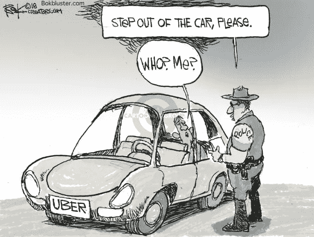

*Cartoon Courtesy:* [*http://www.cartoonistgroup.com/store/add.php?iid=169867*](http://www.cartoonistgroup.com/store/add.php?iid=169867)

如果像优步& Ola 这样的按需乘车服务已经在运输理念上进行了一场革命，那么自动驾驶汽车将是下一个撼动整个运输行业的复兴。这个新想法正在成为价值数万亿美元的生意，比亚马逊和沃尔玛加起来还要大。据世界经济论坛称，汽车行业的这一巨大飞跃将通过减少车祸数量、减少紧急服务需求、节省工时、降低汽车拥有成本&每年带来 3.1 万亿美元的收入，同时还能通过缩短通勤距离和减少碳排放间接节省成本。

最重要的是，一旦你不再需要方向盘和司机，就有无限的设计可能性。汽车可以是小巧的蛋形或箱形的活动房屋，它们提供的不仅仅是移动性。截然不同的汽车设计意味着截然不同的道路。道路本身可以建议一条更快、更安全的路线，嵌入车辆和基础设施中的智能设备可以即时通信以适应交通。

自动驾驶汽车比赛中值得注意的参赛者是:

*   **特斯拉**
*   **Waymo**
*   **巡航**
*   **Mobileye**
*   福特、通用等。

特斯拉的 Autopilot 和英特尔的 Mobileye **的一些版本使用高度可信的视觉，基于摄像头的自动驾驶技术，**与激光雷达(LIDAR)技术相反。

视觉技术，

*   **能在环境下工作，激光雷达不行。恶劣的天气**
*   比激光雷达便宜多了
*   对**车辆设计**不那么突兀。

但是为了让它工作，视觉技术需要巨大的计算能力来处理所有的视觉数据。这就是人工智能算法发挥作用的地方。在这个项目中，我使用了以下人工智能子领域来解决汽车的单个功能，以建立一个功能齐全的汽车。

来预测，

*   **转向角度:**采用深度学习
*   **加速和刹车:**计算机视觉&深度学习
*   **齿轮和离合器:**使用机器学习

Self Driving System in Action. All Controls are driven by ML/ DL Prediction.

**这个项目的源代码可以在** [**这里找到**](https://github.com/AdroitAnandAI/Self-Driving-Car-on-Indian-Roads)

**从** [**我的 Kaggle 源下载印度驾驶视频资料。**](https://www.kaggle.com/ananduthaman/self-driving-car-on-indian-roads)

# **数据收集**

有几个公开可用的驾驶数据集，但是**每个数据集都有这样或那样的缺点**，如下所示:

a) Sully Chen 的[驾驶数据](https://github.com/SullyChen/driving-datasets) (25 分钟)

*   仅包含转向角作为参数
*   需要更多的参数，来建造一辆功能齐全的汽车

b) Comma.ai [研究数据](https://github.com/commaai/research) (7 小时)

*   包含转向、加速和制动。没有“齿轮”数据。图像质量较差
*   他们的大部分驾驶数据都是在车道分离的高速公路上，那里弯道很少，车辆也少，这与印度的道路相反。

c)百度的[appolo 开放平台](http://data.apollo.auto/?locale=en-us&lang=en)(巨大)

*   包含所有复杂的激光雷达和 3D 数据
*   庞大的数据库:**庞大得不合理**要在 PC 上处理

**所有可用的开放数据集都记录在西方设置**中，那里的车道很宽，标志&分隔线也很清晰。但是**对于人工智能算法来说，**印度的道路比西方的道路更难**，因为没有足够的印度路况数据。**因此，在西方数据集上训练的算法在印度条件下可能表现不佳。

**上述数据集都不适合**在个人电脑上制造一辆功能齐全的汽车。此外，我很好奇人工智能算法如何在印度环境中工作。因此，我决定录制自己的视频。首先，我把一部 iPhone 挂在车外的挡风玻璃上，沿着印度狭窄弯曲的道路行驶。为了录制视频，我试图使用 [Nexar AI dashcam 应用程序](https://www.getnexar.com/)，但我的尝试失败了，因为它会自动检测并只存储碰撞帧。然后，我使用 iPhone 内置的录像机，沿着多条线路行驶了大约 1-1.5 小时。

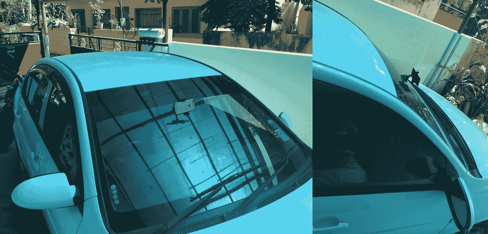

External mounted dash-cam to record driver view video

但是录制的视频不足以训练一个自动驾驶系统。为了制造一辆功能齐全的汽车，汽车驾驶员在驾驶时提供的所有基本输入，即必须预测转向角、加速度、制动、离合器和档位。因此，训练数据也需要具有所有这些参数。

## 汽车控制台界面

为了记录驾驶时的转向角，我们可以使用汽车的车载诊断系统，以每毫秒一次的速度找到转向角。同样，我们可以破解汽车的机械和电子设备，以获得其他参数，如加速度，制动，离合器和齿轮等。作为一个生成训练数据的黑客，在不篡改汽车 OBD 的情况下，**我用 Python 编写了一个汽车控制接口，记录来自键盘的扫描码。这个界面是用来模拟驾驶的，就像你用键盘玩电子游戏一样。**

录制的视频和控制台界面是并排运行的，所以我可以使用箭头键来模拟在录制的视频中看到的驾驶。在驾驶模拟过程中，使用了七个关键控件来计算参数:

> 向上和向下箭头:加速&刹车
> 左右箭头:方向/转向角度
> ‘a’:升档
> ‘z’:降档【T8’‘g’:空挡

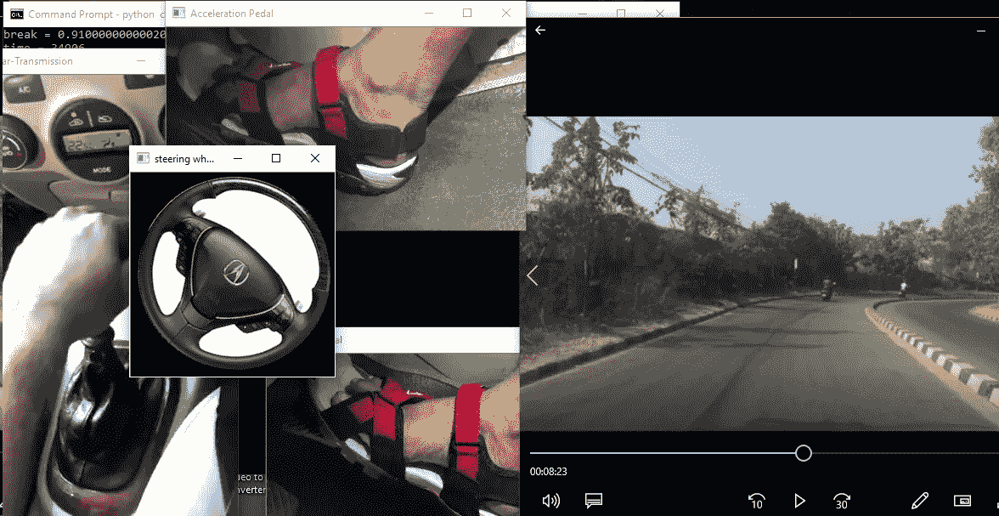

Car Console Interface & Recorded Video running side-by-side. Input from keyboard is driving all the console controls (Left) based on the turns and traffic in recorded video (Right)

接口程序将视频中每一帧的转向角、加速度、制动和档位值写入输出文件。**如果视频以 30 fps 的速度录制，则必须每隔 1000/30 = 33 ms** 循环写入参数值。要获得这种准确性有点困难，因为它取决于写入输出的“while”循环的执行时间。您可能需要每 30–33 毫秒写一次，才能与以 30 fps 录制的视频正确同步。**将“写入频率”视为超参数**，因为它取决于机器速度。您可以通过进行 1 分钟的驾驶模拟来调整写入频率，并检查它离 60x30 = 1800 帧有多远。在下面的代码中，您可以以纳秒级的精度调整“writeFrequency”参数。

***Car Console Interface in Python***

# **数据预处理**

自我录制的驾驶视频需要一些预处理步骤，然后才能传送到网络。按顺序使用以下软件:

a) [无损剪切](https://www.videohelp.com/software/LosslessCut) —无损剪切相关视频。

b) [随时视频转换器](https://www.any-video-converter.com/products/for_video_free/) —调整视频大小以减少数据。

c) [视频到 JPG 转换器](https://www.dvdvideosoft.com/products/dvd/Free-Video-to-JPG-Converter.htm) —从视频中提取帧。

使用汽车控制台界面生成的提取视频帧和相应驾驶控制参数的印度驾驶数据集上传到 [Kaggle](https://github.com/AdroitAnandAI/Self-Driving-Car-on-Indian-Roads) 。**提取的帧与相应的参数值**(由模拟器生成)一起输入卷积神经网络进行训练。

如果你想使用一个开放的数据集，你必须写一个程序来解析给定的文件格式。下面的解析器代码读取. h5 文件，以及来自 [comma.ai 数据集](https://github.com/commaai/research)的参数值。上述预处理步骤，例如“帧尺寸调整”可以在下面的解析器代码本身中实现。

Parser code for .h5 files in comma.ai

# **模型构建**

到目前为止，我们已经有了包含帧图像和相应参数值的训练数据集，即转向角、加速度、制动和档位。

**为了从图像中预测转向角度**，**我们可以使用深度学习(CNN)或计算机视觉**技术。这两种方法的可行性将在后面的章节中进行分析。但是即使是人，也不能从单个帧中预测刹车或加速。因此，**这种帧反馈 CNN 模型不足以预测加速度或制动参数**，因为我们遗漏了一个**重要信息，即帧的“序列”。**

为了解决“序列”问题，我们可以使用

*   复杂的 CNN-RNN 架构
*   计算机视觉辅助技术。

**我们选择了 CV 技术来量化“序列”信息**，因为它可以很容易地从记录的视频中计算出来。这种量化值用于辅助加速和制动预测。**可以根据所有剩余参数**预测档位，即转向、加速、制动&序列信息。因此，使用了机器学习技术。离合器可以很容易地根据档位计算出来。

# a)转向角预测

**为了预测转向角度，CNN 网络有大量的信息可以学习**，例如车道线的角度、道路的曲率、标志牌、其他车辆和行人的转向角度、道路中间分隔带的曲率等。此外，还有计算机视觉技术来寻找道路上车道线的角度，这反过来有助于决定转向角度。下面我们介绍两种方法来分析更好的西装。

# # **使用霍夫变换**

为了估计所需的转向角度，**可以对提取的帧应用霍夫变换，以使用 OpenCV 找到“车道线”**的系数& theta(由 [Github 项目](https://github.com/nalinirachit/SelfDrivingCar_Term1-LaneLines)提供)

图像处理步骤的顺序如下所示:

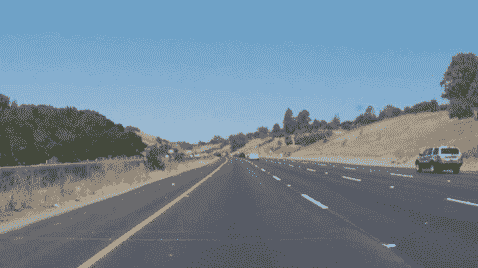

1\. **Input image 2\. Greyscale 3\. Gaussian Blur, 4\. Canny Edge Detection 5\. Mask 6\. Hough lines 7\. Lane Lines**

霍夫变换可以帮助**从图像中的点扩散**估计线条。

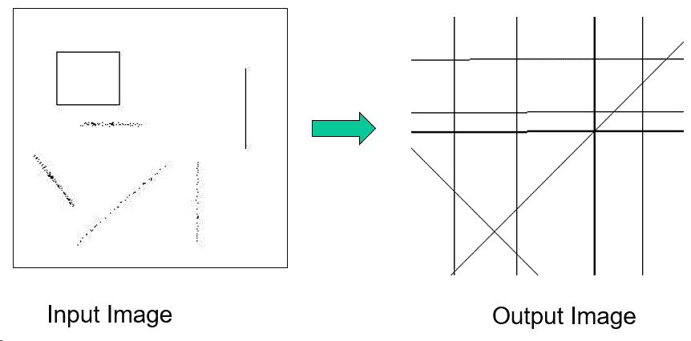

**Hough Transformation Implementation for Polygons**

**边缘检测后断开的车道线也可以通过分析累加器阵列的蝶形宽度来检测**，如下所示:

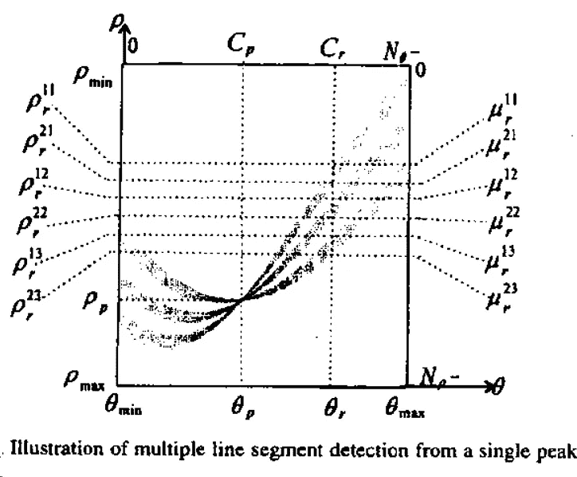

霍夫空间中正弦波的**交点将给出待估计的线的参数** **。**对于每一帧，估计车道线的角度将有助于确定转向角度。在下面的**可视化中，对应于 3 条线的三个点扩散云生成 3 个正弦波**，在右侧霍夫空间中有 3 个交点。

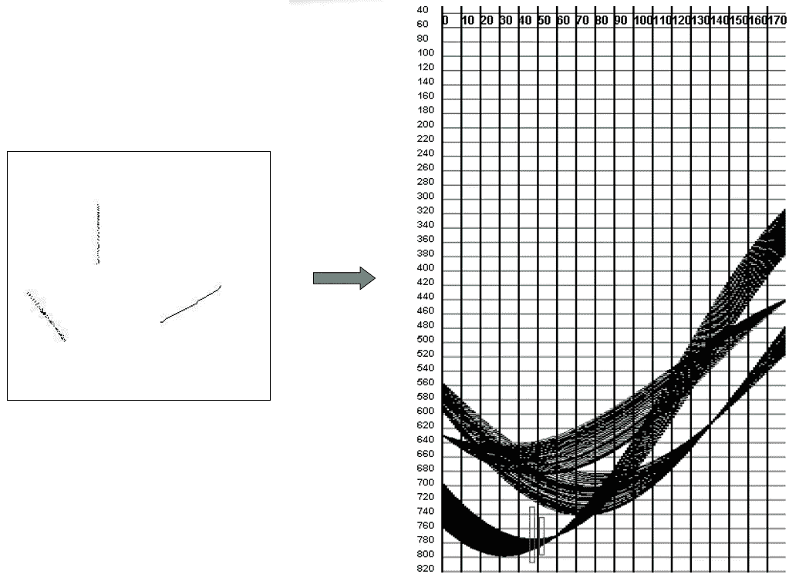

**Matlab Implementation: Multiple Lane Line Detection from Edge Detected Point Spreads**

但是，**上述计算机视觉技术**不适合制造我们的自动驾驶汽车，**因为我们想在印度道路上自动驾驶，那里可能没有车道线或分隔线这样一致的信息。**因此，我们使用鞋底深度学习来预测转向角度。

# # **使用深度学习模型**

我们需要预测每个单独帧的转向角度。我们可以采用一组转向角和相应的帧图像来馈送 CNN 模型，并尝试最小化 MSE 训练损失。经过多次迭代和历元训练的模型，可以用来预测转向角，即使是在不平坦的印度环境中。为此，使用了英伟达用于自动驾驶汽车的端到端 CNN 架构。[1]

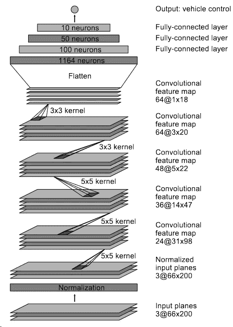

Nvidia’s CNN architecture: contains 27 million connections & 250 thousand parameters

**模型可解释性:**理解深度学习模型内部正在发生的事情是很重要的。对于 CNN 模型，我们可以将隐藏层可视化，以了解单个过滤器拾取的特征。

CNN Visualization Code

输入图像帧和隐藏层可视化输出如下所示:

Input Image Frame

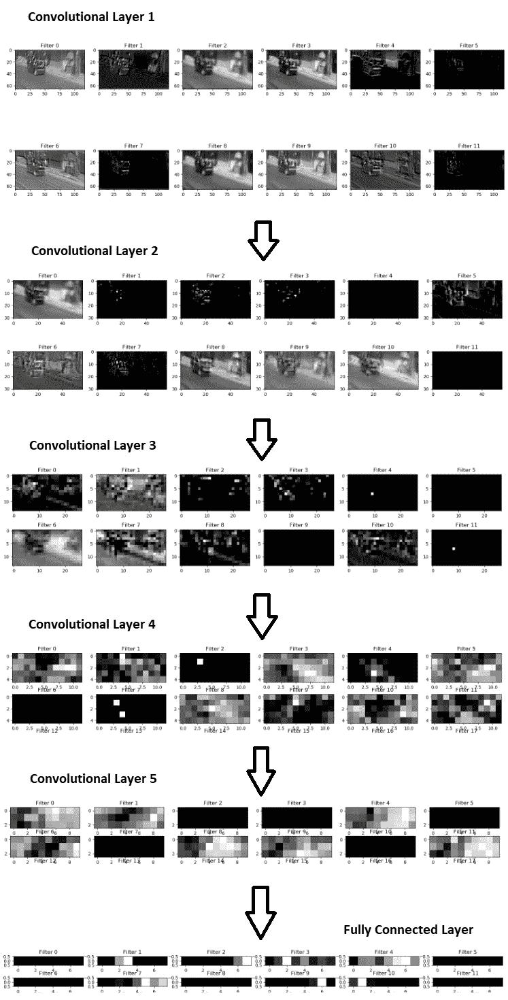

CNN Hidden Layer Visualization for different filters

三个驾驶控制参数，即转向角、加速度和制动在不同的车型上进行训练，并在运行时同时执行**以驱动汽车。**训练一个控制参数的代码如下。

To Train the ‘Acceleration’ control variable. Similar training is done for Steer & Brake.

# b)加速和制动预测

由于加速和刹车固有地依赖于视频中的帧序列，我们借助计算机视觉来预测这两个参数。

**光流**表示由观察者和场景之间的相对运动引起的场景中物体和边缘的明显运动。在录制的视频中，我们可以分析强角点的光流，通过先前的帧来估计未来的帧流。

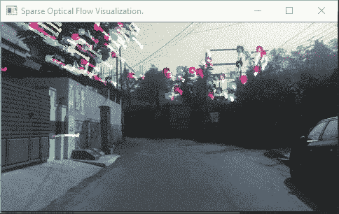

Visualization of Sparse Optical Flow along narrow Indian roads

假设在第(n-1)和第(n-2)帧中有“k”个强角，其中“n”是当前帧。比方说在拐角处，c 从一帧移到下一帧。**光流可以通过对先前帧中所有角点**的距离偏移求和来量化。

但是，已经发现**该和将与检测到的角点数量成比例地平方增加**。此外，**和将沿着曲线**急剧增加，因为帧中的像素将从左向右或从右向左移动。

基于上述逻辑，**下面的等式已经根据经验计算出来，以量化来自光流的加速度。**

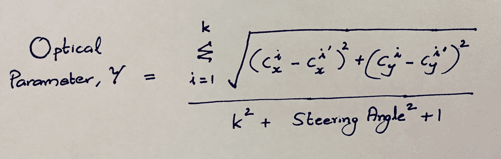

Steering Angle is in Degrees

下面的 python 程序**分析记录的视频&计算视频中每个相邻帧**的光流参数‘gamma’并输出到文件。

**由于计算的光学参数值是无界的，应用 sigmoid 函数或双曲线正切函数**来挤压这些值。由于 tanh 将所有正值限制在 0 & 1 之间，而 sigmoid 的范围是 0.5 比 1，所以 tanh 成为我们的自然选择。**挤压量可通过“alpha”参数**进行调整，如下图所示。

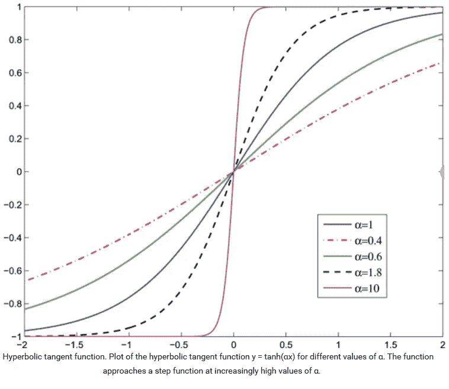

[Image Courtesy](https://www.researchgate.net/figure/Hyperbolic-tangent-function-Plot-of-the-hyperbolic-tangent-function-y-tanhax-for_fig9_6266085)

**基于“伽马”值的分布，我们可以决定“阿尔法”值**以匹配记录的加速度值的分布，然后乘以最大加速度值，以从 0 到 1 进行缩放。在这种情况下，我们计算出 **alpha = 0.18** 以避免在双曲正切曲线的渐近端出现任何 gamma 值。

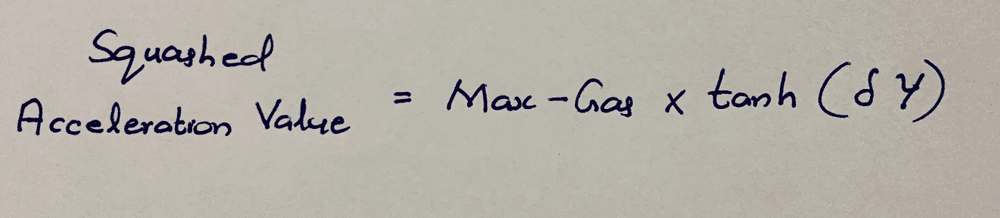

Here, alpha is denoted by delta symbol

结合这两个值来预测加速度和制动值。

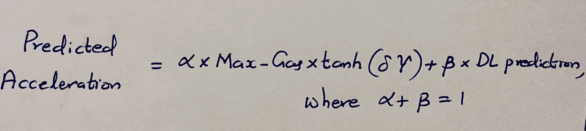

当汽车行驶时，计算来自仪表板摄像头视频的光流值，并且上述计算是在运行中完成的，以预测加速度和制动。上述公式的实现在下面的并发执行部分。

为了计算上述等式中的“DL 预测”，使用了受著名的 LeNet 架构启发的 3**-卷积层模型。因此，对于 steer 来说，NVidia 端到端 CNN 架构以及对于 Accel 和 Brake LeNet 来说，受启发的架构与光流参数特征相结合。**

不同模型的原型制作在 Keras 中完成，如下所示。

LeNet Architecture

*LeNet-inspired 3-Convolution Layer Architecture in Keras*

# c)齿轮和离合器预测

**档位不依赖于单个帧图像，而是所有参数**的组合，即转向角、加速度、制动&也是序列信息。因此，我们可以使用机器学习算法，使用上述参数作为输入特征来预测因变量“齿轮”。

我们知道基于树的最大似然算法在特征较少时表现更好，就像在这种情况下。在尝试了逻辑回归、朴素贝叶斯、GBDT 等多种算法后，**发现 RandomForest 给出了最大的准确性。**自动驾驶汽车只有在最后“n”帧的档位预测相同时才会换档，而不是依赖于单个帧的档位预测，**。**换档时离合器可以轻松计算。

RandomForest Algorithm to predict gear of last ’n’ frames.

# **并发模型执行**

转向、加速、制动和档位模型**在不同的会话**中同时执行，并带有相应的计算图表，以预测每一帧的所有驾驶控制值。

Concurrent Execution of all models at Run-time

# 预测输出

下面的汽车正在根据 dash-cam 视频输入进行自动驾驶。**它可以很好地处理新曲目，在训练网络时看不到。**

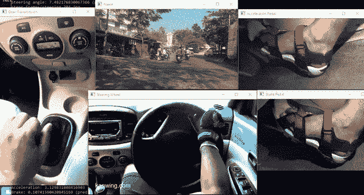

All the controls are guided by prediction

**该项目的源代码可以在** [**这里**](https://github.com/AdroitAnandAI/Self-Driving-Car-on-Indian-Roads) 找到

# 结束语

想象我们的世界拥有自动驾驶汽车的所有优势，这似乎不亚于一部科幻电影，其中无人驾驶的摆渡物体(UFO)正在我们的道路上蜿蜒前行。对普通大众来说，可能是《爱丽丝梦游仙境》。

但是今天的仙境可以在未来变成令人惊叹的现实，那时人类驾驶汽车将会是一个故事，由老奶奶们讲给他们的孙子们听。但要实现这一点，它必须通过所有的障碍，即伦理，技术和后勤，成为一个现实世界的乌托邦。例如，基础设施需要彻底检修，技术应该处理所有极端情况，特别是在崎岖的印度道路上，以防止类似优步的事件发生。

西北大学教授 Jeremy P Birnholtz 说，“人的变化很慢，技术的变化很快”。人类和自动驾驶汽车相互适应的效率如何，最好留给时间来检验。

人类驾驶汽车的能力如此之差，以至于计算机不必好到比人类好太多~马克·安德森

# 参考

[1]马留什 b，达维德 D，丹尼尔 D 等。艾尔。、(2016) **自动驾驶汽车端到端学习**。检索自 Arxiv: 1604.07316v1 [cs。简历]

[2]菲利普·f·阿列克谢·d·等人艾尔。，(2015) **FlowNet:用卷积网络学习光流。**检索自 Arxiv:1504.06852 v2【cs。简历]

[3] Abdoulaye S .，Eric A .，(2013) **扩展标准霍夫变换用于分析线识别。**检索自 IJACSA)国际高级计算机科学与应用杂志，2013 年第 4 卷第 3 期。

 [## sully Chen/自动驾驶仪-张量流

### 这份英伟达论文的 TensorFlow 实现:有一些变化的 https://arxiv.org/pdf/1604.07316.pdf…

github.com](https://github.com/SullyChen/Autopilot-TensorFlow)  [## 自动驾驶汽车将如何重塑我们的世界

### 自动驾驶汽车只是拼图的一部分。前纽约市交通专员塞缪尔·施瓦茨(又名…

www.wsj.com](https://www.wsj.com/articles/how-autonomous-vehicles-will-reshape-our-world-1539871201)  [## 应用课程

### 应用机器学习课程研讨会案例研究

www.appliedaicourse.com](https://www.appliedaicourse.com/)