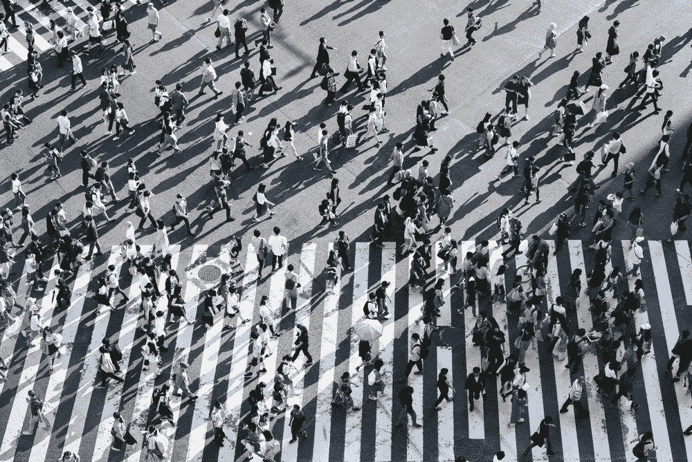

# 自动驾驶汽车:更大的道路安全，更少的隐私

> 原文：<https://towardsdatascience.com/self-driving-cars-bigger-road-safety-less-privacy-78dfa2ad0251?source=collection_archive---------11----------------------->

## 他们应该减少道路伤亡，但他们还需要什么？

汽车是当今最普遍的交通工具。他们提供舒适，自由，可用性，各种各样的费用和一个微小的，但不是微不足道的被卷入事故的可能性。

伤亡人数正在减少，然而汽车仍然是最致命的交通系统之一，仅次于摩托车。根据世界卫生组织的数据，它们也是一个难以承受的经济负担，占每个国家 GDP 的 1%到 3%。

政府和汽车制造商正在共同努力，努力大幅降低这一比率:例如，欧洲联盟委员会制定了若干战略，其中包括合作智能交通系统，重点是减少人为错误和创造环境友好型解决方案。

根据 2017 年道路安全初步统计数据，2017 年的死亡人数比 2010 年减少了 20%，比 2016 年减少了 2%。委员会发布了 2010 年至 2020 年道路交通死亡人数减半的目标，设定了一些目标[2],但不幸的是，这些目标并没有实现，这意味着实现这一目标将具有挑战性。

Photo by [Denys Nevozhai](https://unsplash.com/@dnevozhai?utm_source=medium&utm_medium=referral) on [Unsplash](https://unsplash.com?utm_source=medium&utm_medium=referral)

## 我们如何提高道路安全？

大量的努力和资源对于**提高道路安全**至关重要，行业已经提出了大数据和自动驾驶汽车等解决方案。既然大多数车祸都是由于**人为因素**而不是太多技术故障，那么用软件代替人为因素听起来就顺理成章了。

## 可能的解决方案:无人驾驶汽车

第一个挑战是建立一个能够比最好的人类司机更好地感知道路的自动驾驶系统，这不会很快发生。目前的地图也不够精确。但是自动驾驶是什么意思呢？

简而言之，汽车自治有 5 个级别:

*   0 级车没有自动化功能，
*   第三级意味着人类和机器之间的交换，根据研究，这是最致命的级别[3]。
*   在 5 级[4]的所有条件下，车辆完全自动驾驶。
*   截至 2018 年，市场上最先进的汽车都在 2 级的中途。

当前的自动驾驶汽车配备了内部和外部传感器、激光雷达单元、摄像头和强大的软件，包括驾驶员的语音和手势识别、语言翻译和强化学习算法[5]。汽车**通过捕捉附近物体的大小和速度的数据并预测可能的变化，不断渲染封闭的环境**。该算法的主要任务可以分为目标检测、识别、定位和运动预测。

在**强化学习**算法中，奖励被分配给某些结果，推动算法学习相应的行为。数据越多，算法更新其参数以实现奖励的精度就越高。

> **因果关系是这样的:自动驾驶汽车收集的数据越多，算法就越强大，适应性越强，事故就越少。**

然而仅仅收集数据是不够的；道路、环境和人类司机的行为可能会有很大的不同，这取决于该地区是城市还是农村、特定国家的习俗和非书面法律。

因此，用尽可能多的**不同数据**来训练这些汽车是必不可少的。下面的困境出现了:需要多少数据？自动驾驶汽车什么时候可以被允许上路？

# 在开发和测试的哪个阶段，我们可以允许汽车上路？

兰德研究所的高级研究人员认为[6]，在制造商能够确认它们在统计上与人类驾驶员一样安全之前，自动驾驶汽车需要行驶很长的距离。

他们提出了这样一个问题:“对人们来说什么是重要的，他们希望他们比人类司机更安全吗？这个答案会随着时间而改变吗？”。制造商需要的数据量取决于公司对风险的厌恶程度，以及对公众的信任程度。

**最佳切入点**是一个有争议的话题[7]:

> 比起机器犯的错误，人们更能接受其他人犯的错误，即使机器总体表现比人好[8][9]。

在寻求减少死亡事故的过程中，自动驾驶汽车必须面对创建和维护地图、掌握复杂的社会互动、应对恶劣天气条件以及应对网络攻击的挑战[10]。

## 数据保密

考虑到汽车和私人公司将知道司机最常去的地方，并可能(并将)建立客户偏好和习惯的档案，隐私和数据保护问题不容忽视。

如今，理论上没有人知道汽车在哪里。如果乘客随身携带他们的手机并激活定位服务，操作系统可以跟踪他们的位置，知道他们移动的速度以及他们何时/何地停下来。但其他的就不多了。

在涉及更多软件和互联网连接的汽车中，用户可以发出语音命令，已经有一些软件公司在处理语音命令。当然，这些公司非常重视隐私，但已经存在数据泄露的风险，即使这种风险很小。亚马逊 Echo 设备已经出现了一些数据隐私问题。

在自动驾驶汽车中，用户将他们的生活和隐私交给了一家软件公司，这是对已经存在几十年的传统汽车制造商的一大飞跃。例如，优步只有 10 岁。也许明智的做法是警惕我们信任谁来驾驶我们。

自动驾驶汽车背后的技术监管等其他问题存在争议，但超出了本文的范围。

## 哪些公司领先？

当进入竞争激烈的自动驾驶汽车行业时，有三家公司处于前列，即**谷歌、特斯拉，最近还有优步**。

**谷歌**每周收集 15000 英里的自动驾驶里程，迄今为止在美国已经积累了 170 万英里的自动驾驶里程[11]，与欧洲不同，美国的死亡事故正在增加[12]。美国人在致命事故发生前行驶了 1 亿英里；因此，按照目前的速度，谷歌需要数年才能行驶同样的距离。

**特斯拉**，另一方面，有一个不同的方法。通过使用他们的“自动驾驶模式”，特斯拉已经行驶了 13 亿英里[13]，其中汽车由人类在自动驾驶模式下驾驶。尽管如此，将顾客作为试驾者也有缺点，正如少数有争议的致命车祸所显示的那样。

**优步最初是一家拼车公司，现在已经迅速转向送餐和自行车共享，以及他们自己的无人驾驶汽车，甚至有一段时间还有无人驾驶卡车。在一系列事故之后，优步继续在匹兹堡[15][16]和多伦多[17]测试他们的赛车(低速)。关于他们收集的数据的性质和数量，没有多少公开信息。他们的汽车扩展到其他城市也没有截止日期[18]。**

## **结论**

**总之，自动驾驶汽车正在逐渐加入道路，这一过程可能会因公众的不情愿而推迟，但不会停止。**

**许多公司正在投资开发和增强他们的自动驾驶算法，在美国，主要城市的道路已经成为他们的游乐场。**

**随着司机习惯于驾驶自动驾驶汽车上路，后者的相关性必然会增加，完全自动驾驶和联网汽车网络的乌托邦可能并不遥远。**

## **参考**

**[1]: [世卫组织世界报道](http://www.who.int/violence_injury_prevention/publications/road_traffic/world_report/chapter2.pdf)(2013)
【2】:[欧盟自 2001 年以来的道路死亡人数](https://www.bismart.com/wp-content/uploads/2017/09/big-data-solutions-traffic-fatalities-eu.png)
【3】:[众包地图应该有助于无人驾驶汽车更安全地在我们的城市中导航](https://www.technologyreview.com/s/612825/open-source-maps-should-help-driverless-cars-navigate-our-cities-more-safely/)(2019)
【4】:[用 3D 绘制世界将让我们用增强现实绘制街道](https://www.technologyreview.com/s/613311/mapping-the-world-in-3d-will-let-us-paint-streets-with-augmented-reality/)(2019)
【5】:[未来自动驾驶汽车驾驶员研究
【6】:](https://mediaroom.kbb.com/future-autonomous-vehicle-driver-study)[汽车的自主水平](http://standards.sae.org/j3016_201609/)
【7】:[使用深度强化学习的自动驾驶汽车在闭塞的路口导航](https://arxiv.org/pdf/1705.01196.pdf)(2018)
【8】:[驾驶到安全的地方:需要行驶多少英里才能证明自动驾驶汽车的可靠性](https://www.rand.org/pubs/research_reports/RR1478.html)(2016)
【9】:[为什么等待完美的自动驾驶汽车可能会付出生命的代价](https://www.rand.org/blog/articles/2017/11/why-waiting-for-perfect-autonomous-vehicles-may-cost-lives.html) (2017)

【12】:[自动驾驶汽车的挑战与障碍](https://www.vox.com/2016/4/21/11447838/self-driving-cars-challenges-obstacles)(2016)
【13】:[way mo，在路上](https://waymo.com/ontheroad/)
【14】:[美国道路安全法律滞后，而死亡事故攀升](https://www.citylab.com/transportation/2018/01/us-road-safety-laws-lag-while-fatalities-climb/551135/)(2018)
【15】:[特斯拉、 自动驾驶数据](https://spectrum.ieee.org/cars-that-think/transportation/self-driving/tesla-reveals-its-crowdsourced-autopilot-data, https://electrek.co/2016/11/13/tesla-autopilot-billion-miles-data-self-driving-program/)(2016)
【16】:[我们的自动驾驶车辆之路](https://www.uber.com/blog/our-road-to-self-driving-vehicles/)(2017)
【17】:[优步的自动驾驶汽车自致命车祸以来首次重返公共道路](https://www.theverge.com/2018/12/20/18148946/uber-self-driving-car-return-public-road-pittsburgh-crash)(2018)
【18】:[优步刚刚被批准恢复在匹兹堡和该州其他地方的自动驾驶测试](https://www.post-gazette.com/business/tech-news/2018/12/18/Uber-pittsburgh-resume-testing-self-driving-autonomous-vehicles-penndot/stories/201812180146)(2018)**