# 自我激励通常与生活的宗教方面有关

> 原文：<https://towardsdatascience.com/self-motivation-is-usually-linked-to-the-religious-aspects-of-life-4b34c8b22d96?source=collection_archive---------50----------------------->

## 如何使用自然语言处理来检查体裁之间的相似性，从而洞察整本书的写作内容

我们都同意桔子更像柠檬，而不是菠萝。像大小、形状和水果种类这样的属性很快就会进入我们的脑海。检查对象之间的相似性可以洞察它们的属性和总体特征。

在我最近的项目中，我通过使用自然语言处理(NLP)分析不同流派的书籍的导语，对它们的写作方式有了深入的了解。这个简单的项目展示了 NLP 在实践中的应用，以及文本分析在数据科学中的重要性。关于这个项目的更多细节和完整代码，请查看这个 [*资源库。*](https://github.com/EdidiongEsu/genre_NLP)

## 什么是广告词？

简介是对一本书、一部电影或其他产品的简短描述，是为促销目的而写的。书的简介通常很短，大多数情况下超过 100 个单词。

> 一个 200 字的导语可以用来代表一本 58000 字左右的书。

**我对这个项目的主要目标包括找出以下内容**:

*   导语是整本书的准确表达吗？
*   导语可以用来区分书籍的类别吗？
*   使用自然语言处理的不同类型的书籍/小说之间的相似性。

## 数据是从哪里得到的

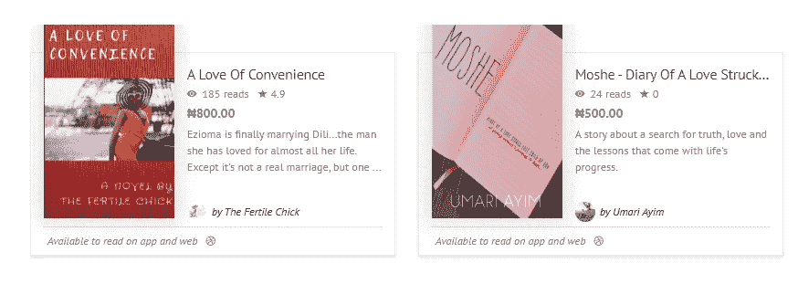

我从非洲最受欢迎的电子书店 [*okadabooks*](https://okadabooks.com/) 网上搜集数据，以用于此次分析。我选择这个网站的原因之一是它种类繁多，致力于出版非洲文学。查看 [*此处*](https://github.com/EdidiongEsu/okadabooks_scraper) 了解更多关于网页抓取算法的细节。

## **规范化简介**

为了进行正确的文本分析，最初的广告必须规范化。这包括删除标点符号、数字，并将所有大写字母改为小写。我用`df['norm_blurb']= df.blurb`创建了一个广告的副本，然后用`df.norm_blurb= df.norm_blurb.astype(str)`将其类型改为 strings。我使用 lambda 映射函数来帮助完成剩下的工作，如下所示。每行代码上的注释显示了每行代码在做什么。

标准化后的数据框如下所示:

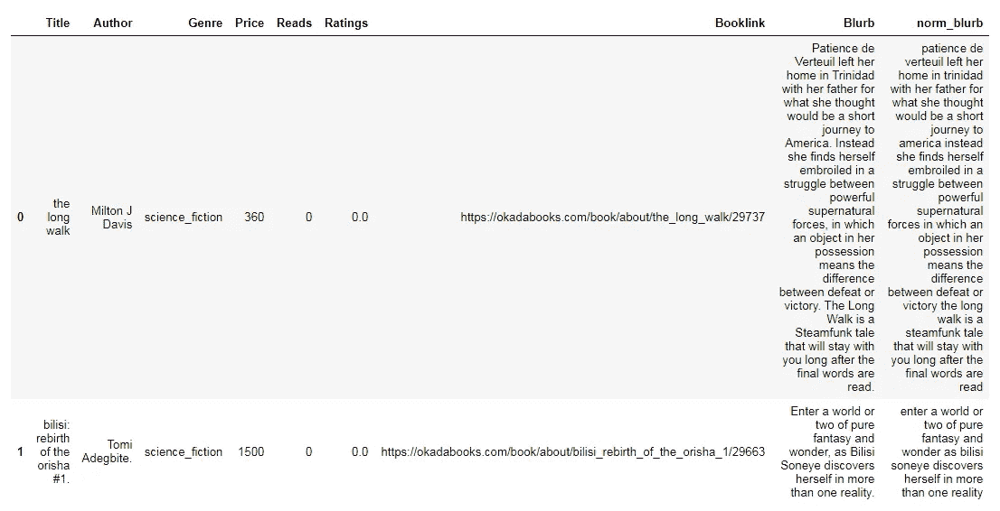

*sample of the data frame*

## 选择要使用的类型

为了提高我的结果的准确性，我选择 norm_blurb 列中包含至少总共 100，000 个单词的流派。所有的广告词大约有 110 万字。这也有助于降低该项目的复杂性。

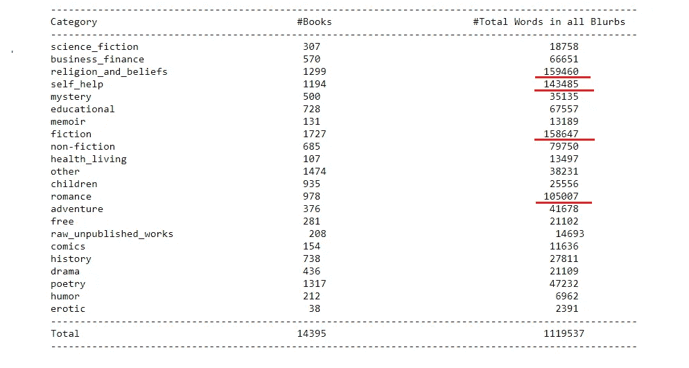

Breakdown of blurb words in all categories

我选择了上图中下划线标出的四种类型:自助类、小说类、浪漫类和宗教类。为四种类型创建了数据帧，另一个标记为`random_df`的长度为 2000 的数据帧通过使用`df.sample(l=2000).`函数使用四种类型的随机行创建。

## 消除停用词并创建每个词的频率字典

[*停用词*](https://en.wikipedia.org/wiki/Stop_words) 是语言中最常见的词。大多数句子需要包含停用词才能成为有意义的完整句子。它们是对语义关系没有影响/影响很小的词。通常，停用词会被删除，因为它们不重要，会扭曲词频分析。使用`**from** **sklearn.feature_extraction** **import** stop_words`导入库。`stopwords.ENGLISH_STOP_WORDS`将在功能中用来删除停用词。英语停用词的例子包括:

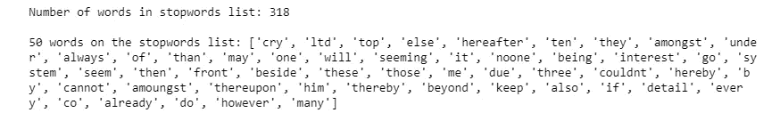

使用了一个函数来返回所需结果。这个函数创建一个字典，计算一个单词出现的次数，然后删除停用的单词。每一行都有一个注释解释它的作用。

## 导语是书籍的准确表达吗？/导语可以用来区分书籍的类别吗？

第一个问题有助于回答第二个问题。**是的！在所选的类别中，10 个最常见的单词让我们对这些问题有了深入的了解。**

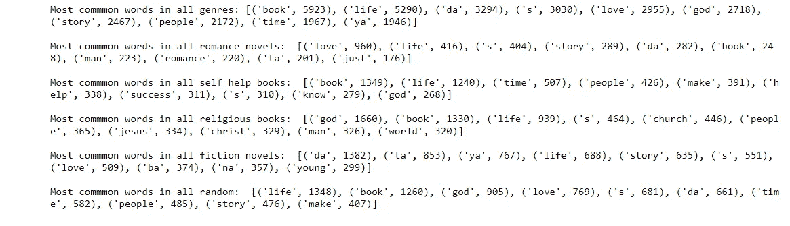

当一个人寻找浪漫小说时，他/她是在寻找某种**爱情**故事。对于宗教类书籍，难免看不到**神**、**教会**之类的字眼。大多数励志书籍(自助)通常会讲述如何在一段时间内获得成功的秘诀。用最简单的术语来说，小说就是某种故事。

> 注意上面加粗的单词在它们各自的体裁中是 10 个最常见的单词。

可以从最常用的词中做出更多的推断:

*   上帝、基督和耶稣是宗教范畴中最常见的 10 个词。这是意料之中的。这也暗示了很多宗教书籍都是关于 okadabooks.com 的基督教的
*   自助书籍(也称为励志书籍)中多次提到成功，这些书籍倾向于宣扬激励/提供通往成功的秘诀。
*   上帝是自助(励志)书籍中第十常见的词。这表明**成功有时与生活的精神层面联系在一起。这个推论耐人寻味。**
*   爱情是言情小说中最常见的词。由此得出结论，言情类的导语是整本书的准确表达。

从这些频繁出现的词汇中，可以推断出很多关于 okadabooks.com 的书籍。虽然大多数导语确实是用于促销目的，但它们是整本书的伟大代表。

# 体裁之间的相似性

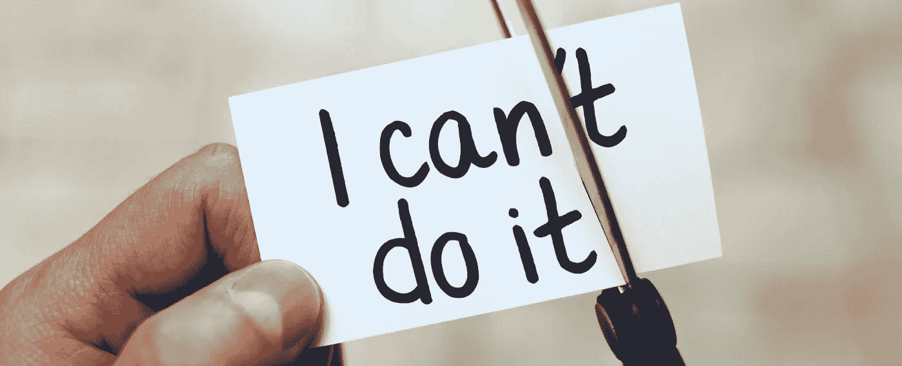

因为我们已经确定导语是书籍的一种很好的表现形式，相似性度量可以通过比较词频来计算。在这篇文章中，我将只集中在宗教书籍和其余选择的流派之间的相似性。哪个类别与宗教书籍最相似？哪个最不相似？

[*Jaccard 相似度*](https://en.wikipedia.org/wiki/Jaccard_index) 比较两个集合的成员，看哪些成员是共享的，哪些是不同的。简单地说，它是通过寻找集合的交集除以它的并集得到的。下面的函数用于获得所需的结果。

```
**def** jaccard_similarity(genre1, genre2):     
       intersection = len(set(genre1).intersection(set(genre2)))
       union = len(set(genre1).union(set(genre2)))     
       **return** intersection/union
```

该值的范围从 0 到 1，其中 1 表示两个数据集 100%相似。然后用环形图将相似性可视化。

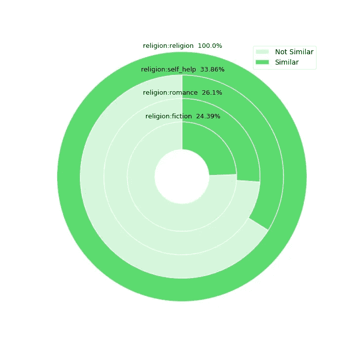

除了自我相似性之外，宗教书籍与自助书籍最为相似，约占 34%。这又回到了我们最初的推断:

> 上帝是自助(励志)书籍中第十个最常见的词。这表明成功有时与生活的精神层面联系在一起。

为了更深入的了解，我研究了这两个类别中最常见的单词。结果很有趣。

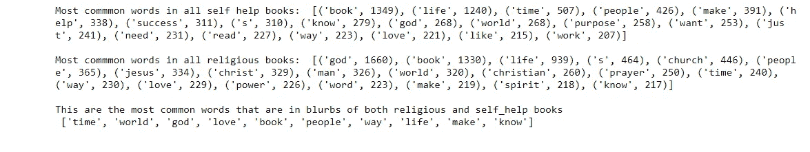

## 广告样本

这两个类别的示例让我们对一些书面广告有所了解。这只限于自助和宗教类别。

**宗教信仰类别:**

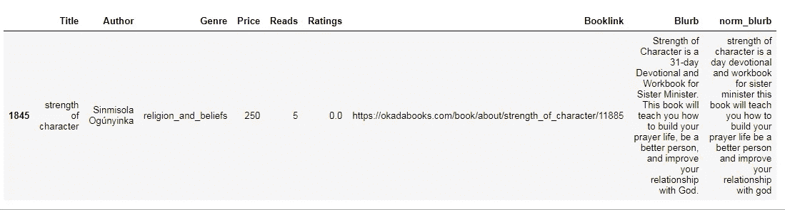

> 简介上写着:
> 
> 性格的力量是一个 31 天的奉献和姐妹部长的工作手册。这本书将教你如何建立你的祷告生活，成为一个更好的人，并改善你与上帝的关系。

**自助类别:**

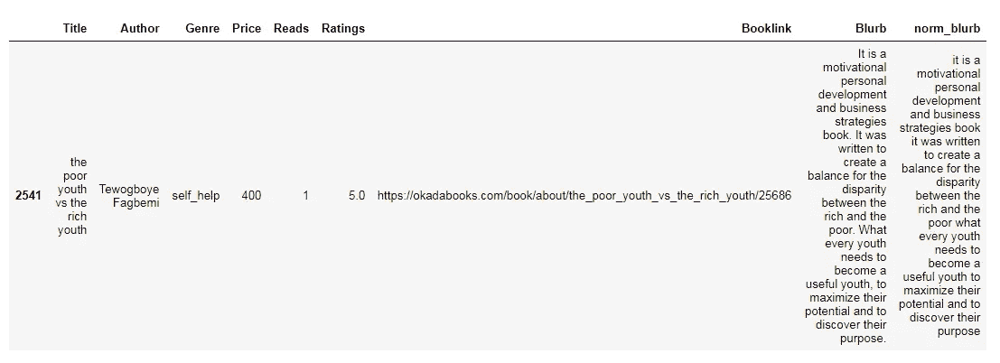

> 这是一本激励个人发展和商业策略的书。它是为了平衡贫富差距而写的。每个青年都需要成为有用的青年，最大限度地发挥他们的潜力，并发现他们的目的。

## 结论

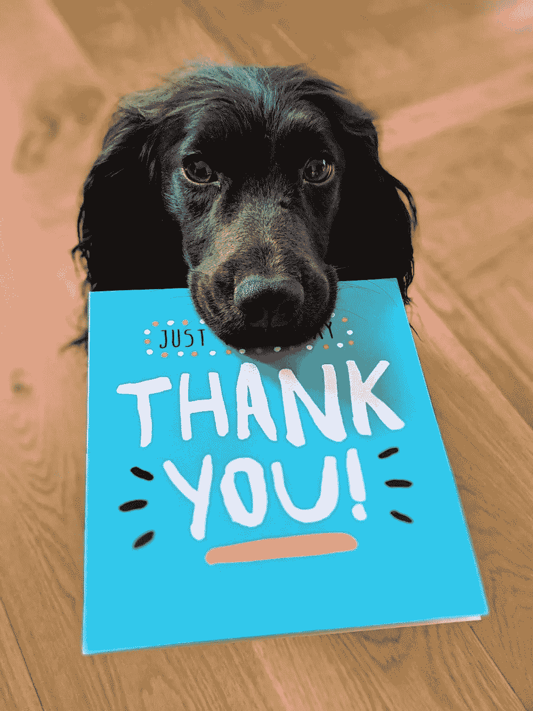

这个简短的项目研究了两个物体之间的相似性，并证实了两个物体之间的相似性度量可以洞察它们的属性和整体特征。在这种情况下，通过使用自然语言处理来比较几种体裁，这给出了对不同类别书籍的写作内容的理解。

我很想听听你对此的想法。感谢您的阅读！

如果你喜欢这篇文章，请关注并看看我的其他数据科学文章🙏🙏。