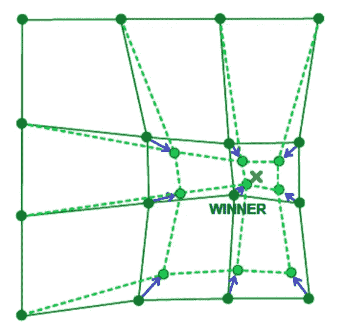

# 自组织地图

> 原文：<https://towardsdatascience.com/self-organizing-maps-1b7d2a84e065?source=collection_archive---------6----------------------->

## (**科霍宁的地图)**

> **简介**

自组织映射或 Kohenin 映射是由 [Teuvo Kohonen](https://en.wikipedia.org/wiki/Teuvo_Kohonen) 在 20 世纪 80 年代推出的一种人工神经网络。(论文[链接](https://sci2s.ugr.es/keel/pdf/algorithm/articulo/1990-Kohonen-PIEEE.pdf))

SOM 使用无监督学习来训练，它与其他人工神经网络略有不同，SOM 不是通过 SGD 的反向传播来学习，而是使用竞争学习来调整神经元中的权重。我们使用这种类型的人工神经网络进行降维，通过创建空间组织的表示来减少我们的数据，还帮助我们发现数据之间的相关性。

> **SOM 的架构:**

自组织地图有两层，第一层是输入层，第二层是输出层或要素地图。

与其他神经网络类型不同，SOM 在神经元中没有激活函数，我们直接将权重传递给输出层，而不做任何事情。

SOM 中的每个神经元被分配一个与输入空间具有相同维数 d 的权重向量。

> **自组织地图训练**

正如我们之前提到的，SOM 不使用 SGD 的反向传播来更新权重，这种类型的无监督人工神经网络使用竞争学习来更新其权重。

竞争学习基于三个过程:

*   竞争
*   合作
*   适应

让我们解释一下那些过程。

***1)竞争:***

正如我们之前所说的，SOM 中的每个神经元都被分配了一个与输入空间维数相同的权重向量。

在下面的例子中，在输出层的每个神经元中，我们将有一个维数为 n 的向量。

我们计算每个神经元(来自输出层的神经元)与输入数据之间的距离，距离最小的神经元将成为竞争的赢家。

欧几里德度量通常用于测量距离。

***2)公司:***

我们将在最后的过程(适应)中更新获胜神经元的向量，但它不是唯一的一个，它的邻居也将被更新。

我们如何选择邻居？

为了选择邻居，我们使用邻域核函数，该函数取决于两个因素:时间(每次新输入数据增加的时间)和获胜神经元与另一个神经元之间的距离(该神经元离获胜神经元有多远)。

下图向我们展示了如何根据距离和时间因素选择获胜神经元(中间最绿的神经元)的邻居。

Time and distance factors

***3)改编:***

在选择胜出的神经元和它的邻居后，我们计算神经元更新。这些选择的神经元将被更新，但不是相同的更新，神经元和输入数据之间的距离越大，我们调整它，如下图所示:

neurons of the output layer update

将使用以下公式更新优胜神经元及其相邻神经元:

这个学习率表明了我们想要调整权重的程度。

在时间 t(正无穷大)之后，这个学习速率将收敛到零，因此我们将没有更新，即使对于神经元赢家也是如此。

邻域核取决于赢家神经元和另一个神经元之间的距离(它们成比例地相反:d 增加使 h(t)减少)和邻域大小，邻域大小本身取决于时间(随着时间增加而减少)，这也使邻域核函数减少。

完整 SOM 算法:

> **例子:**

现在让我们看一些例子

示例 1:

正如你在这个例子中所看到的，特征图采用了在二维空间中描述数据集的形状。

示例 2:

SOM with 3D feature map