# 自定进度多任务学习——综述

> 原文：<https://towardsdatascience.com/self-paced-multitask-learning-76c26e9532d0?source=collection_archive---------4----------------------->

更新:

*   2021 年 8 月 14 日:从 GUPNet (ICCV 2021)添加 HTL(分层任务学习)

多任务学习使用相同的模型来执行多重回归和分类任务。多任务通常被认为可以提高网络性能，因为多个相关的任务有助于相互调整，并且可以学习更健壮的表示。此外，将所有任务合并到同一个模型中也有助于减少计算，这是自动驾驶等实时应用的关键要求。

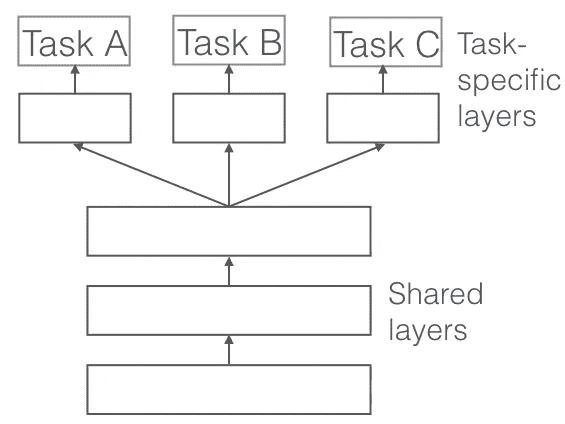

A typical network structure for [multi-task learning](http://ruder.io/multi-task/)

通常，同一个主干(编码器)用于从原始输入中提取常见的低级特征，多个特定于任务的头(解码器)连接到主干。每项任务都有一个或多个损失项，总损失通常是所有损失项的加权平均值。深度神经网络中的每个可学习参数通过优化方法根据基于该总损失计算的梯度来更新。

现代优化方法，如随机梯度下降法和我们最喜欢的替代方法 Adam，无情地将总损失项减少到局部最优值。优化方法本身并不知道每个单独的损失项和每个单独任务的进度。因此，基于深度学习的多任务学习的性能对分配给每个任务的*相对*权重非常敏感。在极端情况下，如果除了一个任务之外的所有任务的权重都被设置为零，那么只有那个特定的任务将被适当地优化。

> 我曾经听过这个笑话(可能来自吴恩达在 Coursera 上的[深度学习专业，但我不确定)，它是这样的:如果一个人工智能算法被告知根据整个人类的*平均*幸福来最大化一个目标，它会做什么？这个目标听起来很合理，但人工智能可能会消灭大多数人类，只最大化少数人的幸福，最大化人类的平均幸福。](https://www.coursera.org/specializations/deep-learning)

Well this graph of local optima is definitely from Andrew Ng’s course

多任务学习中损失的一般公式是

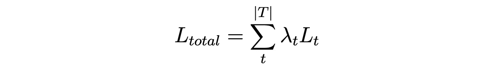

其中λ是分配给特定于任务 t 的损失 L_t 的权重，现在的问题是，如何选择λ来平衡多个任务？

# 标准基线

最简单的做法是在所有任务中使用统一的权重。然而，来自不同任务的损失通常具有非常不同的尺度，并且均匀地平均它们淹没了来自小损失任务的梯度。

一种典型的方法是通过网格搜索手动调整权重。然而，搜索空间随着任务的数量呈指数增长。当任务的数量超过两个时，执行网格搜索通常会非常繁琐，并且在计算上非常困难，尤其是当您有其他超参数需要优化时。(稍微好一点的方法是[随机搜索](https://scikit-learn.org/stable/modules/grid_search.html)，它给出了搜索优化参数的固定预算，但仍然需要多次运行相同的实验来搜索优化的参数。)此外，在整个训练过程中，搜索到的权重是**静态的**，正如我们在下面看到的，这可能不是最优的。

# 自定进度学习

一种更有原则的方法是根据某种标准自动为每项任务分配权重。有两个相关的学习领域:**课程学习**和**自定进度学习**。

课程学习最初是为了提高多任务子集的训练。它指出从小处着手很重要，用简单的例子初始化培训过程，然后继续进行更具挑战性的。这通常会带来更好的性能(参见这篇博文中的示例[)。它在强化学习社区的应用比在计算机视觉领域更广泛。听起来它为我们的多任务问题提供了一个解决方案——我们可以从简单的任务开始，然后从困难的任务开始。然而，如何确定每个任务的难度是一个公开的问题，并且任务的难度可能在训练过程中发生变化。显然，手工制作课程表很有挑战性(对于动态的课程表来说更是如此)，所以我们需要一种自动化的方式来做这件事。另外，课程学习有一个很强的假设 ***所有任务都有一个恒定的底层分布*** 。](/how-to-improve-your-network-performance-by-using-curriculum-learning-3471705efab4)

自定进度学习是一种自动化的课程学习方法，其中课程由模型的能力决定。基本思想是监控*学习进度*信号，并设计或学习调整任务相对权重的策略。这种方法将学习每个任务的动态权重。这实际上非常类似于人类学生的学习方式——学生根据他们在特定科目上的表现来决定在每个科目上投入多少精力。

在接下来的会议中，我将简要概述文献中关于**自定进度多任务学习**的三种流行方法。

*   [使用不确定性衡量场景几何和语义损失的多任务学习](https://arxiv.org/abs/1705.07115) (CVPR 2018)
*   [GradNorm:深度多任务网络中自适应损耗平衡的梯度归一化](https://arxiv.org/abs/1711.02257) (ICML 2018)
*   [DTP:多任务学习的动态任务优先级](http://openaccess.thecvf.com/content_ECCV_2018/papers/Michelle_Guo_Focus_on_the_ECCV_2018_paper.pdf) (ECCV 2018)

## 使用不确定性衡量损失的多任务学习

这篇论文的作者(特别是 Alex Kendall)是深度学习中不确定性研究的先驱。这项工作是他们之前在不确定性方面的研究的一个特殊应用，例如[我们在计算机视觉的贝叶斯深度学习中需要哪些不确定性？](https://arxiv.org/pdf/1703.04977.pdf) (NIPS 2017)和[贝叶斯 SegNet:场景理解的深度卷积编码器-解码器架构中的模型不确定性](https://arxiv.org/pdf/1511.02680.pdf) (BMVC 2017)。

The famous illustration of Aleatoric Uncertainty and Epistemic Uncertainty. This has become the de facto namecard for Bayesian Deep Learning.

深度学习中不确定性的一些背景知识:不确定性有两种，*认知*不确定性，和*任意*不确定性。认知不确定性是可以用更多数据解释的模型不确定性。任意不确定性是不能用更多的数据来解释的数据不确定性。随机不确定性可进一步分为两类，数据相关的*异方差*不确定性和任务相关的*同方差*不确定性。具体来说，作者建议使用同方差不确定性来衡量不同的任务。

嗯，这是一个相当复杂的问题，但这个想法是明确的。存在一种特定类型的不确定性，它不随输入数据而改变，并且是特定于任务的，作者正建议了解这种不确定性，并使用它来降低每个任务的权重。

本文推导了基于同方差不确定性下高斯似然最大化的多任务损失公式。这里就不赘述了，但是简化的形式是惊人的简单。

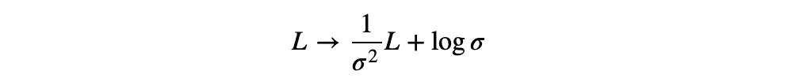

Modified weight based on task uncertainty

在上面的等式中，σ是与每个任务相关的不确定性(具体地说是同方差不确定性)，不确定性越大，任务损失对总损失的贡献就越小。为了避免神经网络通过将所有任务的不确定性设置得非常高来学习琐碎的解决方案，第二项开始起作用并避免不确定性被设置得太高。第二项可以看作是一个正则化项，或“不确定性预算”。(这其实让我想起了另一篇论文:[神经网络中用于分布外检测的学习置信度](https://arxiv.org/abs/1802.04865)，其中也有神经网络跳过不确定性高的例子的“作弊预算”。你可以在[这里](https://github.com/patrick-llgc/Learning-Deep-Learning/blob/master/paper_notes/learning_ood_conf.md)找到我对这篇论文的笔记。

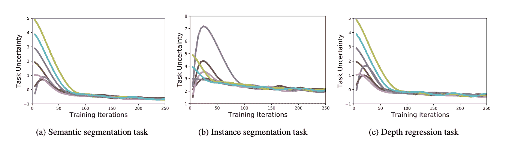

Task weight changes during training (uncertainty weighting)

这篇论文可能是最著名的，因为它简单明了。github 上有 [Tensorflow 实现](https://github.com/ranandalon/mtl/blob/master/utils/loss_handler.py#L6)、 [Keras 实现](https://github.com/yaringal/multi-task-learning-example)和 [pyTorch 实现](https://github.com/CubiCasa/CubiCasa5k/blob/master/floortrans/losses/uncertainty_loss.py)。

## **GradNorm:深度多任务网络中自适应损耗平衡的梯度归一化**

GradNorm 用学习率代替不确定性作为学习进度信号。他们认为，任务不平衡阻碍了适当的训练，因为它们表现为反向传播梯度之间的不平衡。

训练率可以通过损失率或训练率的倒数 r(t)= 1(t)/1(0)来估计，即损失减少的速度有多快。这在所有任务中都是正常的。

然后，我们计算特定层(通常是主干最后一层的特征图)的每个任务的平均梯度范数。G(t) = ||∇wL(t)||_2.这在所有任务中也是正常的。

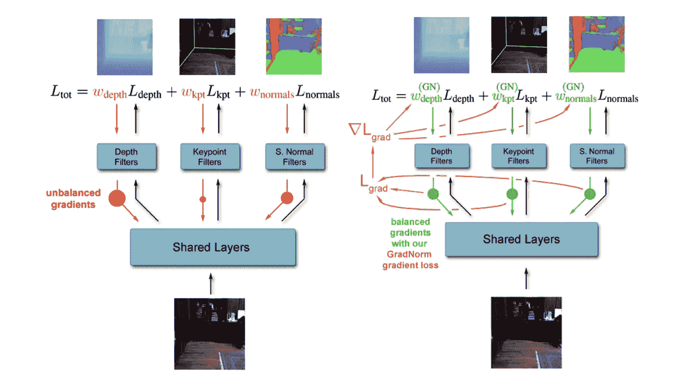

Without GradNorm and With GradNorm

使用来自以下损失的梯度来动态更新权重。

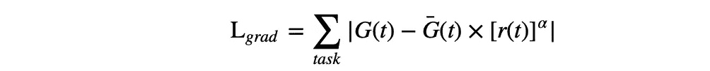

GradNorm loss for dynamically updating weights

等式中有一个超参数α，用于调整不同任务的平衡强度。α越高，不同任务之间的损失越不对称。如果α=0，则任务的权重相等。作者发现网络性能对(0，3)中的α相对不敏感。看起来α=1 可能是一个很好的默认值。

此外，GradNorm 总是确保权重被重新归一化为 1，这有助于更平滑的训练。

作者还发现，时间平均加权因子非常接近通过网格搜索选择的最优加权因子。这意味着 GradNorm 也可以用于找到最佳的*静态*权重，但只需运行一次实验(不像网格搜索所需的指数增长的实验数量)。

我在 github 上只找到了 pyTorch [的一个实现。](https://github.com/hosseinshn/GradNorm/blob/master/GradNormv8.ipynb)

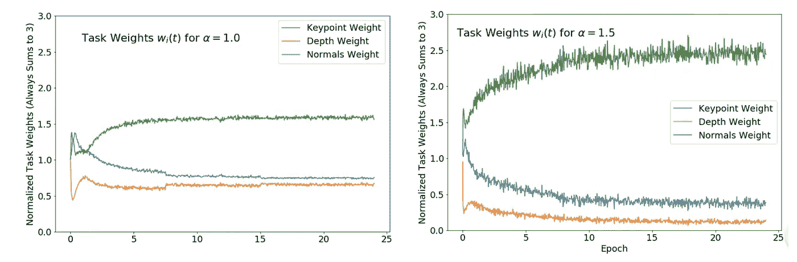

Task weight changes during training (GradNorm)

## DTP:多任务学习的动态任务优先级

动态任务优先级不是用损失率作为学习进度信号，而是用 KPI κ(t)来代替，实际上更有意义。L(0)或初始损失中有太多的噪声，并且严重依赖于初始化方法。

DTP 借鉴了 Focal Loss(FAIR 的 [RetinaNet](https://arxiv.org/abs/1708.02002) 论文)的思想，将任务权重设置为 FL(κ)。γ是一个超参数，默认值为 1。

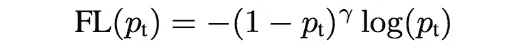

The formulation of Focal loss, an extension to Cross Entropy loss

这篇论文实际上也谈到了在网络体系结构中通过任务层次的实例级优先化和任务优先化，但是我个人认为那些新奇的东西不切实际。

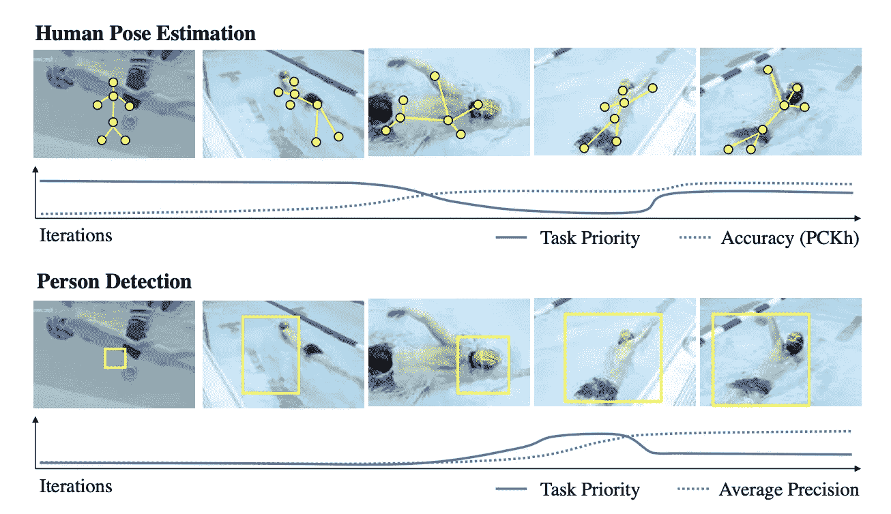

Task weight changes during training (DTP)

## **HTL:分层任务学习**

有时手头的多项任务并不相等，最好先训练一些不确定性低的任务，然后再开始训练不确定性高的任务。 **GUPNet** [(用于单目 3D 物体检测的几何不确定性投影网络，ICCV 2021)](https://arxiv.org/abs/2107.13774) 提出了一种分层任务学习(HTL)方法来解决单目图像深度预测的高度不适定问题。

HTL 受到这样一种动机的启发，即每项任务都应该在其前置任务训练好之后开始训练。HTL 确保只有当一项任务学得足够好时，才开始另一项任务的训练。

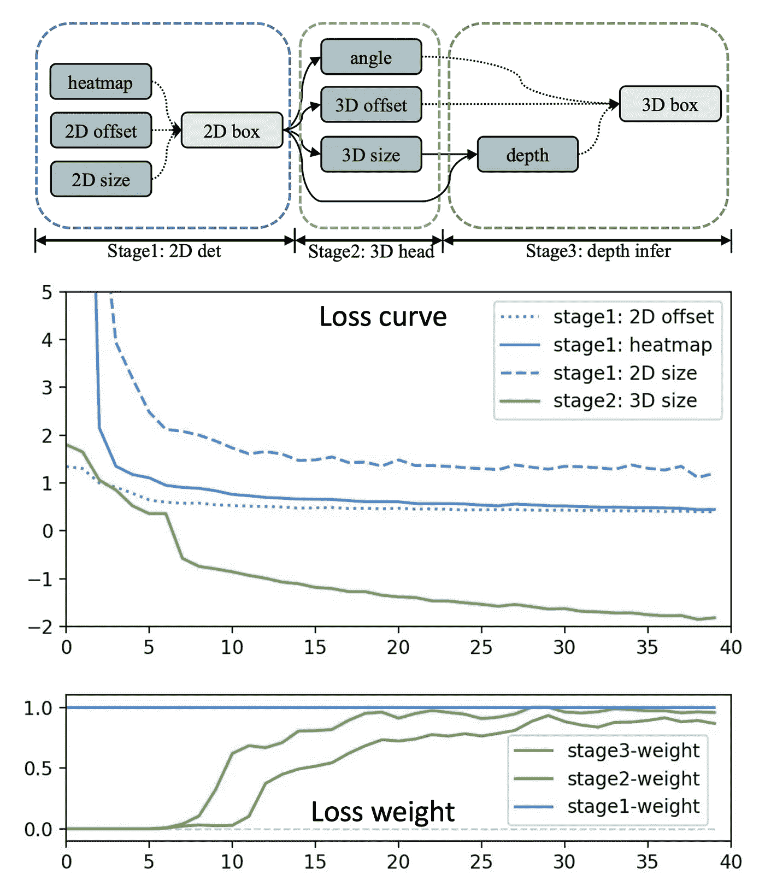

The 3 training stages of GUPNet and the evolution of loss curves and loss weights

具体地，在 GUPNet 的公式中，深度预测严重依赖于 2D 和 3D 尺寸的预测。HTL 解决了在初始训练阶段 2D/3D 尺寸的估计会有噪声，导致可怕的深度预测的问题。

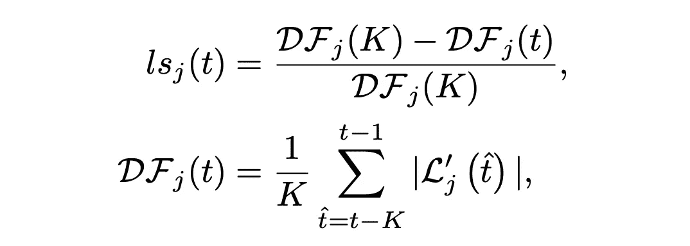

通过比较最后 K 个时期和最初 K 个时期的学习趋势来定义任务是否已经被很好地学习的学习情况(ls)。一个任务只有当它所有的前置任务都学习好了才能开始训练。

# 外卖食品

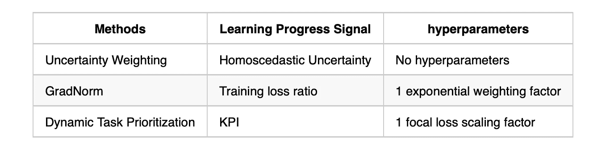

Comparison of different self-paced learning method

这三种方法实际上都很容易实现，尤其是在 pyTorch 中。需要注意的是，流入和流出加权因子的梯度可能需要[分离](https://stackoverflow.com/questions/56816241/difference-between-detach-and-with-torch-nograd-in-pytorch)。

没有强有力的证据表明一种方法比另一种好得多。当然，GradNorm 和 DTP 论文都说它们比不确定性加权要好，但是在实践中这种改进非常小。考虑到实现的容易程度，也许应该首先尝试不确定性加权。

**结束注释:**对于 DTP 或 GradNorm 来说，更好的方法可能是，分别训练每个任务，并大致了解目标损失 L(∞)或 KPI κ(∞)，并使用与预训练网络的目标值的比率作为学习进度信号。

# 关于我

作为一名物理学家，我曾在 X 射线探测器设计(我的博士论文)、半导体设备异常检测、医疗人工智能和自动驾驶等领域工作。我目前在一家快速发展的初创公司工作，致力于感知(传统的**相机感知**和新兴的基于 DL 的**雷达感知**)。我们在圣地亚哥和硅谷都有办公室。如果你对深度学习充满热情，或者你是个硬核 DSP 算法工程师，或者只是想打个招呼，请在 [patrickl@xsense.ai](http://patrickl@xsense.ai/) 给我留言。