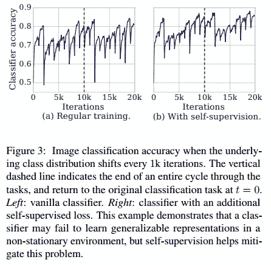
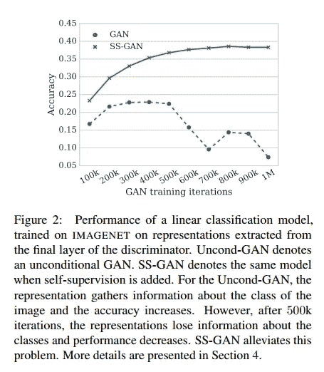
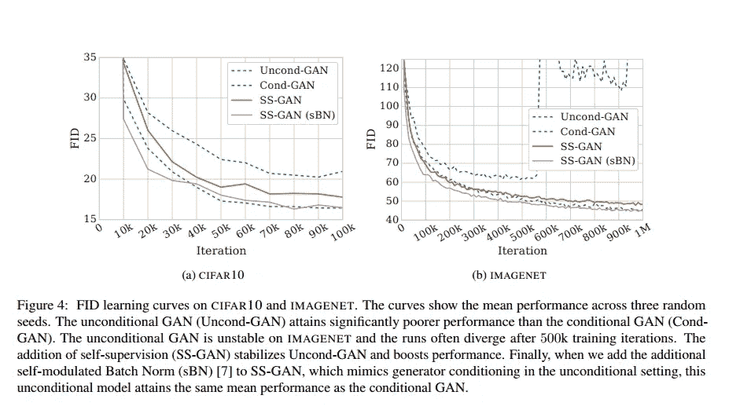

# 使用辅助旋转损耗的自监督 GANs

> 原文：<https://towardsdatascience.com/self-supervised-gans-using-auxiliary-rotation-loss-60d8a929b556?source=collection_archive---------33----------------------->

**TL；DR-自监督 GANs 结合了对抗学习和自监督学习，以弥补监督和无监督图像生成之间的差距，即有条件和无条件的 GANs。**

**你可以通过使用这篇准备训练 Pytorch 实现的论文来训练自己的 SS-GAN——**[**【Github**](https://github.com/vandit15/Self-Supervised-Gans-Pytorch)**。**

# 首先，什么是甘？

GANs 是生成对抗网络的缩写，它是一个神经网络系统，其中两个神经网络(生成器或鉴别器)一起工作，玩一个极大极小游戏，以学习它们生成图像和分别尝试检测图像是真是假的任务。换句话说，鉴别器的目标是区分生成器生成的数据和我们试图建模的真实数据。Ian Goodfellow 在 2014 年提出的这种结合两种网络的方法被证明是图像生成的神奇答案。然而，训练甘是一个棘手的问题。正如在深度学习领域一直以来的那样，在训练 GAN 时添加标记数据是一种拯救，该系统现在被称为条件 GAN 或 cgan。然而，监督图像生成虽然方便，但需要大量数据。为了补救这个问题，我们可以使用半监督学习技术来自己创建一个标签。这样，我们可以在有条件的和无条件的图像生成之间架起一座桥梁。

# 鉴别器遗忘

接下来，我们讨论传统 GANs 中的一个问题，这篇论文的作者强调了这个问题，叫做鉴别器遗忘。下图中描述的两个场景证明了这一点:

左图显示，尽管任务相似，但 Cifar10 数据集上的普通 1 对 1 分类器倾向于显示大量遗忘。每次任务发生变化，准确率都会大幅下降。然而，当损失函数由自我监督辅助时，情况就不是这样了。这表明，在这样一个不断变化的环境中，该模型没有保留可概括的表示。

右图显示了 GAN 训练期间的类似效果。每 100k 次迭代，鉴别器被用于 IMAGENET 分类，并且这显示了相同的遗忘模式，这与自我监督的情况不同。

# 自监督 GAN

在详细介绍 SS-GAN 之前，我们先来快速了解一下什么是自我监督学习。这个想法是在一个可以定义的托词任务上训练一个模型，每个样本的标签可以根据活动来决定。该活动可以是输入中的任何变化，例如，预测输入的旋转或预测图像块的相对位置。现在讨论它的用途，作者已经将预测旋转角度的任务加入到鉴别器中。因此，随着假对真的对抗性预测，它还试图预测图像在一组{0，90，180 和 270}角度之间的倾斜。这是借鉴了文献[1]中提出的自我监督方法。这使得鉴别器有两个头，模型的整体功能如下图所示:

# 合作对抗训练

该模型中的生成者和鉴别者仍然在使用标准的对抗损失并辅以谱范数和梯度惩罚来对抗地进行极小极大博弈。然而，我们正试图模仿有条件的 GAN 从标签中获得的好处(换句话说就是信息)。标签帮助生成器决定生成哪种图像，而不是随机生成像素。类似的还有 SS-GAN 的努力。该生成器并不是完全有条件的，因为它总是生成“直立”的图像，这些图像被进一步旋转以供鉴别器预测。另一方面，正如作者所说

> "鉴别器被训练成仅基于真实数据来检测旋转角度."

这阻止了生成器生成易于预测旋转的图像。

总结一下，鉴别器有两个头。非旋转图像鉴别器的目标是预测真假。在旋转的实像上，预测 4 个旋转角度中的一个。

# 实验

他们将基于标准 resnet 的架构用于鉴别器和生成器，这些架构取自他们与 SS-GAN 进行比较的无条件 GAN。使用两个超参数来控制旋转损失的权重，一个用于真实图像，一个用于虚假图像。

为了比较样品质量，作者使用 FID。

此外，可以使用下图描述结果:

值得注意的重要一点是，自我监督比无条件监督提供了更好的绩效。

# 结论

在我看来，这项工作开辟了一条新的 gan 线，我们可以在不使用标记数据的情况下获得条件 gan 的稳定图像生成。用最先进的型号替换鉴别器有助于进一步改进。作者还提出了在半监督环境中使用少量标签进行进一步改进的想法。

# 参考

[1] Spyros Gidaris，Praveer Singh 和 Nikos Komodakis。通过预测图像旋转的无监督表示学习。
参加 2018 年
(ICLR)国际学习代表大会。