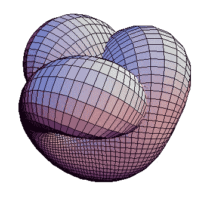

# 自我监督学习的模式

> 原文：<https://towardsdatascience.com/self-supervised-learning-78bdd989c88b?source=collection_archive---------5----------------------->

Photo by [Kevin Gent](https://unsplash.com/@kevinbgent?utm_source=medium&utm_medium=referral) on [Unsplash](https://unsplash.com?utm_source=medium&utm_medium=referral)

# 为了乐趣和利益探索自我

自我监督[在空中](https://twitter.com/ylecun/status/1123235709802905600?lang=en)(与[会谈](https://youtu.be/VsnQf7exv5I?t=3548))。解释自我学习、无监督学习、弱监督学习、半监督学习、远程学习和完全监督学习(当然还有 RL)之间的区别变得更加困难[。)尽管如此，我们还是要努力。](https://twitter.com/ekshakhs/status/1151188702971830272)

在上下文中，问题是将一个**对象**(一个单词、句子、图像、视频、音频……)编码成一个*足够通用的*表示(数字块)，这对于解决*多任务*是*有用的*(保留足够的对象特征)，例如，找到一个句子的情感，将其翻译成另一种语言，在图像中定位事物，使其分辨率更高，检测正在说的文本，识别扬声器开关，等等。

鉴于*图像、视频或语音的多样性，我们必须经常将**与几个任务(甚至是一个任务)联系起来，如果我们遇到新的例子或新的任务，这些任务就会中断。从新的例子***(标有预期输出的输入)中不断地重复学习*是我们的首要策略(监督学习)。我们私下里(并且雄心勃勃地)希望这种令人厌倦的重复学习过程最终会消失，我们会学到这些物体的好的*通用*表示。 ***学一次，永远重用*** 。但是，所谓的*无监督学习*范式( *only-input-no-labels)* 并没有带来太多(像 GANs 和 learn-to-cluster 模型这样的轻微例外)。*

进入**自我监督**:谢天谢地，散布在人工智能研究网络中的一种新的学习模式已经悄然出现，它有望更接近难以实现的目标。**原理**非常简单:为了给一个对象编码，你试着在它的*部分*或它(自我)的不同*视图*之间设置学习任务。

> 给定对象的一部分(输入)，你能预测/生成另一部分(输出)吗？

这个原则有几种不同的味道。

*   例如，给定一个句子*上下文*围绕一个单词，你能(学会)**预测出*遗漏的单词*** (skip-grams，BERT)。
*   或者，**修改输入对象的*视图*** 并预测发生了什么变化(旋转图像并预测旋转角度)。
*   或者，修改输入视图，确保**输出不改变**。

因为你只是简单地摆弄这个物体，所以这些是 ***免费午餐*** 任务——不需要外部*标签*。

幸运的是，我们现在有了(大量)自动生成的*输入输出示例*，我们又回到了游戏中。继续使用你的监督学习工具包中的每一把锤子来学习一个伟大的(通用的？)表示这些例子中的对象。

> 通过尝试从自我输入中预测自我输出，您最终了解了对象的*内在属性/语义*，否则将需要大量的示例来学习。

自我监督损失现在已经成为沉默的英雄有一段时间了，跨多个领域的表征学习(如*自动编码器*、*单词嵌入器*、*辅助损失、许多数据增强、…* )。一个非常漂亮的滑梯[在这里](https://project.inria.fr/paiss/files/2018/07/zisserman-self-supervised.pdf)。现在，有了 NLP 的 ImageNet moment(ELMo，BERT 和其他人)，我想他们自己已经成功了。监管光谱中缺失的空白，每个人(包括 AGI；)一直在等。

可以理解的是，围绕着*更新的自我监督技巧*，用*更少的例子*获得 SoTA，以及*混合各种监督*(你好 [NeurIPS](https://nips.cc/Conferences/2019/CallForPapers) ！).迄今为止，自监督方法大多试图将对象的组成部分联系起来，以一部分作为输入，预测另一部分。或者，通过数据增广改变对象的*视图*，预测相同的标签。

接下来，让我们看看这个社区在玩新锤子的时候变得多么有创造力。还有许多问题有待解决:例如，你如何**比较多种不同的自我监督技巧**——哪一个比其他人学得更好？你如何**选择输出**？例如， [UDA](https://arxiv.org/abs/1904.12848) 使用内在输出分布 D 作为标签，而不是使用显式标签作为输出——确保当输入 x 的视图改变时，D 变化最小。

另外，我很好奇谁声称他们是第一个做这件事的人:)

**更新**:一个有趣的 [twitter 帖子](https://twitter.com/ekshakhs/status/1151188702971830272)讨论自我监督是否是无监督(或其他)的品牌重塑。

> **tldr** : *自我监督学习*是非监督学习的一个优雅子集，在这里你可以通过暴露对象的部分或对象的不同视图之间的**关系，从数据对象中“内在地”生成输出标签。**

**关于我:**我是一名独立的计算机科学研究员、工程师和演讲者，喜欢提炼复杂的技术并将其转化为可消费的产品。我在学术界、工业界和初创公司都工作过。我帮助公司理解和应对复杂、不断发展的人工智能空间，并构建基于深度学习的解决方案，以最大化投资回报。如果你喜欢这篇文章，请*鼓掌*并发表你的评论。你可以关注我，在这里阅读我的其他文章[，在](https://medium.com/@ekshakhs) [linkedin](https://in.linkedin.com/in/nishant-sinha-a610311) 上找到我，或者直接给我发邮件。

**PS:** 如果你想找人‘监督’你(弱监督、完全监督、远程监督甚至共同监督)解决一些非常有趣的文字、视觉和言语问题，请联系 nishant@offnote.co 的我！