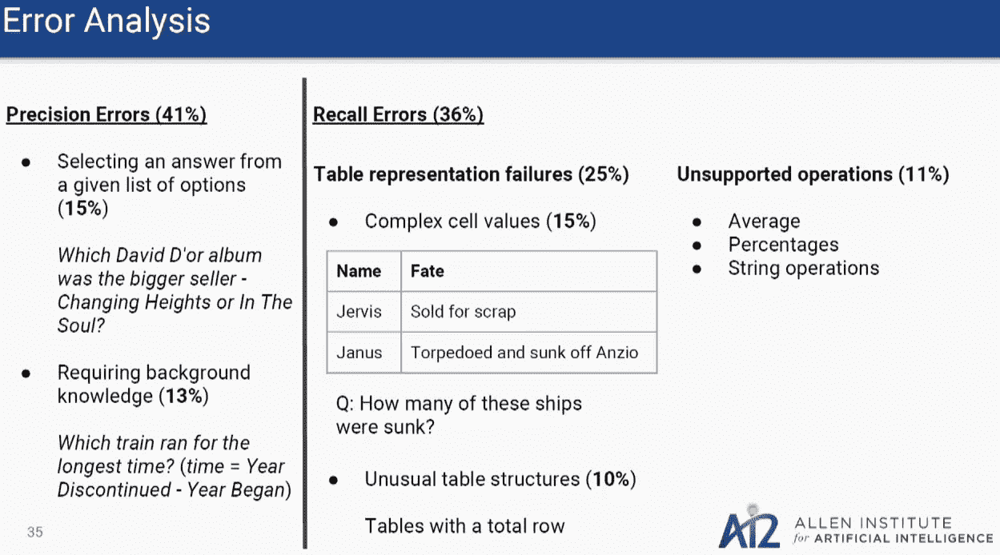

# 半结构化表格的带类型约束的神经语义分析

> 原文：<https://towardsdatascience.com/semantic-parsing-with-type-constraints-542efb268a68?source=collection_archive---------18----------------------->

## 将这篇高水平的人工智能研究论文总结成字节大小的片段

Photo by [Startaê Team](https://unsplash.com/@startaeteam?utm_source=medium&utm_medium=referral) on [Unsplash](https://unsplash.com?utm_source=medium&utm_medium=referral)

这是对

*针对半结构化表格的具有类型约束的神经语义解析*

由[贾扬特·克里希那穆提](https://www.linkedin.com/in/jayant-krishnamurthy-134035188/)、[帕拉德普·达西格](https://www.linkedin.com/in/pradeepdasigi/)和[马特·加德纳](https://www.linkedin.com/in/matt-gardner-34292bbb/)在此发现:

[http://ai2-website . S3 . Amazon AWS . com/publications/wikitables . pdf](http://ai2-website.s3.amazonaws.com/publications/wikitables.pdf)

# 两句外卖

不关注语言语义的自然语言处理(NLP ),只产生哪些单词更常用/不常用以及哪些单词可能与这些单词相关的基本统计数据；因此，如果没有类型约束，就无法实现真正的自然语言理解(NLU ),因为语言的结构(对理解意义至关重要)没有传达给模型。

Their technique checks all the boxes. Image from the [authors’ slide deck on this paper](https://nlp.stanford.edu/seminar/details/jkrishnamurthy.pdf).

为了克服这个障碍，作者实现了一种新的编码器-解码器解析器，使用约束来确保他们的 NLU 模型理解语言如何构造的逻辑，从而能够学习不同的实体如何相互关联，推动神经语义解析器的发展。

## 过去的方法

以前已经通过各种方法解决了这个问题，作者从这些方法中吸取了好的方面，同时避免了大部分的缺点。其中包括:

*   形式主义，使用隐藏变量或机器翻译将数据转换成词汇化的[语法形式](https://en.wikipedia.org/wiki/Formal_grammar)(如 [CCG](https://en.wikipedia.org/wiki/Combinatory_categorial_grammar) )。然而，前一种方法很难训练，后一种方法不精确。
*   实体链接将相关单词/概念连接在一起，但通常是通过固定规则或词典手动或粗略完成的。
*   监督，涉及数据中的标记逻辑形式或被限制为问答对。贴标签证明是昂贵的/困难的；同时，问答配对的效用有限，但应用灵活。

## 他们的第一个新方法:类型约束解码

Krishnamurthy 等人的模型通过将编码器-解码器框架捆绑到他们的 [LSTM](https://skymind.ai/wiki/lstm) 中来解决这些限制，以将[输入单词向量](https://medium.com/explore-artificial-intelligence/word2vec-a-baby-step-in-deep-learning-but-a-giant-leap-towards-natural-language-processing-40fe4e8602ba)转换成逻辑形式(类似于古老的 [seq2seq 方法](https://medium.com/@devnag/seq2seq-the-clown-car-of-deep-learning-f88e1204dac3))，但关键是他们还在语法上分配了类型约束。这种方法实现了前面提到的前一种方法的精度，自动对实体链接进行编码，同时还无需手动标记即可进行缩放。

Image from the [authors’ slide deck on this paper](https://nlp.stanford.edu/seminar/details/jkrishnamurthy.pdf).

他们工作的真正关键在于对解码后的语法实施类型约束:约束是参数的必要条件。使用自动分配的类型约束，他们能够仅使用以下 4 类规则来导出每个有效的逻辑形式:

> Application“通过将从β到τ的函数应用于β类型的参数，重写τ类型的非终结符。我们也允许有多个参数的应用程序。
> 
> constant-“其中 constant const 的类型为τ。该规则生成与表无关的操作(如 argmax)和特定于表的实体(如 united_states)，"
> 
> Lambda –"生成 lambda 表达式，其中参数的类型为α。x 代表一个新的变量名。这个规则的右边用 x 的绑定来扩展范围γ，然后生成τ类型的表达式。”
> 
> 变量-“此规则在当前范围内的先前生成的 lambda 表达式中生成一个变量绑定。”

The parser starts off by predicting the logical form’s root type then decodes all the data into logical forms using the rules and constraints. Image from the [authors’ slide deck on this paper](https://nlp.stanford.edu/seminar/details/jkrishnamurthy.pdf).

基本上，最大的湖的名称是通过按照以 km 为单位的面积的类型约束从最大到最小对所有湖的列表进行排序来找到的，并且再次使用类型约束来返回名称而不是另一个数据点，例如面积。

一个更简单的例子可以是找到等式的结果:` 35 x 1.2 = `这将通过应用以下类型约束来实现:

*   整数类型约束将应用于 35，以使它只关注数字，而不是事实，如史密斯大厦的观景台在第 35 层。
*   将应用乘法函数类型约束来进行数学运算，而不是使用字母“x”。
*   浮点数类型约束将应用于 1.2，以防止数字向下舍入到整数 1。
*   并且将所有这些放在一起将得到“35 * 1.2 = 42”的计算结果

## 他们的第二个贡献是:用语义解析器训练实体链接

除了训练他们的核心模型来解析问答对的语义之外，他们还训练了一个独立的 LSTM 模型来处理与主模型并行的实体链接。研究人员没有依赖于手动完成的每个单词嵌入(单词的数字表示)的冗长的实体链接，或者在手头任务的上下文之外创建的通用的、不可变的实体链接词典，而是创建了一个单独的模型来映射上下文感知的实体链接矩阵，该矩阵是随着他们的主要语义解析器学习更多而创建和更新的，从而在良性循环中加强语义解析器。

Image from the [authors’ slide deck on this paper](https://nlp.stanford.edu/seminar/details/jkrishnamurthy.pdf).

链接的创建部分基于单词的相似性，部分基于单词如何一起使用。因此，单词“Boatswain”与“Boathouse”的联系比“Cummerbund”更紧密，但如果解析描述“Cummerbund”可以存储在“boathouse”中的所有不同方式和数量的语料库，这两个单词将开始在此上下文中建立紧密的联系。这种学习术语在当前主题的上下文中如何相互关联的能力使得它们的语义解析器能够实现令人印象深刻的性能；它可以以类似于人类学习的方式建立利基领域的专业知识，不仅在当前“阅读”的内容中建立联系，还可以联系到它“阅读”的其他内容，这种影响随着“阅读”的增加而加剧。

## 第三:关于外延的动态规划(DPD)

将所有这些改进结合在一起，他们在每个表格/语料库/主题上使用 DPD，计算将导致答案的所有逻辑一致的约束组合。通常，如果可能的预测数量相对较少，则来自解析器的结果/进程相对容易评估，但是随着该数量的增加，以传统方式(通过网络架构处理它们)评估这些选项的难度/成本会呈指数级增加，对于复杂的主题来说很快变得不可行。

Image from the [authors’ slide deck on this paper](https://nlp.stanford.edu/seminar/details/jkrishnamurthy.pdf).

Krishnamurthy 等人通过将他们的评估限制在最可能的最佳预测的限度内来解决这个问题。以前的方法在选择它们的边际对数似然最佳预测时，要么需要使用非常高的限制。或者先前的尝试使用了强化学习技术，由于较差的信噪比，该技术不适合复杂的对象。这种新颖的方法在合理的限制范围内有效，因为他们首先使用 DPD 限制了可能的选项集，因此只有有效的选项是可能的。这使得他们能够以更低的成本获得更好的结果。

## 数据

由于其复杂性(深度)和广泛的信息范围(广度)，研究人员选择在 [WikiTableQuestions 数据集](https://nlp.stanford.edu/blog/wikitablequestions-a-complex-real-world-question-understanding-dataset/)上测试他们的结果。这个数据集由维基百科上各种主题的数据表组成:具体来说是 2108 个表。此外，它包含 22033 个复杂程度不同的问题，需要语义解析器来真正理解数据以及数据之间的关系，以便更好地执行。此外，该数据集有一个基于新鲜表格的隐藏测试问题集，允许模型接受未知数据的挑战，以证明其归纳新主题的能力，并表明它不仅仅是记住问答对。

此处信息的巨大广度和深度为语义理解机器通过克服以下挑战展示能力提供了几个机会:

*   图式映射——理解不同的词可能被用来指代相同的想法
*   组合性——大短语通常由许多小短语组成，每个小短语都相对简单。
*   各种操作——问题中的每一个小短语都可能是需要对数据进行的不同类型的操作，例如:过滤数据、精确定位数据、计算统计数据和比较数量

Complex questions like this are available to train on and to test the true capabilities of a semantic parsing model. Image from the [authors’ slide deck on this paper](https://nlp.stanford.edu/seminar/details/jkrishnamurthy.pdf).

以前对 QA 数据集的尝试倾向于要么强烈关注深度，而广度非常狭窄(例如"哪些州与德克萨斯州接壤，有一条主要河流？"但是只关注地理)或者他们覆盖了广泛的问题而没有深入到任何主题(例如“世界上有哪些国家说法语？”).

## 表演

使用类型约束解码，用语义解析器和 DPD 训练的实体链接，Krishnamurthy 等人能够在 WikiTableQuestions 数据集上超越现有技术水平，证明他们的方法除了理论之外也是实用的。由于这个数据集如此之深和庞大，这些不是简单的是/否问题；因此，45.9%是一个非常令人印象深刻的结果。

Comparison with the other cutting edge approaches. Image from the [authors’ slide deck on this paper](https://nlp.stanford.edu/seminar/details/jkrishnamurthy.pdf).

他们训练了使用单一模型和模型集合的语义解析器版本，以显示这些方法可以跨多种实现工作。总体基本上是一组不同的(有时非常不同，有时只是略有不同)模型，所有这些模型一起接受训练，每个模型做出一个预测，并比较它们的答案，以在大多数情况下得出一个更好的选择。想要更好的解释，请看这个:[https://towards data science . com/two-is-better-one-ensembling-models-611 ee 4 fa 9 BD 8](/two-is-better-than-one-ensembling-models-611ee4fa9bd8)

Type constraint (left) and entity linking (right) experiments’ results. Images from the [authors’ slide deck on this paper](https://nlp.stanford.edu/seminar/details/jkrishnamurthy.pdf).

除了测试各种实现之外，他们还通过有选择地关闭特定模块来测试这 3 种贡献，以查看对整体性能的影响。

When the team dug into the reasons for the model’s errors, they seemed to be due to a variety of reasons, all with rather intuitive explanations. Image from the [authors’ slide deck on this paper](https://nlp.stanford.edu/seminar/details/jkrishnamurthy.pdf).

这些结果表明，所有这三种方法一起对语义分析和自然语言处理的整体技术水平产生了显著的进步。虽然还有改进的空间，但这些贡献解决了解析器在真实用例中实际实现所需的许多挑战。

Image from the [authors’ slide deck on this paper](https://nlp.stanford.edu/seminar/details/jkrishnamurthy.pdf).

## Krishnamurthy 等人的代码:

 [## allenai/allennlp

### 一个基于 PyTorch 的开源 NLP 研究库。- allenai/allennlp

github.com](https://github.com/allenai/allennlp/blob/master/allennlp/models/semantic_parsing/wikitables/wikitables_mml_semantic_parser.py) 

## 帕拉德普·达西吉介绍他们的研究:

[https://vimeo.com/238234920](https://vimeo.com/238234920)

## 演示本文结果的幻灯片:

[https://nlp.stanford.edu/seminar/details/jkrishnamurthy.pdf](https://nlp.stanford.edu/seminar/details/jkrishnamurthy.pdf)

我期待着听到您对本文或讨论的主题的任何反馈或问题，无论是在这里还是在社交媒体上。随时联系我(只要告诉我你看到这篇文章了)→

[twitter.com/theNathanielW](https://twitter.com/theNathanielW)

【linkedin.com/in/theNathanielWatkins 号