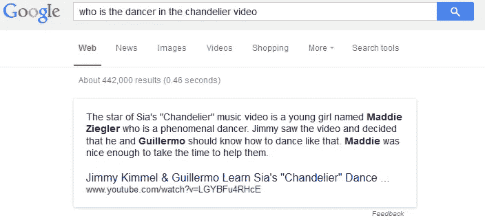
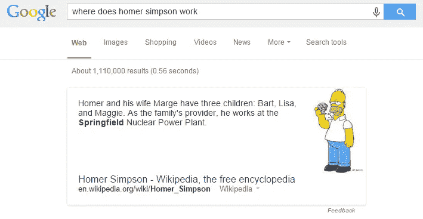

# 语义搜索

> 原文：<https://towardsdatascience.com/semantic-search-73fa1177548f?source=collection_archive---------5----------------------->

## 关于语义、搜索和语义搜索的简短帖子

Photo by [Kayla Farmer](https://unsplash.com/@imagesbykayla?utm_source=medium&utm_medium=referral) on [Unsplash](https://unsplash.com?utm_source=medium&utm_medium=referral)

## ⚠️在我的博客⚠️中读到了[的原帖](https://anebz.eu/semantic-search)

**语义学**是语言学的一个分支，研究单词的含义、它们的符号用法，也包括它们的多重含义。

> “一天早上，我射杀了一头穿着睡衣的大象。我永远也不会知道他是怎么穿上我的睡衣的。”格劳乔·马克斯

这句话在语义上是模棱两可的:不清楚作者是穿着睡衣射杀了一头大象，还是他射杀了一头大象，而大象恰好穿着睡衣。显然，在这个例子中，两者中只有一个有意义，但两种情况都是语法正确的。

> "约翰和玛丽结婚了。"(对彼此？还是分开？)
> 
> 约翰吻了他的妻子，萨姆也吻了。(山姆吻了约翰的妻子还是他自己？)

[更多关于语言歧义的信息](https://cs.nyu.edu/faculty/davise/ai/ambiguity.html)。

## 词汇搜索引擎

起初，**搜索引擎** (Google，Bing，DuckDuckGo，Yahoo 等。)是*词汇:*搜索引擎寻找查询词的**字面**匹配，而不理解查询的含义，并且仅返回包含精确查询的链接。

例如，如果用户寻找“cis lmu”，来自 lmu 大学的 cis 中心的主页匹配该查询，因为:

*   CIS 中心的主页包含这两个词
*   主页的 url 包含这两个词
*   该页面位于域的顶级
*   以及由搜索引擎指定的许多其他原因

所有这些标准都很容易检查，它们本身就使这个页面成为这个查询的首选。不需要更深入地理解查询实际“意味着”什么或者主页实际“关于”什么。

# 语义搜索

[语义搜索](https://en.wikipedia.org/wiki/Semantic_search)是**有意义的搜索**。此“*意为*”可以指搜索过程的各个部分:

*   理解查询，而不是简单地寻找文字匹配，
*   或者以适合有意义检索的方式表示知识。

语义搜索超越了查询的“静态”字典含义，以理解搜索者在特定上下文中的意图。通过从过去的结果中学习并创建实体之间的链接，搜索引擎可以利用出现在可搜索数据库中的术语的上下文含义来生成更相关的结果。

它还允许用户提出自然语言问题，而不是让计算机理解我们的语言:“我如何开始数据科学的职业生涯？”vs .“数据科学职业步骤和技巧”。在第二种情况下，没有动词或不必要的单词，只有用户认为与搜索引擎相关的关键字。

语义搜索结果还要求将来自几个不同来源的信息汇集在一起，以令人满意地回答查询。

在这个例子中，主要结果是关于吉米·基梅尔和吉列尔莫关于 Maddie Zieger 的 YouTube 视频，Maddie zie ger 是“Sia 枝形吊灯音乐视频的明星”。

*   谷歌“理解”查询“谁是 X”的结果必须是一个人的名字。
*   请注意，“麦迪·齐格勒”和“吉列尔莫”都被突出显示，这是谷歌的一个不正确的结果。另一方面，“吉米”没有突出显示。可能是因为 Guillermo 比 Jimmy 更接近句子中的动词 dance。对于更高级的读者来说，你可能会注意到第三行中的代词“他”指的是吉米，两个男人属于同一类别，因此同样接近动词“舞蹈”，但成功地将“他”与“吉米”联系起来是另一个语言学问题，称为*共指消解*，在本例中没有得到很好的解决。([维基百科链接，](https://en.wikipedia.org/wiki/Coreference#Coreference_resolution) [斯坦福 NLP 小组的实现](https://nlp.stanford.edu/projects/coref.shtml))
*   “吊灯视频中的舞者”和“吊灯音乐视频中的明星…谁是一个非凡的舞者”没有字面上的匹配。这些词没有出现在彼此旁边，但搜索引擎将“音乐视频中的明星”和“舞者”联系起来。

在这个例子中，结果不仅正确显示，而且有一个用户友好的部分，有一张图片，以及其他类似的建筑和它们的高度。

显示的例子是谷歌的结果。即使近年来其他搜索引擎已经实现了语义搜索功能，谷歌是第一个这样做的，2013 年更新了[蜂鸟](https://www.searchenginejournal.com/google-algorithm-history/hummingbird-update/#close)，也是迄今为止最准确的一个。

## 奖金:[怎么用？](https://medium.com/value-stream-design/semantic-search-2371fda0bbf5)

谷歌在 2012 年包括了一个知识图，一个[本体，](https://en.wikipedia.org/wiki/Ontology_%28information_science%29)以图形格式表示人、地点和事物之间的语义关系。这些关系可以是同义词、同音异义词等。随着 2013 年蜂鸟的更新，谷歌拥有了一个巨大的知识图表，其中收集了大约[5.7 亿个概念和关系](https://www.crazyegg.com/blog/google-hummingbird-change-approach-seo/)。

当一个新的查询到达系统时，首先通过使用自然语言处理(NLP)算法，如词性标注检索、命名实体识别、纠错、转换为单词嵌入、搜索同义词等，将查询分解成根术语。

然后，将这些术语匹配到本体中，从庞大的图中获得最接近的术语。这些术语或链接与输入更相关。好的系统使本体独立于语言，这样西班牙语的查询可以匹配英语的本体术语。

## 其他链接

[1]:巴斯特，布赫霍尔德，奥斯曼，[关于文本和知识库的语义搜索](http://ad-publications.informatik.uni-freiburg.de/FNTIR_semanticsearch_BBH_2016.pdf)，弗赖堡大学，2016

[2]:曼戈尔德，[语义搜索
方法的综述和分类，](https://www.semanticscholar.org/paper/A-survey-and-classification-of-semantic-search-Mangold/344885b612ddbe5ede930571bd433f195245147d)斯图加特大学，2007

[3]: Fatima，Luca，Wilson，[语义搜索引擎的新框架](https://www.researchgate.net/publication/262635559_New_Framework_for_Semantic_Search_Engine)，安格利亚·罗斯金大学，2014

Github 工程，[走向自然语言语义码搜索，](https://github.blog/2018-09-18-towards-natural-language-semantic-code-search/) 2018

Hamel Husain，[如何用深度学习为任意对象创建自然语言语义搜索](/semantic-code-search-3cd6d244a39c)，2018