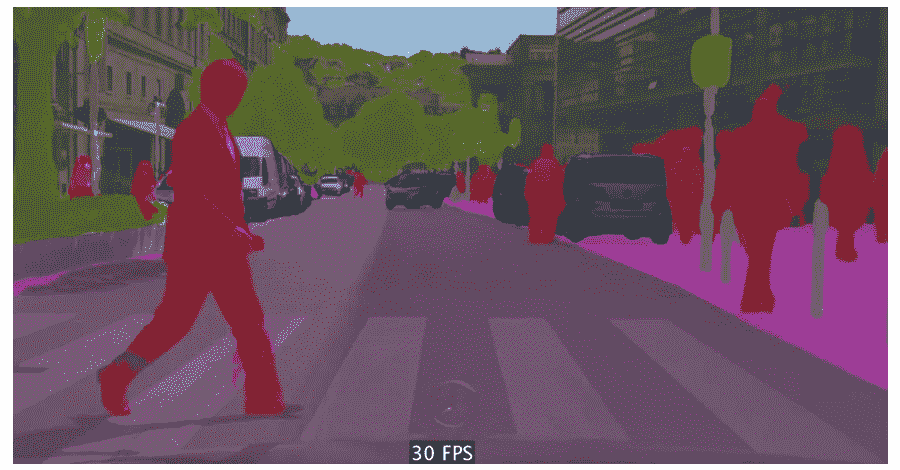
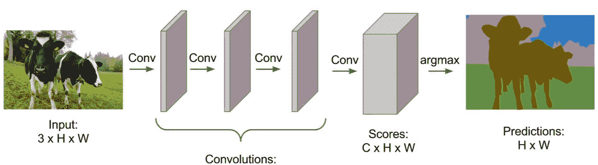
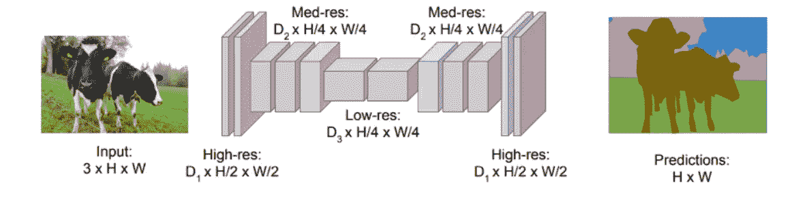
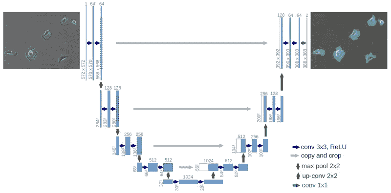

# 神经网络时代的语义分割

> 原文：<https://towardsdatascience.com/semantic-segmentation-in-the-era-of-neural-networks-703bf93e5ee1?source=collection_archive---------19----------------------->

图像分割是计算机视觉和目标识别与检测的基本任务之一。在语义分割中，目标是**将图像的每个像素分类到特定的类别**。与图像分类的不同之处在于，我们不是将整个图像分类到一个类中，而是对每个单独的像素进行分类。因此，我们有一组预定义的类别，我们希望在图像的每个像素中分配一个标签。我们根据图像中不同物体的上下文来完成这项任务。

我们可以在上图中看到一个真实的例子。图像的每个像素都被分配了一个特定的标签，并用不同的颜色表示。红色代表人，蓝色代表车，绿色代表树等等。

值得一提的是，语义分段不同于实例分段，在实例分段中，我们为同一类的实例区分标签。在那种情况下，人们会有不同的肤色。

但是我们在乎吗？(对了，如果你不知道 frak 是什么意思，就去狂看《太空堡垒卡拉狄加》吧。太牛逼了)。为什么我们需要这种高细节的处理？

事实证明，语义分割有许多不同的应用。你可以从上图中猜出第一种。自动驾驶汽车。自动驾驶汽车需要知道自己看到了什么。他们需要知道一切。每个该死的像素。另一个普遍的应用当然是在机器人领域(工业或非工业)。我不能列举更多。地理传感，农业，医学图像诊断，面部分割，时尚。

如果你被说服了，让我们来看看如何完成这个任务。这并不难理解。

# 深度学习

深度神经网络彻底改变了计算机视觉，尤其是图像分类，这不是什么秘密。从 2012 年到今天，它大幅超越了它的前辈。计算机比人类更擅长图像分类，这是现在的事实。不可避免地，我们也使用相同的技术进行语义分割。他们成功了吗？

当然，他们做到了。卷积神经网络现在是这类问题的行业标准。我不会用这个领域中所有架构的历史倒叙来烦你。相反，我将向你展示 2019 年出现的最先进的技术。

但首先让我们更具体地定义我们的问题:

*   图像的每个像素必须被分配到一个类别，并相应地着色
*   输入和输出图像应该具有完全相同的大小
*   输入中的每个像素必须与输出中完全相同位置的像素相对应
*   我们需要像素级的精度来区分不同的类。

考虑到这些因素，我们来看一下架构:

# 全卷积网络(FCN)

全卷积网络只包括卷积层和汇集层，不需要完全连接。最初的方法是使用一堆相同大小的卷积层将输入图像映射到输出图像。

Stanford University School of Engineering

正如你可能想象的那样，它产生了相当好的结果，但是它的计算量非常大。问题是，他们不能使用任何缩减像素采样或合并图层，因为这将搞乱实例的位置。为了保持图像分辨率，他们需要添加许多层来学习低级和高级特征。因此，它最终变得非常低效。

为了解决这个问题，他们提出了一种编码器-解码器架构。编码器是一个典型的卷积网络，如 AlexNet 或 ResNet，解码器由去卷积(虽然我不喜欢这个术语)和上采样层组成。**下采样步骤的目标是捕获语义/上下文信息，而上采样的目标是恢复空间信息**。

Stanford University School of Engineering

这样，他们设法大大降低了时间和空间的复杂性。而且，最终的结果。因为编码器降低了图像分辨率，所以分割缺少定义明确的边缘，这意味着图像之间的边界没有明确定义。

拯救:跳过连接。

**跳过连接绕过层，将信息原封不动地传递给下一层**。在我们的例子中，我们使用它们将信息从编码器的早期层传递到解码器，绕过下采样层。事实上，这有助于改善分割的细节，使形状和边缘更加精确。

# 优信网

基于全编解码和跳连接概念，全卷积网络的思想扩展到了 U-net **。U-net 通过增加解码器的大小来匹配编码器，从而在 FCN 中引入对称性，并使用级联**来取代跳过连接中的求和操作。

由于对称性，我们可以将更多的信息从下采样层传输到上采样层(因为现在有更多的要素地图)，从而提高最终输出的分辨率。

[https://datascience.stackexchange.com](https://datascience.stackexchange.com)

U-nets 最初是为生物医学图像分割而开发的，但它们也用于各种不同的应用中，如添加完全连接的层或残差块。

为了完全掌握 U-net 的思想，让我们写一些代码来实现它是多么简单。我们将使用 python 和 keras 框架来进一步简化事情。

你认为我在开玩笑吗？就是这样。堆叠在一起的一堆卷积层、池层和上采样层，以及实现跳过连接的一些连接。非常简单还是什么？

当然，我们仍然需要做大量的工作，比如预处理我们的输入数据，扩充它们，更重要的是找到它们。我的意思是，为我们的训练收集地面图像根本不是一件容易的事情。试想，对于每一幅输入图像，我们都希望它的分割能够找到它们之间的误差。我们如何构建地面真实分段？用手吗？那是做这件事的一种可能的方法。通过一个精心制作的剧本？也许吧。有一点是肯定的。这并不容易。

最后，我想提一下，还有其他非常聪明的方法来执行语义分割，但大多数都是建立在 FCN 和 U-Net 之上的。其中一些是:

*   使用 atrous 卷积的 DeepLab
*   [金字塔场景解析网](https://arxiv.org/abs/1612.01105)
*   [多路径细化网络](https://arxiv.org/abs/1611.06612)
*   [全球卷积网络](https://arxiv.org/pdf/1703.02719.pdf)

语义分割是一个非常活跃的研究领域，因为它在现实世界的应用中非常重要和紧急，所以我们期待在未来几年看到更多的论文。计算机视觉和深度学习的结合非常令人兴奋，并在复杂的任务中给了我们巨大的进步。你认为如果没有深度学习，特斯拉自动驾驶汽车今天已经行驶了 12 亿英里吗？我个人不这么认为。让我们看看未来会怎样…

> ***如果你有任何想法、评论、问题或者只是想了解我的最新内容，请随时在***[**Linkedin**](https://www.linkedin.com/in/sergios-karagiannakos/)**，**[**Twitter**](https://twitter.com/KarSergios)**，**[**insta gram**](https://www.instagram.com/sergios_krg/)**，**[**Github**](https://github.com/SergiosKar)

***原载于 2019 年 1 月 25 日*[*sergioskar . github . io*](https://sergioskar.github.io/Semantic_Segmentation/)*。***