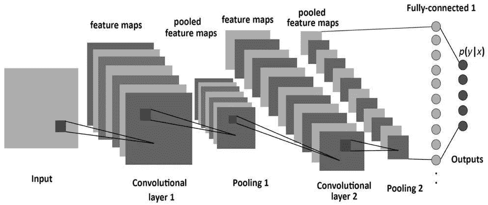
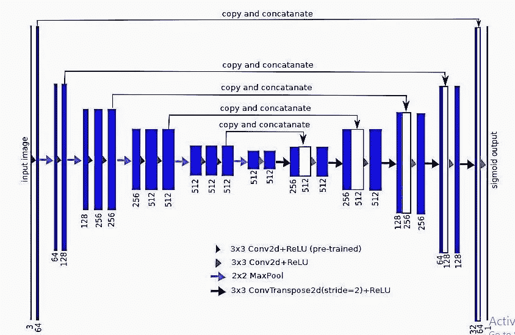
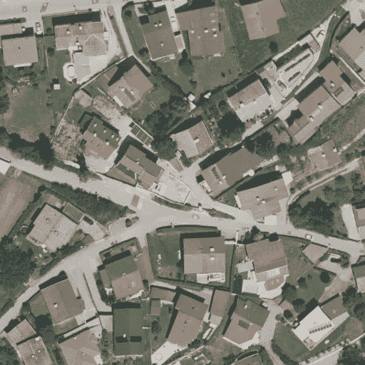
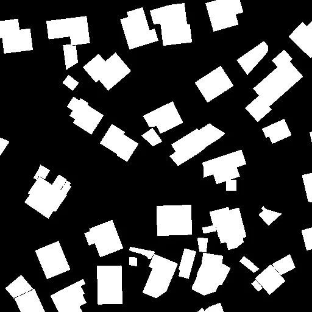

# 基于深度学习的航空图像语义分割

> 原文：<https://towardsdatascience.com/semantic-segmentation-of-aerial-images-using-deep-learning-90fdf4ad780?source=collection_archive---------11----------------------->

source: [matheen faiz](https://unsplash.com/@matheenfaiz) on [unsplash](https://unsplash.com/?utm_source=medium&utm_medium=referral).

在计算机视觉和图像处理中，逐像素图像分割是一项具有挑战性和高要求的任务。这篇博客是关于从航空(卫星/无人机)图像中分割建筑物的。高分辨率遥感数据的提供为有趣的应用开辟了可能性，例如更详细地按像素对单个物体进行分类。通过使用卷积神经网络(CNN ),图像的分割和分类变得非常有效和智能。在本文中，我们使用了非常高分辨率和尺寸的图像，因此图像被裁剪并减小了尺寸，以便在具有正常规格的中等水平的计算机中容易地进行处理。该模型受 UNET 模型的启发，后者广泛用于输出与输入格式相同的网络。该模型通常用于医学科学领域，以检测医学图像中的异常，如发现骨折或肿瘤。微调或迁移学习也用于提高模型的准确性。微调超参数可以有助于改进模型的学习，因为使用了先前训练的模型的编码器。为了针对不同的挑战情况训练我们的模型，以便我们的模型可以产生更准确的结果，我们使用了数据扩充，即拍摄一幅图像并对其进行一些更改，如改变色调、饱和度、亮度值、缩放和改变角度、旋转等，以提供广泛的训练情况，这在训练数据较少或不足的情况下也有帮助。总的来说，经过充分的数据训练后，该模型能够得到高精度的结果。

## 什么是语义切分？？它的实际应用有哪些？？

对无人机图像进行语义分割以对不同属性进行分类是一项非常具有挑战性的工作，因为差异非常大，你不能指望这些地方是相同的。手动分割这些图像以用于不同的应用是一项挑战，也是一个永无止境的过程。因此，需要自动化和智能系统来自动完成我们的工作。所以，剧中的神经网络来了。近年来，神经网络和深度学习在不同领域的应用达到了高峰，解决这一挑战性问题的有趣和智能的方法吸引了不同领域的人们的注意。因此，由于数据的不规则性，通过应用神经网络的概念来解决这个问题是一个有点挑战性的任务。

卷积神经网络(CNN)，是处理图像的深度学习概念。在正常的神经网络操作中，每个节点都是相互连接的，创建了一个复杂的网络，但如果我们在图像中应用相同的东西(它本身就是一个大矩阵)，事情就不会那么好了，因为每个像素在那里充当一个节点，当这几百万个像素与另一层连接时，就会有几百万或几十亿个连接，所以在那种情况下计算太复杂了，所以为图像创建了一种新的方式，我们称之为卷积神经网络。这里的概念基本上是我们卷积图像到另一层。

该计划可以在各种商业目的中实施，例如:无人机是一种新的广泛使用的技术，具有广泛的实施范围，如检查任何区域或交付产品，因此该计划有助于定位准确的位置并提高准确性。通过自动检测建筑物，我们可以使用这些数据来预测人口密度或计算住宅区、商业区或无人居住区的面积。在线地图是目前广泛使用的技术，通过自动检测建筑物等属性，可以很容易地在地图上显示特定区域，这可以有多种应用，如标记区域或使用地图创建建筑物的三维模型。这个项目的另一个主要应用是它在灾害管理中非常有用，例如，如果一个地方遭受了地震或洪水等灾害，那么可以使用飞行器来救援或运送食物，如果建筑物在更短的时间内以高精度定位，就可以做到这一点。此外，这在实际生活中还有许多其他的应用，也可以有益于社会和商业目的。

使用神经网络来创建一些自动化的工作，改变了传统的和缓慢的做事方式，从而产生高精度的结果，这既节省时间又节省成本，而无需任何忙乱的工作；由于航空图像分割是一个重要的挑战，其实际应用是巨大的，自动化是一个很好的解决方案。这里用于语义分割的 UNET 模型受到医学领域的启发。UNET 的真正应用是用于医学图像，即当与正常图像的大数据集比较时，检测像肿瘤或骨折等异常。由于这些敏感的工作需要非常高的精度，所以 CNN 的层被做得更深以学习更重要的特征。这一点启发我们将该模型用于航空图像，因为建筑物之间的差异是完全独特的，并且有许多参数和特征要学习，如果将其用于实际应用，高精度也是必要的。

# 使用的基本概念/技术

**神经网络-** 人工神经网络(ANN)是一种信息处理范式，其灵感来自生物神经系统(如大脑)处理信息的方式。这个范例的关键要素是信息处理系统的新颖结构。它由大量高度互联的处理元件(神经元)组成，这些元件协调工作以解决特定的问题。人工神经网络像人一样，通过例子来学习。通过学习过程，人工神经网络被配置用于特定的应用，例如模式识别或数据分类。生物系统中的学习涉及对神经元之间存在的突触连接的调整。

Fig. A Simple Neural Network Architecture.

**卷积神经网络-** U-Net 架构由捕获上下文的收缩路径和实现精确定位的对称扩展路径组成。收缩路径遵循卷积网络的典型架构，具有交替的卷积和汇集操作，并逐渐向下采样特征地图，同时增加每层的特征地图的数量。扩展路径中的每一步都包括特征图的上采样，然后是卷积。

U-Net 能够从相对较小的训练集中学习。在大多数情况下，用于图像分割的数据集最多由数千个图像组成，因为手动准备掩模是非常昂贵的过程。通常，U-Net 是从随机初始化的权重开始从头开始训练的。众所周知，没有过拟合的训练网络的数据集应该是相对较大的，数百万张图像。在 Image-net 数据集上训练的网络被广泛用作其他任务中网络权重的初始化源。以这种方式，可以对网络的非预训练的几层(有时仅对最后一层)进行学习过程，以考虑数据集的特征。

Fig. A Simple Convolutional Network Structure.

**UNET 模型**——U-Net 架构由一个捕捉上下文的收缩路径和一个支持精确定位的对称扩展路径组成。收缩路径遵循卷积网络的典型架构，具有交替的卷积和汇集操作，并逐渐向下采样特征地图，同时增加每层的特征地图的数量。扩展路径中的每一步都包括特征图的上采样，然后是卷积。

UNET 能够从相对较小的训练集中学习。在大多数情况下，用于图像分割的数据集最多由数千个图像组成，因为手动准备掩模是非常昂贵的过程。通常，U-Net 是从随机初始化的权重开始从头开始训练的。众所周知，没有过拟合的训练网络的数据集应该是相对较大的，数百万张图像。在 Image-net 数据集上训练的网络被广泛用作其他任务中网络权重的初始化源。以这种方式，可以对网络的非预训练的几层(有时仅对最后一层)进行学习过程，以考虑数据集的特征。

Fig. A Simple U-NET Structure.

**使用 VGG-16 编码器进行微调(在 image-net 上进行了预训练)** -作为我们 U-Net 网络中的编码器，我们使用了相对简单的 VGG 系列 CNN，由 11 个连续层组成，称为 VGG16。VGG16 包含七个卷积层，每个卷积层后面都有一个 ReLU 激活函数，以及五个最大轮询操作，每个操作将特征映射减少 2。所有卷积层都有 3×3 个内核。第一个卷积层产生 64 个信道，然后，随着网络的加深，在每次最大池化操作之后，信道的数量加倍，直到它达到 512。在随后的层上，通道的数量不变。为了构建编码器，我们删除了完全连接的层，并用 512 个信道的单个卷积层代替，该卷积层充当网络的瓶颈中心部分，将编码器与解码器分开。

为了构造解码器，我们使用转置卷积层，它将特征图的大小加倍，同时将通道的数量减少一半。并且转置卷积的输出然后与解码器的相应部分的输出连接。通过卷积运算来处理所得到的特征图，以保持通道的数量与对称编码器项中的相同。这个上采样过程重复 5 次，以与 5 个最大池配对。从技术上讲，完全连接的层可以接受任何大小的输入，但因为我们有 5 个最大池层，每个层对图像进行两次下采样，所以只有边长可被 32 整除的图像可以用作当前网络实施的输入。

# 提议的模型/工具

**数据集** -我将我的模型应用于 Iniria 航空影像标注数据集。该数据集由 180 幅欧洲和美国城市居民区的航空影像组成，并被标记为建筑物和非建筑物类别。数据集中的每幅图像都是 RGB 格式，分辨率为 5000×5000 像素，每个像素对应一个 30 厘米×30 厘米的地球表面。但是我们不能把这么大尺寸的图像直接放到我们的代码中，所以我们需要截取这些图像。每个裁剪图像的分辨率必须能被 32 整除。因此，我对这些图像进行了 512x512 分辨率的裁剪，然后将其用于我的算法中。首先，我尝试使用双线性插值来调整图像的大小，但这种技术未能保留图像的重要细节，所以我只是正常地裁剪它。从总数据集来看，80%的图像作为测试数据，其余 20%作为验证集。

**平台和软件要求-**

Jupyter Notebook 中的 Python 3.5 用于编码目的(Anaconda 环境)。

*   Keras 与 Tensorflow(后端)用于开发代码。

**图像增强和图像数据生成器**——图像增强通过不同的处理方式或多种处理方式的组合，如随机旋转、平移、剪切和翻转等，人工生成训练图像。在 Keras 中，有一个名为图像数据生成器的预定义功能，专门用于此目的。我旋转它，放大我的数据集的随机图像。这有助于创建一个模型，更智能地识别不同情况下的建筑物。并且它还增加了数据中的图像数量，这与结果的良好预测成正比。

**带有预训练 vgg16 编码器的 UNET 模型** -我使用预训练的权重来微调我的模型。预训练模型在不同于手头任务的任务上被训练，但是提供了非常有用的起点，因为在旧任务上训练时学到的特征对于新任务是有用的。我已经采取了 vgg16 的编码器部分，并把它的权重是“预先训练的图像网络”使用相同的名称。然后，我根据编码层的结构创建了解码层，通过相应地对其进行上采样，并将这些层“连接”到它们各自的编码层。然后我已经把激活函数取为“亚当”，损耗取为“二元交叉熵”。

**迭代**——迭代/历元数我取 100。并且相应地使用等于测试图像除以所取批量的 step_per_epoch。这同样适用于验证集。

# 实施情况和结果

raw image(left)………………………………………………………………………………….. processed image(right)

# 优点和缺点

**优点-**

这是一种非常有效和简单的技术，可以获得高精度的结果。

这是一项不断改进的最新技术，会定期更新，以便我们将来拥有更好的模型。

您可以在很少的数据中获得很高的准确性。

*   它易于学习和实施

**缺点-**

它需要非常高的计算能力，这使得它是一个有点昂贵的过程。

高端 GPU(图形处理单元)是先决条件，否则将花费太多时间进行训练。

某些标记图像的边界部分有时不太清晰，但这可以通过使用大型数据集或应用 CRF(条件随机场)来解决。

超参数调整是一个耗时的过程。

# 结论

因此，我的结论是，通过使用 UNET，预先训练的 VGG-16 作为编码器，我们可以用非常有限的数据集获得高精度。我只拍摄了 200 张图像，经过训练，准确率达到了 98.5%。我还尝试了不同数量的数据来检查结果，如 2000 张图像，6000 张图像，结果令人满意。由于它的学习与数据的数量成正比，所以提供大数据有助于获得智能学习和更好的结果。我还应用了图像增强，这也有助于通过提高训练数据集的质量来获得更好的结果。因此，总的来说，这是一种非常有效的图像分割技术，用于提取航空图像中的建筑物等特征。