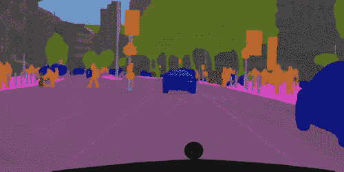
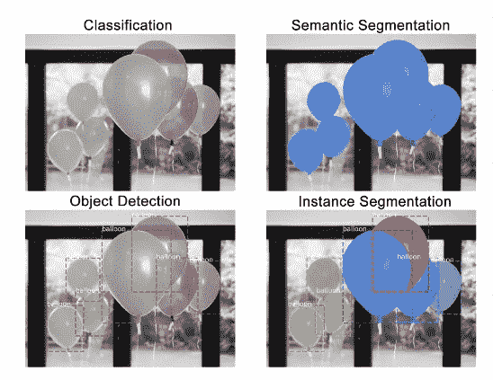
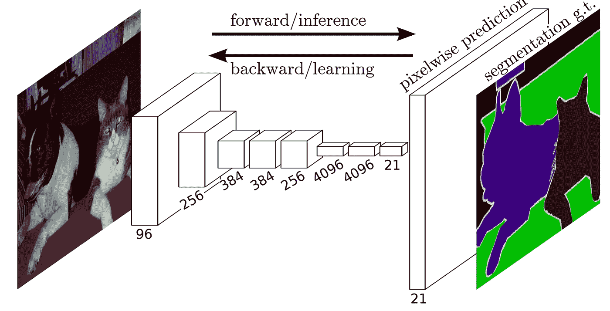
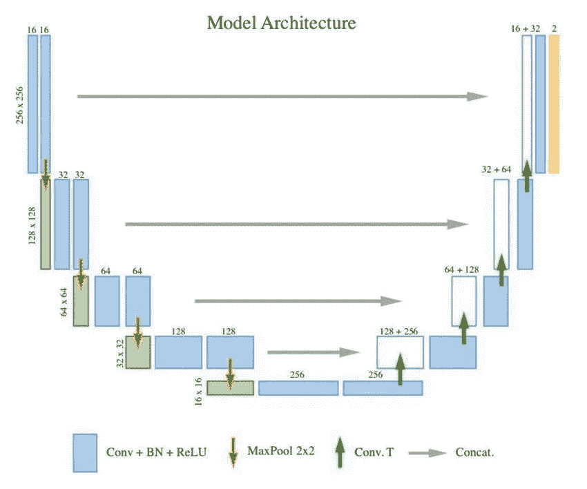

# 语义分割—流行的架构

> 原文：<https://towardsdatascience.com/semantic-segmentation-popular-architectures-dff0a75f39d0?source=collection_archive---------2----------------------->

## 用数据做很酷的事情！

Semantic Segmentation

# **什么是语义切分？**

语义分割的任务是将图像中的每个像素分类，如下图所示。在这里你可以看到所有的人都是红色的，道路是紫色的，车辆是蓝色的，街道标志是黄色的，等等。

语义分割不同于实例分割，实例分割是同一类的不同对象将具有不同的标签，如在 person1、person2 中，因此具有不同的颜色。下图非常清晰地说明了实例分割和语义分割的区别。

Different tasks in computer vision

一个重要的问题可能是，为什么我们需要这种逐像素理解像素位置的粒度？

我想到的一些例子有:

I)自动驾驶汽车——可能需要知道另一辆汽车在路上的确切位置，或者过马路的人的位置

ii)机器人系统——如果机器人知道两个部件的确切位置，那么它们将会表现得更好

iii)损坏检测——在这种情况下，了解损坏的确切程度可能很重要

# 面向语义分割的深度学习模型架构

现在让我们来讨论 3 种进行语义分割的模型架构。

**1。**[**【FCN】**](https://people.eecs.berkeley.edu/~jonlong/long_shelhamer_fcn.pdf)

FCN 是一种流行的语义分割算法。该模型使用各种卷积块和最大池层，首先将图像解压缩到其原始大小的 1/32。然后，它在这个粒度级别上进行分类预测。最后，它使用采样和反卷积层来调整图像的大小到原始尺寸。

Fully Convolutional Network

这些模型通常没有任何完全连接的层。下采样步骤的目标是捕获语义/上下文信息，而上采样的目标是恢复空间信息。图像大小也没有限制。最终图像与原始图像大小相同。为了完全恢复下采样中丢失的细粒度空间信息，使用了跳过连接。跳过连接是至少绕过一个层的连接。这里，它用于将信息从下采样步骤传递到上采样步骤。合并不同分辨率级别的要素有助于将上下文信息与空间信息结合起来。

我训练了一个 FCN 来为自动驾驶汽车执行语义分割或道路与非道路像素。

**2。U-Net**

[U-Net](https://arxiv.org/abs/1505.04597) 架构建立在完全卷积网络(FCN)的基础上，并经过修改，在医学成像中能够产生更好的分割效果。

与 FCN-8 相比，两个主要区别是:

(1)U-网是对称的，并且

(2)下采样路径和上采样路径之间的跳跃连接应用串联运算符而不是求和。

这些跳跃连接旨在向上采样时向全局信息提供局部信息。由于其对称性，网络在上采样路径中具有大量特征图，这允许传递信息。B

U 形网因其对称的形状而得名，不同于其他 FCN 变体。

U-Net 架构分为 3 个部分:

1:收缩/下采样路径
2:瓶颈
3:扩展/上采样路径

U-net model

我已经实现了用于烟雾分割的 U-net。U-net 的一个主要优点是运行速度比 FCN 或 Mask RCNN 快得多。

**3。屏蔽 RCNN**

先来温柔的介绍一下  [Mask RCNN。](https://arxiv.org/abs/1703.06870)

Mask RCNN Model

[更快的 RCNN](https://arxiv.org/abs/1506.01497) 是一个非常好的算法，用于物体检测。更快的 R-CNN 由两个阶段组成。第一阶段，称为区域提议网络(RPN)，提议候选对象包围盒。第二阶段本质上是快速 R-CNN，使用 RoIPool 从每个候选框中提取特征，并执行分类和包围盒回归。这两个阶段所使用的特征可以被共享以用于更快的推断。

屏蔽 R-CNN 在概念上很简单:更快的 R-CNN 对每个候选对象有两个输出，一个类标签和一个边界框偏移量；为此，我们添加了第三个分支，输出对象遮罩—这是一个二进制遮罩，指示对象在边界框中的像素位置。但是额外的遮罩输出不同于类和框输出，需要提取对象的更精细的空间布局。为此，RCNN 使用全卷积网络(FCN)。

简而言之，我们可以说 Mask RCNN 将两种网络——更快的 RCNN 和 FCN——结合在一个大型架构中。模型的损失函数是进行分类、生成包围盒和生成掩模的总损失。

掩模 RCNN 有几个额外的改进，使它比 FCN 更准确。你可以在他们的论文[中读到更多关于他们的内容。](https://arxiv.org/abs/1703.06870)

我已经使用 Keras Matterport github 和 Tensorflow 对象检测训练了自定义掩膜 RCNN 模型。要学习如何自己制作一个面具 RCNN，请跟随[车损检测博客](https://www.analyticsvidhya.com/blog/2018/07/building-mask-r-cnn-model-detecting-damage-cars-python/)的教程。

我有自己的深度学习咨询公司，喜欢研究有趣的问题。我已经帮助许多初创公司部署了基于人工智能的创新解决方案。请到 http://deeplearninganalytics.org/来看看我们吧。

你也可以在 https://medium.com/@priya.dwivedi 的[看到我的其他作品](https://medium.com/@priya.dwivedi)

如果你有一个我们可以合作的项目，请通过我的网站或 info@deeplearninganalytics.org 联系我

# 参考资料:

[更多关于 FCN 的信息](http://deeplearning.net/tutorial/fcn_2D_segm.html)

[关于优信网的更多信息](http://deeplearning.net/tutorial/unet.html)