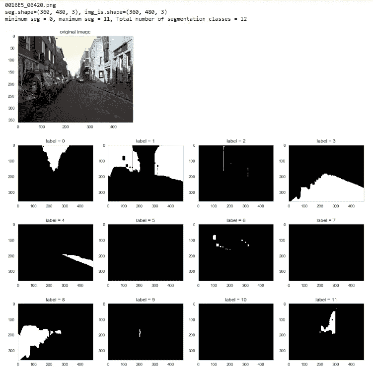
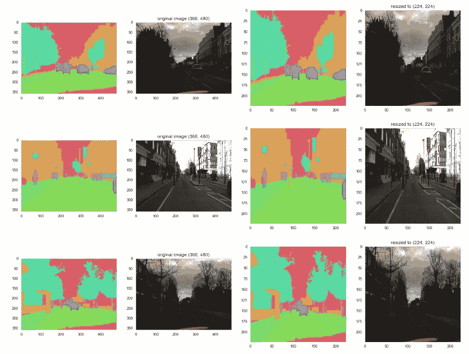
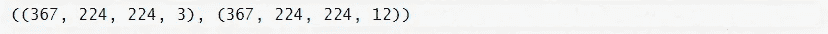
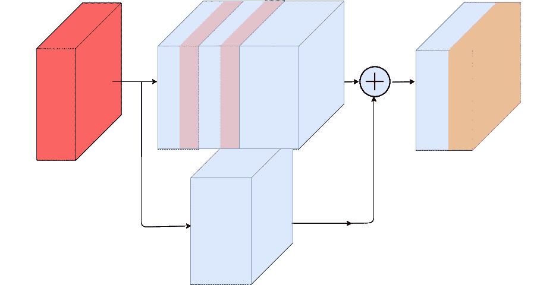
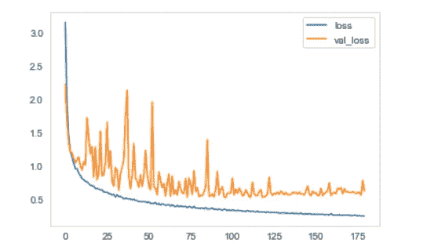
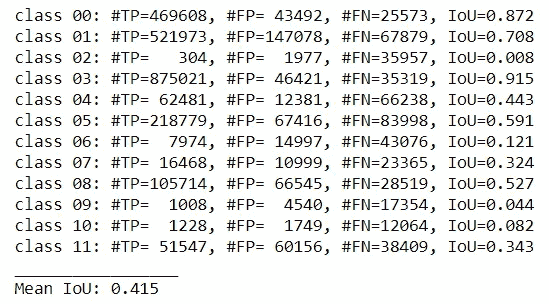
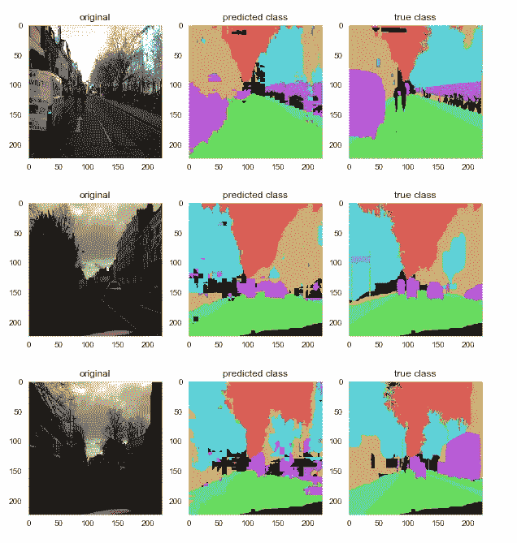

# 使用深度可分离残差神经网络的语义分割

> 原文：<https://towardsdatascience.com/semantic-segmentation-using-deep-separable-residual-neural-networks-ab96184f291f?source=collection_archive---------24----------------------->


Semantic segmentation using Google deep-lab v3

在这篇博客中，我们将看到如何使用深度可分离残差神经网络来执行语义分割。使用可分离的卷积神经网络代替传统的 2D 卷积也被阐明。

# **数据集描述**

对于图像分割任务，我们将使用由 [Divam Gupta](https://github.com/divamgupta) 准备的示例数据。分割数据可从- [驱动器](https://drive.google.com/file/d/0B0d9ZiqAgFkiOHR1NTJhWVJMNEU/view)获得。总共有 12 个分割类和总共 367 个图像及其相应的注释。

# 数据的可视化

使用下面用 python 3 编写的代码块可以很容易地将数据可视化。

下面提到的代码代表下载数据的目录。

```
dir_data = “dataset1/”
dir_seg = dir_data + “/annotations_prepped_train/”
dir_img = dir_data + “/images_prepped_train/”
```

可视化部分如下。

```
import cv2, os
import numpy as np
import matplotlib.pyplot as plt
import seaborn as sns## seaborn has white grid by default so I will get rid of this.
sns.set_style(“whitegrid”, {‘axes.grid’ : False})ldseg = np.array(os.listdir(dir_seg))
## pick the first image file
fnm = ldseg[300]
print(fnm)## read in the original image and segmentation labels
seg = cv2.imread(dir_seg + fnm ) # (360, 480, 3)
img_is = cv2.imread(dir_img + fnm )
print(“seg.shape={}, img_is.shape={}”.format(seg.shape,img_is.shape))## Check the number of labels
mi, ma = np.min(seg), np.max(seg)
n_classes = ma — mi + 1
print(“minimum seg = {}, maximum seg = {}, Total number of segmentation classes = {}”.format(mi,ma, n_classes))fig = plt.figure(figsize=(5,5))
ax = fig.add_subplot(1,1,1)
ax.imshow(img_is)
ax.set_title(“original image”)
plt.show()fig = plt.figure(figsize=(15,10))
for k in range(mi,ma+1):
 ax = fig.add_subplot(3,n_classes/3,k+1)
 ax.imshow((seg == k)*1.0)
 ax.set_title(“label = {}”.format(k))plt.show()
```



The visualization output consisting of 12 classes of annotations for a single image.

# 数据预处理

数据预处理步骤仅包括将图像的尺寸调整到(224，224)的形状。这是用于 ResNet -50 网络的常规形状，因此也用于我们的可分离残差神经网络。

调整大小的图像的可视化。

```
import randomdef give_color_to_seg_img(seg,n_classes):
 ‘’’
 seg : (input_width,input_height,3)
 ‘’’

 if len(seg.shape)==3:
 seg = seg[:,:,0]
 seg_img = np.zeros( (seg.shape[0],seg.shape[1],3) ).astype(‘float’)
 colors = sns.color_palette(“hls”, n_classes)

 for c in range(n_classes):
 segc = (seg == c)
 seg_img[:,:,0] += (segc*( colors[c][0] ))
 seg_img[:,:,1] += (segc*( colors[c][1] ))
 seg_img[:,:,2] += (segc*( colors[c][2] ))return(seg_img)input_height , input_width = 224 , 224
output_height , output_width = 224 , 224ldseg = np.array(os.listdir(dir_seg))
for fnm in ldseg[np.random.choice(len(ldseg),3,replace=False)]:
 fnm = fnm.split(“.”)[0]
 seg = cv2.imread(dir_seg + fnm + “.png”) # (360, 480, 3)
 img_is = cv2.imread(dir_img + fnm + “.png”)
 seg_img = give_color_to_seg_img(seg,n_classes)fig = plt.figure(figsize=(20,40))
 ax = fig.add_subplot(1,4,1)
 ax.imshow(seg_img)

 ax = fig.add_subplot(1,4,2)
 ax.imshow(img_is/255.0)
 ax.set_title(“original image {}”.format(img_is.shape[:2]))

 ax = fig.add_subplot(1,4,3)
 ax.imshow(cv2.resize(seg_img,(input_height , input_width)))

 ax = fig.add_subplot(1,4,4)
 ax.imshow(cv2.resize(img_is,(output_height , output_width))/255.0)
 ax.set_title(“resized to {}”.format((output_height , output_width)))
 plt.show()
```



The resized images.

从上面的图片中我们可以看到，调整图片的大小确实改变了图片的长宽比，但是对文件的注释图片没有太大的影响。

现在，让所有的图像调整到(224，224)的大小。下面的代码可以用来做这件事。

```
def getImageArr( path , width , height ):
 img = cv2.imread(path, 1)
 img = np.float32(cv2.resize(img, ( width , height ))) / 127.5–1
 img1 = cv2.cvtColor(img,cv2.COLOR_BGR2LAB)
 img = cv2.merge((img,img1))
 #print(img.shape)
 return imgdef getSegmentationArr( path , nClasses , width , height ):seg_labels = np.zeros(( height , width , nClasses ))
 img = cv2.imread(path, 1)
 img = cv2.resize(img, ( width , height ))
 img = img[:, : , 0]for c in range(nClasses):
 seg_labels[: , : , c ] = (img == c ).astype(int)
 ##seg_labels = np.reshape(seg_labels, ( width*height,nClasses ))
 return seg_labelsimages = os.listdir(dir_img)
images.sort()
segmentations = os.listdir(dir_seg)
segmentations.sort()

X = []
Y = []
for im , seg in zip(images,segmentations) :
 X.append( getImageArr(dir_img + im , input_width , input_height ) )
 Y.append( getSegmentationArr( dir_seg + seg , n_classes , output_width , output_height ) )X, Y = np.array(X) , np.array(Y)
print(X.shape,Y.shape)
```



The data and the label shape.

# 模型开发

该模型是一个深度可分离的残差神经网络。用可分离卷积范式代替传统的 2D 卷积运算，降低了模型的参数复杂度。

传统的卷积方法使用基于梯度的学习，因此消失梯度和精度下降是卷积范例的两个主要问题，卷积范例指出，随着参数复杂性的增加，由于模型损失的增加，模型的精度降低。

## 残余建筑

残差架构类似于 ResNet-50 模型，其避免了基于梯度的学习，但是使得残差学习范式能够通过模型获得最佳结果。所提出的残差模型具有 4 个残差块，其中每个残差块依次具有 3 个可分离卷积层以及与单个可分离卷积方法的快捷连接。

剩余网络定义如下。

```
def residual_block(mod_, f_in, f_out, strides_ = (1,1), use_shortcut_ = False): 
 shortcut_ = mod_

 k_ = (3,3)

 mod_ = SeparableConv2D(f_in, kernel_size=k_, strides=(1,1), padding = “same”)(mod_)
 mod_ = BatchNormalization()(mod_)
 mod_ = ELU()(mod_)

 mod_ = SeparableConv2D(f_in, kernel_size=k_, strides=strides_, padding = “same”)(mod_)
 mod_ = BatchNormalization()(mod_)
 mod_ = ELU()(mod_)

 mod_ = SeparableConv2D(f_out, kernel_size=k_, strides=(1,1), padding = “same”)(mod_)
 mod_ = BatchNormalization()(mod_)
 mod_ = ELU()(mod_)

 if use_shortcut_ == True or strides_ != (1,1):
 shortcut_ = SeparableConv2D(f_out, kernel_size=k_, strides=strides_, padding = “same”)(shortcut_)
 shortcut_ = BatchNormalization()(shortcut_)

 mod_ = Add()([shortcut_, mod_])
 mod_ = ReLU()(mod_)

 return mod_
```

剩余网络可以图示如下。



Residual block of our proposed network.

## 上采样反卷积层

上采样层将低分辨率图像提高到高分辨率。有各种各样的上采样方法。所提出的方法将转置卷积层用于上采样，这可以被最好地描述如下。该方法简单地反转卷积的向前和向后传递，并在 Keras 的 [Conv2DTranspose](https://keras.io/layers/convolutional/) 中实现。

```
def model_build(in_):

 IMAGE_ORDERING = “channels_last”

 k_=(3,3)

 mod_ = Conv2D(16, kernel_size=k_, strides = (1,1), padding = “same”)(in_)

 mod_ = BatchNormalization()(mod_)

 mod_ = ReLU()(mod_)

 mod_ = MaxPooling2D()(mod_)

 mod_ = residual_block(mod_, 16, 32, use_shortcut_=True)

 mod_ = MaxPooling2D()(mod_)

 mod_ = residual_block(mod_, 32, 64, use_shortcut_=True)

 mod_ = MaxPooling2D()(mod_)

 pool3 = mod_

 mod_ = residual_block(mod_, 64, 96, use_shortcut_=True)

 mod_ = MaxPooling2D()(mod_)

 pool4 = mod_

 mod_ = residual_block(mod_, 96, 128, use_shortcut_=True)

 mod_ = MaxPooling2D()(mod_)

 pool5 = mod_

 n = 2048
 nClasses = 12
 o = ( Conv2D( n , ( 7 , 7 ) , activation=’relu’ , padding=’same’, name=”conv6", data_format=IMAGE_ORDERING))(pool5)
 conv7 = ( Conv2D( n , ( 1, 1 ) , activation=’relu’ , padding=’same’, name=”conv7", data_format=IMAGE_ORDERING))(o)

 ## 4 times upsamping for pool4 layer
 conv7_4 = Conv2DTranspose( nClasses , kernel_size=(4,4) , strides=(4,4) , use_bias=False, data_format=IMAGE_ORDERING )(conv7)
 ## (None, 224, 224, 10)
 ## 2 times upsampling for pool411
 pool411 = ( Conv2D( nClasses , ( 1 , 1 ) , activation=’relu’ , padding=’same’, name=”pool4_11", data_format=IMAGE_ORDERING))(pool4)
 pool411_2 = (Conv2DTranspose( nClasses , kernel_size=(2,2) , strides=(2,2) , use_bias=False, data_format=IMAGE_ORDERING ))(pool411)

 pool311 = ( Conv2D( nClasses , ( 1 , 1) , activation=’relu’ , padding=’same’, name=”pool3_11", data_format=IMAGE_ORDERING))(pool3)

 o = Add(name=”add”)([pool411_2, pool311, conv7_4 ])
 o = Conv2DTranspose( nClasses , kernel_size=(8,8) , strides=(8,8) , use_bias=False, data_format=IMAGE_ORDERING )(o)
 o = (Activation(‘softmax’))(o)

 return o## The model input and summary##in_ = Input((224,224,3))
model_f = model_build(in_)
model = Model(input = in_, output = model_f)
model.compile(optimizer = RMSprop(), loss = "categorical_crossentropy", metrics=["accuracy"])model.summary()
```

通过执行上面的代码，可以绘制和可视化模型摘要。RMSprop 已经被用作具有分类交叉熵损失的优化器。

## 数据集的训练和测试分割。

关于训练和测试数据，数据集已经以 85:15 的比例分割。训练和测试数据没有任何重叠图像。

```
from sklearn.utils import shuffle
train_rate = 0.85
index_train = np.random.choice(X.shape[0],int(X.shape[0]*train_rate),replace=False)
index_test = list(set(range(X.shape[0])) — set(index_train))

X, Y = shuffle(X,Y)
X_train, y_train = X[index_train],Y[index_train]
X_test, y_test = X[index_test],Y[index_test]
print(X_train.shape, y_train.shape)
print(X_test.shape, y_test.shape)
```

## 模特培训

训练参数如下。

```
nb_epochs = 180
nb_batch = 32earlyStopping=EarlyStopping(monitor=’val_loss’, patience=10, verbose=0, mode=’auto’)lr_reduce = ReduceLROnPlateau(monitor=’val_acc’, factor=0.01, epsilon=0.0001, patience=2, verbose=1)save_path=”weights/sep_kernel3_res4_85_lab.h5"checkpoint = ModelCheckpoint(save_path, monitor=’val_acc’, verbose=1, save_best_only=True, mode=’max’)
```

模特培训

```
hist1=model.fit(X_train, y_train, epochs = nb_epochs, batch_size = nb_batch, callbacks=[checkpoint,earlyStopping,lr_reduce], validation_data=(X_test, y_test), verbose = 1)
```

## 模型评估

绘制培训损失曲线

```
for key in [‘loss’, ‘val_loss’]:
 plt.plot(hist1.history[key],label=key)
plt.legend()
plt.show()
```



Training Loss

并集或 IOU 的交集计算如下:

```
def IoU(Yi,y_predi):
 ## mean Intersection over Union
 ## Mean IoU = TP/(FN + TP + FP)IoUs = []
 Nclass = int(np.max(Yi)) + 1
 for c in range(Nclass):
 TP = np.sum( (Yi == c)&(y_predi==c) )
 FP = np.sum( (Yi != c)&(y_predi==c) )
 FN = np.sum( (Yi == c)&(y_predi != c)) 
 IoU = TP/float(TP + FP + FN)
 print(“class {:02.0f}: #TP={:6.0f}, #FP={:6.0f}, #FN={:5.0f}, IoU={:4.3f}”.format(c,TP,FP,FN,IoU))
 IoUs.append(IoU)
 mIoU = np.mean(IoUs)
 print(“_________________”)
 print(“Mean IoU: {:4.3f}”.format(mIoU))

IoU(y_testi,y_predi)
```



The classwise IOU and the mean IOU

# 模型性能的可视化

该模型的预测能力通过下面这段代码来可视化。

```
shape = (224,224)
n_classes= 10for i in range(10):
 img_is = (X_test[i] + 1)*(255.0/2)
 seg = y_predi[i]
 segtest = y_testi[i]fig = plt.figure(figsize=(10,30)) 
 ax = fig.add_subplot(1,3,1)
 ax.imshow(img_is/255.0)
 ax.set_title(“original”)

 ax = fig.add_subplot(1,3,2)
 ax.imshow(give_color_to_seg_img(seg,n_classes))
 ax.set_title(“predicted class”)

 ax = fig.add_subplot(1,3,3)
 ax.imshow(give_color_to_seg_img(segtest,n_classes))
 ax.set_title(“true class”)
 plt.show()
```

以下代码的输出如下。



The prediction ability of the model is fine but can be optimized.