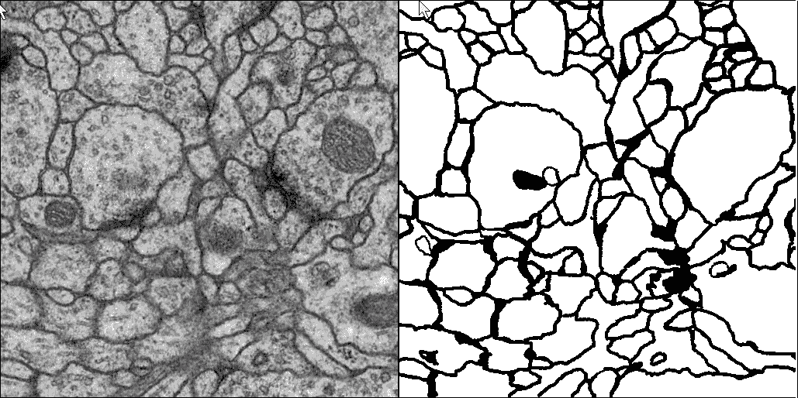
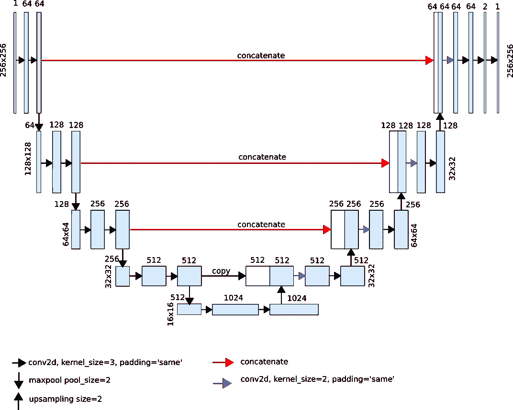
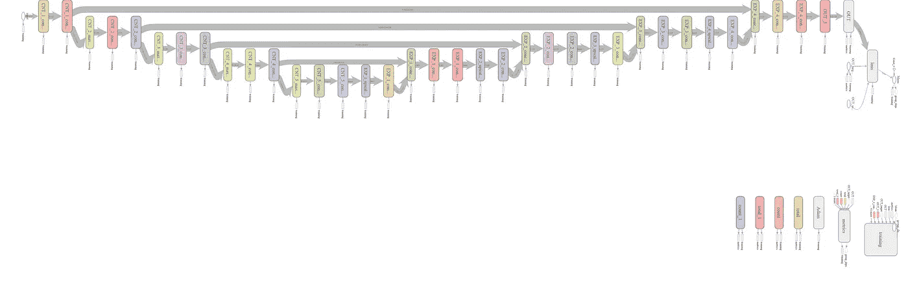
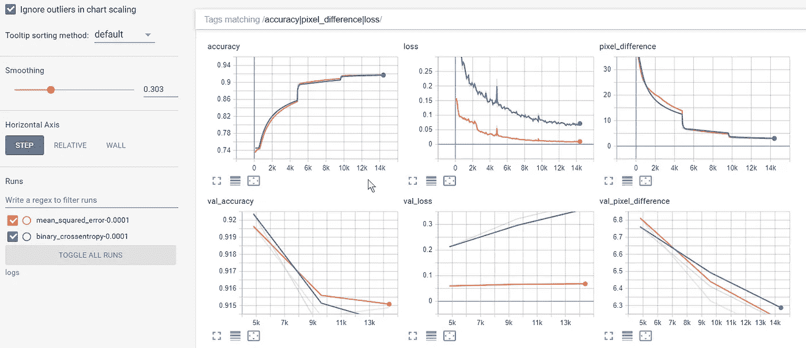
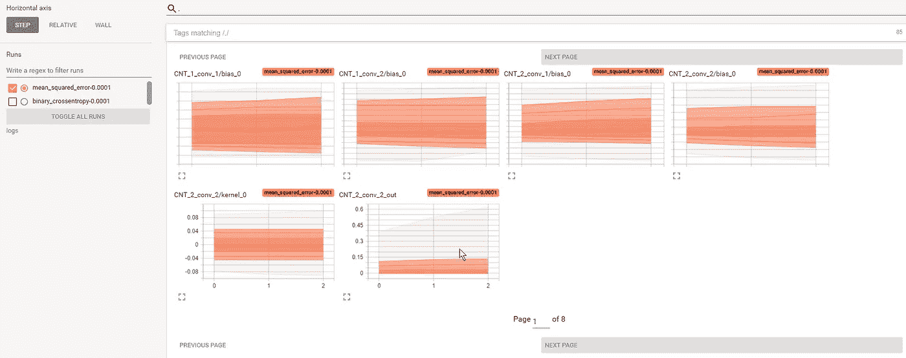
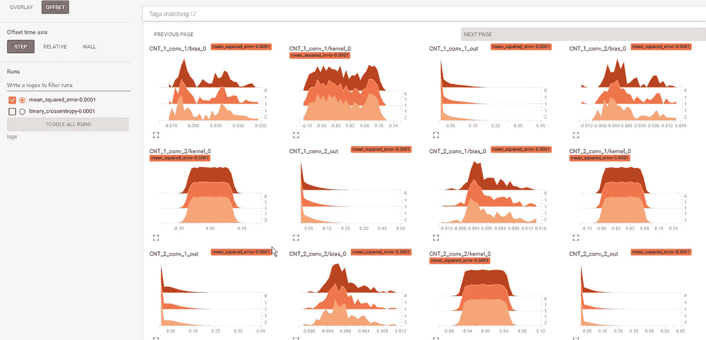
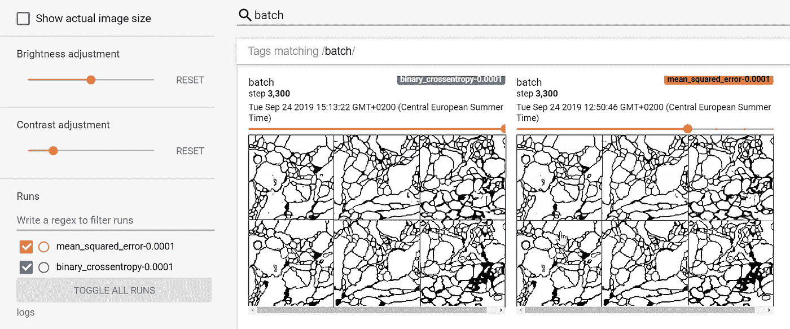

# 语义分割:通过 TensorBoard 可视化学习进度

> 原文：<https://towardsdatascience.com/semantic-segmentation-visualization-of-learning-progress-by-tensorboard-7272fd5b6b50?source=collection_archive---------19----------------------->

# 介绍

神经网络的构建和训练不是一个简单的过程，除非你使用 MNIST 数据集，这是深度学习世界中的一种“Hello world”应用程序。很容易犯错误，花几天时间去想为什么网络没有达到您期望的性能。通常，深度学习库有一些 API，允许在训练期间探索模型和模型行为。但是它们非常受限制，并且需要额外的可视化编程。在本文中，我们将使用 TensorBoard 来可视化 CNN 的训练。例如，我们将对 [ISBI 挑战赛 2012 数据集](http://brainiac2.mit.edu/isbi_challenge/home)使用语义分段。本文的完整代码可以在 [Github](https://github.com/Booritas/semantic-segmentation) 上找到。

## 什么是 TensorBoard？

TensorBoard 是一个工具，用于可视化张量流图、关于图形执行的量化指标以及可以帮助您了解神经网络行为的附加数据。

从软件的角度来看，TensorBoard 是一个网络服务器，它监控某个目录，并将存储在其文件中的数据显示为图形、图表、直方图、图像等。TensorFlow 程序在执行过程中向目录提供数据。服务器读取数据并将其可视化。由开发人员决定必须显示哪些数据。TensorBoard 可以绘制标量图(例如，损失、准确度的线图)、图像(例如，当前预测图像)、直方图(作为权重分布)。除此之外，TensorBoard 还可以将您的模型显示为交互式图形。

使用 TensorBoard 服务很简单:在你的程序代码中添加中间训练数据，启动 TensorBoard，你就可以监控你的模型的训练进度。

TensorBoard 预装了 TensorFlow。以下命令启动 TensorBoard 服务:

```
tensorboard —-logdir *logs*
```

其中*日志*是包含要监控的数据的目录的路径。

如果要在特定端口上启动 TensorBoard，可以使用*端口*参数:

```
tensorboard —-logdir *logs --port=9000*
```

默认情况下，TensorBoard 仅在本地主机上提供服务。参数 *bind_all* 允许在所有网络接口上绑定。

```
tensorboard —-logdir *logs --port=9000 --bind_all*
```

或者，您可以使用 *host* 参数指定主机名或 IP 地址，将 TensorBoard 暴露给特定的主机。

## 你的数据怎么写？

TensorFlow 提供了一组 API，用于以 TensorBoard 可以理解的格式序列化您的数据。以下是可用的序列化函数:

*   *标量* —写入单个值的历史，如损失、准确性等。
*   *图像* —写入图像的历史。
*   *直方图* —记录某个张量的数据分布历史。
*   *text* —写一个字符串型张量的历史。
*   *音频* —写入音频样本的历史(包含音频数据的张量)。
*   *tensor_summary* —写一个任意张量的历史。

每个函数都接受一个张量作为输入数据，并返回一个 protobuf 字符串，该字符串可以由一个 *FileWriter* 对象写入磁盘。此外，可以使用函数 *merge* 和 *merge_all 将摘要合并到集合中。*

如果你使用 Keras，你不必直接使用函数。Keras 提供了一个方便的 *TensorBoard* 回调，它将为您完成大部分工作。

TensorBoard 的一个很好的特性是可以在同一个图上显示几次运行的指标。通过这种方式，可以比较不同超参数的模型行为。你要做的只是把不同跑步的日志保存在 TensorBoard 文件夹的不同子目录下。您可以随时打开/关闭管路的可视化。

# 电镜图像中神经元突起的 2D 分割

在下面的例子中，我们将使用 TensorBoard 对 EM 堆叠中神经元结构分割的模型训练进行可视化( [ISBI 挑战数据集](http://brainiac2.mit.edu/isbi_challenge/))。

## 数据集描述

训练数据是来自连续切片透射电子显微镜(ssTEM)的一组 30 个图像。

相应的二进制标签以进出的方式提供，即白色用于分割对象的像素，黑色用于其余像素(主要对应于膜)。

换句话说，我们在一个 tiff 文件中组合了 30 个灰度图像(每个图像在一个单独的页面中),在另一个 tiff 文件中组合了 30 个黑/白蒙版。



A sample image and corresponded label mask from the ISBI dataset

显然，30 幅图像不足以训练一个卷积网络，因此使用了诸如旋转、移位、剪切、缩放和翻转之类的增强。

**网络架构**

在本文中，我们使用了一个对称变体的 [U-net 卷积神经网络](https://arxiv.org/pdf/1505.04597.pdf)([https://github.com/zhixuhao/unet](https://github.com/zhixuhao/unet))。通过在原始模型中使用“相同”填充而不是“有效”来实现对称。



U-net neural network

上面的模型在 Keras 中实现。完整的源代码可以在 [Github 资源库](https://github.com/Booritas/semantic-segmentation)中找到。

# Keras TensorBoard 复试

Keras 提供了一个方便的回调函数，使得 TensorBoard 的使用更加容易。

在本文中，我们将使用以下参数:

*   *log_dir* —保存数据的目录路径。
*   *histogram_freq* —权重直方图的保存频率。1-对于每个时期，2-对于每第二个时期，等等。
*   *write_graph —* 一个布尔标志。如果应保存模型图，则为 True。
*   *更新频率—* 数据序列化的频率。可能的值:“batch”代表每一批，“epoch”代表每一个 epoch，或者是一个以样本数定义序列化频率的整数。

## 网络图

将参数 *write_graph* 设置为 *True* 会触发模型图形的序列化。为您的图层提供用户友好的名称非常重要，以便您可以在图表中识别它们。下图是 TensorBoard 为本文使用的 U-net 架构制作的。请注意，该图与上面的网络图非常相似。TensorBoard 的一个很好的特性是用相同的颜色给相同结构的层着色。



Model graph produced by TensorBoard (rotated)

## 标量图

参数 *update_freq* 控制指标序列化的频率。在本文中，除了*损失*之外，我们还序列化了*准确度*和一个自定义指标——错误分类像素的相对数量:

注意:该函数将在训练期间执行，因此我们必须使用 TensorFlow 函数来操纵张量。Numpy 函数在这里不起作用。

这是你需要为 TensorBoard 编写的序列化模型图形和度量的全部代码。注意，在示例中，TensorBoard 目录包含损失函数的名称和学习率。因为我想探索我的模型如何收敛于不同的损失函数和不同的速率，所以我将每次运行的文件输出到 log 文件夹的不同子目录中。它允许我比较同一地块上的可视化不同运行，并比较模型性能:



## 直方图和分布图

将参数 *histogram_freq* 设置为 1 导致权重的串行化和每个时期的网络层的激活。两个新菜单项:*分布*和*直方图*出现在 TensorBoard 仪表盘中。重要的是要知道，如果我们想要可视化直方图，我们不能使用验证数据的生成器。如果你尝试这样做，TensorFlow 会抛出一个错误。



Distribution plots produced by TensorBoard



Histograms produced by TensorBoard

## 自定义图像的序列化

Keras 的 TensorBoard 回调提供了参数 *write_images* ，该参数触发网络层图像的序列化。因为语义分割有助于可视化预测结果，以获得网络表现如何的感觉。这可以通过创建自定义回调和使用 TensorFlow 图像汇总 API 来实现。让我们来看看 Keras 自定义回调的结构:

自定义回调类包含几个将在特定事件上执行的方法。为了监控训练过程的进展，我们使用 on_batch_end 方法，并为每批生成预测结果和相应标签的图像。

现在我们创建该类的一个实例，并将其添加到回调列表中。

现在—开始训练，启动 TensorBoard 并监控进度。下图显示了 TensorBoard dashboard 的屏幕截图，比较了均方误差和二元交叉熵损失函数的分割进度。



# 结论

我发现 TensorBoar 对于监控模特的训练过程非常有用。它允许用几行代码可视化中间步骤。