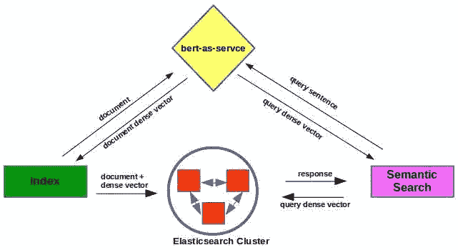
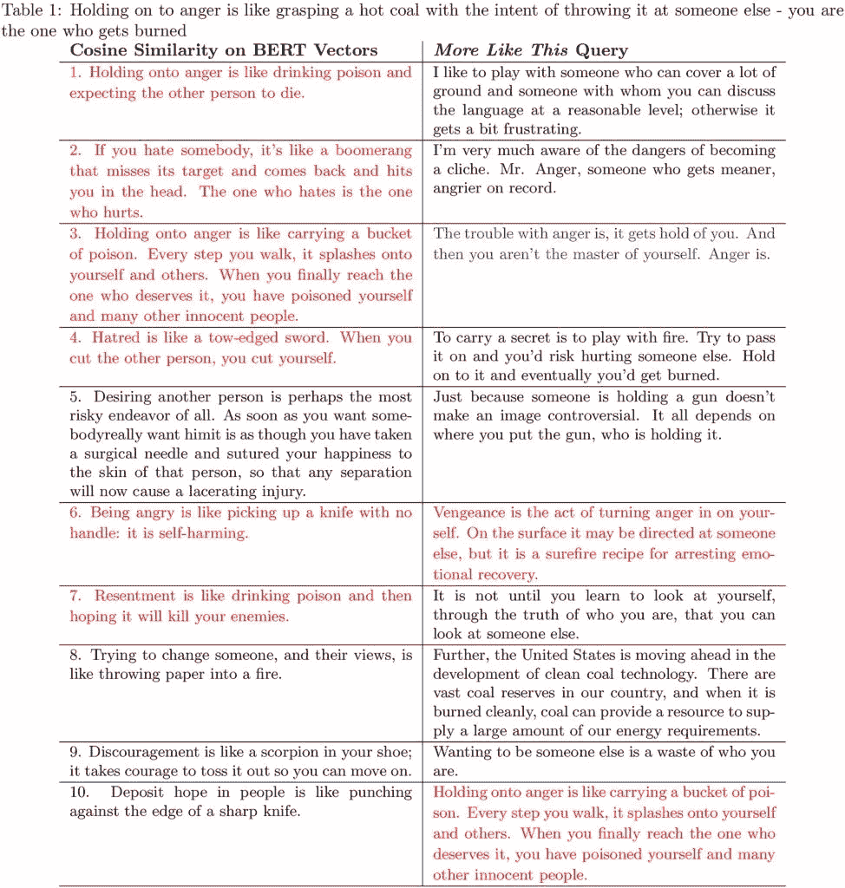
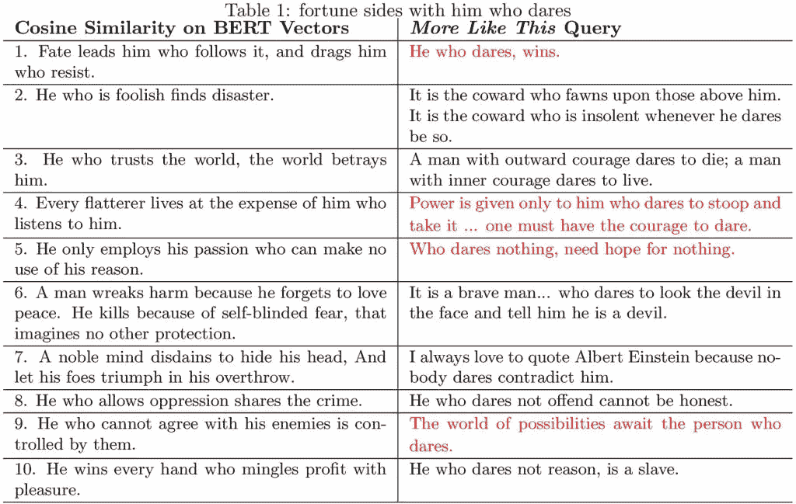

# 规模语义学:BERT + Elasticsearch

> 原文：<https://towardsdatascience.com/semantics-at-scale-bert-elasticsearch-be5bce877859?source=collection_archive---------12----------------------->



随着 BERT、bert-as-service 等工具的出现，以及对弹性搜索中密集向量操作的支持，大规模语义搜索成为可能。虽然程度可能因使用案例而异，但搜索结果肯定会受益于用语义结果增加基于关键字的结果…

跨文本库的基于关键字的搜索是一项众所周知的技术。Lucene 库和像 [Elasticsearch](https://www.elastic.co/guide/en/elasticsearch/reference/current/index.html) 这样的工具擅长闪电般快速地检索给定查询的匹配文档。搜索结果由术语/令牌及其周围的 tf-idf 指标驱动。一般来说，与查询不共享任何公共术语的文档不会成为结果集的一部分。这是基于关键字的搜索的特征。这可以清楚地排除许多*否则*相关的文档，但是那些不与查询共享任何关键词的文档。仔细使用同义词和词干有助于提高回忆。但是什么时候同义词意味着完全平等了？我们可能认为 *sunny* 是 *bright* 的同义词。有*明月*却没有*晴月*——从来没有。至少在我们的星球上没有！此外，用于扩展查询的罕见同义词可能会将本来较差的结果推到最前面。还有词干？是的，让我们甚至不要谈论它。一个*流道*不同于*流道*或*流道*！显然，所有这些围绕关键词的阴谋诡计都无法解决文本中的语义问题。

诸如潜在语义分析(LSA)的方法在过去已经被用于在搜索结果中包括语义相关的文档。但是奇异值分解(SVD)在从分布在节点集群上的数百万个文档构建的术语-文档矩阵上的应用不是微不足道的。基于奇异值分解的语义搜索在弹性搜索处理的规模和吞吐量上是不切实际的。那么，如果我们想用 Elasticsearch 实现语义，我们该怎么办呢？

最近流行的单词固定大小的数字向量会有所帮助。使用单词包方法的单词嵌入可以将一个句子或一个文档变成一个短的密集的数字向量。我们已经在[以前的](http://xplordat.com/2019/09/23/bow-to-bert/) [文章](http://xplordat.com/2018/10/09/word-embeddings-and-document-vectors-part-2-classification/)中详细讨论过这个问题。像从像 [BERT](https://github.com/google-research/bert) 这样的语言模型中获得的嵌入是上下文敏感的，也不同于一键单词向量或 [fastText](https://fasttext.cc/) 嵌入。也就是说，对于“*吃饭为了活着*”vs“*活着为了吃饭*”，我们用 BERT 得到不同的句子向量，让我们可以区分它们。实现大规模语义搜索的关键是将这些向量与弹性搜索相结合。

幸运的是，Elasticsearch 的当前版本(7.3+)支持一个具有各种相关性度量的 [dense_vector](https://www.elastic.co/guide/en/elasticsearch/reference/current/dense-vector.html) 字段，如余弦相似性、欧几里德距离等，可以通过 [script_score](https://www.elastic.co/guide/en/elasticsearch/reference/7.4/query-dsl-script-score-query.html) 计算。这正是我们所需要的，因为我们可以通过查询的密集向量表示，根据这些指标的得分对索引中的文档进行排序。弹性搜索闪电般的速度适用于分布在一群节点上的数百万个密集向量。这基本上是这篇文章的主旨。让我们开始吧。

## 1.作为经纪人的伯特

架构再简单不过了。这些部分都在开源中，我们所要做的就是把它们放在一起。我们使用 [bert-as-service](https://github.com/hanxiao/bert-as-service) 来获得文档和查询的密集向量表示。索引和搜索请求通过 BERT 服务器代理，该服务器为所提供的文档或查询文本生成密集向量。


Figure 1\. Indexing and querying BERT dense vectors in an Elasticsearch index

下面是一个简单的配置，它用一个句子(在我们的例子中是一个短引号)和它的数字向量作为唯一的字段定义了一个索引。根据[无壳基 BERT](https://storage.googleapis.com/bert_models/2018_10_18/uncased_L-12_H-768_A-12.zip) (无壳 _L-12_H-768_A-12)，向量定义为 768 长。

从文件中读取报价，通过调用 bert-as-service 计算密集向量，并批量索引到 Elasticsearch 中。

## 2.使用密集向量的相关性评分

Elasticsearch 采用 Lucene 的[实用评分功能](https://www.elastic.co/guide/en/elasticsearch/guide/current/practical-scoring-function.html)进行传统的基于关键字的搜索。它不适用于我们这里，因为我们处理的是数值向量。我们可以用密集向量周围的任何定制评分函数来覆盖缺省值。但出于效率原因，最好使用弹性搜索预定义的函数，如余弦相似性、L1 或 L2 范数。搜索结果的相关性顺序当然会根据使用的度量标准而有所不同。不确定是否其中一个总是比其他的好，但是余弦相似性似乎对我的测试很好。让我们看一个简单的例子。考虑下面一个文件中的三句话 *sentences.txt* 。

1.  在公园玩耍的孩子们
2.  在草地上奔跑的孩子们
3.  今天交通很糟糕

明明前两句差不多。它们都与第三个不同。我们可以很容易地计算每个句子的向量，并计算不同的度量。运行[Bert _ sentence _ similarity . py](https://gist.github.com/ashokc/ba811c0d9e3457d284df99bb78e455c9)与:

```
pipenv run python ./bert_sentence_similarity.py sentences.txt
```

我们得到:

```
1 & 2 		 1 & 2 		 2 & 3
Cosine Similarity:            0.852 		 0.677 		 0.69
Inv. Manhattan Distance (L1): 0.083 		 0.056 		 0.058
Inv. Euclidean Distance (L2): 1.839 		 1.243 		 1.27
```

所有指标都做了正确的事情，为 1–2 对得出了最高分。在这篇文章的剩余部分，我们将坚持使用 BERT 查询的余弦相似度&句子密集向量作为弹性搜索的相关性分数。如果我们选择 L1 或 L2，热门搜索的顺序会有所不同，但我们在这里的任务是比较 BERT powered 搜索与传统的基于关键字的搜索。

## 3.引文索引

为了测试这个方案对我们的效果如何，我们准备了一个相当大的索引，由不同的人引用的话组成。该索引类似于第 1 节中的索引。引语长度不超过 50 个单词。该索引有几千条引用，其中肯定有一些重复的。以下是一个示例:

> 一旦游戏结束，国王和士兵回到同一个盒子里
> 
> 他使用统计学，就像一个醉汉用灯柱来支撑而不是照明一样
> 
> 你应该经常去参加别人的葬礼；否则他们不会去你家。
> 
> 其他星球上的智慧生命？我甚至不确定地球上有没有！

我们知道许多不同的引语表达了相似的意思。我们用一个引用(或它的转述版本)查询索引，并检查顶部结果的质量。*我们希望看到最热门的搜索结果与我们所理解的查询引用**——最相似*。我们可以用 Elasticsearch 提供的[更像这个](https://www.elastic.co/guide/en/elasticsearch/reference/7.4/query-dsl-mlt-query.html) (MLT)的查询直接做到这一点，当然还有我们的 BERT 衍生向量的余弦相似性，如图 1 所示。任务是评估伯特向量是否有意义地提高了结果的质量。

**查询弹性搜索**

对于 [MLT](https://www.elastic.co/guide/en/elasticsearch/reference/7.4/query-dsl-mlt-query.html) 查询，我们覆盖了一些默认值，以便不排除查询或文档中的任何术语。对于我们用于语义搜索的 [script_score](https://www.elastic.co/guide/en/elasticsearch/reference/7.4/query-dsl-script-score-query.html) 查询，我们从 bert-as-service 获得密集的 query_vector。我们从以下内容开始:

```
bert-serving-start -model_dir $BERT_BASE_DIR -max_seq_len=52 -num_worker=1
```

其中 BERT_BASE_DIR 指向磁盘上*uncased _ L-12 _ H-768 _ A-12*所在的目录。下面是以这两种不同方式查询同一索引的代码片段。

## 4.结果

设备准备就绪后，剩下要做的就是运行一些示例查询/报价，看看 BERT powered Elasticsearch 是否能够返回比仅基于关键字丰度更有意义的结果。我们挑选了一些引言，并列比较了伯特& MLT 公司的 10 大业绩。每个结果都是根据比赛质量评分的——***红色 1 分，蓝色 0.5 分，默认 0 分***——当然是主观的。让我们从第一个开始。


> 抓住愤怒不放就像抓住一块热煤想要扔向别人——你才是那个被烧伤的人
> 
> 佛



Figure 2\. BERT 6 & MLT 2.5

MLT 的热门歌曲完全不相关，因为它已经被“某人”这个词劫持了。它的第八次点击被“煤”误导了，这是一个在引语库中可能很少见的术语。但是 MLT 的第六支安打被伯特错过了。总的来说，我们看到 BERT 能够提取出与查询意思相同但使用了与查询不同的单词的引号(参见 4、6 和 7)。让我们看看另一个。


> 对于大多数人来说，他们认定自己有多幸福，就有多幸福
> 
> 亚伯林罕·林肯


Figure 3\. BERT 3 & MLT 0

在这种情况下，对 MLT 来说不幸的问题是查询中使用的词的选择。最热门的话题是伯特锁定了它，但 MLT 错过了它，因为它正在寻找术语“头脑”或“制造”，但看到了“头脑”和“制造”。它自己的热门搜索完全被短语“下定决心”所占据——与查询完全匹配。使用词干分析器可能有助于 MLT 抓住伯特的热门歌曲。对于它的第二部热播剧，MLT 可能被一个可能很少见的词岔开了，比如“乡亲”和短语“化妆”,因为这句话肯定不是关于打扮的！

但是基于以上两个例子，认为 BERT 已经对传统的一键词向量造成了致命的打击还为时过早。以最后这个例子为例。


> 命运站在敢于冒险的人一边
> 
> 维吉尔



Figure 4\. BERT 0 & MLT 4

*敢*这个词可能是回购协议中一个罕见的词，MLT 很好地坚持了这个词，也许是整个短语*谁敢*。另一方面，BERT 认为(从逻辑上来说，我们可以加上) *dares* 与*激情*、*灾难*等相关，并发现非常不同的匹配。这通常是过度思考的问题，有人可能会说——这是对伯特不友好的攻击。

## 5.结论

我们已经证明，我们可以通过 Elasticsearch 获得大规模的语义搜索结果。随着 BERT、bert-as-service 等工具的出现，以及对弹性搜索中密集向量操作的支持，这一切都成为可能。语义搜索结果的质量将取决于索引中文档的性质以及语义在这些文档中是否重要。语义在大多数自由流动的文本和演讲中是很重要的，除非你在谈论方程式！这是我们结束前的最后一段引言。

> 数学课本如此深奥和专业的一个原因是因为所有的规范和条件都必须放在定理上，以防止它们出现裂缝。从这个意义上说，它们就像法律文件，读起来也同样有趣。
> 
> 大卫·埃德加·华莱士

因此，可能会有一些没有语义或文字游戏的枯燥文本，但很少有人会想去读它，更不用说去搜索它了。所以我们开始了——任何值得搜索的文本都有语义相关的文档。

总结一下:

*   我们已经看到，用 BERT 向量增强的 Elasticsearch 可以从文档报告中提取出语义相关的结果
*   坚持使用实际的关键词有时是正确的做法，而不是像 BERT 那样试图找到向量之间的关系。在这种情况下，基于关键字的搜索占了上风。
*   有了基于关键字的结果，我们可以很容易地解释为什么一个结果上升到顶部。甚至有一个[解释 api](https://www.elastic.co/guide/en/elasticsearch/reference/current/search-explain.html) 来挖掘如何获得相关性分数的细节。这对于基于关键字的方法来说是一个明显的优势。
*   有了 BERT 驱动的语义结果，就很难理解为什么一个结果出现在最上面或者没有出现。正是密集向量决定了相关性分数。谁知道这些密集向量的所有参数是什么……除此之外，还有 1.1 亿个密集向量！

那么，我们准备好用这些语义结果取代传统的基于关键词的结果了吗？不。但是增加他们并让最终用户投票也许没有坏处！

….

*原载于 2019 年 10 月 29 日*[*【http://xplordat.com*](http://xplordat.com/2019/06/18/reconciling-data-shapes-and-parameter-counts-in-keras/)*。*