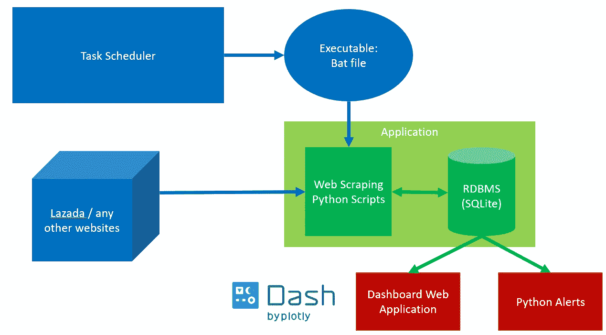
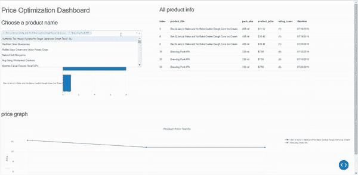
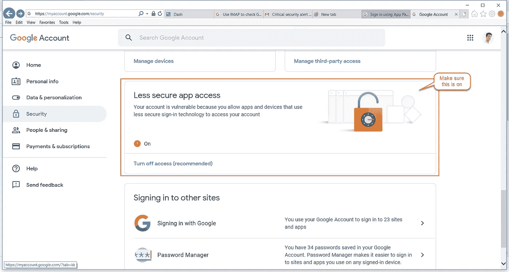
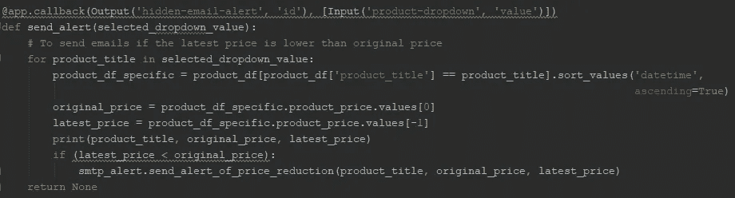

# 使用 Python SMTP 发送数据警报

> 原文：<https://towardsdatascience.com/send-data-alert-with-python-smtp-efb9ee08077e?source=collection_archive---------8----------------------->

## 数据专业人员权威指南(商业智能)

## 使用 Python smtplib 发送业务报告和电子邮件


Source: Unsplash

# 问题陈述:

对于数据科学家来说，将报告传达给非技术用户是非常重要的，尤其是当数据中存在异常时。根据我的工作经验，大多数分析师会手动向用户发送业务报告，他们会处理数据，运行一些验证，并生成报告通过 Outlook/gmail 发送。所有这些都需要很多时间，并为人为错误留有余地。

> 如果我们可以通过分析我们数据的同一个 Python 程序来自动化业务报告和警报，那会怎么样？

这将节省大量的时间和麻烦！

# 输入 Python SMTP 库


[Source](https://avleonov.com/2017/09/14/sending-and-receiving-emails-automatically-in-python/)

简单邮件传输协议(SMTP)允许用户向另一个用户发送邮件。当您从 Python 应用程序推送邮件时，用户将通过邮局协议(POP)和互联网消息访问协议(IMAP)接收邮件。这些是 Outlook 和 Gmail 等标准电子邮件界面的基础。

SMTP 允许服务器通过 TCP 连接监听电子邮件请求，然后通过端口 587 发送电子邮件。

# Python SMTP 的实际应用



Our Application in Big Picture, today we are going to learn how to build Python Alerts with SMTP

在本教程中，您将学习如何使用 Python SMTP 生成电子邮件提醒。

我们将访问我们以前在[构建仪表板 Web 应用](/build-your-own-data-dashboard-93e4848a0dcf)的项目，使用[任务调度器](/automate-your-python-scripts-with-task-scheduler-661d0a40b279)到[从 Lazada](/in-10-minutes-web-scraping-with-beautiful-soup-and-selenium-for-data-professionals-8de169d36319?source=post_page---------------------------) (电子商务)网站抓取数据，并将其转储到 [SQLite RDBMS](/relational-database-management-rdbms-basic-for-data-professionals-aca3567f03da?source=post_page---------------------------) 数据库。根据用户确认的产品，我们将检查价格是否从原始价格下降，并使用它来生成警报。

请随意欣赏这篇文章或访问我的 [Github Repo](https://github.com/VincentTatan/Web-Scraping/blob/master/Selenium%20Web%20Scraping/lazada/dashboard.py) 获取完整代码。或者向下滚动，欣赏这篇文章。

对于不熟悉我提到的仪表板 Web 应用程序的人来说。我正在建立一个基于 Lazada 报废产品价格变化的仪表板。每当用户修改输入下拉菜单时，如果产品价格下降，应用程序会提醒用户。

**我们的任务**是分配一个 webhook，一旦你修改了下拉菜单参数，它就会发送一封电子邮件。



Price Optimization Dashboard Scraped from Lazada over 3 days + Email SMTP

## 以下是实现这一目标的关键步骤:

1.  导入 Python SMTP
2.  生成电子邮件和 SMTP 服务器属性
3.  发送电子邮件请求
4.  使用我们的 Python Dash 仪表板准备 Webhooks
5.  为电子邮件验证机密创建配置文件

# 导入和激活 Python SMTP

当您下载 Python 包时，Python smtplib 已经内置。如果您已经运行了它，您可以像下面这样导入 smtplib

```
import smtplib
```

要激活 SMTP 连接，您需要通过替换如下标记来插入您的身份验证凭据:

```
gmail_user = '<input your gmail user. No need to use @gmail.com>'
gmail_password = '<input your gmail password>'
```

> 仅此而已！非常容易。


Source: Giphy

# 生成电子邮件和 SMTP 服务器属性

创建电子邮件时，您需要考虑两个部分:电子邮件属性和电子邮件发送请求。

在**邮件属性**中，您可以设置:

```
#email properties
sent_from = gmail_user
to = [<email_send_address>]
subject = 'Alert for reduced in price'
email_text = 
"""
Alert for reduced in price
"""
```

1.  `sent_from`:发送邮件的发件人
2.  `to`:邮件的收件人
3.  `subject`:邮件主题
4.  `email_text`:邮件正文的内容。

在**电子邮件发送请求**中，这是设置 SMTP 服务器的位置:

```
#email send request
try:
    server = smtplib.SMTP_SSL('smtp.gmail.com', 465)
    server.ehlo()
    server.login(gmail_user, gmail_password)
    server.sendmail(sent_from, to, email_text)
    server.close()

    print ('Email sent!')
except Exception as e:
    print(e)
    print ('Something went wrong...')
```

1.  `smtplib`正在设置带有 gmail 安全套接字层(SSL)通道和端口 465 的 SMTP 服务器。这将允许我们从自己的 gmail 帐户发送邮件。
2.  `ehlo()` 用于向服务器表明您的身份。这将检查我们设置的 gmail 服务器的 SMTP 服务扩展(e SMTP)。
3.  `login`非常简单。我们将使用自己的用户名和密码登录 gmail 服务器。
4.  然后，我们将使用我们的帐户`sendmail` 来使用我们之前设置的电子邮件属性。
5.  最后，我们将`close`服务器，这将为服务器释放我们的端口 465 和内存使用。

# 发送电子邮件请求

一旦设置了属性，一切都设置好了。你只需要运行它。还有…

> 您遇到了问题。

## 解决您的问题

您很可能会遇到这个错误


Troubleshooting credentials/gmail server error

如果您遇到此错误，并且您已经仔细检查了您的用户名和密码是否正确，那么您需要打开您的 Gmail 设置并打开*不太安全的应用程序访问*选项。这将允许 Python SMTP 访问您的 gmail 帐户并代表您发送电子邮件。

当然，为了维护您的 gmail 安全，您可以在不再使用该功能后将其关闭。



Activating the option “Less Secure App Access” from your gmail setting

最后，一旦你运行你的脚本。你会收到这封邮件。(注意，目前我正在使用我自己的电子邮件来测试应用程序)。


> 恭喜你。您刚刚发送了您的第一个自动电子邮件发送请求！


Source: Makeameme

# 使用我们的 Python Dash 仪表板准备 Webhooks

现在我们知道我们的警报起作用了，让我们设置 web 挂钩。

Web hooks 是服务器端应用程序的资源灯事件反应，用于通知客户端应用程序触发事件。在这种情况下，我们将设置 Dash，以便在用户修改仪表板的下拉菜单时激活警报逻辑。如果我们的产品降价，我们会发出警报。



Additional Callback to call alerts

1.  `product_df_specific` 将按日期对特定产品的值进行排序。
2.  `original_price` 取产品的最早日期
3.  `latest_price` 取产品的最新日期
4.  然后，一旦我们发现`latest_price` 比`original_price`低，就会发送电子邮件。

最终结果是，我们将有一个特定的电子邮件详细信息，列出用户关心的所有产品和价格警报。


Inserting alerts in emails

# 为电子邮件验证机密创建配置文件

还记得步骤 1 中的凭证吗？

```
gmail_user = '<input your gmail user. No need to use @gmail.com>'
gmail_password = '<input your gmail password>'
```

让我们将这些敏感信息放在一个属性文件中，您可以轻松地保护和配置该文件。

首先让我们创建一个名为 properties.ini 的 Python 属性文件:

```
**[EMAIL]** user= <gmail username>
password = <gmail password>
```

这些是你需要保护的私人文件。要访问它，只需使用 Python 内置的 configparser 库。

```
import configparserconfig = configparser.ConfigParser()
config.read('properties.ini')
gmail_user = config['EMAIL']['user']
gmail_password = config['EMAIL']['password']
```

你将首先启动一个`config parser`，这将把你的属性组织成一个树形目录来提取。

然后您将`read` properties ini 文件并提取您的用户名和密码，就像您如何从 2D 数组中提取一个元素一样。

# 最终结果

恭喜你！！您已经在仪表板中创建了第一个 SMTP。如果你做得好，你会得到这个结果。如果没有，请随意查阅我的 [Github 代码](https://github.com/VincentTatan/Web-Scraping/blob/master/Selenium%20Web%20Scraping/lazada/dashboard.py?source=post_page---------------------------)或者在这里提出你的问题。


Email sent when users update the product dropdown

> *现在释放并创建您自己的 Dash Dashboard 和 Python SMTP！*

# 更多参考

如果您需要更多的例子和对 Python SMTP 能做什么的更好的理解。请随意访问以下链接。

1.  [真正的蟒蛇](https://realpython.com/python-send-email/)
2.  [教程点](https://www.tutorialspoint.com/python/python_sending_email)
3.  [初学 Python](https://www.pythonforbeginners.com/code-snippets-source-code/using-python-to-send-email/)

# 最后…


Source: Unsplash

我真的希望这是一本很棒的读物，是你发展和创新的灵感来源。

请**在下面评论**出来建议和反馈。就像你一样，我也在学习如何成为一名更好的数据科学家和工程师。请帮助我改进，以便我可以在后续的文章发布中更好地帮助您。

谢谢大家，编码快乐:)

# 关于作者

Vincent Tatan 是一名数据和技术爱好者，拥有在 Visa Inc .和 Lazada 实施微服务架构、商业智能和分析管道项目[的相关工作经验。](https://bit.ly/2I8jkWV.?source=post_page---------------------------)

Vincent 是土生土长的印度尼西亚人，在解决问题方面成绩斐然，擅长全栈开发、数据分析和战略规划。

他一直积极咨询 SMU BI & Analytics Club，指导来自不同背景的有抱负的数据科学家和工程师，并为企业开发他们的产品开放他的专业知识。

请通过 [**LinkedIn**](http://www.linkedin.com/in/vincenttatan/?source=post_page---------------------------) **，**[**Medium**](https://medium.com/@vincentkernn?source=post_page---------------------------)**或** [**Youtube 频道**](https://www.youtube.com/user/vincelance1/videos?source=post_page---------------------------) 联系文森特