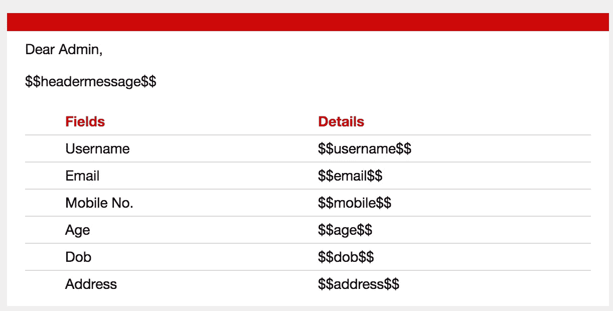
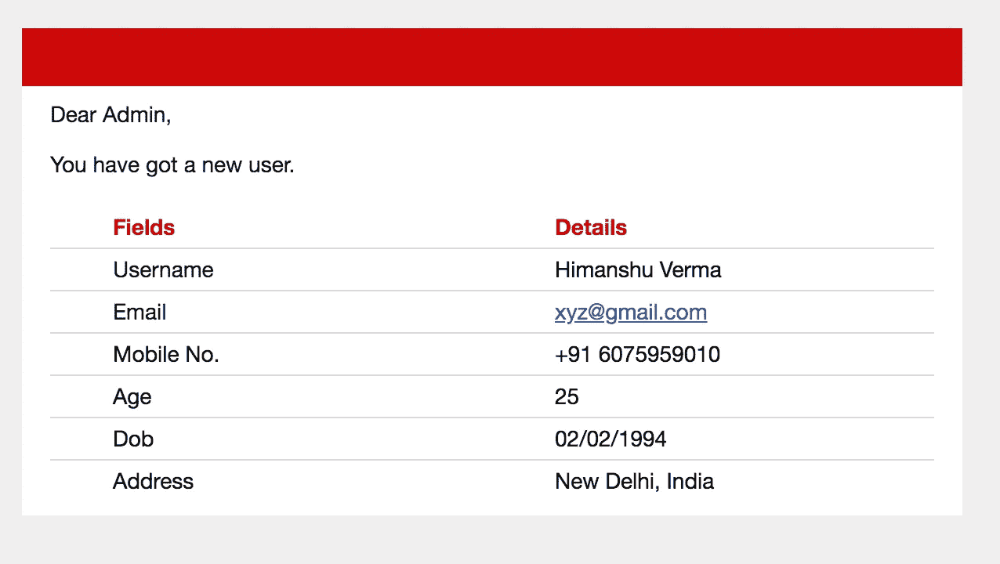

# 发送电子邮件与美丽的形式在安卓系统

> 原文：<https://towardsdatascience.com/send-email-with-beautiful-form-in-android-b12cd5cc9572?source=collection_archive---------19----------------------->

## 在本文中，我们将发送一封包含精心设计的表单的电子邮件，以显示随邮件发送的数据。


Image from [Unsplash](https://unsplash.com/photos/3Mhgvrk4tjM)

众所周知，使用电子邮件对我们所有人来说已经变得必要和重要。有各种电子邮件服务提供商，如雅虎、Outlook、iCloud 和 Gmail 等。这些科技巨头为每个用户提供免费电子邮件服务。如果你使用互联网，那么就没有办法忽视它，因为无论何时你访问任何网站/应用程序来在线购买/销售产品。首先，你必须在这些网站/应用上注册，以证明你在现实世界中的身份。

在本文中，我们将学习如何使用 JavaMail API 将 Gmail 收件箱中的电子邮件发送到指定的电子邮件地址。我们将发送普通用户数据，如用户名、电子邮件地址、手机号码等。

所以让我们开始吧。

# 第一步

*   首先用空活动创建 android 项目，并在根目录下创建名为 MailSender.java 和 JSSEProvider.java 的 java 类。
*   现在我们需要将 Java 邮件 API jar 文件导入到我们的项目中。从[这里](http://script.astromyntra.in/javamailapi.zip)下载 jar 文件，解压后粘贴到 *libs* 文件夹中。
*   如果你的项目不能识别你的库，那么重启 Android studio。
*   右键单击应用程序->新建->文件夹->资产文件夹，创建资产文件夹。我们将把 HTML 文件放在这里，以便在 Gmail 上显示数据。
*   要发送电子邮件，你的应用需要互联网连接，所以在你的 *AndroidManifest.xml* 文件中声明这个权限。

```
<**uses-permission android:name="android.permission.INTERNET"**/>
```

# 第二步

*   在 MailSender.java 类中创建一些实例变量

```
*// change this host name accordingly* **private** String **mailhost** = **"webmail.xyz.in"**;
**private** String **user**;
**private** String **password**;
**private** Session **session**;
Context **context**;
**private** Multipart **_multipart** = **new** MimeMultipart();
```

*   现在在 MailSender.java 文件中创建静态块来调用 JSSEProvider.java 类。JSSEProvider 用于链接 SSLContext、X509 的 KeyManagerFactory、X509 的 TrustManagerFactory 和 AndroidCAstore 的修改版本。

```
**static** {
    Security.*addProvider*(**new** JSSEProvider());
}
```

*   创建参数化的构造函数(传递上下文，“发件人电子邮件 id”和“密码”等。)来初始化实例变量，并创建一个 *Properties* 类的对象来设置构造函数内部的属性。在其中传递上下文、用户电子邮件 id 和密码。看一看构造函数代码。

```
**public** MailSender(Context context,String user, String password) {
    **this**.**user** = user;
    **this**.**password** = password;
    **this**.**context** = context;

    Properties props = **new** Properties();
    props.setProperty(**"mail.transport.protocol"**, **"smtp"**);
    props.setProperty(**"mail.host"**, **mailhost**);
    props.put(**"mail.smtp.auth"**, **"true"**);
    props.put(**"mail.smtp.port"**, **"465"**);
    props.put(**"mail.smtp.socketFactory.port"**, **"465"**);
    props.put(**"mail.smtp.socketFactory.class"**, **"javax.net.ssl.SSLSocketFactory"**);
    props.put(**"mail.smtp.socketFactory.fallback"**, **"false"**);
    props.setProperty(**"mail.smtp.quitwait"**, **"false"**);

    **session** = Session.*getDefaultInstance*(props, **this**);
}
```

*   创建密码验证器方法来验证您的帐户。

```
**protected** PasswordAuthentication getPasswordAuthentication() {
    **return new** PasswordAuthentication(**user**, **password**);
}
```

*   最后，创建用户定义的方法 *sendUserDetailWithImage()将数据发送到邮件。下面的*代码片段从 assets 文件夹中提取 user_profile.html，将其转换为一个缓冲区，然后从缓冲区中读取它，最后将其转换为一个 string 对象，用实际的用户名替换关键字“$$username$$”等等。查看完整的*senduserdetailwithiimage()*代码。

看看完整的 MainSender.java 代码

# 第三步

要在表单中显示数据，请在 assets 文件夹中创建名为 user_profile.html 的 HTML 文件，并粘贴以下代码。

HTML 代码的输出看起来像这样



# 第四步

最后，将下面的代码粘贴到 MainActivity 中。

# 结果



Data received on Gmail

**注意:**如果你这边一切正常，但还是没有收到邮件，请检查你的垃圾邮件文件夹，如果有，点击“标记为非垃圾邮件”。

# 结论

我创建了一个 android 项目，以电子邮件的形式发送用户数据。我使用过 JavaMail API 发送电子邮件。在本文中，我发送了 HTML 表单和数据。

如果你对这篇文章有任何疑问，请在评论区问我。另外，你可以在我的 [Github](https://github.com/himanshujbd/MailSender) 账户上找到这篇文章的完整源代码。

我希望你喜欢读这篇文章，你也可以访问我的 [**网站**](http://thehimanshuverma.com/) ，在那里我会定期发布文章。

[**订阅**](https://mailchi.mp/b08da935e5d9/himanshuverma) 我的邮件列表，以便直接在您的收件箱中提前获得我的文章，或者关注我自己在 Medium 上发表的文章[**The Code Monster**](https://medium.com/the-code-monster)以完善您的技术知识。

# 了解你的作者

希曼舒·维尔马毕业于印度勒克瑙的 APJ 阿卜杜勒·卡拉姆大学博士。他是 Android & IOS 开发人员、机器学习和数据科学学习者、金融顾问和博客作者。