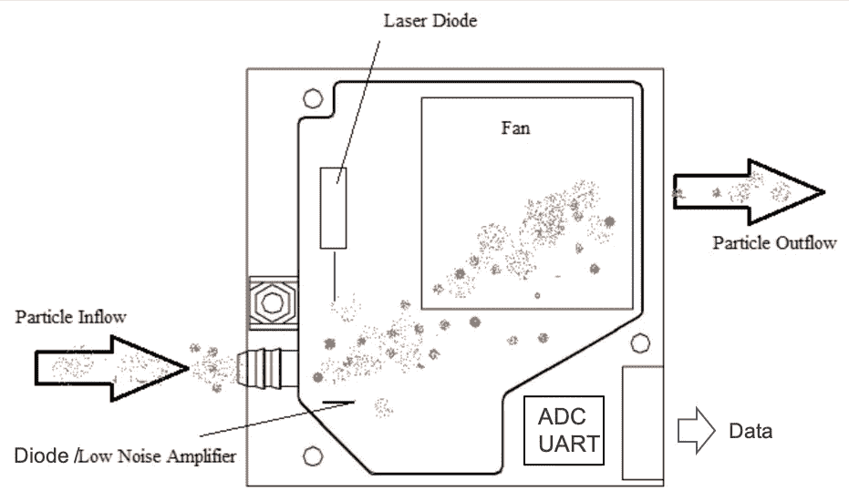
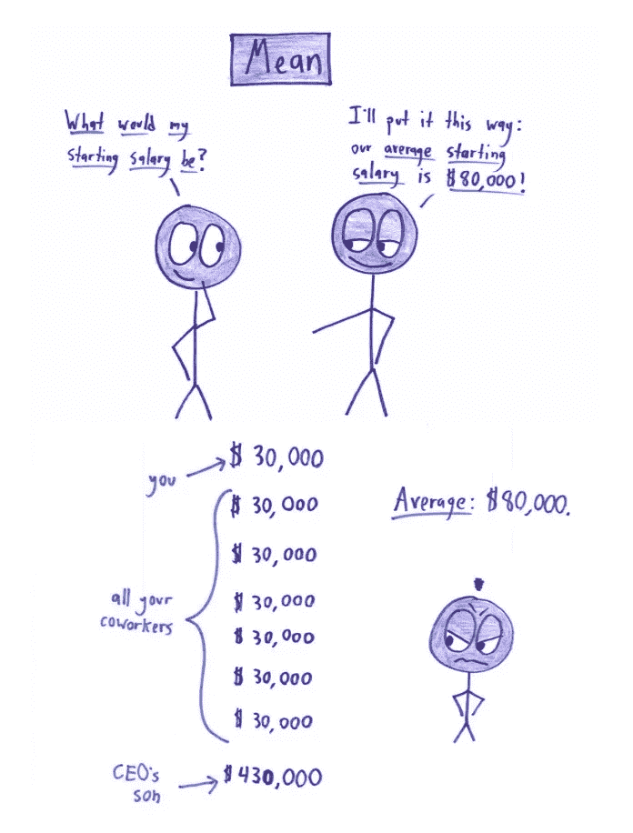
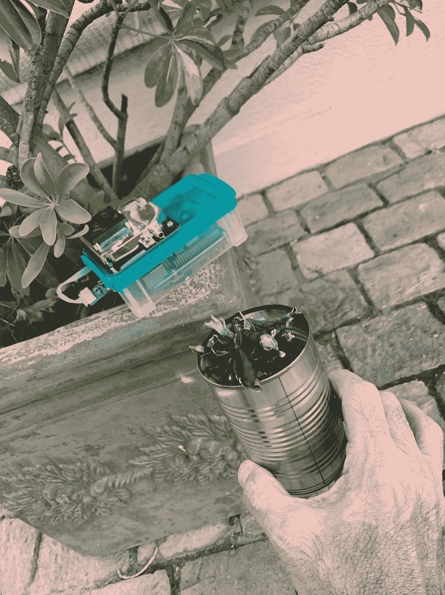

# 感知空气质量

> 原文：<https://towardsdatascience.com/sensing-the-air-quality-5ed5320f7a56?source=collection_archive---------5----------------------->

## 基于 RaspberryPi 4 的低成本物联网空气质量监测仪


Santiago, Chile during a winter environmental emergency

我有幸生活在世界上最美丽的国家之一，但不幸的是，这并不总是美好的。智利冬季空气污染严重，主要是由灰尘和烟雾等颗粒物质造成的。


由于天气寒冷，在南部，空气污染主要是由于木材引起的，而在圣地亚哥(该国中部的主要首都)，空气污染则是由工业、汽车以及两大山脉之间的独特地理位置造成的。


如今，空气污染是全世界的一个大问题，在这篇文章中，我们将探讨如何开发一个廉价的自制空气质量监测器，基于树莓皮。

> *如果你有兴趣了解更多关于空气质量的信息，请访问* [*“世界空气质量指数”项目*](http://aqicn.org/media/) *。*

## 颗粒物(PM)是什么，它是如何进入空气中的？

因此，要了解*污染*或*空气污染*，我们必须研究与之相关的颗粒，也就是众所周知的*颗粒物*。查看上一部分的图表，我们可以发现他们提到了 *PM2.5* 和 *PM10* 。让我们对此进行一个快速的概述。

PM 代表*颗粒物质*(也称为颗粒污染):空气中固体颗粒和液滴混合物的术语。有些微粒，如灰尘、污垢、煤烟或烟雾，很大或很暗，足以用肉眼看到。其他的非常小，只有用电子显微镜才能发现。

颗粒的尺寸范围很广。直径小于或等于 10 微米的颗粒非常小，以至于它们可以进入肺部，潜在地导致严重的健康问题。十微米还不到一根人类头发的宽度。


颗粒污染包括:

*   **粗尘粒(PM10)** :可吸入颗粒物，直径一般在 10 微米及以下。来源包括破碎或研磨作业以及道路上车辆扬起的灰尘。
*   **细颗粒物(PM2.5)** :可吸入的细颗粒物，直径一般在 2.5 微米及以下。所有类型的燃烧都会产生细颗粒物，包括机动车、发电厂、住宅木材燃烧、森林火灾、农业燃烧和一些工业过程

> *你可以在环保局网站上找到更多关于颗粒物的信息:* [*美国环境保护局*](https://www.epa.gov/pm-pollution/particulate-matter-pm-basics)

## 为什么重要的是关心那些颗粒物？

正如 GERARDO ALVARADO Z .在他在智利大学的[工作中所描述的那样，](http://www.tesis.uchile.cl/tesis/uchile/2006/alvarado_g/sources/alvarado_g.pdf)对 1930 年默兹山谷(比利时)、1948 年多诺拉(宾夕法尼亚州)和 1952 年伦敦的高度空气污染事件的研究是第一个将死亡率与颗粒污染联系起来的文献资料来源(Préndez，1993 年)。在调查空气污染对人们健康的影响方面取得的进展已经确定，健康风险是由可吸入颗粒造成的，这取决于它们在呼吸系统不同部分的渗透和沉积，以及对沉积物质的生物反应。

最厚的颗粒，约 5 微米，通过鼻腔纤毛和覆盖鼻腔和气管的粘膜的共同作用被过滤。直径在 0.5 和 5 微米之间的颗粒可以沉积在支气管中，甚至沉积在肺泡中，然而，几小时后它们被支气管和细支气管的纤毛清除。小于 0.5 微米的颗粒可以穿透很深，直到它们沉积在肺泡中，保留几周到几年，因为没有促进消除的粘膜纤毛运输机制。

下图显示了颗粒在呼吸系统中的渗透程度，取决于它们的大小。


因此，发现这两种类型的颗粒(PM2.5 和 PM10)非常重要，好消息是这两种颗粒都可以通过简单且不昂贵的传感器 SDS011 读取。

## 粒子传感器— SDS011

空气质量监测是众所周知的既定科学，始于 80 年代。当时，技术相当有限，用于量化空气污染的解决方案复杂、繁琐且非常昂贵。

幸运的是，如今，利用最新的现代技术，用于空气质量监测的解决方案不仅变得更加精确，而且测量速度也更快。设备变得越来越小，价格也比以前便宜得多。

在本文中，我们将重点介绍一种粒子传感器，它可以检测空气中的灰尘量。虽然第一代传感器只能检测不透明度，但最近的传感器，如从暨南大学(山东)剥离出来的 INOVAFIT 公司的 [SDS011](https://www.amazon.com/gp/offer-listing/B07G33TG9N) ，现在可以检测 PM2.5 和 PM10。


就其尺寸而言，SDS011 可能是精度和价格(低于 40.00 美元)最好的传感器之一。

规范

*   测量值:PM2.5，PM10
*   范围:0–999.9 微克/立方米
*   电源电压:5V(4.7–5.3V)
*   功耗(工作):70mA 10mA
*   功耗(睡眠模式激光和风扇):< 4mA
*   储存温度:-20 至+60C
*   工作温度:-10 至+50C
*   湿度(储存):最大值。90%
*   湿度(工作):最大值。70%(水蒸气凝结会伪造读数)
*   精度:0.3μm 为 70%，0.5μm 为 98%
*   尺寸:71x70x23 毫米
*   认证:CE，FCC，RoHS

SD011 使用 PCB 作为外壳的一面，可以降低成本。接收器二极管安装在 PCB 侧(这是强制性的，因为应避免二极管和 LNA 之间的任何噪声)。发射器激光器安装在塑料盒上，并通过软线连接到 PCB。


简而言之，Nova Fitness SDS011 是一款专业的激光粉尘传感器。安装在传感器上的风扇自动吸入空气。该传感器使用激光散射原理*来测量悬浮在空气中的灰尘颗粒值。该传感器提供高精度和可靠的 PM2.5 和 PM10 值读数。环境的任何变化都可以在 10 秒以下的短响应时间内被观察到。标准模式下的传感器以 1 秒的间隔报告读数。

> **激光散射原理:当颗粒通过检测区时，会引起光散射。散射光被转换成电信号，这些信号将被放大和处理。由于信号波形与颗粒直径有一定的关系，通过分析可以得到颗粒的数量和直径。*

## 但是 SDS011 如何捕捉这些粒子呢？

如前所述，SDS011 使用的原理是[光散射](https://en.wikipedia.org/wiki/Dynamic_light_scattering)或更好的说法，动态光散射(DLS)，这是一种物理学技术，可用于确定悬浮液中的小颗粒或溶液中的聚合物的尺寸分布。在 DLS 范围内，通常通过强度或光子自相关函数(也称为光子相关光谱或准弹性光散射)来分析时间波动。在时域分析中，自相关函数(ACF)通常从零延迟时间开始衰减，并且由于更小的粒子，更快的动态导致散射强度轨迹的更快去相关。已经表明，强度 ACF 是功率谱的傅立叶变换，因此 DLS 测量可以在谱域中同样很好地执行。

下面是两个样品的假设动态光散射:较大的颗粒(如 PM10)在顶部；较小的颗粒(如 PM2.5)在底部；


观察传感器内部，我们可以看到光散射原理是如何实现的:



二极管上捕获的电信号进入低噪声放大器，然后通过 ADC 转换为数字信号，再通过 UART 发送到外部。

> *要了解更多关于 SDS011 的真实科学体验，请看看 Konstantinos et al .*[*低成本便携式 PM2.5 浓度监测系统的开发和现场测试*](https://pdfs.semanticscholar.org/8dbd/245e7045693aa4858b3638466f17bb946aff.pdf)*2018 年的工作。*

## 表演时间到了。

让我们暂时放下这些理论，专注于如何使用 Raspberry Pi 和 SDS011 传感器测量颗粒物


硬件连接实际上非常简单。该传感器与 USB 适配器一起出售，以将其 7 针 UART 的输出数据与 RPi 的标准 USB 连接器之一进行接口。

SDS011 引脚排列:

*   引脚 1 —未连接
*   针 2—pm 2.5:0–999 微克/立方米；PWM 输出
*   引脚 3–5V
*   针 4—PM10:0–999 微克/立方米；PWM 输出
*   引脚 5 — GND
*   引脚 6 — RX UART (TTL) 3.3V
*   引脚 7 — TX UART (TTL) 3.3V

> *对于本教程，我第一次使用全新的树莓-Pi 4。但是当然，任何以前的模型也可以很好地工作。*

一旦您将传感器连接到 RPi USB 端口之一，您将自动开始听到其风扇的声音。噪音有点烦人，所以也许你应该拔下它，等你用软件设置好了再说。

传感器和 RPi 之间的通信将通过串行协议进行。关于这个协议的细节可以在这里找到:[激光灰尘传感器控制协议 V1.3](https://cdn.sparkfun.com/assets/parts/1/2/2/7/5/Laser_Dust_Sensor_Control_Protocol_V1.3.pdf) 。

但是对于这个项目来说，最好是用一个 python 接口来简化要开发的代码。你可以创建自己的界面，或者使用互联网上的一些界面，比如弗兰克·豪雅的或者伊万·卡尔切夫的。我们将使用最后一个，它非常简单并且运行良好(您可以从它的 GitHub 或 mine 下载 sds011.py 脚本)。

> *文件 sds011.py 必须位于创建脚本的同一目录下。*

在开发阶段，我将使用 Jupyter 笔记本，但您可以使用任何您喜欢的 IDE(例如，作为 Raspberry Pi Debian 软件包一部分的 Thonny 或 Geany 都非常好)。

开始导入 sds011，并创建传感器实例。 *SDS011* 提供了一种使用 UART 从传感器读取数据的方法。

```
from sds011 import *
sensor = SDS011("/dev/ttyUSB0")
```

你可以用命令*睡眠*打开或关闭你的传感器:

```
# Turn-on sensor
sensor.sleep(sleep=False)# Turn-off sensor
sensor.sleep(sleep=True)
```

打开传感器后，您可以使用以下方法从传感器获取数据:

```
pmt_2_5, pmt_10 = sensor.query()
```

测量前至少等待 10 秒钟稳定，至少等待 2 秒钟开始新的测量:


这就是使用传感器所需了解的所有软件。但是，让我们更深入地了解空气质量控制！在本文的开始，如果你已经浏览了提供空气好坏信息的网站，你应该意识到颜色与这些值相关联。每种颜色都是一个索引。其中最著名的是在美国和其他几个国家使用的空气质量指数。

## 空气质量指数

空气质量指数是报告每日空气质量的指数。它告诉你你的空气有多干净或被污染，以及你可能担心的相关健康影响。空气质量指数关注的是呼吸污染空气后几小时或几天内你可能经历的健康影响。

例如，EPA(美国环境保护局)不仅计算颗粒污染(PM2.5 和 PM10)的 AQI，还计算《清洁空气法案》规定的其他主要空气污染物:地面臭氧、一氧化碳、二氧化硫和二氧化氮。对于每一种污染物，环境保护局已经建立了国家空气质量标准来保护公众健康。

**AQI 值，颜色和健康信息关联:**


如前所述，这些 AQI 值和颜色与每一种污染物相关，但如何将传感器产生的值与它们联系起来呢？

一个附加表将它们全部连接起来:


但是当然，使用这样的表是没有意义的。最后，这是一个简单的数学算法，使计算。为此，我们将导入 AQI 值与污染物浓度(g/m)之间的转换库:
[python-aqi](https://pypi.org/project/python-aqi/) 。

使用 PIP 安装库:

```
pip install python-aqi
```


## 智利怎么样？

智利也使用了类似的指数，ICAP: *可吸入颗粒物的空气质量指数*。共和国总统府秘书长部 1998 年 3 月 16 日颁布的第 59 号最高法令在其第 1 条 g)款中规定，定义 ICAP 可吸入颗粒物 ICA 的水平如下表所示:


各部分之间的数值将呈线性变化，数值 500 将对应于极限值，当暴露于这些浓度时，超过该极限值将对人群产生风险。根据 ICAP 值，建立了类别(见下表),限定了人们接触的 MP10 的浓度水平:


Bueno:Good → Peligroso: Danger

## 本地记录数据

在这一点上，我们有所有的工具来捕捉来自传感器的数据，并将其转换为更“可读”的值，即 AQI 指数。

让我们创建一个函数来捕获这些值。我们将依次获取 3 个值，取其中的平均值:

```
def get_data(n=3):
    sensor.sleep(sleep=False)
    pmt_2_5 = 0
    pmt_10 = 0
    time.sleep(10)
    for i in range (n):
        x = sensor.query()
        pmt_2_5 = pmt_2_5 + x[0]
        pmt_10 = pmt_10 + x[1]
        time.sleep(2)
    pmt_2_5 = round(pmt_2_5/n, 1)
    pmt_10 = round(pmt_10/n, 1)
    sensor.sleep(sleep=True)
    time.sleep(2)
    return pmt_2_5, pmt_10
```

让我们来测试一下:



Ben Orlin — [MathWithBadDrawings](https://mathwithbaddrawings.com/2016/07/13/why-not-to-trust-statistics/)

我们再来做一个函数，转换 AQI 指数中 PM 的数值:

```
def conv_aqi(pmt_2_5, pmt_10):
    aqi_2_5 = aqi.to_iaqi(aqi.POLLUTANT_PM25, str(pmt_2_5))
    aqi_10 = aqi.to_iaqi(aqi.POLLUTANT_PM10, str(pmt_10))
    return aqi_2_5, aqi_10
```

并一起测试这两种功能:


但是该拿它们怎么办呢？

最简单的答案是创建一个函数来保存捕获的数据，将它们保存在本地文件中:

```
def save_log(): 
    with open("YOUR PATH HERE/air_quality.csv", "a") as log:
    dt = datetime.now()
    log.write("{},{},{},{},{}\n".format(dt, pmt_2_5, aqi_2_5,       pmt_10,aqi_10))
    log.close()
```

通过一个循环，您可以在本地文件中定期记录数据，例如，每分钟:

```
while(True): 
    pmt_2_5, pmt_10 = get_data()
    aqi_2_5, aqi_10 = conv_aqi(pmt_2_5, pmt_10)
    try:
        save_log()
    except:
        print ("[INFO] Failure in logging data") 
    time.sleep(60)
```


每 60 秒，时间戳加上数据将被“附加”到这个文件中，正如我们在上面看到的。

## 向云服务发送数据

至此，我们已经了解了如何从传感器捕获数据，并将其保存在本地 CSV 文件中。现在，是时候看看如何将这些数据发送到物联网平台了。在本教程中，我们将使用[ThingSpeak.com](https://thingspeak.com/)。

> “ThingSpeak 是一个开源的物联网(IoT)应用程序，使用 REST 和 MQTT APIs 来存储和检索数据。ThingSpeak 支持创建传感器日志应用程序、位置跟踪应用程序和具有状态更新的社交网络。”

首先，你必须在 ThinkSpeak.com 有一个账户。接下来，按照说明创建一个通道，记下它的**通道 ID** 和**写 API 键**。


创建频道时，您还必须定义将上传到 8 个字段中的每个字段的信息，如上所示(在我们的示例中，仅使用其中的 4 个字段)。

## MQTT 协议和 ThingSpeak 连接

MQTT 是一种发布/订阅架构，主要用于通过无线网络连接带宽和功率受限的设备。它是一个简单的轻量级协议，运行在 TCP/IP 套接字或 web 套接字上。WebSockets 上的 MQTT 可以用 SSL 保护。发布/订阅体系结构使得消息能够被推送到客户端设备，而无需设备持续轮询服务器。

MQTT 代理是通信的中心点，它负责在发送者和合法接收者之间分发所有消息。客户机是连接到代理的任何设备，可以发布或订阅主题以访问信息。主题包含代理的路由信息。每个想要发送消息的客户端将消息发布到某个主题，每个想要接收消息的客户端订阅某个主题。代理将带有匹配主题的所有消息传递给适当的客户端。

ThingSpeak 在 URL**mqtt.thingspeak.com**和**端口 1883** 有一个 MQTT 代理。ThingSpeak 代理支持 MQTT 发布和 MQTT 订阅。

> *在我们的例子中，我们将使用 MQTT 发布。*


**MQTT 发布**

首先，让我们安装 [Eclipse Paho MQTT Python 客户端库](https://pypi.org/project/paho-mqtt/)，它实现了 MQTT 协议的 3.1 和 3.1.1 版本

```
sudo pip install paho-mqtt
```

接下来，让我们导入 paho 库:

```
import paho.mqtt.publish as publish
```

并启动 Thingspeak 通道和 MQTT 协议。这种连接方法最简单，需要的系统资源最少:

```
channelID = "YOUR CHANNEL ID"
apiKey = "YOUR WRITE KEY"
topic = "channels/" + channelID + "/publish/" + apiKey
mqttHost = "mqtt.thingspeak.com"
```

现在我们必须定义我们的“有效载荷”:

```
tPayload = "field1=" + str(pmt_2_5)+ "&field2=" + str(aqi_2_5)+ "&field3=" + str(pmt_10)+ "&field4=" + str(aqi_10)
```

就是这样！我们准备好开始向云发送数据了！

让我们重写前面的循环函数，使其包含 ThingSpeak 部分。

```
# Sending all data to ThingSpeak every 1 minute
while(True): 
    pmt_2_5, pmt_10 = get_data()
    aqi_2_5, aqi_10 = conv_aqi(pmt_2_5, pmt_10)
    tPayload = "field1=" + str(pmt_2_5)+ "&field2=" + str(aqi_2_5)+ "&field3=" + str(pmt_10)+ "&field4=" + str(aqi_10)
    try:
        publish.single(topic, payload=tPayload, hostname=mqttHost, port=tPort, tls=tTLS, transport=tTransport)
        save_log()
    except:
        print ("[INFO] Failure in sending data") 
    time.sleep(60)
```

如果一切正常，您一定会在 thingspeak.com 上看到数据也出现在您的频道上:


## 最终剧本

需要指出的是，Jupyter Notebook 对于开发和报告来说是一个非常好的工具，但是不适合创建代码投入生产。您现在应该做的是获取代码的相关部分，创建一个. py 脚本，并在您的终端上运行它。

例如，“ts_air_quality_logger.py”，您应该使用以下命令运行:

```
python 3 ts_air_quality_logger.py
```

这个脚本以及 Jupyter 笔记本和 sds011.py 可以在我的存储库 [RPi_Air_Quality_Sensor](https://github.com/Mjrovai/Python4DS/tree/master/RPi_Air_Quality_Sensor) 中找到。

> 请注意，该脚本仅适用于测试。最好不要在最终循环中使用延迟(这会使代码处于“暂停”状态)，而是使用计时器。或者对于一个真正的应用程序，最好不要使用循环，让 Linux 程序定期用 [crontab](https://www.ostechnix.com/a-beginners-guide-to-cron-jobs/) 执行脚本。

## 测试显示器

当我的 Raspberry Pi 空气质量监测器工作时，我将 RPi 组装在一个塑料盒中，将传感器放在外面，并将其放置在我家外面。


有两个经验:

1.  **汽油发动机燃烧**:传感器放置在距离兰姆布雷塔汽车气景约 1 米处，发动机开启:


我让发动机运转了几分钟，然后关掉了。从日志文件，这是我得到的结果:


有趣的是证实了 PM2.5 是发动机产生的最危险的微粒。

2.**燃木**:燃木火放在鼻子正下方；



查看日志文件:


传感器数据瞬间“超出范围”，AQI 转换库无法很好地捕获，因此我更改了以前的代码来处理它:

```
def conv_aqi(pmt_2_5, pmt_10):
    try:
        aqi_2_5 = aqi.to_iaqi(aqi.POLLUTANT_PM25, str(pmt_2_5))
        aqi_10 = aqi.to_iaqi(aqi.POLLUTANT_PM10, str(pmt_10))
        return aqi_2_5, aqi_10
    except:
        return 600, 600
```

> 这种情况在外地也能发生，这是可以的。请记住，实际上，您应该使用移动平均线来真正获得 AQI(至少每小时一次，但通常每天一次)。

## 结论

一如既往，我希望这个项目可以帮助其他人找到进入令人兴奋的电子和数据科学世界的方法！

详情和最终代码请访问我的 GitHub 仓库: [RPi_Air_Quality_Sensor](https://github.com/Mjrovai/Python4DS/tree/master/RPi_Air_Quality_Sensor)

[](https://mjrobot.org)

来自世界南部的 Saludos！

我的下一篇文章再见！

谢谢你，

马塞洛