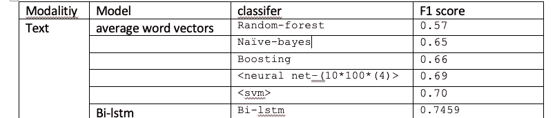

# 基于双 LSTM 的句子分类

> 原文：<https://towardsdatascience.com/sentence-classification-using-bi-lstm-b74151ffa565?source=collection_archive---------1----------------------->

## 基于双向 LSTM 模型的句子分类及其与其他基线模型的比较

因此，有各种各样的方法来进行句子分类，如单词袋方法或神经网络等。在这篇文章中，我将主要讨论使用深度学习模型(特别是双 LSTM)的句子分类任务

本文主要关注一些基本的介绍，然后直接进入实现。如果您需要更深入的信息，我在参考资料中提供了链接。

我把文章按不同的类别组织起来，

1.  介绍
2.  实现:(预处理和基线模型)
3.  双 LSTM 模型
4.  结果和结论

随意跳到一个特定的类别。

**一、简介**

对于句子分类，我们主要有两种方法:

1.  单词袋模型(BOW)
2.  深度神经网络模型

BOW 模型的工作原理是分别对待每个单词，并对每个单词进行编码。对于 BOW 方法，我们可以使用 TF-IDF 方法，但它不能保留句子中每个单词的上下文。

因此，为了更好地完成命名实体抽取、情感分析等任务，我们使用深度神经网络。

## **二世。实施**

**数据集:**

在这篇文章中，我使用了 Reddit - [数据集](https://emoclassifier.github.io/) [2]，它基于四种情绪类别，如愤怒、快乐、血腥和毛骨悚然。

对于深度神经模型，我们需要文本的嵌入。嵌入捕捉了单词在更高维度平面中的表示。通过嵌入，我们创建了单词的向量表示，通过理解单词的上下文来学习单词。我们可以使用预先训练的嵌入，如 glove、fasttext，它们在数十亿个文档上进行训练，或者我们可以使用 gensim 包等创建自己的嵌入(在我们自己的语料库上进行训练)。

在本文中，我使用了预先训练好的 [glove-twitter 嵌入](https://nlp.stanford.edu/projects/glove/)，它适用于我们的社交网络数据环境。此外，我选择 100 维嵌入，它表现很好，不需要花太多时间训练。可以选择其他(25、50、300 D 也可以)。

```
embedding_path = "~/glove.twitter.27B.100d.txt" ## change 
# create the word2vec dict from the dictionary
def get_word2vec(file_path):
    file = open(embedding_path, "r")
    if (file):
        word2vec = dict()
        split = file.read().splitlines()
        for line in split:
            key = line.split(' ',1)[0] # the first word is the key
            value = np.array([float(val) for val in line.split(' ')[1:]])
            word2vec[key] = value
        return (word2vec)
    else:
        print("invalid fiel path")w2v = get_word2vec(embedding_path)
```

**文本预处理:**

所以他们的数据有四个代表四种不同情绪的文件，所以我们需要合并这些文件来完成多类别分类任务。

```
df_rage = pd.read_csv(os.path.join(dir_path,'processed_rage.csv'))
df_happy =  pd.read_csv(os.path.join(dir_path,'processed_happy.csv'))
df_gore =  pd.read_csv(os.path.join(dir_path,'processed_gore.csv'))
df_creepy =  pd.read_csv(os.path.join(dir_path,'processed_creepy.csv'))# create a random balances dataset of all of the categories
length = np.min([len(df_rage),len(df_happy),len(df_creepy),len(df_gore)])df_final = pd.concat([df_rage[:length], df_happy[:length], df_gore[:length], df_creepy[:length]], ignore_index=True)
```

**标记化:**

为了将句子分解成更简单的记号或单词，我们对文本进行记号化。在这里，我们将使用 nltk Tweet tokenizer，因为它可以很好地处理社交网络数据。

```
import nltk
from nltk.corpus import stopwords
stopwords = set(stopwords.words('english'))
nltk.download('wordnet')
nltk.download('stopwords')
from nltk.tokenize import TweetTokenizer
from nltk.corpus import wordnet as wn
tknzr = TweetTokenizer()def get_tokens(sentence):
#     tokens = nltk.word_tokenize(sentence)  # now using tweet tokenizer
    tokens = tknzr.tokenize(sentence)
    tokens = [token for token in tokens if (token not in stopwords and len(token) > 1)]
    tokens = [get_lemma(token) for token in tokens]
    return (tokens)def get_lemma(word):
    lemma = wn.morphy(word)
    if lemma is None:
        return word
    else:
        return lemmatoken_list = (df_final['title'].apply(get_tokens))
```

准备输入变量

```
# integer encode the documents
encoded_docs = t.texts_to_sequences(sentences)
# pad documents to a max length of 4 words
max_length = max_len
X = pad_sequences(encoded_docs, maxlen=max_length, padding='post')
```

输出变量:

```
from sklearn import preprocessing
le = preprocessing.LabelEncoder()
Y_new = df_final['subreddit']
Y_new = le.fit_transform(Y_new)
```

将数据拆分为培训和测试

```
## now splitting into test and training data
from sklearn.model_selection import train_test_split
X_train,X_test, Y_train, Y_test =  train_test_split(X, y,test_size =0.20,random_state= 4 )
```

**基准模型**

在获得 LSTM 模型的分数之前，我已经从我们的基线模型中获得了一些指标:

对于基线模型，我们可以简单地计算 word2vec 嵌入的平均值。

```
# the object is a word2vec dictionary with value as array vector,
# creates a mean of word vecotr for sentences
class MeanVect(object):
    def __init__(self, word2vec):
        self.word2vec = word2vec
        # if a text is empty we should return a vector of zeros
        # with the same dimensionality as all the other vectors
        self.dim = len(next(iter(word2vec.values())))

    # pass a word list
    def transform(self, X):
        return np.array([
            np.mean([self.word2vec[w] for w in words if w in self.word2vec]
                    or [np.zeros(self.dim)], axis=0)
            for words in (X)
        ])
```

SVM

```
def svm_wrapper(X_train,Y_train):
    param_grid = [
    {'C': [1, 10], 'kernel': ['linear']},
    {'C': [1, 10], 'gamma': [0.1,0.01], 'kernel': ['rbf']},]
    svm = GridSearchCV(SVC(),param_grid)
    svm.fit(X_train, Y_train)
    return(svm)
```

韵律学

```
# svm
svm = svm_wrapper(X_train,Y_train)
Y_pred = svm.predict(X_test)
score = accuracy_score(Y_test,Y_pred)
print("accuarcy :", score)0.70
```

对于基线，你可以进一步应用其他分类器(如随机森林等)，但我用 SVM 得到了最好的 F1 分数。

对于语言环境中的神经模型，最流行的是 LSTMs(长短期记忆),这是一种 RNN(递归神经网络),它保留了文本的长期依赖性。我在参考文献中加入了链接，这些参考文献似乎详细解释了 LSTM 的观点。

**三世。双向 LSTM:**

对于双向 LSTM，我们有一个嵌入层，而不是加载随机权重，我们将从手套嵌入中加载权重

```
# get the embedding matrix from the embedding layer
from numpy import zeros
embedding_matrix = zeros((vocab_size, 100))
for word, i in t.word_index.items():
 embedding_vector = w2v.get(word)
 if embedding_vector is not None:
  embedding_matrix[i] = embedding_vector
```

我们还想计算神经模型的 vocab 大小。

```
from keras.preprocessing.text import Tokenizer
from keras.preprocessing.sequence import pad_sequences
# prepare tokenizer
t = Tokenizer()
t.fit_on_texts(token_list)
vocab_size = len(t.word_index) + 1# integer encode the documents
encoded_docs = t.texts_to_sequences(sentences)
# pad documents to a max length of 4 words
max_length = max_len
X = pad_sequences(encoded_docs, maxlen=max_length, padding='post')
y = Y_new
```

最终模型

```
# main model
input = Input(shape=(max_len,))
model = Embedding(vocab_size,100,weights=[embedding_matrix],input_length=max_len)(input)
model =  Bidirectional (LSTM (100,return_sequences=True,dropout=0.50),merge_mode='concat')(model)
model = TimeDistributed(Dense(100,activation='relu'))(model)
model = Flatten()(model)
model = Dense(100,activation='relu')(model)
output = Dense(3,activation='softmax')(model)
model = Model(input,output)
model.compile(loss='sparse_categorical_crossentropy',optimizer='adam', metrics=['accuracy'])
```

对于我们的神经模型，上面的 max_len 必须是固定的，它可以是具有最大字数的句子，也可以是静态值。我把它定义为 60。

模型总结-

```
Layer (type)                 Output Shape              Param #   
=================================================================
input_32 (InputLayer)        (None, 60)                0         
_________________________________________________________________
embedding_34 (Embedding)     (None, 60, 100)           284300    
_________________________________________________________________
bidirectional_29 (Bidirectio (None, 60, 200)           160800    
_________________________________________________________________
time_distributed_28 (TimeDis (None, 60, 100)           20100     
_________________________________________________________________
flatten_24 (Flatten)         (None, 6000)              0         
_________________________________________________________________
dense_76 (Dense)             (None, 100)               600100    
_________________________________________________________________
dense_77 (Dense)             (None, 3)                 303       
=================================================================
Total params: 1,065,603
Trainable params: 1,065,603
Non-trainable params: 0
_________________________________________________________________
```

因此，在针对 ner 模型的通用架构的论文[1]中，他们在双 LSTM 之上使用了 CRF 层，但是对于简单的多类别句子分类，我们可以跳过它。

使训练数据符合模型:

```
model.fit(X_train,Y_train,validation_split=0.25, nb_epoch = 10, verbose = 2)
```

**四:成绩**

评估模式

```
# evaluate the model
loss, accuracy = model.evaluate(X_test, Y_test, verbose=2)
print('Accuracy: %f' % (accuracy*100))Accuracy: 74.593496
```

分类报告

```
from sklearn.metrics import classification_report,confusion_matrix
Y_pred = model.predict(X_test)
y_pred = np.array([np.argmax(pred) for pred in Y_pred])
print('  Classification Report:\n',classification_report(Y_test,y_pred),'\n')Classification Report:
               precision    recall  f1-score   support

           0       0.74      0.72      0.73       129
           1       0.75      0.64      0.69       106
           2       0.76      0.89      0.82       127
           3       0.73      0.72      0.72       130

   micro avg       0.75      0.75      0.75       492
   macro avg       0.75      0.74      0.74       492
weighted avg       0.75      0.75      0.74       492
```



Comparison with other models

**结论:**

因此，我们看到，对于保留文本序列及其上下文的神经模型，我们得到了比 BOW 模型更好的分数，但这取决于上下文和应用。因此，在某些情况下，与复杂的神经模型相比，简单的模型可能是有益的。此外，我们有一个较小的数据集，所以训练时间很短，但对于较大的数据集(> 100k)，可能需要 1 个多小时的训练。

希望你喜欢，如果你有任何疑问或意见，请随时添加到评论区。谢了。

参考资料:

[1]:兰普尔、纪尧姆、米格尔·巴列斯特罗斯、桑迪普·苏布拉曼尼安、川上和也和克里斯·戴尔。"命名实体识别的神经架构." *arXiv 预印本 arXiv:1603.01360* (2016)。

[2] Duong、Chi Thang、Remi Lebret 和 Karl Aberer。"用于分析社交媒体的多模态分类."2017 年第 27 届欧洲机器学习和数据库知识发现原理与实践会议(ECML-PKDD)

 [## 了解 LSTM 网络——colah 的博客

### 这些循环使得循环神经网络看起来有点神秘。然而，如果你想得更多一点，事实证明…

colah.github.io](http://colah.github.io/posts/2015-08-Understanding-LSTMs/) [](https://machinelearningmastery.com/develop-bidirectional-lstm-sequence-classification-python-keras/) [## 如何用 Keras 在 Python 中开发用于序列分类的双向 LSTM

### 双向 LSTMs 是传统 LSTMs 的扩展，可以提高模型在序列分类上的性能

machinelearningmastery.com](https://machinelearningmastery.com/develop-bidirectional-lstm-sequence-classification-python-keras/) [](https://developers.google.com/machine-learning/crash-course/embeddings/video-lecture) [## 嵌入|机器学习速成班|谷歌开发者

### 嵌入是一个相对低维的空间，您可以将高维向量转换到其中。嵌入…

developers.google.com](https://developers.google.com/machine-learning/crash-course/embeddings/video-lecture)  [## 用 Word2Vec 进行文本分类

### 在上一篇文章中，我谈到了主题模型对于非 NLP 任务的有用性，这次又回到了 NLP 领域。我…

nadbordrozd.github.io](http://nadbordrozd.github.io/blog/2016/05/20/text-classification-with-word2vec/)