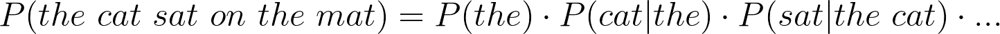

# 单词暗示特征背后的语言模型概念

> 原文：<https://towardsdatascience.com/sentence-generation-with-n-gram-21a5eef36a1b?source=collection_archive---------12----------------------->

## N 元语法的简单介绍


Photo by [Ksenia Makagonova](https://unsplash.com/@dearseymour?utm_source=medium&utm_medium=referral) on [Unsplash](https://unsplash.com?utm_source=medium&utm_medium=referral)

# 介绍

你可能在智能手机上见过单词建议功能。当您键入一个单词时，键盘会理解您键入的内容，并建议下一个相关的单词。如果你选择了建议的单词，它会建议另一个，一个又一个，直到你得到这些有趣的句子。

这是一个简单的概念，称为 [**语言建模**](https://en.wikipedia.org/wiki/Language_model) 。所以语言建模所做的是，它阅读书面文本，并试图为下一个单词分配概率。让我们看一个例子。


Figure 1: Language model tries to guess what the next word is. (number on the right is probability)

直观地，假设我们有 100 个单词要考虑下一个单词，语言模型会考虑上一个单词，并给出这 100 个单词的概率。然后，作为单词建议功能的一部分，它可以向用户提供前 3 个选项。现在，让我们给 LM 一个正式的定义。

# 语言模型


Figure 2: An example sentence with its notation

通常，语言模型被称为**，一种赋予句子概率的方式**。

但是等等！我们之前不是提到过 LM 给下一个单词分配概率吗？让我们分解上面的等式来进一步研究这个问题。



Equation 1: Probability of a sentence based on probability of predicting next word

正如你在等式 1 中看到的，LM 不仅可以给下一个给定的单词分配概率，还可以给整个句子分配概率。然后，LM 可以理解哪个句子听起来好，哪个不好。


Figure 3: Language model determines which sentence is more suitable than the others

太棒了，对吧？但是在如此强大的功能背后有什么呢？有许多方法可以创建这种语言模型。在这篇文章中，我们将探索一个简单的方法，叫做 **n-gram** 。

# n 元语法

一个关键的想法是 ngram 一次只看 n 个单词。让我们以“猫坐在垫子上”为例。


Figure 4: Behavior of bigram

假设 n=2(也称为 bigram)，它会尝试根据第一个词预测第二个词。例如:

*   **猫** : Bigram 试图记住“the”后面应该是“cat”。
*   **cat sat**:“cat”后面应该是“sat”。
*   **坐在**上:“坐”之后是“开”

n=3 的情况也是如此。对于单词“猫坐”，三元模型知道“坐”在“猫”之后。我想你明白了。

这个概念可扩展到 n 个单词(n-gram)。那么，ngram 如何知道所有这些模式呢？是**概率论**。

# 二元模型

为了简单起见，我们将看看二元模型的情况。从上面的例子中，我们知道“cat”在“the”之后，可以表示为 *P(cat | the)* 。

> P (cat | the):给定单词“the”，下一个单词是“cat”的概率。

要计算这个概率，只需使用下面的公式。


Equation 2: Probability for Bigram

其中 *c(猫)*是“猫”在整个语料库中的出现次数。同样的道理也适用于 *c(the)* 。直观地说，这个等式表示:**在所有的单词“the”中，有多少个单词后面是“cat”？瞧，现在我们有了。**

# 二元模型与三元模型

Bigram 很简单，功能也很强大，但是在很多情况下它无法执行。例如:


Figure 3: Bigram fails when it has the same previous word

在句子的开头，模型看到“the”后面跟着“cat”。如果我们使用 bigram，并且仅依靠**之前的一个单词**，则很难猜出下划线单词是“mat ”,因为它可能再次生成“cat”。幸运的是，三元模型或四元模型可以解决这个问题。也就是说，如果我们看到“坐在”,下一个词很可能是“垫子”。

然而，这并不意味着我们考虑的序列越长，预测就越好。例如，对于 6-gram 来说，可能很难看到确切的“猫坐在”。因此，它不是很有效。

> 大多数时候，二元模型和三元模型是常见的选择。

# 后退和插值

也有这样的时候，你的数据集很小，3-gram 不能识别一些精确的单词；因此，导致概率为 0。这将使您的整个 3-gram 实现不再有用。

你可以很容易地做一个简单的 if-else，并在 3-gram 失败的情况下使用 2-gram。或者在 2 克失败的情况下使用 1 克。**有种叫做，退避。**

另一种技术，**插值**，是同时考虑不同的 ngrams。这个想法是给你的 n-gram 赋予权重(λ),这样你的 3-gram 模型也可以查看 2-gram 和 1-gram 的值。即

*   3 克装 60%
*   2 克装 35%
*   1 克含 05%


Equation 3: Interpolation of 3-gram

手动配置重量，直到你觉得它是正确的。你也可以使用一些自动的方法，但是我们不会在这篇文章中讨论。有关如何正确设置这些重量的更多信息，您可以参考[和](https://web.stanford.edu/~jurafsky/slp3/3.pdf)。

# 履行

现在让我们试着用这个 LM 来生成一个基于随机首字的句子。对于这个任务，我们将使用[哈利波特与魔法石电影剧本](https://www.kaggle.com/gulsahdemiryurek/harry-potter-dataset)来训练我们的 ngram。对于下面的代码，你也可以在[上找到这个内核](https://www.kaggle.com/ruka96/sentence-generation-with-n-gram?scriptVersionId=22881807)。

然后，我们就可以统计出一元词、二元词和三元词的出现频率。这将在以后用于计算概率。

既然我们可以计算 n-gram 的数目，我们就可以计算它的概率。对于 1 克、2 克和 3 克，我们将分别使用 0.01、0.4 和 0.5 的线性插值。

让我们试着造 20 个单词。首字母将被随机化，并选择最好的下一个单词。

那么，这将如何表现呢？下面是每一代的结果。

```
Generation #1:
protecting the stone , but i think i 'll be a wizard . . . . . . . .Generation #2:
platform 9 3/4 ? think you 're going to be the same . . . . . . . Generation #3:
sacrifice himself , he 's got a little bit . . . . . . . . . . .
```

# 结论

N-gram 是一种简单而强大的语言建模技术，只需查看 2 到 3 个单词。由于计算简单快速，它在许多应用中非常实用，例如移动设备上的单词建议。然而，N-gram 在生成长句时并不健壮，因为长句中的当前单词依赖于句子中的第一个单词。这种长期依赖关系更适合神经网络之类的模型，但这是以后文章的主题。

# 参考

1.  [https://web.stanford.edu/~jurafsky/slp3/3.pdf](https://web.stanford.edu/~jurafsky/slp3/3.pdf)
2.  [https://towards data science . com/introduction-to-language-models-n-gram-e 323081503d 9](/introduction-to-language-models-n-gram-e323081503d9)
3.  [http://www . cs . UMD . edu/class/fall 2018/cmsc 470/slides/slides _ 10 . pdf](http://www.cs.umd.edu/class/fall2018/cmsc470/slides/slides_10.pdf)