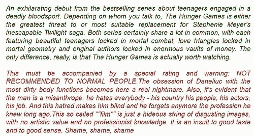
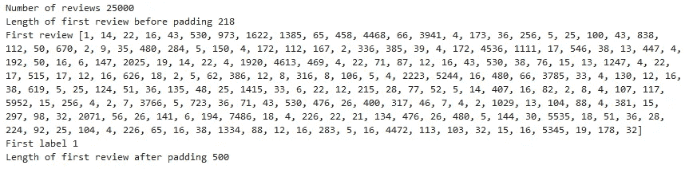
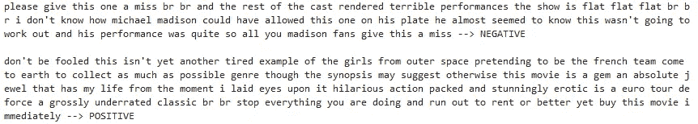
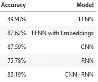
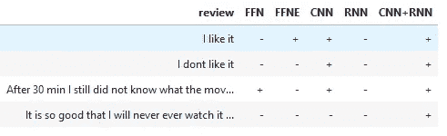

# 情感分析:一个实用的基准

> 原文：<https://towardsdatascience.com/sentiment-analysis-a-benchmark-903279cab44a?source=collection_archive---------18----------------------->

## 使用 FCNNs、CNN、RNNs 和 Python 中的嵌入对客户评论进行分类。

通过动手实践 Python 代码，我们展示了简单递归神经网络的局限性，并展示了嵌入如何改进用于情感分类的全连接神经网络和卷积神经网络。

我们通过对电影评论数据集进行情感分类，展示了如何处理序列数据。情感基本上是感情，包括用自然语言写的情感、态度和观点。

# IMDB 电影评论数据集

我们首先使用 Keras API 加载 IMDB 数据集。评论已经被符号化了。我们希望有一个有限的词汇表，以确保我们的单词矩阵不是任意小的。我们还希望有一个有限长度的评论，而不是必须处理非常长的句子。我们的训练数据集有 25，000 条客户评论，以及它们的正确标签(正面或负面)。

上面你可以看到一个例子，是一个数字列表，也叫做单词向量。每个数字代表一个单词在词汇表中的索引。如果您需要更深入地了解机器学习的文本表示，您可能想在继续之前看看下面的文章。

 [## 自然语言处理中的文本表示

### 理解书面单词:温习 Word2vec、GloVe、TF-IDF、单词袋、N-grams、1-hot 编码…

towardsdatascience.com](/representing-text-in-natural-language-processing-1eead30e57d8) 

通过将单词 vectors 转换回文本，下面的代码可以用来以纯文本显示评论。我们运行一个样本正面和一个样本负面审查的代码。

# FCNN、CNN、RNN 的情感分析基准

一个句子可以被认为是一系列具有跨时间语义联系的单词。就语义联系而言，我们的意思是，出现在句子前面的词在句子的后半部分影响句子的结构和意义。在理想情况下，一个句子中还有向后的语义联系。它们通常是通过将句子以相反的顺序输入到一个模型中来捕获的。

**递归神经网络**可用于提取、识别或表征文本的情感内容，并将其分类为正面或负面。

 [## 递归神经网络解释

### 一个有趣的和有插图的指南来理解直觉。

towardsdatascience.com](/recurrent-neural-networks-explained-ffb9f94c5e09) 

我们将这种方法与全连接神经网络、卷积神经网络以及两者的组合进行比较。

下面的代码运行 ca。在 Google Cloud 的 GPU 实例上运行 2 小时。

未看过的电影评论(测试数据集)的分类精度如上表所示。令人惊讶的是，具有嵌入的全连接神经网络优于其余的网络。这是一个 250 个节点完全连接的单层网络。卷积神经网络具有类似的精度。虽然 CNN 被设计为尊重图像数据中的空间结构，同时对场景中学习到的对象的位置和方向具有鲁棒性，但这一相同的原理也可以用于序列，例如电影评论中的一维单词序列。使 CNN 模型对于学习识别图像中的对象有吸引力的相同属性可以帮助学习单词段落中的结构，即对于特征的特定位置的技术不变性。在研究社区中，关于 CNNs vs RNNs 仍然存在公开的争论。在电影评论分类的情况下，与没有嵌入的全连接网络相比，简单的 RNN 在处理序列数据中是有用的。

# 自由文本上的情感预测

下面我们在自由文本评论上测试我们的模型。每个评论首先被标记化，然后被转换成用于预测的词向量。正面评论的概率被选择为大于 0.5。

带有嵌入的完全连接的神经网络对所有四种情绪都是正确的，而其余的模型有假阳性和假阴性。我们的 RNN 和 CNN 的性能肯定可以通过在更强的 GPU 机器上增加训练时段的数量来提高。

# 结论

在本文中，我们展示了神经网络如何解决电影评论的分类问题，同时对卷积神经网络的全连接方法进行了基准测试。简单的 RNN 是一个“非常深”的前馈网络(当在时间上展开时)。除了爆炸和消失梯度的问题，在实践中，他们不能学习长期的依赖关系。LSTMs 的明确设计是为了避免长期依赖问题。这里没有涉及它们，也没有涉及朴素贝叶斯，朴素贝叶斯是一种概率性的情感分析方法。

有助于理解 RNN 和 LSTM 运作的两个最好的博客是:

1.  [http://karpathy.github.io/2015/05/21/rnn-effectiveness/](http://karpathy.github.io/2015/05/21/rnn-effectiveness/)
2.  http://colah.github.io/posts/2015-08-Understanding-LSTMs/

你也可以看看我的其他文章，详细解释 LSTMs 和一般的深度学习。

 [## 基于 LSTM 的非洲语言分类

### 厌倦了德法数据集？看看 Yemba，脱颖而出。力学的 LSTM，GRU 解释和应用，与…

towardsdatascience.com](/lstm-based-african-language-classification-e4f644c0f29e)  [## 深度学习为什么有效:解决一个农民的问题

### 在开始是神经元:梯度下降，反向传播，回归，自动编码器，细胞神经网络…

towardsdatascience.com](/why-deep-learning-works-289f17cab01a)