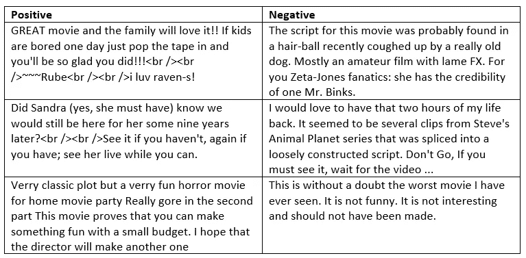
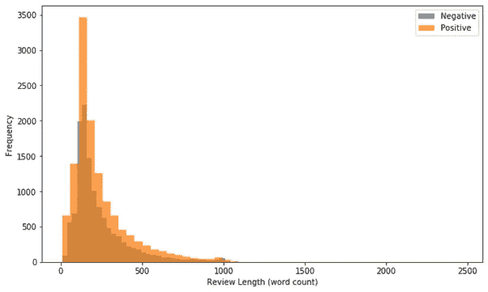
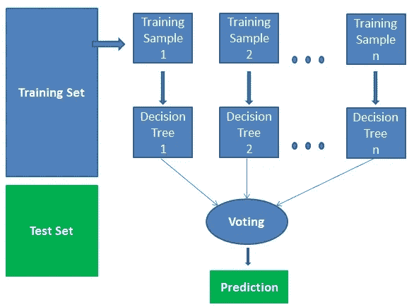
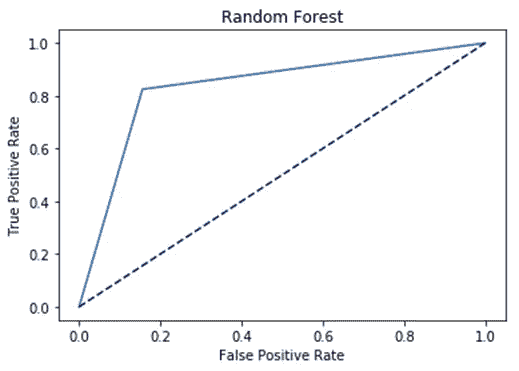

# 情感分析——电影评论指南

> 原文：<https://towardsdatascience.com/sentiment-analysis-a-how-to-guide-with-movie-reviews-9ae335e6bcb2?source=collection_archive---------0----------------------->

## [现实世界中的数据科学](https://towardsdatascience.com/data-science-in-the-real-world/home)

## 你觉得情感分析怎么样？好/坏？到这篇文章结束的时候，你会觉得积极向上！


Image retrieved from Kaggle

那么，到底什么是情操？情感与一个单词或一系列单词的意思有关，通常与一种观点或情感有关。还有分析？嗯，这是看数据，做推论的过程；在这种情况下，使用机器学习来学习和预测电影评论是正面还是负面。

也许你有兴趣知道电影评论是正面还是负面，公司在各种场合使用情感分析，特别是出于营销目的。用途包括社交媒体监控、品牌监控、客户反馈、客户服务和市场研究(“情绪分析”)。

这篇文章将涵盖:

1.  竞争
2.  预处理数据
3.  特征
4.  系统模型化
5.  估价
6.  后续步骤

# 竞争

我们将使用 [IMDB 电影数据集](https://www.kaggle.com/c/word2vec-nlp-tutorial/data)，其中有 25，000 条带标签的评论用于训练，25，000 条评论用于测试。 [Kaggle 挑战赛](https://www.kaggle.com/c/word2vec-nlp-tutorial/)要求二进制分类(“一袋单词和一袋爆米花”)。

让我们来看看数据集的一些汇总统计(李，2019)。我们被告知，积极和消极的电影评论平分秋色。以下是一些正面和负面的评论:



Selection of reviews including all the formatting and typos.

看到电影评论(字数)长度的分布根据情绪分裂也很有趣。这两种类型的评论的传播形状相似，但是负面评论平均来说要短一些。



Graph of word count frequency according to sentiment.

# 预处理

文字是杂乱的，人们喜欢通过添加过多的标点符号和拼写错误来更清楚地表达自己。然而，机器学习模型无法处理作为输入的文本，因此我们需要将字符和单词映射为数字表示。

文本的基本预处理包括删除非字母字符、停用词(一组非常常见的词，如 the、a 和等)。)并将所有单词改为小写。在这种情况下，我们还需要从电影评论中删除 HTML 标签。这些步骤可以打包成以下函数。

Code to process movie reviews.

下表显示了当停用词从评论中删除后，最常用的词是如何变化的。


Table of frequent words with and without stop words.

# 特征

我们应该如何将单词表示转换成模型可以解释的数字形式？有许多方法，但是现在，让我们尝试一些简单的方法。

## 一袋单词

我们从语料库(整个文本数据集)中获得词汇表。词汇表的长度等于我们应用单词包(BOW)时输出的向量的长度。对于每一项(可能是一个条目、一句话、一行文本)，我们将文本转换成向量形式的频率计数。在这种情况下，我们将其限制为前 5000 个单词，以限制数据的维度。我们通过从 [sklearn 的库](https://scikit-learn.org/stable/modules/generated/sklearn.feature_extraction.text.CountVectorizer.html)中设置一个计数矢量器来对此进行编码，使其适合训练数据，然后转换训练和测试数据。

下面的灰框中给出了一个例子。我们查看语料库中所有独特的单词，然后计算这些单词在每段文本中出现的次数，从而得到每段文本的向量表示。

```
Text:It was the best of times,it was the worst of times,it was the age of wisdom,it was the age of foolishness.Unique words:
"it", "was", "the", "best", "of", "times", "worst", "age", "wisdom" "foolishness""it was the worst of times" = [1, 1, 1, 0, 1, 1, 1, 0, 0, 0]"it was the age of wisdom" = [1, 1, 1, 0, 1, 0, 0, 1, 1, 0]"it was the age of foolishness" = [1, 1, 1, 0, 1, 0, 0, 1, 0, 1]
```

## Word2Vec

Word2vec (Word to Vector)是一个处理文本的两层神经网络。它的输入是一个文本语料库，输出是一组向量:语料库中单词的特征向量。该算法由谷歌在 2013 年创建。50 维空间可以通过使用经典的投影方法(例如 PCA)来可视化，以将向量减少到可以在图上绘制的二维数据。

为什么我们要用 Word2vec 而不是 BOW？它更擅长在周围环境中学习单词。这个过程比实现 BOW 要复杂一些，所以我不会在这里概述，但可以在[的 GitHub 文件夹](https://github.com/shiaoligreen/practical-data-science/tree/master/Bag%20of%20Words%20Meets%20Bags%20of%20Popcorn)中找到(Dar，Green，Kurban & Mitchell，2019)。简而言之，它需要将评论标记为句子而不是单词，确定向量表示，然后适当地平均它们。

## Tf-Idf

这是 Term-Frequency-Inverse-Document-Frequency 的缩写，它为我们提供了一个衡量单词在文档中的重要性的方法。

术语频率(与单词袋相同):


逆文档频率衡量一个术语在所有文档中的稀有程度(值越高，单词越稀有)[【1】](#_ftn1):


我们将这两者结合起来得到 Tf-Idf，如下所示:


为了实现这个表示，我们使用了来自 [sklearn 库](https://scikit-learn.org/stable/modules/generated/sklearn.feature_extraction.text.TfidfTransformer.html)的 TfidfTransformer 函数。对训练集进行拟合，并为测试集确定相同单词的值。

Code for some of the features.

[【1】](#_ftnref1)其中 ln 为自然对数。

# 系统模型化

我们为这个数据集尝试了两种不同的模型:朴素贝叶斯和随机森林。朴素贝叶斯建立在贝叶斯定理的基础上，而随机森林是一组决策树。这两个实现的合并代码可以在 GitHub 存储库中的 NLP _ IMDb·朱皮特笔记本中找到(Dar 等人，2019)。

# 朴素贝叶斯

这是一个用于分类的概率机器学习模型，基于贝叶斯定理:


b 是证据，而 A 是假设(Gandhi，2018)。我们必须假设这些特征是独立的(一个不影响另一个)。

根据这个问题，我们用 y 表示正面或负面的评论，X 表示评论的特征向量。我们最后得到的寻找类的等式是:


这是使用 [sklearn 的朴素贝叶斯包](https://scikit-learn.org/stable/modules/naive_bayes.html)实现的！

## 随机森林

随机森林是一系列决策树，其中的叶节点表示预测的类别。我们可以使用 [sklearn 的 ensemble 包](https://scikit-learn.org/stable/modules/generated/sklearn.ensemble.RandomForestClassifier.html)中的 RandomForestClassifier 函数。

每个决策树都包含一组特征，并在最后输出一个决策。然后将所有决策树的结果结合起来，给出最终的类别预测。来自 DataCamp 的下图很好地展示了这一过程。



Image retrieved from DataCamp

## 估价

Kaggle 指定使用 ROC 曲线下的面积作为本次比赛的衡量标准。ROC 是接收运营商特征的缩写，是一种概率曲线。它将真阳性率与假阳性率进行对比。[【2】](#_ftn1)这条曲线下的面积越高，模型预测产量就越好。下面是单词袋和随机森林的图表。虚线表示基线，如果预测是随机的，那么这是可以预期的。



The area under the ROC curve for Bag of Words with a Random Forest.

我们可以在下表中检查一些不同的排列。


Table of results for various feature and model combinations.

有趣的是，与随机森林相比，Tf-Idf 表现稍好，而朴素贝叶斯表现稍好。然而，具有 Word2Vec 特性的朴素贝叶斯的性能会显著下降。这可能是因为当表示转换为正数时丢失了一些信息(因为朴素贝叶斯只允许正值)，而使用了高斯朴素贝叶斯。

[[2]](#_ftnref1) True positive 表示当一个项目为正数时，它被预测为正数。假阳性表示阴性项目被预测为阳性。

## 后续步骤

这只是情感分析的开始。进一步的方法可以使用二元模型(两个单词的序列)来试图保留更多的上下文含义，使用 LSTMs(长短期记忆)等神经网络来扩展评论中单词之间的关系距离等。

# 参考

一袋文字遇上一袋爆米花。(未注明)。从[https://www.kaggle.com/c/word2vec-nlp-tutorial/](https://www.kaggle.com/c/word2vec-nlp-tutorial/)取回

达尔，奥，格林，s，库尔班，r .，，米切尔，C. (2019)。冲刺三，一队。从 https://github.com/shiaoligreen/practical-data-science[取回](https://github.com/shiaoligreen/practical-data-science)

甘地，R. (2018 年 5 月 5 日)。朴素贝叶斯分类器。检索自[https://towards data science . com/naive-Bayes-classifier-81d 512 f 50 a7c](/naive-bayes-classifier-81d512f50a7c)

李，s .(2019 . 3 . 18)。一个完整的探索性数据分析和文本数据的可视化。检索自[https://towards data science . com/a-complete-explorative-data-analysis-and-visualization-for-text-data-29fb 1b 96 FB 6a](/a-complete-exploratory-data-analysis-and-visualization-for-text-data-29fb1b96fb6a)

情感分析。(未注明)。从 https://monkeylearn.com/sentiment-analysis/[取回](https://monkeylearn.com/sentiment-analysis/)