# 情感分析和登月

> 原文：<https://towardsdatascience.com/sentiment-analysis-and-the-moon-landing-2466baf65a53?source=collection_archive---------16----------------------->

*应用机器学习结合基于规则的方法来理解第一次载人登月 50 周年后的情绪*


The lunar lander ‘The Eagle’ on its descent towards the surface of the moon. Nasa

1969 年 7 月 20 日，月球着陆器向休斯顿报告:

> 休斯敦，这里是宁静湾。老鹰着陆了。

在过去的几天里，世界各地的媒体参加了庆祝首次将我们带到月球的史诗般的月球任务 50 周年的活动。从存档材料中可以清楚地看出，这一里程碑被广泛誉为人类成就的巅峰。然而，与此同时，人们也对阿波罗计划的巨额费用提出了质疑。这些资源本可以更明智地使用吗？这种观点认为，我们仍然在地球上与挑战作斗争，所以为什么要去太空寻找更多的挑战。

我们如何去了解今天的普遍意见呢？自 1969 年以来发生了一些戏剧性的变化，使我们能够对最普遍的情绪有一个更广泛的了解。通过社交媒体以及强大算法的出现，我们拥有了丰富的信息，这些算法允许我们以各种方式自动处理数据。想象一下拥有可以告诉我们一个陈述的情感内容的机器！情感分析的应用在我们的社会中扮演着越来越重要的角色，从产品开发到衡量不同公共政策的受欢迎程度。我们将探索情绪分析是如何完成的，并看看如何利用它来解码基于 50 周年前后收集的 twitter 数据的公众情绪。

# **为什么要进行情绪分析，这是怎么一回事？**

[情感分析](https://en.wikipedia.org/wiki/Sentiment_analysis)，或观点挖掘，是关于发现人们对产品、服务或话题的观点、情感和感受。自动情绪分析的效用来自于这样一个事实，即可用的结构化反馈，如从您的酒店评论部分的星级评级中收集的反馈，通常非常稀少且缺乏深度。我们更倾向于在社交媒体上发布更微妙的反馈和评论。随着处理大量文本形式的非结构化数据的现代工具的出现，公司和组织开始挖掘这个洞察力的金矿。

情绪分析涵盖不同的类别，如极性、主观性，甚至包括快乐、悲伤、愤怒和惊讶等情绪:

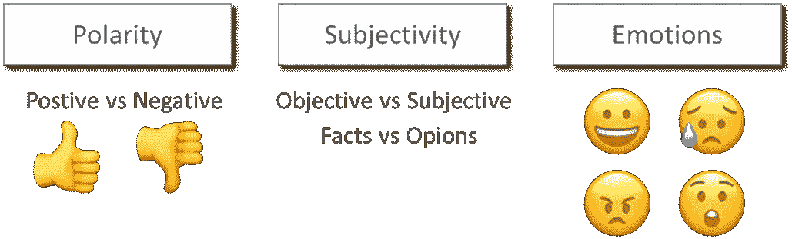

我们在本文中关注的情绪类型与书面陈述的“极性”有关，即特定推文的整体积极或消极程度。需要注意的是，情感分析并不是一个完全被征服的领域。即使对于最先进的算法，这仍然是一项艰巨的任务，这使得它成为研究人员和商业开发人员非常感兴趣的领域。

# **对社交媒体数据进行情感分析时面临的挑战**

我们表达自己的方式因个体差异和文化背景而异。甚至我们一时的情绪也会影响我们选择如何表达自己，并且会在一天中发生变化。不同文化之间也有很大的差异，例如，我们表达不同感情的强烈程度。在社交媒体数据的情感分析方面，一些最常见的挑战是:

俚语、拼写错误和非常规的语言使用

b)一条推文中不同主题的多种观点

c)修饰词和否定词(强化/弱化或转化情感)

d)模棱两可的话(“生病”可能意味着你生病了，或者某事实际上非常好)

e)符号、表情符号和表情符号；-)

f)讽刺和讽刺，甚至人类犯的错误比我们想象的还要多

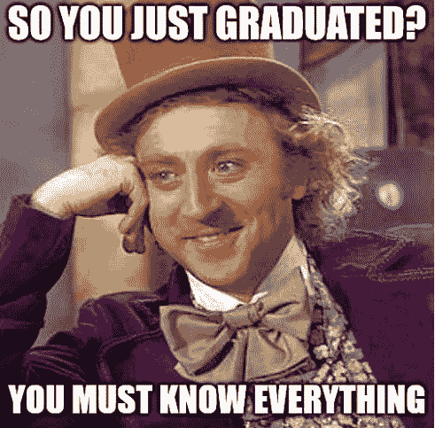

除了这些特定语言的挑战，还有偏见和不平衡数据的挑战。与某些主题相关的各种社交媒体平台可能有偏见，不代表全体民众的意见。不平衡的数据对于机器学习模型来说可能是具有挑战性的。想象一下，90%的“训练”数据有积极的情绪，那么模型在区分中性和消极情绪方面可能表现不佳。语言也不是一成不变的，而是不断发展的，任何模型都需要不断地被监控和更新。甚至人类也不能总是完全处理与情感分析相关的所有挑战，尤其是在文本形式中，其中存在有限的视觉线索，例如发送者的面部表情。

# **基于规则 vs 机器学习**

进行情感分析有两种主要方法:

*   基于规则的专家系统(又称词典方法)
*   机器学习(人工智能的子领域)

基于规则的方法依赖于“词典”，它是一个包含大量单词的词汇表，每个单词都有一个预定义的情感值。例如，单词“恨”的情感值为-0.57，而“爱”的情感值为+0.63。在其最简单的形式中，该算法将文本中每个单词的所有情感值相加，以计算整体情感。基于规则的方法的优点是，给定足够大的词典，它们是相当准确的，并且人们可以容易地描述每个情感分类是如何形成的。

第二种方法基于机器学习，像人类一样从经验中学习。一般来说，经历或训练越多，这些模型在预测情绪方面就越好。有许多机器学习算法，数据科学家的任务之一是了解哪些算法与哪种类型的问题相关。机器学习方法有可能比基于规则的方法更好地扩展，并且已经被证明是惊人地准确。然而，与更透明的基于规则的方法相比，它需要大量的训练数据，并且对于一些算法来说，更难解释如何做出某个预测。我们将进一步研究如何应用机器学习和基于规则的方法来进行情感分析，并对它们进行比较。第三种选择，通常在工业中使用，是使用一种结合了两者优点的混合方法。

# 让我们开始吧

在我们准备好计算整体情绪之前，我们需要执行许多步骤。我们采用的方法是*数据科学家的*方法:

1.阐明假设和定义目标

2.获取和探索数据

3.训练和评估模型

4.预测情绪并分析结果

# **1。** **制定假设，明确目标**

在我们进入数据之前，定义一个明确的目标并决定如何衡量我们的成功率是非常重要的。我们的目的是看看我们是否能对当前与美国宇航局在阿波罗计划期间进行的太空探索有关的情绪有所了解。假设是，我们将会注意到登月 50 周年所带来的所有关注所带来的更大影响。这项任务是预测 7 月 20 日前后几天 Twitter 消息的极性。极性将被定义为属于三类之一:正、负和中性。极性还会有一个振幅，例如，一条推文可以是正的(+0.23)或非常正的(+0.91)。

如上所述，我们将评估两种不同的情感分析方法，基于规则和基于机器学习。为了比较它们，我们将使用一个所谓的“[混淆矩阵](https://en.wikipedia.org/wiki/Confusion_matrix)”。混淆矩阵通常用于这些类型的分类任务，并以结构化格式展示正确和不正确的分类:

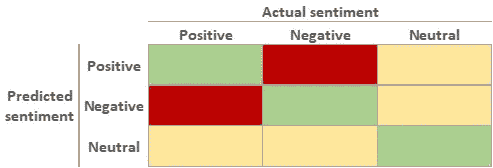

The confusion matrix

我们希望最大化正确预测情感(绿色)的数量占所有预测情感的比例。这被称为模型的准确性。相反，我们希望最大限度地减少错误预测情绪的数量(黄色和红色)。由于我们对积极情绪和消极情绪之间的比例感兴趣，我们将格外关注避免假阴性和假阳性(用红色标记)。这些类型的错误分类将在最大程度上影响正面和负面之间的比率。错误分类的中性情绪(黄色)也值得最小化，但不如假阳性/假阴性率优先。

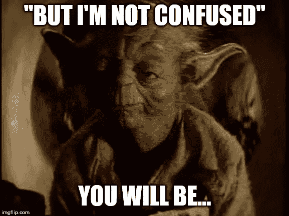

混淆矩阵有时会令人混淆，所以让我们来看一个例子。看看下面这条推文:

> “阿波罗 11 号的一个伟大时刻是美国国家航空航天局宣布发射期间宇航员的心率”

一个情绪模型预测它带有积极的情绪(+0.62，其中+1.00 是最积极的)，这与人类对它的评价一致，使它成为真正积极的*:*

*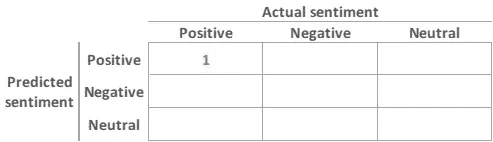*

*Confusion matrix with one correctly made sentiment prediction*

*现在考虑这条推文:*

> *“美国国家航空和宇宙航行局只是隐藏秘密太空计划和其中的先进技术的烟幕”*

*它显然是负面的，但一个情绪模型预测它是*正面的* (+0.08)，使它成为一个*假正面的*预测(使用 0 的截止值，所有低于 0 的都被归类为负面):*

*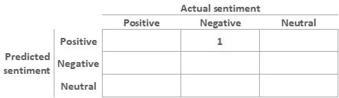*

*Confusion matrix with one incorrectly made sentiment prediction*

*另一个值得注意的评估分类器的方法是[接收器操作特性](https://en.wikipedia.org/wiki/Receiver_operating_characteristic)。但是为了简单起见，我们将在这里集中讨论混淆矩阵。*

*因此，总结一下:我们希望通过捕获每个类别中的所有情感(回忆)来最大化绿盒(准确性)，同时我们希望尽可能多的预测是正确的(精确度)。我们预计会有一部分未分类的推文。但是，由于我们正在寻找积极/消极情绪的比率，我们理想地想要一个在分类积极和消极情绪方面同样好(或坏)的模型。*

# ***2。** **数据的采集和勘探***

*为了获取 Twitter 数据，我们设置了一个 [Twitter 开发者账户](https://developer.twitter.com/)来访问 Twitter API。有了安全的 api，我们将使用 Python 和开源库 Tweepy 连接到 API 并收集 tweets:*

**

*具体来说，我们正在查看 7 月 14 日至 7 月 22 日期间收集的英语推文。总共收集了数百万条推文，其中 21 000 条包含关键词[NASA，Apollo，Saturn V 等等。].这些推文被收集到一个数据库中( [SQLite](https://sqlite.org/index.html) )，然后就可以使用 Python 的 Pandas 库进行访问和操作。*

*此外，我们需要另一个带有*标签数据*的 twitter 数据集，以便训练和评估我们的两个竞争模型。带标签的数据是指我们知道正确情绪的推文。为了进行适当的评估，我们应该尽可能使用与手头任务相似的数据，例如主题、长度、语言、音调等。一个流行的数据集是斯坦福 Twitter [数据集](http://cs.stanford.edu/people/alecmgo/trainingandtestdata.zip)。它包含了自 2009 年 4 月以来的 160 万条带有注释的推文。*

*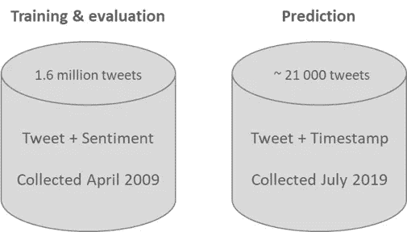*

*Two datasets: the “Stanford Twitter” for Training & evaluation and the newly scraped sentiments using Twitters API*

*仔细观察“训练和评估”数据集，我们可以看到它在负(0)和正(4)之间达到了完美的平衡，各有 80 万。请注意，数据集缺乏我们在评估模型时需要处理的任何中性情绪:*

*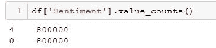*

*Balanced ‘training & evaluation’ dataset*

*该数据集的标签是使用机器学习算法(参见论文[此处](https://cs.stanford.edu/people/alecmgo/papers/TwitterDistantSupervision09.pdf))而不是人工注释创建的，因此可能包含一些奇怪和误导性的分类。这个例子似乎普遍适用:*

> *使用牙线。我总是害怕晚上的这个时候(0，即消极)*

# ***3。** **训练和评估模型***

***基于规则的模型(无需培训)***

*如前所述，我们希望评估基于规则和机器学习模型的准确性。对于基于规则的评估，我们将研究一个开源框架 [VADER](https://github.com/cjhutto/vaderSentiment) (效价感知词典和情感推理机)。Vader(让我们坚持使用小写字母)是一个基于词汇和规则的情绪分析工具，专门针对社交媒体中表达的情绪。通过规则引擎，Vader“倾听”修饰词(加强/削弱)，使用大写字母和感叹号(加强感情)。维达甚至支持表情符号和表情符号。*

*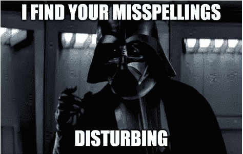*

```
***from** vaderSentiment.vaderSentiment **import** SentimentIntensityAnalyzer
analyzer = SentimentIntensityAnalyzer()analyzer.polarity_scores('great minds think alike')['compound']0.6249*
```

*`compound`分数是通过对词典中每个单词的化合价分数求和计算出来的，根据规则进行调整，然后归一化到-1(最极端的负面)和+1(最极端的正面)之间。*

*让我们对来自“培训和评估”数据集的推文子集(100 k)进行情感分析，并评估:*

```
*df['Vader_compound'] = df['SentimentText'].apply(**lambda** x: analyzer.polarity_scores(x)['compound'])df.sample()*
```

*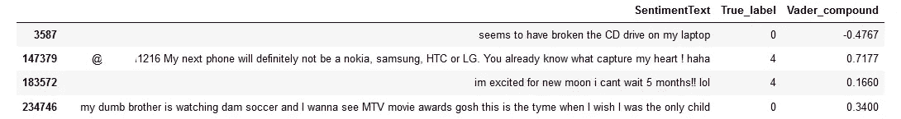*

*基于这些分数，我们可以使用维德[文章](https://github.com/cjhutto/vaderSentiment)建议的默认临界值来决定情感分类:*

*正面情绪:`compound`得分> = 0.05*

*中性情绪:(`compound`得分> -0.05) & ( `compound`得分< 0.05)*

*负面情绪:`compound`得分< = -0.05*

*根据上述截止值，我们得出以下基于 100 k 样本的混淆矩阵(四舍五入到最接近的 1000):*

*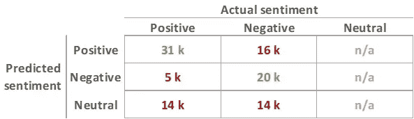*

*这相当于 51%的总体准确率(从左上角到右下角的对角线总和，并按预测总数进行划分)。这不是一个令人印象深刻的数字。跳过中性的(在这种情况下，不会影响正/负的总比率，因为它们是近似平均分布的)，我们得到 71% 的**准确度。请记住，该数据集不包含任何被标记为中性的推文，但模型预测约有 28%属于这一类别。让我们看看这与基于机器学习的方法相比如何。***

***机器学习***

*如上所述，我们不仅有一个机器学习模型可供选择，而是有一个由不同算法和方法组成的生态系统。我们将利用所谓的[人工神经网络](https://en.wikipedia.org/wiki/Artificial_neural_network)，这种网络近年来以[深度学习](https://en.wikipedia.org/wiki/Deep_learning)的名义引起了很多热议。这些神经网络最初是受人脑如何通过以各种方式连接计算机模拟的神经元来运作的启发。这些人工神经元可以被视为实际生物神经元的数学表示。如同生物学上的对应物一样，学习和记忆并不编码在神经元本身，而是编码在神经元之间的连接中。多年来，已经尝试和测试了各种专门的神经网络架构。出于我们的目的，我们将更密切地关注所谓的*递归神经网络*，它特别能够处理数据序列，如文本，它可以被视为一系列单词和以特定顺序设置的其他令牌。在循环神经网络家族中，我们发现了一种叫做*长短期记忆* ( [LSTM](https://www.researchgate.net/publication/13853244_Long_Short-term_Memory) )的变体。开发 LSTM 是为了应对与测序数据相关的特定挑战，即长期依赖性。对于文本数据，这意味着 LSTM 可以连接跨越大跨度文本序列的模式。其他架构往往会“忘记”，并主要关注文本序列的最后部分。*

*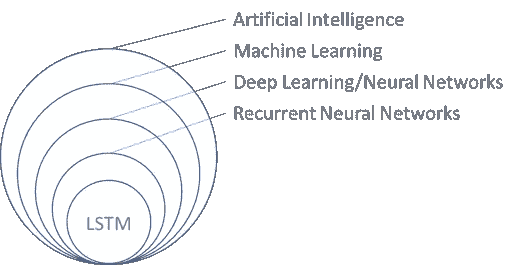*

*如上所述，这些模型需要大量的培训。这意味着我们必须向神经网络“展示”数千条不同的推文以及正确的答案，然后才能用它来预测情绪。*

*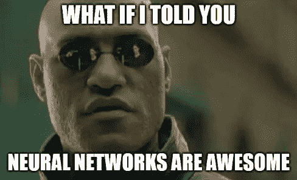*

*我们可以花很多很多文章来研究神经网络，尤其是 LSTM 是如何工作的。但是在这篇文章中，我们将集中讨论如何设置它们来进行分类情感的特定任务的训练。对于那些对 LSTM 详细工作原理感兴趣的人，我推荐 Christopher Olah 关于这个话题的博客文章。*

*在获取和探索我们的数据之后，我们继续进行数据清理或其他预处理步骤。我们将删除任何无助于神经网络将特定文本输入与特定情感相关联的内容。这包括:超链接、用户名、转发前缀、数字和标点符号。其他预处理步骤通常包括移除非常频繁的单词([停用单词](https://en.wikipedia.org/wiki/Stop_words))、纠正拼写错误的单词、移除表情符号/表情符号以及将单词简化为其基本形式(词干)。人们必须注意，这些结构中的一些可能实际上包含有助于预测情绪的信息。例如，当删除非常频繁的单词时，我们可能会意外地删除否定词(例如，不要，不会)，这些否定词可以通过颠倒句子的整个情感来发挥重要作用。*

*在我们将清理过的推文输入神经网络之前，我们需要将单词转换成数值，以便模型能够消化它们。这意味着我们需要使用以下方法之一将每个单词映射成一个数字:*

1.  *为文本中出现的每个单词分配一个数字，例如，第一个单词被赋予数字 1，最后一个单词将被映射到 38041(如果所有推文中有那么多独特的单词)*
2.  *使用一种叫做*TF-IDF*(T[erm Frequency-Inverse Document Frequency](https://en.wikipedia.org/wiki/Tf–idf))的技术:我们给每个单词分配一个实数，这个实数与该单词在一条推文中出现的频率除以该单词在整个推文中出现的频率成比例。这个词在所有推文中出现的频率越高，实际数字就越低。理论是，一个词在所有推文中越不寻常，它能提供的信息就越多。最常见的词不太可能帮助我们区分不同的推文，以预测情绪。*
3.  *应用*单词嵌入*(例如 Word2Vec):一种复杂的方法，不仅将每个单词映射到单个数字，还映射到一系列数字(向量)，旨在捕捉一个单词可能包含的许多细微差别和维度。这些向量的一个特别有用的特性是，两个单词彼此越相关，向量就越相似。*

*为简单起见，我们将使用(1)并将单词映射到出现时的数字，并将单词限制在最常见的前 20 000 个:*

```
*# Encode the tweets into sequences of integers
**from** keras.preprocessing.text **import** Tokenizertokenizer = Tokenizer(num_words=20000)
tokenizer.fit_on_texts(X_train)
sequences_train = tokenizer.texts_to_sequences(X_train)
sequences_test = tokenizer.texts_to_sequences(X_test)*
```

*例如，下面这条推文:“现在要睡觉了，晚安各位”*

*映射到:[43，2，137，27，456，181]*

*最后，我们需要让推文具有相同的维度(长度)，我们可以通过将序列“填充”到最大 25 个单词的长度来实现这一点:*

```
*# Pad sequences
max_length = 25X_train = pad_sequences(tokenizer.texts_to_sequences(X_train), maxlen= max_length)*
```

*tweets 现在是填充的，前面的例子是:
[ 0，0，0，0，0，0，0，0，0，0，0，0，0，0，0，0，0，0，0，0，0，0，43，2，137，27，456，181]*

*巧妙的是，0 位数字就是为了这个目的而保留的。*

*现在我们终于准备好训练神经网络了。我们将使用谷歌称为 [Tensorflow](https://www.tensorflow.org/) 的深度学习开源框架来定义、编译和训练神经网络。为了让它更容易访问，我们将使用 [Keras](https://keras.io/) API，它工作在 Tensorflow 之上，非常适合像我们这样的实验性探索。用于训练的数据是来自我们“训练&评估”数据集的一百万条推文。*

*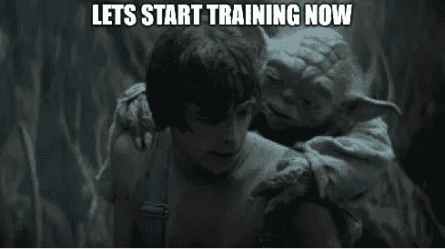*

```
*# Define neural network modelmodel = Sequential()
model.add(Embedding(20000, 64))
model.add(Bidirectional(LSTM(64, dropout=0.8, recurrent_dropout=0.8)))
model.add(Dense(1, activation=’sigmoid’))model.summary()*
```

*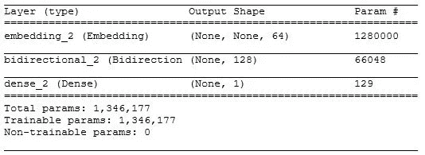*

```
*# Compile model
model.compile(loss=’binary_crossentropy’, optimizer=’Adam’, metrics=[‘accuracy’])# Train the neural network
model.fit(X_train, y_train, batch_size=32, epochs=5, verbose=2, validation_split=0.1)*
```

*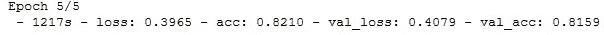*

*经过近两个小时的培训，我们已经准备好对它进行评估。使用与 Vader 相同的数据进行评估，我们达到了 82%的准确率！这意味着在这个测试集中，神经网络可以正确区分 82%的推文中的消极和积极情绪。想象一下，在几行代码中，我们已经能够建立和训练一个“阅读”推特的神经网络，并且可以相当准确地判断情绪是积极的还是消极的。)神经网络在以适当的格式给出足够的训练数据的情况下，其识别模式的能力简直令人敬畏。*

*与仅使用 CPU(英特尔 i7–7700 HQ)运行相比，GPU (Nvidia GeForce GTX 1060)帮助将训练时间减少了不到一半。*

*神经网络的混淆矩阵；*

*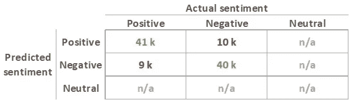*

*神经网络的这种特殊配置(参见上面代码中的“sigmoid”激活函数)输出一个从 0 到 1 的分数(1 是最积极的情绪)。0.5 左右的值介于两个极端之间，可以解释为这些预测更不确定是正还是负。为了减少错误分类的积极和消极情绪的数量，同时使其与 Vader 结果更具可比性，我们可以更仔细地研究这些更中性的预测分数。*

*下面是一种使用 0.5 左右的临界值引入中性情绪的方法，从而整理出模型对极性不太确定的情绪:*

*正面情绪:`activation function` > = 0.65*

*中性情绪:(`activation function` < 0.65) & ( `activation function` ≥ 0.35)*

*负面情绪:`activation function` < 0.35*

*这产生了以下混淆矩阵:*

*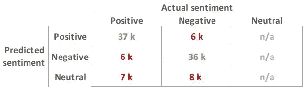*

*我们已经设法降低了假阴性和假阳性的比例。但我们同时妥协，通过引入 15 k 中性情绪预测，降低了真正正面和真正负面的数量。忽略中性预测，我们现在的**准确率为 86%** 。设置截止值是为了以平衡的方式分割不正确的预测。我们现在终于可以比较这两个模型了。机器学习模型以 86%的准确率优于基于规则的 Vader 模型，而当孤立地看正面和负面预测时，准确率为 71%。我们有相当大比例的中性错误分类(分别为 28%和 15%)，至少在测试的推文中是这样。但我们应该注意的是，我们想要对其进行预测的 twitter 数据可能与“训练评估”数据集中发现的数据具有不同的特征。例如，我们知道我们想要预测的 twitter feed 实际上会包含中性或中性倾向的推文:*

> *在月球形成之前，地球上的一天只有 6 个小时
> (中性情绪)*

*我们实际上不能说不同的模型在识别中性情绪方面有多好，因为评估数据只包含积极和消极的标签。此外，我们可能会遇到带有大量表情符号、大写字母和感叹号的推文，我们还没有训练我们的机器学习模型来融入这些内容。为了这个效果，我们将使用一个混合版本，使用基于 Vaders 规则的预测*结合基于机器学习的*。为此，我们将采用“协商一致”的方法。这意味着，当神经网络预测与 Vader 模型相同的情绪(积极或消极)时，我们将继续使用神经网络分数作为情绪的基础。当神经网络和维达之间缺乏共识时，我们会将推文分类为中性。*

*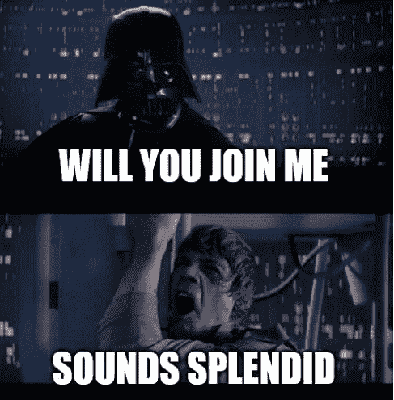*

# ***4。** **预测情绪，分析结果***

*最后，我们准备好预测收集的 tweets 上的情绪，并看看结果。我们只需要根据我们定义的关键词过滤掉所有的推文*

*关键词=[美国宇航局，阿波罗，土星五号，登月，陆地*月球]*

*查看最频繁出现的转发，我们注意到一些与实际的太空任务无关，所以我们去掉了这些。我们让神经网络和 Vader 算法就情感达成一致，对通过神经网络的推文应用所有需要的预处理。为了使视觉化更直观地解释，我们将把消极情绪和积极情绪分开。我们将转换来自神经网络的负面情绪得分，因此我们最终得到的情绪得分范围是从-1 到 1(而不是从 0 到 1)。我们使用基于 Python 的图形工具 [Plotly](https://plot.ly/) 及其图表工作室，通过分别绘制所有积极情绪和消极情绪的总和(采用移动平均值使其不那么跳动)来可视化结果:*

*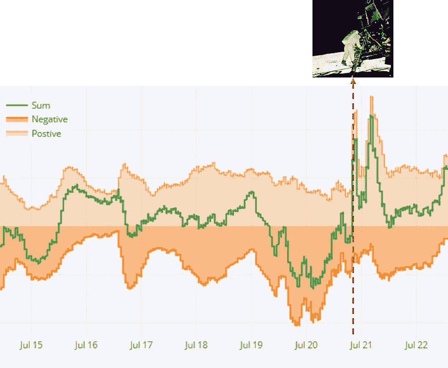*

*Predicted sentiments visualized using Plotly’s Chart studio. Times are in UCT (formerly known as GMT)*

*总体趋势偏向积极情绪，但有趣的是，在登月日前夕，我们看到了明显的消极情绪。此外，向积极情绪高峰的快速转变几乎与实际着陆时间(世界协调时 7 月 20 日 20:17)完全一致。最有可能的是，积极的洪水更多的是由美国晚间新闻广播的时间和影响，全面关注 50 周年。为了进行深入的分析，我们需要仔细观察实际的推文，寻找不同的主题。通过统计 7 月 20 日期间最常用的词(停用词和“关键词”已删除)，可以获得一个概览:*

```
 *('years', 2302),
 ('anniversary', 2170),
 ('ago', 1475),
 ('one', 1264),
 ('astronauts', 1213),
 ('today', 1199),
 ('go', 1075),
 ('rocket', 953),
 ('mission', 938),
 ('day', 904),*
```

*我们还需要分析任何可能触发特定推文的外部因素。这些外部触发因素可能是与我们想要研究的主题相关的本地或全球新闻。在我们的场景中，这方面的一个例子是 7 月 22 日印度[号月船 2 号](https://en.wikipedia.org/wiki/Chandrayaan-2)的成功发射，现在它正在登陆月球表面的路上。*

*我们用几条示例推文及其预测情绪来总结这一分析。你自己会如何评价这些推文的情绪？*

> *我厌倦了听到我的手机今天的计算能力比美国宇航局阿波罗 11 号的休斯敦任务控制中心还要强*
> 
> *“阿波罗 11 号”的一个伟大时刻是美国宇航局宣布宇航员在发射期间的心率(+0.72)*
> 
> *沃利不是我们家乐高土星五号火箭的粉丝(-0.90)*

**

*What is not to like about the LEGO Saturn V rocket?*

# ***结论***

*我个人认为，阿波罗计划执行的登月任务是一项真正鼓舞人心的成就。在我看来，积极的贡献远远超过了成本，主要是通过激励人们追求科学和工程职业。这些地区的受欢迎程度的提高对我们现代的、以技术为基础的经济产生了深远的影响。*

*在 2018 年期间，许多方法变得出名，这些方法进一步提高了基于机器学习的情感分析的准确性。谷歌的 [BERT](https://arxiv.org/pdf/1810.04805.pdf) (变形金刚的双向编码器表示)引起了特别的兴趣。BERT 代表了一个非常大的神经网络，它利用预训练来实现对语言的*上下文*理解(而不是仅仅在独立的基础上理解不同的单词)。这种上下文理解是通过在海量数据集上对神经网络进行预训练来实现的(想想整个英文维基百科)。在对神经网络进行预训练以“模拟”一种语言之后，它可以通过更有限的训练集来进一步调整以用于特定的任务，例如，用于情感分析，具有最先进的准确性。*

*除了新的和令人兴奋的神经网络架构之外，还有旨在不仅捕捉文本的极性，而且解码更微妙的情感，例如情感方面(快乐、悲伤、愤怒、惊讶等)的努力。)关于基于机器学习的情感分析的最新发展，请查看代码为的[论文。](https://paperswithcode.com/task/sentiment-analysis)*

*感谢您花时间阅读这篇文章。希望你已经学到了一些新的东西:*

*   *情感分析，它的目的和挑战*
*   *从目标定义到可视化的数据科学周期*
*   *如何使用混淆矩阵评估分类器*
*   *如何将基于规则的模型和机器学习模型应用于情感分析*

*最美好的祝愿/彼得*

***参考文献***

*VADER:*

> *休顿，C.J .和吉尔伯特，E.E. (2014 年)。VADER:基于规则的社交媒体文本情感分析的简约模型。第八届网络日志和社交媒体国际会议。密歇根州安阿伯，2014 年 6 月。*

*LSTM:*

> *Hochreiter，Sepp 和 Jürgen Schmidhuber。"长短期记忆"*神经计算*9(1997):1735–1780。*