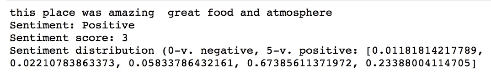
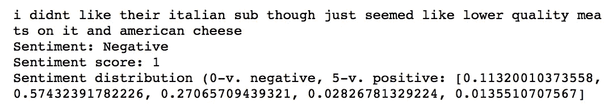

# 情感分析:无以言表

> 原文：<https://towardsdatascience.com/sentiment-analysis-beyond-words-6ca17a6c1b54?source=collection_archive---------6----------------------->


任何纽约移民都知道，在纽约之外很难找到好吃的披萨。加上意大利的家庭传统，好的披萨是一件大事。因此，当我努力开发一个自然语言处理项目来探索情感分析工具时，还有什么比帮助像我这样的人找到完美的比萨饼店更好的使用这些工具呢！

在这个项目中，我使用了来自 [Yelp 挑战数据集](https://www.yelp.com/dataset/challenge)的餐馆评论。特别是，我使用了 Yelp 归类为“披萨餐厅”或“餐厅，披萨”类别的餐厅。

我知道食客喜欢和不喜欢餐馆的原因各不相同，但我对用户给某个地方的评分并不感兴趣。相反，我想了解就餐者喜欢和不喜欢的特定方面，这样潜在的就餐者就可以更好地了解这个地方是否符合他们的需求。这对于那些获得 3-4 星评价的餐厅来说尤其重要，这些餐厅可能会因为各种不同的原因获得这一评级。

例如，也许你正在寻找一片地道的纽约式比萨饼。在这种情况下，服务和及时性可能就不那么重要了，只要厨师能送货上门。另一方面，也许你正在为朋友的生日计划一次集体聚餐。在这种情况下，服务和氛围对体验非常重要——如果你有一些挑食或对食物敏感的朋友，那么菜单上提供的食物选择不仅仅是披萨。最后，如果你正在午休，但渴望任何形式的融化奶酪，食物质量和氛围可能没有食物准备的及时性重要。

那么如何为披萨店获得这种基于方面的情感呢？首先，我将每个评论拆分成句子，并使用 spaCy 和 gensim 获得评论者在每个句子中提到的不同主题(即，食品质量、服务、等待时间、氛围和菜单品种)。一旦我有了自己的主题(我将把主题建模留给另一个博客)，我需要弄清楚评论者对餐馆的这一方面是积极还是消极。这篇文章比较了两种模拟评论者情绪的方法:VADER 和 StanfordCoreNLP。

**与 VADER 的感情得分**

首先，我尝试了 VADER 情绪包，并定义了一个函数 perspective _ analyzer _ scores()来返回从-1(非常负面)到 1(非常正面)的整体情绪评级。

```
from vaderSentiment.vaderSentiment import SentimentIntensityAnalyzer
import re
import stringanalyzer = SentimentIntensityAnalyzer()def sentiment_analyzer_scores(text):
    score = analyzer.polarity_scores(text)
    print(text)
    print(score)
```

我尝试的第一句话非常简单:“这个地方的食物和氛围都非常棒”。这篇评论显然是正面的，果然，VADER 综合情绪得分为 0.84。到目前为止一切顺利。

```
text_pos = 'this place was amazing  great food and atmosphere'
sentiment_analyzer_scores(text_pos)
```


VADER 在这个非常简单的负面评价中也表现不错，综合得分为-0.66:

```
text_neg = 'i didnt like their italian sub though just seemed like lower quality meats on it and american cheese'
sentiment_analyzer_scores(text_neg)
```


然而，在这个更微妙的例子中，它卡住了。以“所有东西对我来说都像垃圾，但我们不断回来，因为我的妻子喜欢意大利面”为例。这位评论者显然不喜欢这家餐厅，尽管他或她的妻子“喜欢”意大利面(附带说明，这位评论者应该赢得年度配偶奖，因为他继续吃垃圾来取悦妻子！)任何带有垃圾这个词的美食评论都应该立刻遭到否定，但 VADER 给出了非常正面的 0.7 分。

```
text_amb = "everything tastes like garbage to me but we keep coming back because my wife loves the pasta"
sentiment_analyzer_scores(text_amb)
```


发生了什么事？下面这个函数返回一个单词列表，VADER 把这些单词分为积极的、中性的和消极的。根据自述文件，“VADER (Valence Aware 字典和情感推理器)是一个词汇和基于规则的情感分析工具，专门针对社交媒体中表达的情感。”因此，它依赖于某些单词的极性来确定整体情绪。

```
import nltk
nltk.download('punkt')
nltk.download('vader_lexicon')
from nltk.tokenize import word_tokenize, RegexpTokenizerdef get_word_sentiment(text):

    tokenized_text = nltk.word_tokenize(text)

    pos_word_list=[]
    neu_word_list=[]
    neg_word_list=[]for word in tokenized_text:
        if (analyzer.polarity_scores(word)['compound']) >= 0.1:
            pos_word_list.append(word)
        elif (analyzer.polarity_scores(word)['compound']) <= -0.1:
            neg_word_list.append(word)
        else:
            neu_word_list.append(word)print('Positive:',pos_word_list)        
    print('Neutral:',neu_word_list)    
    print('Negative:',neg_word_list)
```

正如下面的输出所示，单词“loves”和“like”的正极性必须相当高。此外，如果没有对这个句子的更广泛的句法理解，将这个句子注册为否定的唯一单词是“垃圾”。在这种情况下，“垃圾”被认为是中性的，整体文本被确定为相当积极的。

```
get_word_sentiment(text_amb)
```


**进入斯坦福核心 NLP**

[斯坦福的核心 NLP 程序](https://nlp.stanford.edu/sentiment/index.html)正好有这个问题的解决方案，因为它是在电影评论上训练的，其中评论者可能会在同一个句子中讨论电影的积极和消极方面(例如，“情节缓慢，但表演很棒”)。

据该网站称，该模型“实际上是基于句子结构建立了一个完整句子的表示，而不是看单个单词的情绪。它根据单词如何组成更长短语的意思来计算情感。这样，模型就不像以前的模型那样容易被愚弄了。”

完美！幸运的是，有一个 Python 包装器可以让您调用核心 NLP 服务器(它返回结果的速度惊人地快)。要进行调用，您需要 pip 安装 pycorenlp，并从 pycorenlp 导入 StanfordCoreNLP。然后，在终端中，将 cd 放入 Stanford CoreNLP 文件夹，并使用以下命令启动服务器:

```
cd stanford-corenlp-full-2018-10-05
java -mx5g -cp "*" edu.stanford.nlp.pipeline.StanfordCoreNLPServer -timeout 10000
```

太好了——现在让我们看看效果如何。

```
#!pip install pycorenlp
from pycorenlp import StanfordCoreNLPnlp = StanfordCoreNLP('[http://localhost:9000'](http://localhost:9000'))def get_sentiment(text):
    res = nlp.annotate(text,
                       properties={'annotators': 'sentiment',
                                   'outputFormat': 'json',
                                   'timeout': 1000,
                       })
    print(text)
    print('Sentiment:', res['sentences'][0]['sentiment'])
    print('Sentiment score:', res['sentences'][0]['sentimentValue'])
    print('Sentiment distribution (0-v. negative, 5-v. positive:', res['sentences'][0]['sentimentDistribution'])
```

在将食物视为垃圾的评论中，该模型将整个句子分类为非常负面(0 是最负面的，4 是最正面的)。情绪分布显示，这句话有一些中性甚至积极的方面，但总体来说这不是一个好的评估。

```
get_sentiment(text_amb)
```


还有一个[酷直播演示](http://nlp.stanford.edu:8080/sentiment/rntnDemo.html)，展示了该模型如何将句子的不同点解析为积极和消极的方面:


[http://nlp.stanford.edu:8080/sentiment/rntnDemo.html](http://nlp.stanford.edu:8080/sentiment/rntnDemo.html)

为了更好地衡量，我将把上面的肯定句和否定句放进去:

```
get_sentiment(text_pos)
```



```
get_sentiment(text_neg)
```



这就是你要的，一个细致入微的情感分析包，非常适合评论电影、书籍、消费品和…披萨！

我应该指出，这篇文章绝不是对 VADER 的批评——它有一些很棒的功能，例如它能够识别社交媒体口语(“LOL”，表情符号)，并从所有大写字母和标点符号中提取重点。相反，我的目的是强调一种情绪分析工具，它非常适合包含积极和消极方面的客户评论。

我希望这篇文章对你有所帮助，欢迎在评论中提出任何反馈或问题！