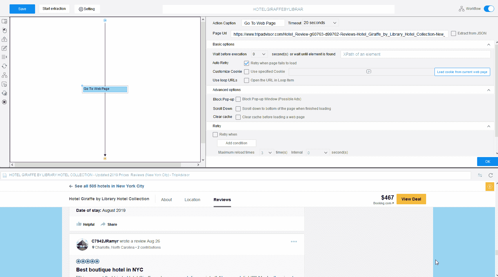
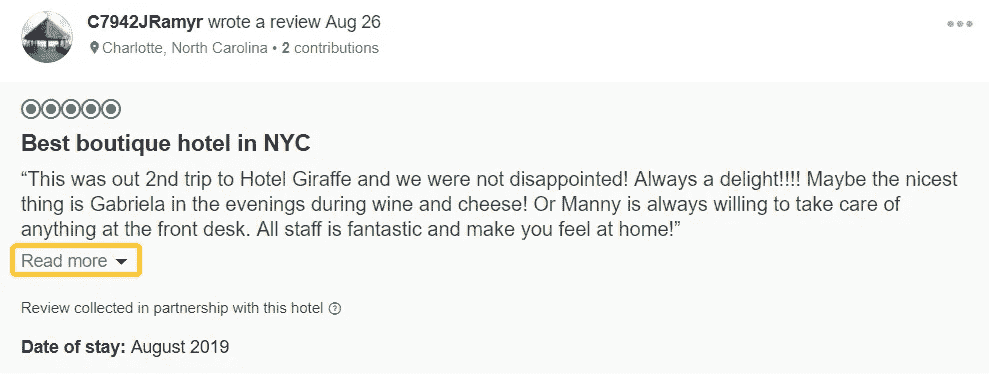
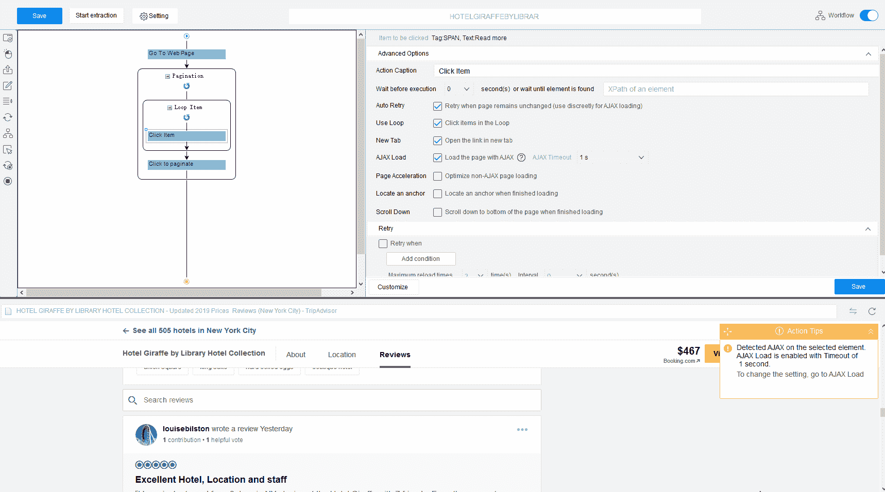
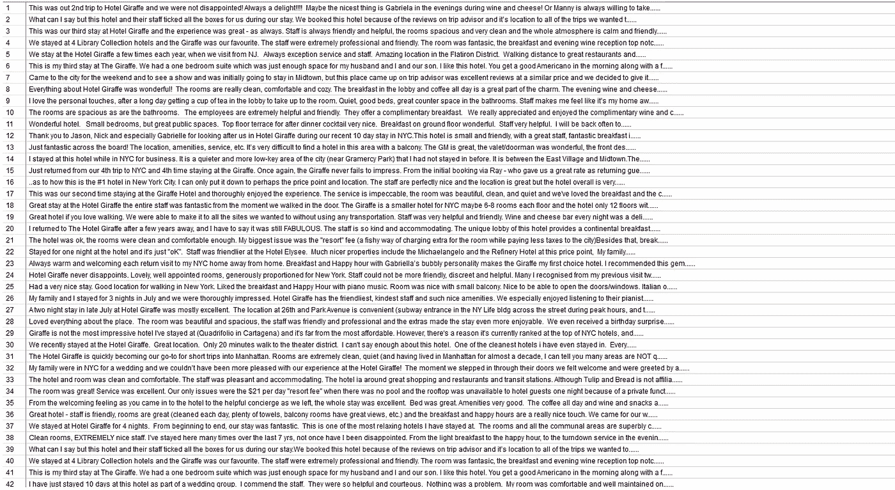
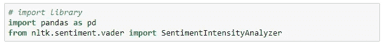
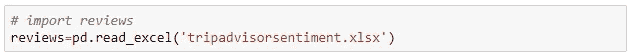
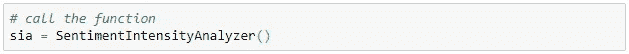
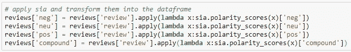
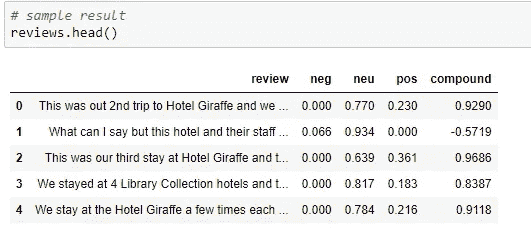
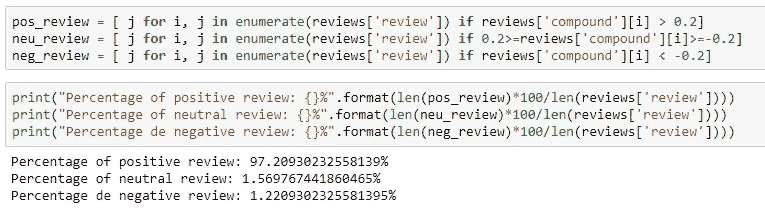

# 酒店评论的情感分析

> 原文：<https://towardsdatascience.com/sentiment-analysis-for-hotel-reviews-3fa0c287d82e?source=collection_archive---------10----------------------->

Photo by [Marten Bjork](https://unsplash.com/@martenbjork?utm_source=unsplash&utm_medium=referral&utm_content=creditCopyText) on [Unsplash](https://unsplash.com/search/photos/hotel-review?utm_source=unsplash&utm_medium=referral&utm_content=creditCopyText)

不管你喜不喜欢，客人评论正成为影响人们预订/购买的一个突出因素。

想想你过去的经历。当你在 Expedia/Booking/猫途鹰寻找一个度假的地方时，你做了什么？我敢打赌，在你知道之前，你会滚动屏幕查看评论。

作为一名企业主或员工，如果你仍然怀疑客人评论对企业的影响有多重要，不妨看看一些统计数据:

换句话说，客人的评论显然会影响人们的预订决定，这意味着，你最好注意人们对你的酒店的评论！

你不仅想要好的评论，还希望它们能帮助你最大程度地了解你的客户。评论可以告诉你是否符合客户的期望，这对于根据客户的角色制定营销策略至关重要。

点评很重要，作为酒店老板，你需要开始利用它。

## **什么是情感分析**

[情感分析](https://en.wikipedia.org/wiki/Sentiment_analysis)，也称为观点挖掘，是一种文本挖掘技术，可以提取给定文本的情感——无论是积极的、消极的还是中性的，并返回一个情感分数。这种技巧通常用于评论或[社交媒体](https://www.octoparse.com/blog/top-5-social-media-scraping-tools-for-2018)文本。

在本文中，我将向您展示如何使用 [*网络抓取工具*](https://www.octoparse.com/blog/top-20-web-crawling-tools-for-extracting-web-data)*有效地*收集酒店评论，并使用 Python* 进行情感分析。*

## **使用 Octoparse 抓取评论**

我使用的网页抓取工具叫做[octoporparse](https://www.octoparse.com/Download)。这是一个为像我一样没有编码背景的人建立的自己动手的网络刮刀。我将向您展示如何使用 Octoparse 来收集纽约市排名第一的酒店——由图书馆酒店收藏的长颈鹿酒店的评论。

以下是该网页的链接:

*https://www . tripadvisor . com/Hotel _ Review-g 60763-d 99762-Reviews-Hotel _ 长颈鹿 _ by _ 图书馆 _ 酒店 _ 收藏-New _ York _ City _ New _ York . html #点评*

首先，我们将在 Octoparse 中导入我们的目标网址。

**注意**每页只有 5 条评论，所以如果我们需要浏览所有评论，我们需要让 Octoparse 对所有评论页面进行分页。

怎么会？当我们仔细查看评论时，我们可以看到一些评论上有一个“阅读更多”按钮。在这种情况下，我们的爬虫需要在提取之前点击按钮来加载整个评论。

**接下来**，我们循环遍历所有评论项，并提取每个评论。

**最后但同样重要的是，**将新创建的“循环项目”拖出来，放在第一个“循环项目”的下面。这是因为我们想在提取实际评论之前先点击所有的“阅读更多”。

一旦我们成功提取了该酒店的所有评论，我们就可以使用 Python 获得每个评论的情感分数了。

*小贴士:如果你想获得更详细的关于搜集访客评论的分步指南，可以看看这篇* [*帖子*](https://helpcenter.octoparse.com/hc/en-us/articles/360028185851-Scrape-reviews-from-Trustpilot) *。*

## **用 Python 进行情感分析**

首先，我们要导入库。这里我们将使用两个库进行分析。

第一个叫 [**pandas**](https://pandas.pydata.org/) ，是一个开源库，用 Python 提供了简单易用的数据结构和分析函数。

第二个我们要使用的是 Python 中一个强大的库，叫做[**【NLTK】**](https://www.nltk.org/)**。NLTK 代表自然语言工具包，这是一个常用的 NLP 库，有很多语料库、模型和算法。**

让我们继续导入刮掉的评论。

下面，我们应用了来自 *nltk .情操.维德*包的一个名为*SentimentIntensityAnalyzer()*的函数。[情感分析器](https://www.nltk.org/api/nltk.sentiment.html)可以利用 NLTK 算法和特性实现和促进情感分析任务，因此无需复杂编码即可生成情感得分。在使用它之前，我们需要调用它。

现在我们已经调用了函数，应用它来生成极性得分。有四种类型的分数:负面的、中性的、正面的和复合的。通过使用 *apply()* 和 *lambda* ，我们可以转换结果并将它们放入“reviews”数据框架中。

然后我们有每个评论的情感分数。

每个评论都有一个负面、中性、正面和复合分数。复合得分是前三项得分的综合评定。这个分数从-1 到 1 不等。通常我们会设置一个复合分数的阈值来识别情感。这里我们可以将阈值设置为 0.2。如果评论的综合得分大于 0.2，则该评论是正面的。如果一个评论的综合得分小于 0.2，则该评论是负面的。如果复合得分在-0.2 到 0.2 之间，那么复习就是神经的。

我们可以看到，97.2%的评价是正面的，只有 1.22%的评价是负面的。根据分析，可以肯定地说，图书馆酒店收藏的长颈鹿酒店是一家广受欢迎的酒店。

当然，我们还可以做更多的事情来进一步分析评论，例如:

*   构建一个[词云](https://wordart.com/)或[话题建模](https://en.wikipedia.org/wiki/Topic_model)模型，识别人们喜爱这家酒店的关键原因是什么。
*   通过提取其他酒店的点评，按照上述步骤进行分析，与其他酒店进行情感评分对比。
*   提取更多信息，如审查日期、审查者的贡献、审查者的有益投票、审查有益投票、份额数量等，将其可视化并应用业务分析方法。

你现在知道评论对你的事业成功有多重要了。为什么不去 [Octoparse](https://www.octoparse.com/blog/big-announcement-web-scraping-template-take-away) 亲自尝试一下呢？Octoparse 是一款易于使用的网络抓取工具，可以帮助你点击一下就将网站转化为结构化数据。更好的是，有针对不同流行网站的现成模板和终身免费版本。如果你的网络抓取相关项目需要任何帮助，请随意评论！

*原载于 2019 年 9 月 11 日*[*https://www.octoparse.com*](https://www.octoparse.com/blog/sentiment-analysis-for-hotel-reviews)*。*